# Port Scanning
```bash
❯ rustscan -a 10.48.175.92 -- -A

Open 10.48.175.92:22
Open 10.48.175.92:80

PORT   STATE SERVICE REASON         VERSION
22/tcp open  ssh     syn-ack ttl 62 OpenSSH 6.6.1p1 Ubuntu 2ubuntu2.13 (Ubuntu Linux; protocol 2.0)
| ssh-hostkey: 
|   1024 57:20:82:3c:62:aa:8f:42:23:c0:b8:93:99:6f:49:9c (DSA)
| ssh-dss AAAAB3NzaC1kc3MAAACBAPcMQIfRe52VJuHcnjPyvMcVKYWsaPnADsmH+FR4OyR5lMSURXSzS15nxjcXEd3i9jk14amEDTZr1zsapV1Ke2Of/n6V5KYoB7p7w0HnFuMriUSWStmwRZCjkO/LQJkMgrlz1zVjrDEANm3fwjg0I7Ht1/gOeZYEtIl9DRqRzc1ZAAAAFQChwhLtInglVHlWwgAYbni33wUAfwAAAIAcFv6QZL7T2NzBsBuq0RtlFux0SAPYY2l+PwHZQMtRYko94NUv/XUaSN9dPrVKdbDk4ZeTHWO5H6P0t8LruN/18iPqvz0OKHQCgc50zE0pTDTS+GdO4kp3CBSumqsYc4nZsK+lyuUmeEPGKmcU6zlT03oARnYA6wozFZggJCUG4QAAAIBQKMkRtPhl3pXLhXzzlSJsbmwY6bNRTbJebGBx6VNSV3imwPXLR8VYEmw3O2Zpdei6qQlt6f2S3GaSSUBXe78h000/JdckRk6A73LFUxSYdXl1wCiz0TltSogHGYV9CxHDUHAvfIs5QwRAYVkmMe2H+HSBc3tKeHJEECNkqM2Qiw==
|   2048 4c:40:db:32:64:0d:11:0c:ef:4f:b8:5b:73:9b:c7:6b (RSA)
| ssh-rsa AAAAB3NzaC1yc2EAAAADAQABAAABAQCwY8CfRqdJ+C17QnSu2hTDhmFODmq1UTBu3ctj47tH/uBpRBCTvput1+++BhyvexQbNZ6zKL1MeDq0bVAGlWZrHdw73LCSA1e6GrGieXnbLbuRm3bfdBWc4CGPItmRHzw5dc2MwO492ps0B7vdxz3N38aUbbvcNOmNJjEWsS86E25LIvCqY3txD+Qrv8+W+Hqi9ysbeitb5MNwd/4iy21qwtagdi1DMjuo0dckzvcYqZCT7DaToBTT77Jlxj23mlbDAcSrb4uVCE538BGyiQ2wgXYhXpGKdtpnJEhSYISd7dqm6pnEkJXSwoDnSbUiMCT+ya7yhcNYW3SKYxUTQzIV
|   256 f7:6f:78:d5:83:52:a6:4d:da:21:3c:55:47:b7:2d:6d (ECDSA)
| ecdsa-sha2-nistp256 AAAAE2VjZHNhLXNoYTItbmlzdHAyNTYAAAAIbmlzdHAyNTYAAABBBKF5YbiHxYqQ7XbHoh600yn8M69wYPnLVAb4lEASOGH6l7+irKU5qraViqgVR06I8kRznLAOw6bqO2EqB8EBx+E=
|   256 a5:b4:f0:84:b6:a7:8d:eb:0a:9d:3e:74:37:33:65:16 (ED25519)
|_ssh-ed25519 AAAAC3NzaC1lZDI1NTE5AAAAIItaO2Q/3nOu5T16taNBbx5NqcWNAbOkTZHD2TB1FcVg
80/tcp open  http    syn-ack ttl 62 Apache httpd 2.4.7 ((Ubuntu))
|_http-server-header: Apache/2.4.7 (Ubuntu)
| http-methods: 
|_  Supported Methods: GET HEAD POST OPTIONS
|_http-title: 0day
Warning: OSScan results may be unreliable because we could not find at least 1 open and 1 closed port
OS fingerprint not ideal because: Missing a closed TCP port so results incomplete
Aggressive OS guesses: Linux 3.10 - 3.13 (96%), Linux 3.13 (96%), Linux 4.4 (96%), Linux 5.4 (95%), Linux 3.8 - 3.16 (93%), Amazon Fire TV (92%), Sony Android TV (Android 5.0) (92%), Android 5.0 - 6.0.1 (Linux 3.4) (92%), Android 5.1 (92%), Android 6.0 - 9.0 (Linux 3.18 - 4.4) (92%)
```
So first I visited the webpage. But found nothig suspecious. <br/>
 <br/>
Found nothing suspecious. So I perform directory bruteforcing. <br/>
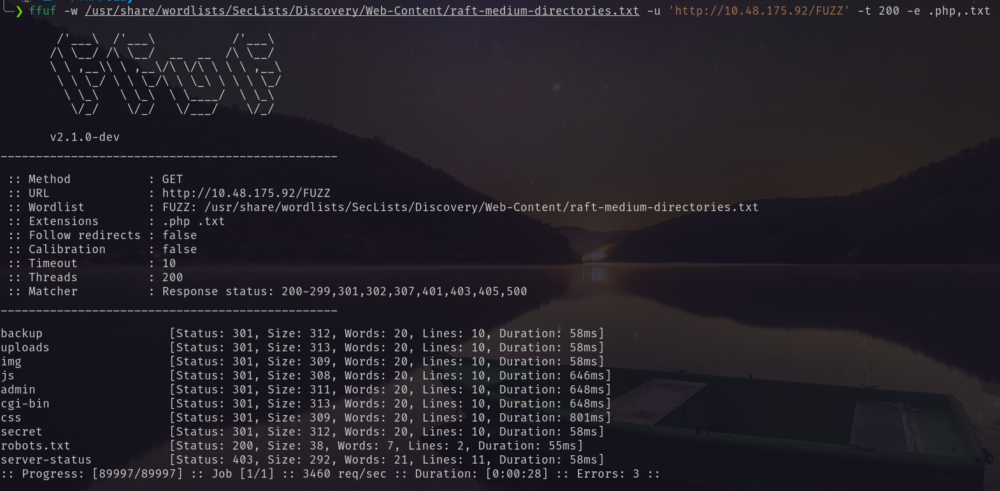 <br/>
In backup directory I found rsa private key. <br/>
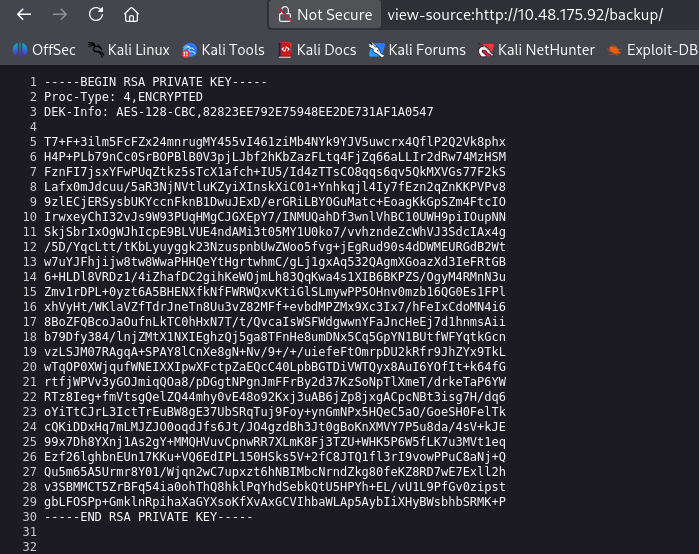 <br/>
Using john I cracked the key. But no use. <br/>
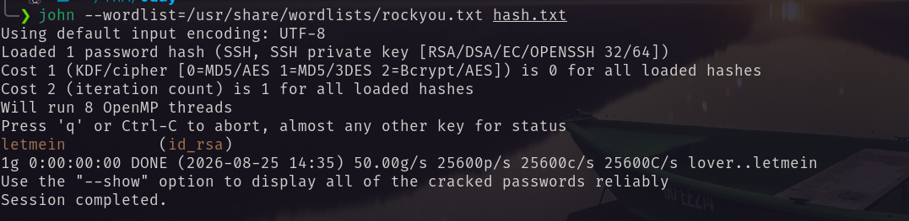 <br/>
I visited all the pages that I found via bruteforcing. But none of them give me anything suspicious. So after thinking some time I started bruteforcing `/cgi-bin` found the following <br/>
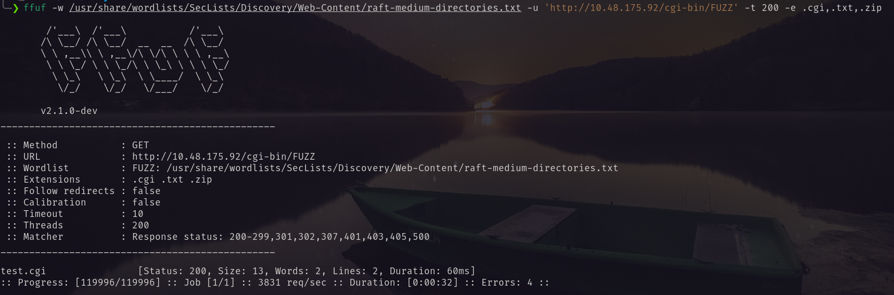 <br/>
I visited the file but nothing came out. <br/>
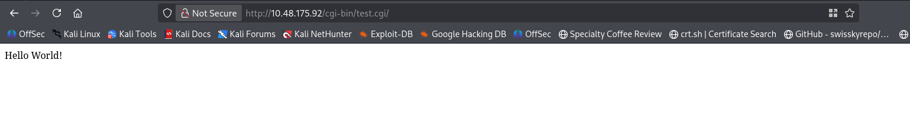 <br/>
After googling about it I found [this](https://hacktricks.wiki/en/network-services-pentesting/pentesting-web/cgi.html) article. Following this I scanned the uri with nmap to check for shellshock vulnerability. I got it. <br/>
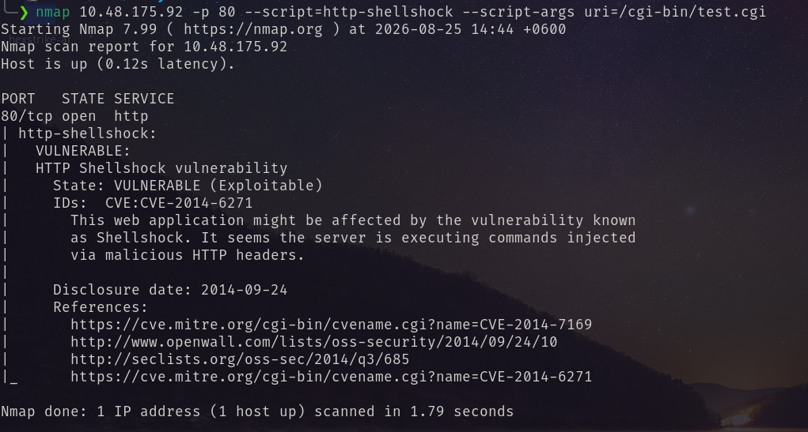 <br/>
Using metasploit auxiliary scanner I again confirmed the vulnerability and command injeciton. <br/>
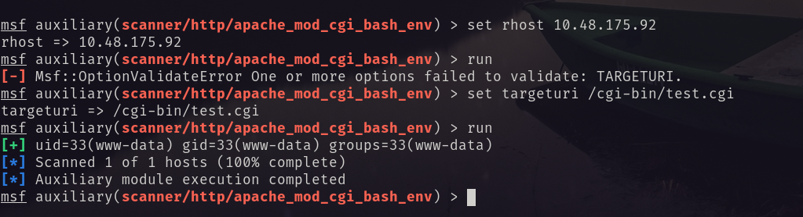 <br/>
Then using the metasploit exploit I got meterpreter shell. <br/>
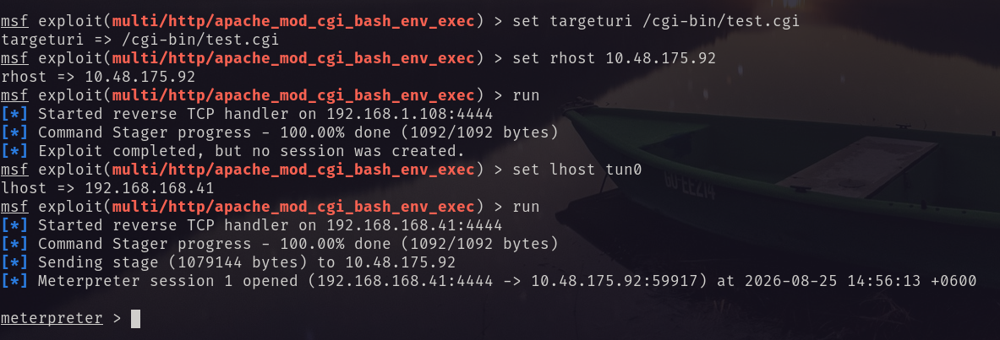 <br/>
And got the user flag from `/home/ryan/` <br/>
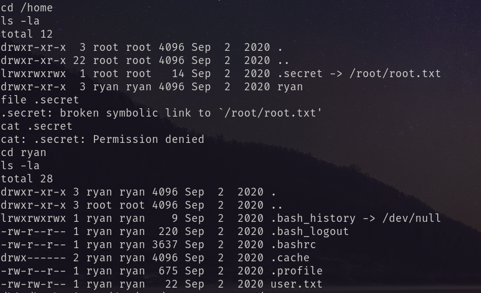 <br/>
# Privilege Escalation
Ran `linpeas.sh` and found older kernel version. <br/>
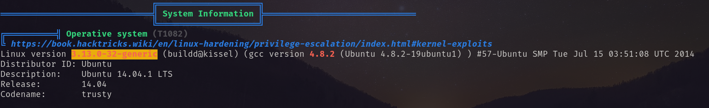 <br/>
The kernel version is exploitable. Searching the google found [this](https://github.com/lucyoa/kernel-exploits/tree/master/overlayfs) exploit. Downloaded the exploit and ran it and became ROOT! <br/>
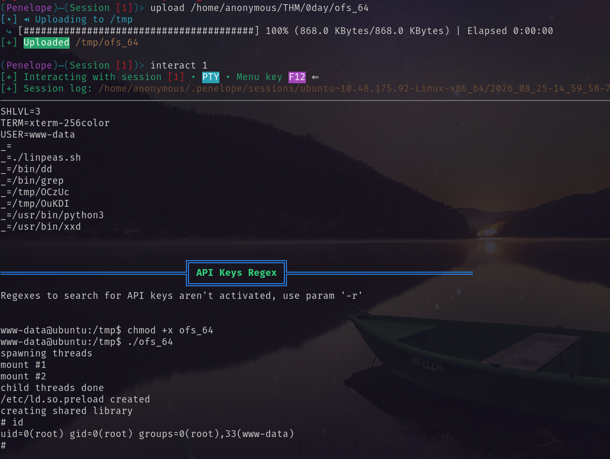 <br/>