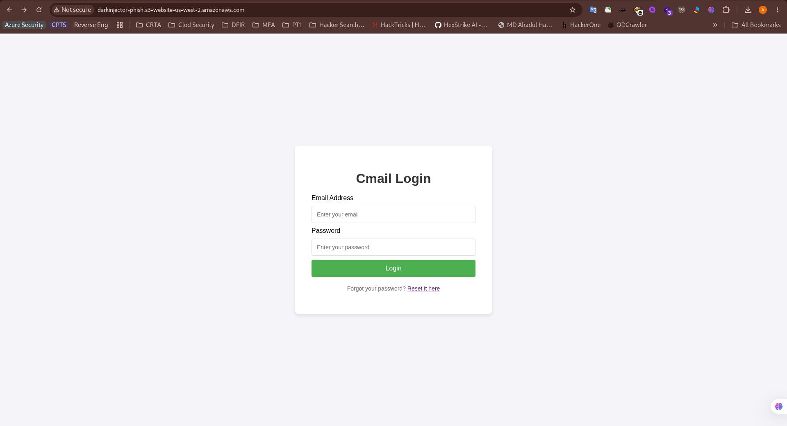
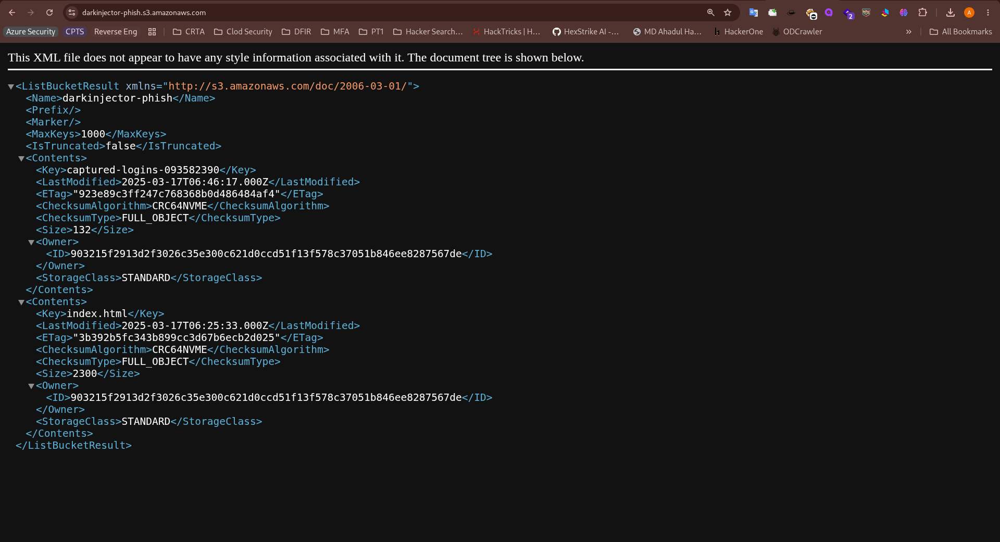

First visiting the URL: `http://darkinjector-phish.s3-website-us-west-2.amazonaws.com` just give me a login page. <br/>

I tried `dirsearch` but it came out nothing. After thinking some time I visited the URL: `http://darkinjector-phish.s3.amazonaws.com`. It give me something suspicious. <br/>
 <br/>
Then I have visited the URL: `http://darkinjector-phish.s3-website-us-west-2.amazonaws.com/captured-logins-093582390` <br/>
This downloads a file with the flag.
```bash
user,pass
munra@thm.thm,Password123
test@thm.thm,123456
mario@thm.thm,Mario123
flag@thm.thm,THM{this_is_not_what_i_meant_by_public}
```