# Port Scanning
```bash
rustscan -a 10.49.172.13 -- -A
--------------------------------------------
Open 10.49.172.13:22
Open 10.49.172.13:80
Open 10.49.172.13:139
Open 10.49.172.13:445

PORT    STATE SERVICE     REASON         VERSION
22/tcp  open  ssh         syn-ack ttl 62 OpenSSH 8.2p1 Ubuntu 4ubuntu0.5 (Ubuntu Linux; protocol 2.0)
| ssh-hostkey: 
|   3072 3b:c8:f8:13:e0:cb:42:60:0d:f6:4c:dc:55:d8:3b:ed (RSA)
| ssh-rsa AAAAB3NzaC1yc2EAAAADAQABAAABgQCqrhWpCkIWorEVg4w8mfia/rsblIvsmSU9y9mEBby77pooZXLBYMvMC0aiaJvWIgPVOXrHTh9IstAF6s9Tpjx+iV+Me2XdvUyGPmzAlbEJRO4gnNYieBya/0TyMmw0QT/PO8gu/behXQ9R6yCjiw9vmsV+99SiCeuIHssGoLtvTwXE2i8kxqr5S0atmBiDkIqlp+qD1WZzc8YP5OU0CIN5F9ytZOVqO9oiGRgI6CP4TwNQwBLU2zRBmUmtbV9FRQyObrB1zCYcEZcKNPzasXHgRkfYMK9OMmUBhi/Hveei3BNtdaWARN9x30O488BmdET3iaTt5gcIgHfAO+5WzUPBswerbcOHp2798DXkuVpsklS9Zi9dvpxoyZFsmu1RoklPWea+rxq09KRjciXNvy+jV8zBGCGKwwi62nL9mRyA5ZakJKrpWCPffnEMK37SHL0WqWMRZI4Bbj2cOpJztJ+5Ttbj5wixecnvZu8hkknfMSVwPM8RqwQuXtes8AqF6gs=
|   256 1f:42:e1:c3:a5:17:2a:38:69:3e:9b:73:6d:cd:56:33 (ECDSA)
| ecdsa-sha2-nistp256 AAAAE2VjZHNhLXNoYTItbmlzdHAyNTYAAAAIbmlzdHAyNTYAAABBBPBg1Oa6gqrvB/IQQ1EmM1p5o443v5y1zDwXMLkd9oUfYsraZqddzwe2CoYZD3/oTs/YjF84bDqeA+ILx7x5zdQ=
|   256 7a:67:59:8d:37:c5:67:29:e8:53:e8:1e:df:b0:c7:1e (ED25519)
|_ssh-ed25519 AAAAC3NzaC1lZDI1NTE5AAAAIBaJ6imGGkCETvb1JN5TUcfj+AWLbVei52kD/nuGSHGF
80/tcp  open  http        syn-ack ttl 62 Apache httpd 2.4.41 ((Ubuntu))
|_http-server-header: Apache/2.4.41 (Ubuntu)
|_http-title: Athena - Gods of olympus
| http-methods: 
|_  Supported Methods: POST OPTIONS HEAD GET
139/tcp open  netbios-ssn syn-ack ttl 62 Samba smbd 4
445/tcp open  netbios-ssn syn-ack ttl 62 Samba smbd 4
Warning: OSScan results may be unreliable because we could not find at least 1 open and 1 closed port
Device type: general purpose|phone|specialized
Running (JUST GUESSING): Linux 5.X|6.X|4.X (96%), Google Android 10.X|11.X|12.X (93%), Adtran embedded (92%)
OS CPE: cpe:/o:linux:linux_kernel:5 cpe:/o:linux:linux_kernel:6 cpe:/o:linux:linux_kernel:4 cpe:/o:google:android:10 cpe:/o:google:android:11 cpe:/o:google:android:12 cpe:/h:adtran:424rg
OS fingerprint not ideal because: Missing a closed TCP port so results incomplete
Aggressive OS guesses: Linux 5.14 - 6.8 (96%), Linux 4.15 - 5.19 (96%), Linux 4.15 (96%), Linux 5.4 - 5.15 (96%), Android 10 - 12 (Linux 4.14 - 4.19) (93%), Adtran 424RG FTTH gateway (92%), Android 10 - 11 (Linux 4.9 - 4.14) (92%), Android 12 (Linux 5.4) (92%), Android 9 - 11 (Linux 4.9 - 4.14) (92%), Linux 2.6.32 (92%)
No exact OS matches for host (test conditions non-ideal).
TCP/IP fingerprint:
SCAN(V=7.99%E=4%D=7/3%OT=22%CT=%CU=35446%PV=Y%DS=3%DC=T%G=N%TM=6A4776FC%P=x86_64-pc-linux-gnu)
SEQ(SP=107%GCD=1%ISR=107%TI=Z%CI=Z%II=I%TS=A)
SEQ(SP=FE%GCD=1%ISR=109%TI=Z%CI=Z%II=I%TS=A)
OPS(O1=M4E8ST11NW7%O2=M4E8ST11NW7%O3=M4E8NNT11NW7%O4=M4E8ST11NW7%O5=M4E8ST11NW7%O6=M4E8ST11)
WIN(W1=F4B3%W2=F4B3%W3=F4B3%W4=F4B3%W5=F4B3%W6=F4B3)
ECN(R=Y%DF=Y%T=40%W=F507%O=M4E8NNSNW7%CC=Y%Q=)
T1(R=Y%DF=Y%T=40%S=O%A=S+%F=AS%RD=0%Q=)
T2(R=N)
T3(R=N)
T4(R=Y%DF=Y%T=40%W=0%S=A%A=Z%F=R%O=%RD=0%Q=)
T5(R=Y%DF=Y%T=40%W=0%S=Z%A=S+%F=AR%O=%RD=0%Q=)
T6(R=Y%DF=Y%T=40%W=0%S=A%A=Z%F=R%O=%RD=0%Q=)
T7(R=Y%DF=Y%T=40%W=0%S=Z%A=S+%F=AR%O=%RD=0%Q=)
U1(R=Y%DF=N%T=40%IPL=164%UN=0%RIPL=G%RID=G%RIPCK=G%RUCK=G%RUD=G)
IE(R=Y%DFI=N%T=40%CD=S)

Uptime guess: 22.102 days (since Thu Jun 11 12:20:19 2026)
Network Distance: 3 hops
TCP Sequence Prediction: Difficulty=254 (Good luck!)
IP ID Sequence Generation: All zeros
Service Info: OS: Linux; CPE: cpe:/o:linux:linux_kernel

Host script results:
| nbstat: NetBIOS name: ROUTERPANEL, NetBIOS user: <unknown>, NetBIOS MAC: <unknown> (unknown)
| Names:
|   ROUTERPANEL<00>      Flags: <unique><active>
|   ROUTERPANEL<03>      Flags: <unique><active>
|   ROUTERPANEL<20>      Flags: <unique><active>
|   \x01\x02__MSBROWSE__\x02<01>  Flags: <group><active>
|   SAMBA<00>            Flags: <group><active>
|   SAMBA<1d>            Flags: <unique><active>
|   SAMBA<1e>            Flags: <group><active>
| Statistics:
|   00 00 00 00 00 00 00 00 00 00 00 00 00 00 00 00 00
|   00 00 00 00 00 00 00 00 00 00 00 00 00 00 00 00 00
|_  00 00 00 00 00 00 00 00 00 00 00 00 00 00
|_clock-skew: 0s
| smb2-time: 
|   date: 2026-07-03T08:46:48
|_  start_date: N/A
| smb2-security-mode: 
|   3.1.1: 
|_    Message signing enabled but not required
| p2p-conficker: 
|   Checking for Conficker.C or higher...
|   Check 1 (port 57625/tcp): CLEAN (Couldn't connect)
|   Check 2 (port 53665/tcp): CLEAN (Couldn't connect)
|   Check 3 (port 57230/udp): CLEAN (Failed to receive data)
|   Check 4 (port 41176/udp): CLEAN (Failed to receive data)
|_  0/4 checks are positive: Host is CLEAN or ports are blocked

TRACEROUTE (using port 443/tcp)
HOP RTT      ADDRESS
1   93.10 ms 192.168.128.1
2   ...
3   96.50 ms 10.49.172.13
```
Found the SMB port is open. So I go for SMB enumeration first.
```bash
smbclient -N -L //10.49.172.13    
Anonymous login successful

	Sharename       Type      Comment
	---------       ----      -------
	public          Disk      
	IPC$            IPC       IPC Service (Samba 4.15.13-Ubuntu)
Reconnecting with SMB1 for workgroup listing.
smbXcli_negprot_smb1_done: No compatible protocol selected by server.
Protocol negotiation to server 10.49.172.13 (for a protocol between LANMAN1 and NT1) failed: NT_STATUS_INVALID_NETWORK_RESPONSE
Unable to connect with SMB1 -- no workgroup available
```
I found share `public` is available. Then I tried to connect the share without user and password.
```bash
smbclient //10.49.172.13/public -N
Anonymous login successful
Try "help" to get a list of possible commands.
smb: \> ls
  .                                   D        0  Mon Apr 17 06:54:43 2023
  ..                                  D        0  Mon Apr 17 06:54:05 2023
  msg_for_administrator.txt           N      253  Mon Apr 17 00:59:44 2023
smb: \> get msg_for_administrator.txt
getting file \msg_for_administrator.txt of size 253 as msg_for_administrator.txt (0.6 KiloBytes/sec) (average 0.6 KiloBytes/sec)
```
Viewing the `msg_for_administrator.txt` file i found `/myrouterpanel`.
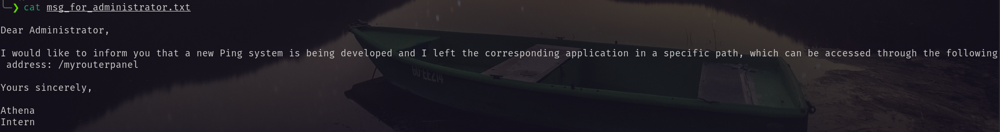
Visiting the provided url I found an input section that takes input an ip address and ping it.
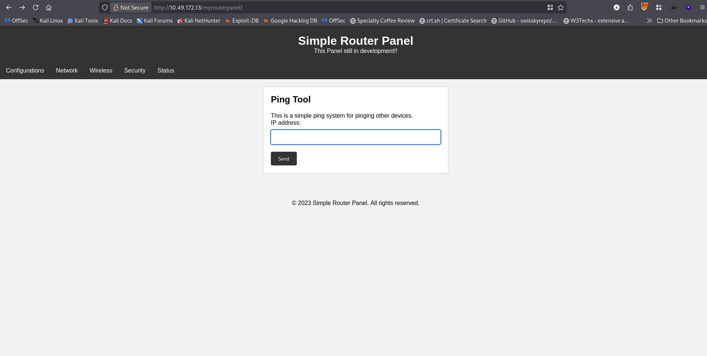
So I thought there can be command injection vulnerability. So I crafted a netcat payload and injected it. But there was filtering issue.

After trying sometime I was able to receive the reverse shell.
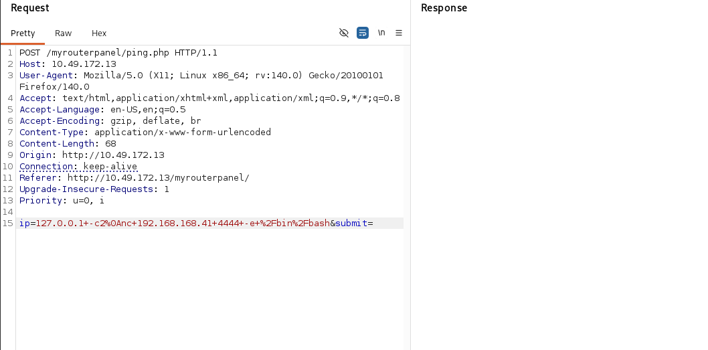
Using [penelope](https://github.com/brightio/penelope)shell handler i receive the shell.
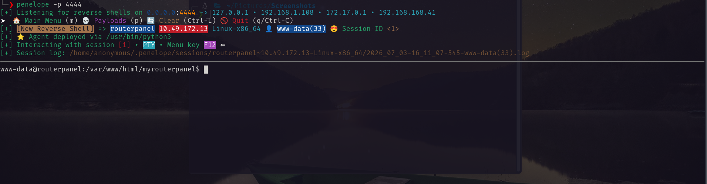
Using pspy64 I have found some interesting interesting process is executing as user athena.
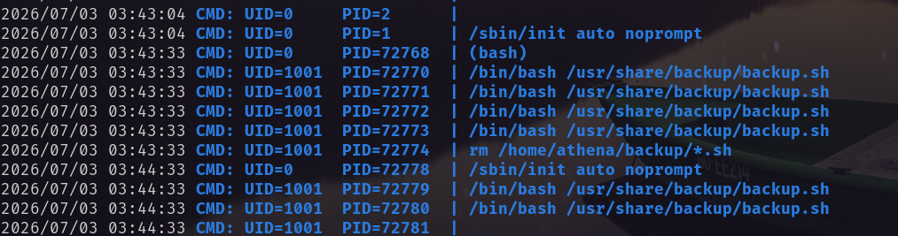
And this file has write permission.<br/>
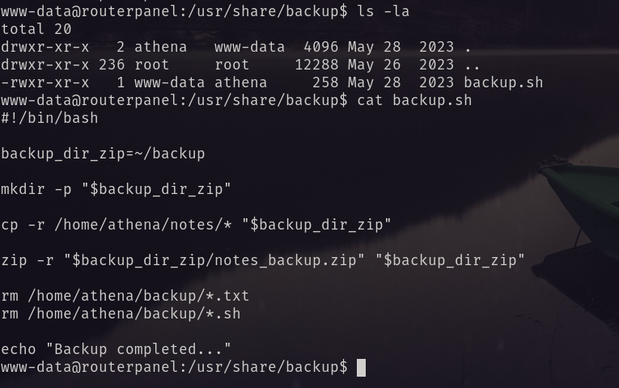<br/>
So I again insert a reverse shell in that file and obtained shell as user athena. 
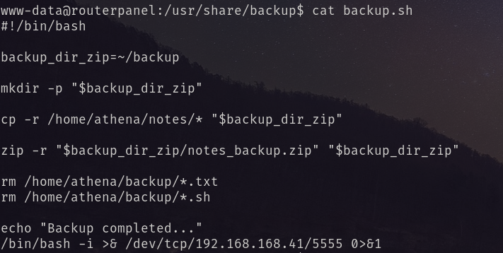
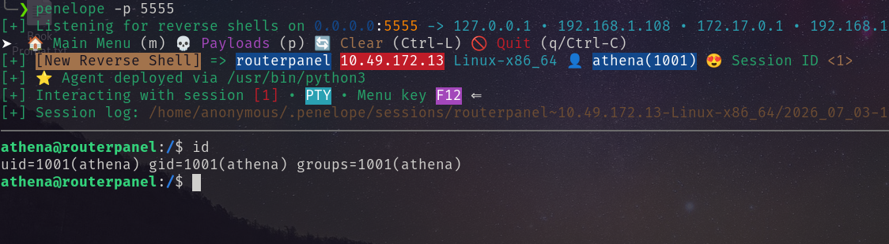
And obtained the user flag.
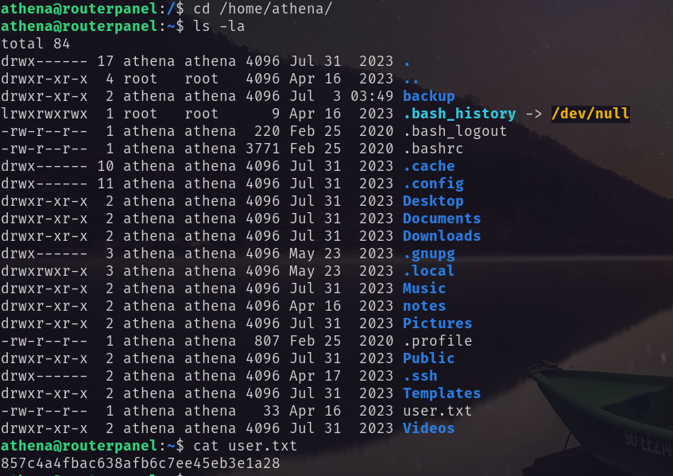
# Privilege to root
Using `sudo -l` I found 
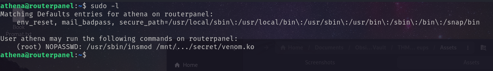
With `modinfo` I found. <br/>
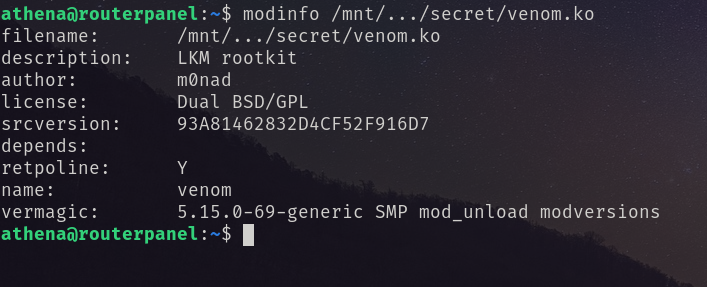
Googling about the author `m0nad` and `venom.ko` I found this [repo](https://github.com/m0nad/Diamorphine)
And following this [writeup](https://medium.com/@tommasogreco/tryhackme-athena-walkthrough-4f45a4e15466) I became root.
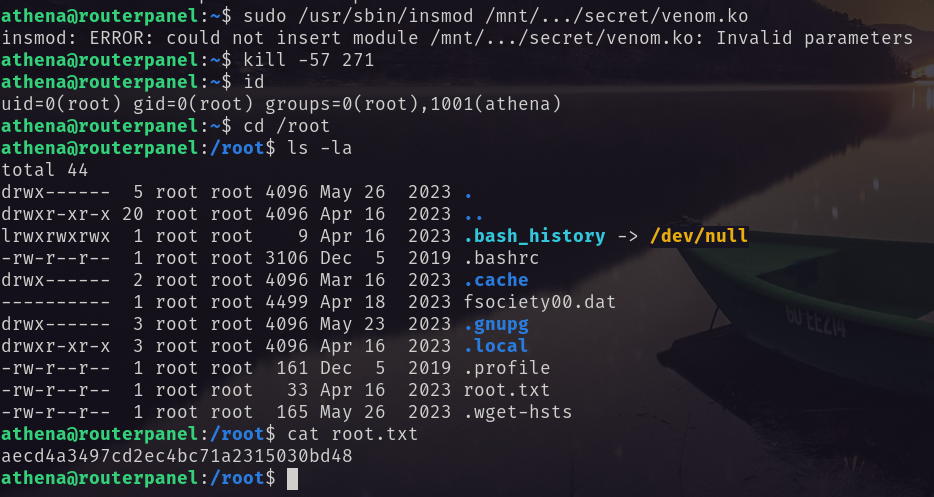
