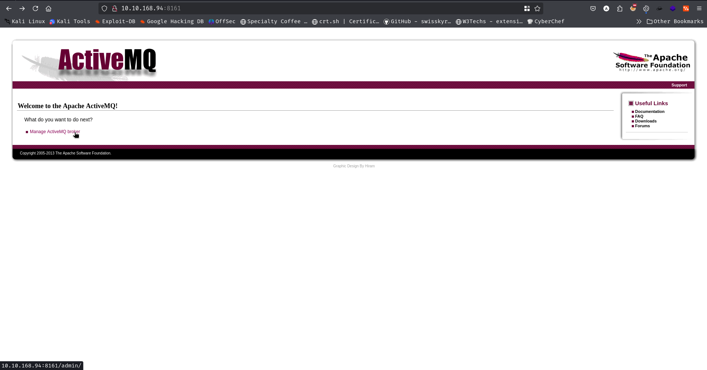
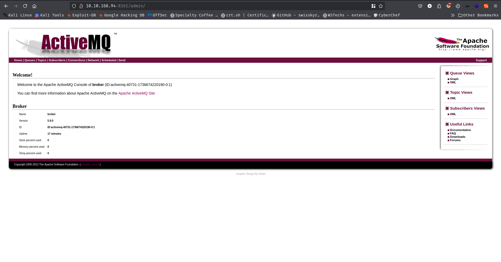
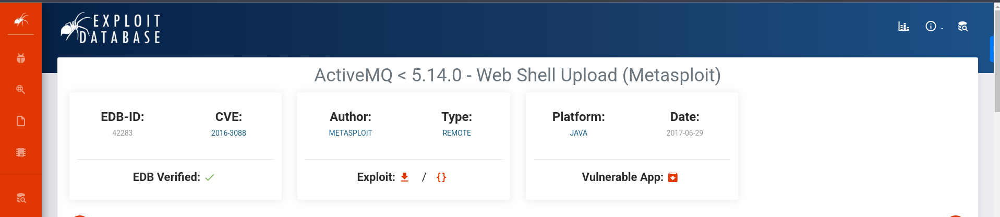
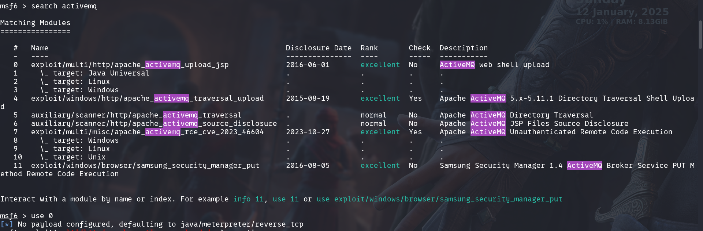
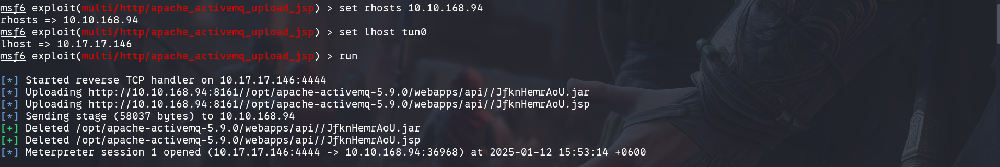
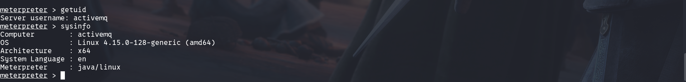
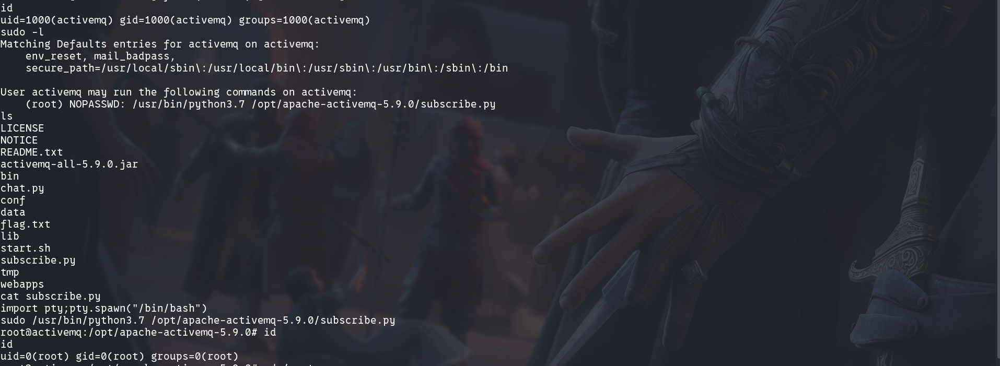
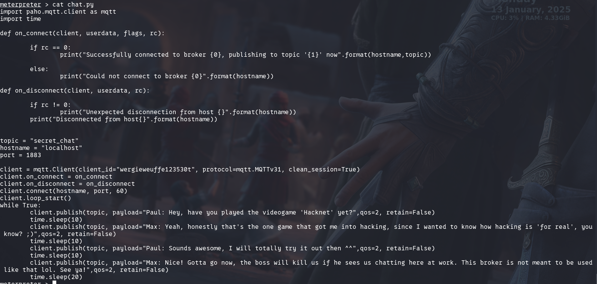

### Open Ports 
```bash 
rustscan -a 10.10.12.245 -- -A -p1000-10001

Open 10.10.12.245:22
Open 10.10.12.245:1883
Open 10.10.12.245:8161
Open 10.10.12.245:38593
```
Now using nmap 
```bash
nmap 10.10.12.245 -p 22,1883,8161,38593 -A -vv

PORT      STATE SERVICE    REASON         VERSION
22/tcp    open  ssh        syn-ack ttl 60 OpenSSH 7.6p1 Ubuntu 4ubuntu0.3 (Ubuntu Linux; protocol 2.0)
| ssh-hostkey: 
|   2048 4c:75:a0:7b:43:87:70:4f:70:16:d2:3c:c4:c5:a4:e9 (RSA)
| ssh-rsa AAAAB3NzaC1yc2EAAAADAQABAAABAQC0E0J6enJ0afxy700qSiIX5MtF1OnZao36BxMDHd4z3X/fbRQc3WOsCzY9KsTw7RltG4bSBJGja3ppRbiLTowv+2aunR3nKPaR/Rea1NFCHPxonnYutUyqPsJIRnm+oV+hqd/rvn/BgLpdNo2bpWG1PG3gNVwmbuUqybL9XF3KoZz8gj6zZPJ+RV8yrM17R2bd1J7YgTMJBKSuKyzVQZJQHJMhdBLBOfVmF3PgajXe2Dm10xbL2rQ3Zsbbuk6hhc4Ypq1LYeZ1PA0aNuHoMzhjXlYQ3XElD5Rzr6rBo5LJr2VD2Y3mo86wyM6OZBb+B88Law3RJ4fwtjVgEoa2KX0F
|   256 f4:62:b2:ad:f8:62:a0:91:2f:0a:0e:29:1a:db:70:e4 (ECDSA)
| ecdsa-sha2-nistp256 AAAAE2VjZHNhLXNoYTItbmlzdHAyNTYAAAAIbmlzdHAyNTYAAABBBHyqJ0DAEyEKxeir3lNhPLTZNtDo/CfpLAKWpiSxZUd8NJIrcsNod31Tl+KSwMvNjNvW2ilD1YYxnO2A3FDApqg=
|   256 92:d2:87:7b:98:12:45:93:52:03:5e:9e:c7:18:71:d5 (ED25519)
|_ssh-ed25519 AAAAC3NzaC1lZDI1NTE5AAAAINqDlHwUjvqNDfhowAQHQMu7A/HVUijCXkxdkgpF/pSe
1883/tcp  open  mqtt?      syn-ack ttl 60
|_mqtt-subscribe: The script encountered an error: ssl failed
8161/tcp  open  http       syn-ack ttl 60 Jetty 7.6.9.v20130131
|_http-title: Apache ActiveMQ
|_http-favicon: Unknown favicon MD5: 05664FB0C7AFCD6436179437E31F3AA6
|_http-server-header: Jetty(7.6.9.v20130131)
| http-methods: 
|_  Supported Methods: GET HEAD
38593/tcp open  tcpwrapped syn-ack ttl 60
Warning: OSScan results may be unreliable because we could not find at least 1 open and 1 closed port
Device type: general purpose
Running: Linux 4.X
OS CPE: cpe:/o:linux:linux_kernel:4.15
OS details: Linux 4.15
```

Going to the http port I loged in using credential `admin:admin`. <br/>
<br/>
<br/>
W get the activemq version is 5.9.0. Googling that version I found a metasploit exploit for this version.<br/>
<br/>
<br/>
<br/>
<br/>
Now for being root I do the following<br/>
<br/>
#### The video game name is `Hackenet`
<br/>
