# Port scan
```bash
❯ rustscan -a 10.49.182.174 -- -A

Open 10.49.182.174:22
Open 10.49.182.174:21
Open 10.49.182.174:80
Open 10.49.182.174:3306

PORT     STATE SERVICE REASON         VERSION
21/tcp   open  ftp     syn-ack ttl 62 vsftpd 3.0.5
22/tcp   open  ssh     syn-ack ttl 62 OpenSSH 8.2p1 Ubuntu 4ubuntu0.13 (Ubuntu Linux; protocol 2.0)
| ssh-hostkey: 
|   3072 5a:06:d7:83:24:56:34:f6:74:cc:29:2f:57:ee:45:5a (RSA)
| ssh-rsa AAAAB3NzaC1yc2EAAAADAQABAAABgQDXqIbxWzeds+ZJMe+gPka6hF/bB6xei1/P8JdwLMf9R42pf86Jd3OmY5fj0rgGE4j+8zMpCaArfmf0r0PqWNUvxIE71NOI91kBj8PmanoEfeYfnSGY1QRzL53j2+qIRhkmsjCQENUMD9RLdMk9sfDTBMqXpV9cMIAi9ra6c5eSGKSf+2VomZJkBhWPkFNerYwYVfVGnF99NDAg+xKNxVjjPKulpi4KvKIZl1e6OPqaW+FvMm9BSXSEIfAXIsJX3N64GUuIDeg7F3NsC4SKSM3N8Mr3pJgs8XeuDQ64ug47yNYwkBDIyRKElkJd9BfgrmyAhY2A7ESmjxUUTbxghZexhGbHX/HMf+xDYunJtedlOlKfDt3Y9srhbAut1hX/msF3t7pJnXuoWIRj4YslhT/okWFsJ4XLtatyr8SnBVG8EJoPb7xoJNIydK/PkxeNkTVqw5/JAs0+DbqDyxUPAkXiiddhXymGo6N7fnz5UPVzbBOXsqXbHwKZ9OgxKaFek9k=
|   256 9e:1e:e3:5e:d2:a4:57:c8:15:ab:4d:ad:fd:af:cb:2c (ECDSA)
| ecdsa-sha2-nistp256 AAAAE2VjZHNhLXNoYTItbmlzdHAyNTYAAAAIbmlzdHAyNTYAAABBBEMqmqwlmyK1Men15UTf1/PA3860puteoTYnCplZIAYNtA2sfdNPfACAYBzWSg0kU8Z4A7pxBJlKB2OggY/+v/0=
|   256 d8:19:7e:66:c2:ff:f6:68:22:51:24:df:ba:9f:06:25 (ED25519)
|_ssh-ed25519 AAAAC3NzaC1lZDI1NTE5AAAAIGMyxwqI3ees8sqiO4qy/ahsS2owCHYR65PzyDtJVKPu
80/tcp   open  http    syn-ack ttl 62 Apache httpd 2.4.41 ((Ubuntu))
|_http-title: Login
|_http-server-header: Apache/2.4.41 (Ubuntu)
| http-methods: 
|_  Supported Methods: GET HEAD POST OPTIONS
| http-cookie-flags: 
|   /: 
|     PHPSESSID: 
|_      httponly flag not set
3306/tcp open  mysql   syn-ack ttl 62 MySQL 8.0.41-0ubuntu0.20.04.1
| mysql-info: 
|   Protocol: 10
|   Version: 8.0.41-0ubuntu0.20.04.1
|   Thread ID: 76365
|   Capabilities flags: 65535
|   Some Capabilities: Support41Auth, Speaks41ProtocolOld, IgnoreSpaceBeforeParenthesis, Speaks41ProtocolNew, LongPassword, SupportsTransactions, SupportsCompression, IgnoreSigpipes, SwitchToSSLAfterHandshake, FoundRows, ConnectWithDatabase, SupportsLoadDataLocal, LongColumnFlag, DontAllowDatabaseTableColumn, InteractiveClient, ODBCClient, SupportsMultipleResults, SupportsMultipleStatments, SupportsAuthPlugins
|   Status: Autocommit
|   Salt: H>A>\x06\x04\x1D\x03R5x\x063\x07UM\x03tM\x17
|_  Auth Plugin Name: caching_sha2_password
| ssl-cert: Subject: commonName=MySQL_Server_8.0.26_Auto_Generated_Server_Certificate
| Issuer: commonName=MySQL_Server_8.0.26_Auto_Generated_CA_Certificate
| Public Key type: rsa
| Public Key bits: 2048
| Signature Algorithm: sha256WithRSAEncryption
| Not valid before: 2021-10-19T04:00:09
| Not valid after:  2031-10-17T04:00:09
| MD5:     5441 cf59 375b 5402 352d 4df1 dab3 f945
| SHA-1:   de74 633f 3958 dd20 0a40 e5b4 ffa9 cae8 62d8 9d46
| SHA-256: c0bc b150 fe3e 807c 0fa5 4a7c 0c5d c7bc dfea 094a d822 433a 20af b89a 7c2a 8be9
| -----BEGIN CERTIFICATE-----
| MIIDBzCCAe+gAwIBAgIBAjANBgkqhkiG9w0BAQsFADA8MTowOAYDVQQDDDFNeVNR
| TF9TZXJ2ZXJfOC4wLjI2X0F1dG9fR2VuZXJhdGVkX0NBX0NlcnRpZmljYXRlMB4X
| DTIxMTAxOTA0MDAwOVoXDTMxMTAxNzA0MDAwOVowQDE+MDwGA1UEAww1TXlTUUxf
| U2VydmVyXzguMC4yNl9BdXRvX0dlbmVyYXRlZF9TZXJ2ZXJfQ2VydGlmaWNhdGUw
| ggEiMA0GCSqGSIb3DQEBAQUAA4IBDwAwggEKAoIBAQDceHCeokIvf/5tiDXOhmUK
| HjWxbf+vHbhSEV0kg9J5CNyqL9JRLL+vLStv5KXyw4giERZmQZR7UM3VLu/jw1vg
| K3CMB7CWqaCTJclhqHgJXlH2OU0LGlkgjvoUjV2pnQKGsCEDVl2Q4QiXKzSMai4d
| ISz1QR9kQsV8bOEw7a46Ece9hPH4ESSUF7ZuTgnbLzBhxYlVa5HYQ2Zt7Z2c6ZGR
| fyJTMtovZzmxN0KWaiOJzCBAT5/ZaTiVR2mK0KpzoxJ1sut5Trw98Uh2iBtC/rXt
| z6+HiJjncW1phZNaXWgYrkp5GrGz39LPmK+XmBNlraokiLDubJkKrgvE8vILE9rd
| AgMBAAGjEDAOMAwGA1UdEwEB/wQCMAAwDQYJKoZIhvcNAQELBQADggEBAKcxAdpb
| Z6ahf4CWhSPH4maAHWqYytghjPjG1Tlk6Lvwu3wTJUqItsmphvRIXvu1fME4TRZd
| ZG9ZM8BARM5ZZYCRHmhfGA5JBaKpAvfjhPNVssvVjSVI4cpiMTVrPikva22Qzxq7
| 33oVAFsfYlSiFqlRHqdNwAv5TSn0N85xU/En6DmUowaQzwTcPBrns1EC1lrDMBXU
| WY2rYfQiC0EkZVhkQuNGkXyUj/e89mwp8RVVJFkmjZ6NbuGCDCenG+A6/kDWj9ps
| mnDukjklQJKq9p6iIhrV69ejm3OHL5hfPRahBIM8AYAtljW2LQ67elYijyCde58Z
| AcodcjpmQ8egD1w=
|_-----END CERTIFICATE-----
|_ssl-date: TLS randomness does not represent time
Warning: OSScan results may be unreliable because we could not find at least 1 open and 1 closed port
Device type: general purpose|phone|specialized
Running (JUST GUESSING): Linux 5.X|6.X|4.X (96%), Google Android 10.X|11.X|12.X (93%), Adtran embedded (92%)
OS CPE: cpe:/o:linux:linux_kernel:5 cpe:/o:linux:linux_kernel:6 cpe:/o:linux:linux_kernel:4 cpe:/o:google:android:10 cpe:/o:google:android:11 cpe:/o:google:android:12 cpe:/h:adtran:424rg
OS fingerprint not ideal because: Missing a closed TCP port so results incomplete
Aggressive OS guesses: Linux 5.14 - 6.8 (96%), Linux 4.15 - 5.19 (96%), Linux 4.15 (96%), Linux 5.4 - 5.15 (96%), Android 10 - 12 (Linux 4.14 - 4.19) (93%), Adtran 424RG FTTH gateway (92%), Android 10 - 11 (Linux 4.9 - 4.14) (92%), Android 12 (Linux 5.4) (92%), Android 9 - 11 (Linux 4.9 - 4.14) (92%), Linux 2.6.32 (92%)
```
First I visited I web.
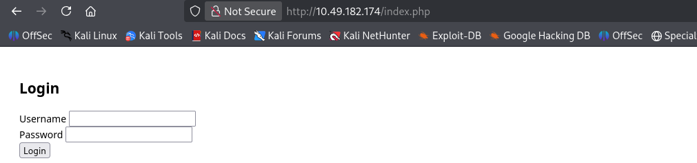
Tried SQL injection. But nothing came out. So tried on anonymous login on ftp port. Also disappointed. After that I ran nmap scan on port 3306. And found something.
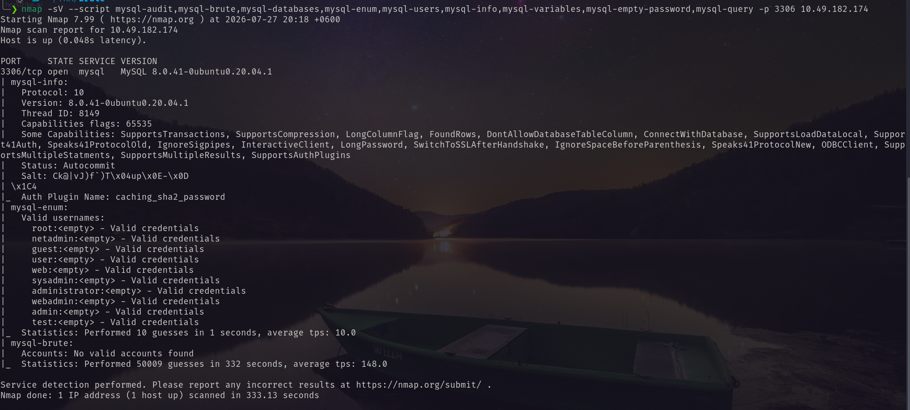
I collected the user-names and ran hydra.
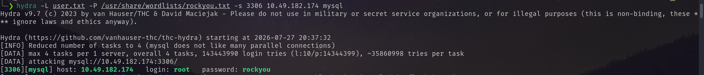
Got the Mysql credential `root:rockyou`.
Using the credential I logged in to the server. And got the password hash.
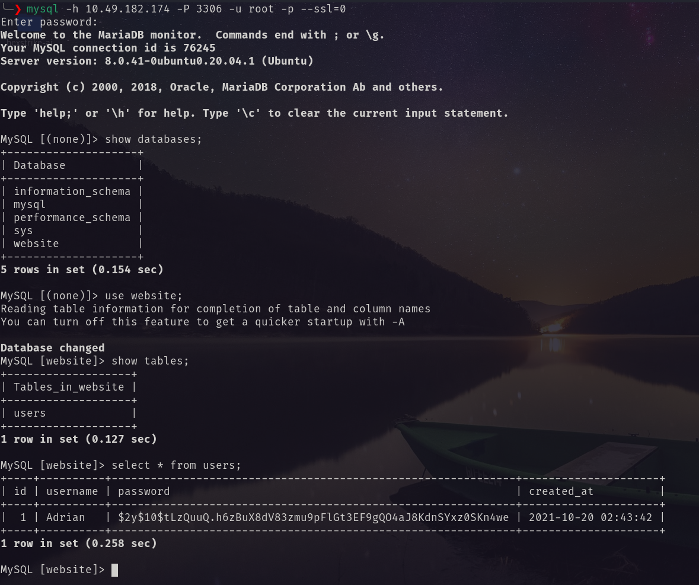
The password hash is `bcrypt`. Using john I decrypt the hash.
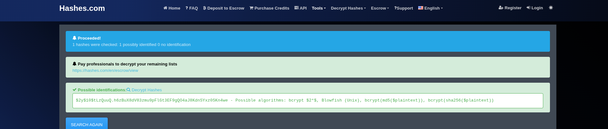
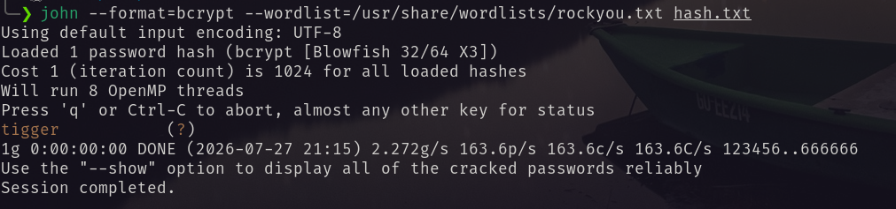
Using the username and password I logged in to the page.
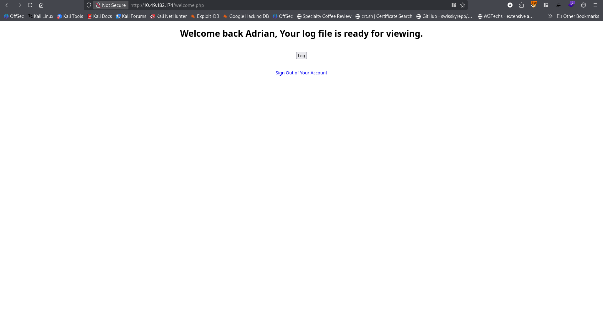
When I press the log button then
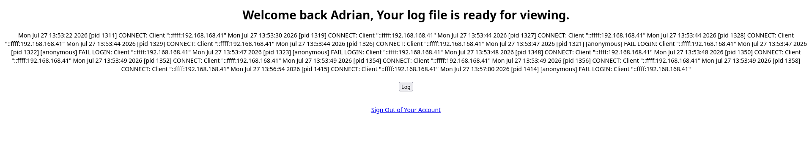
I view it using the burpsuite. 
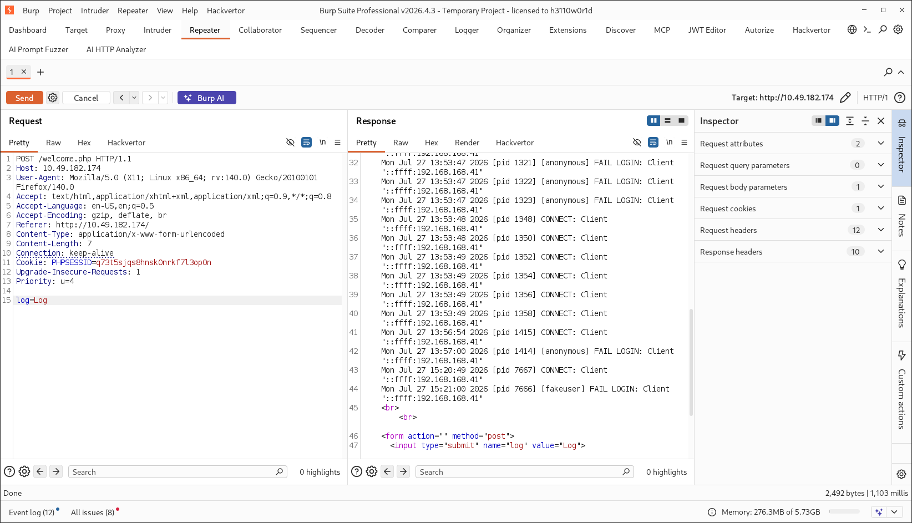
It is representing the log of ftp login with out any filtering. So I decided to perform LFI. I tried to login with a php shell script and then tried to get the RCE.
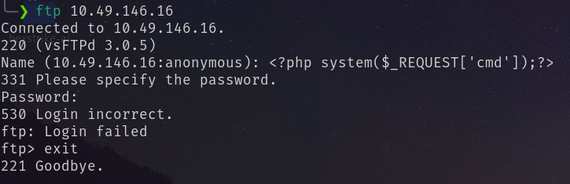
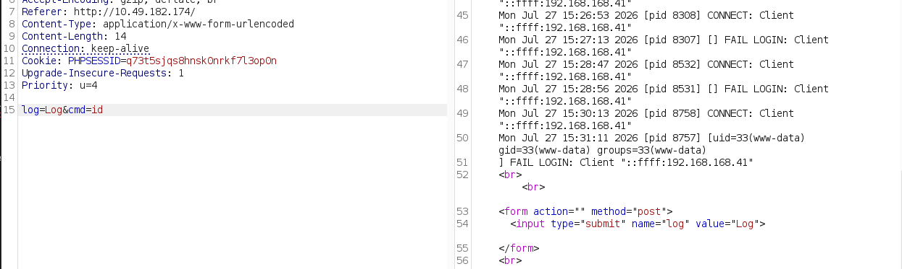
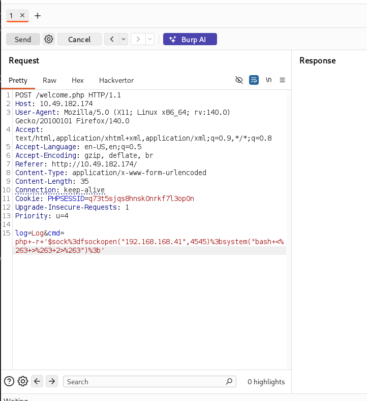
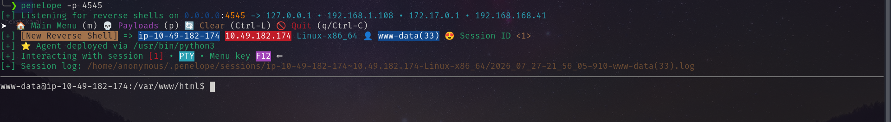
Inside the home directory of adrian I found the following.
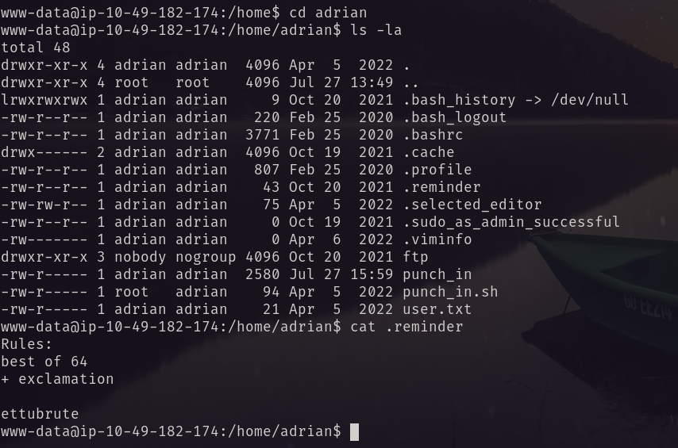
It is like something password rule. So I created a password list using the rule.
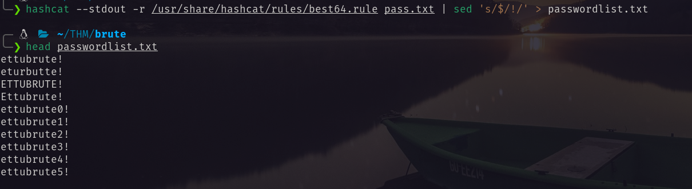
Using hydra I brute force the ftp and got the password.
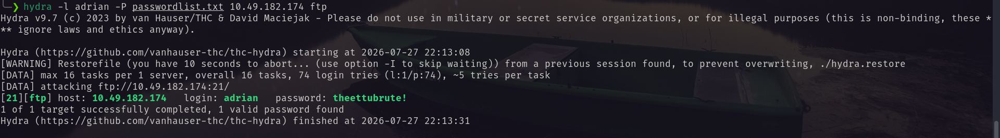
Using the ftp credential `adrian:theettubrute!` I logged via ftp and got some interesting files.
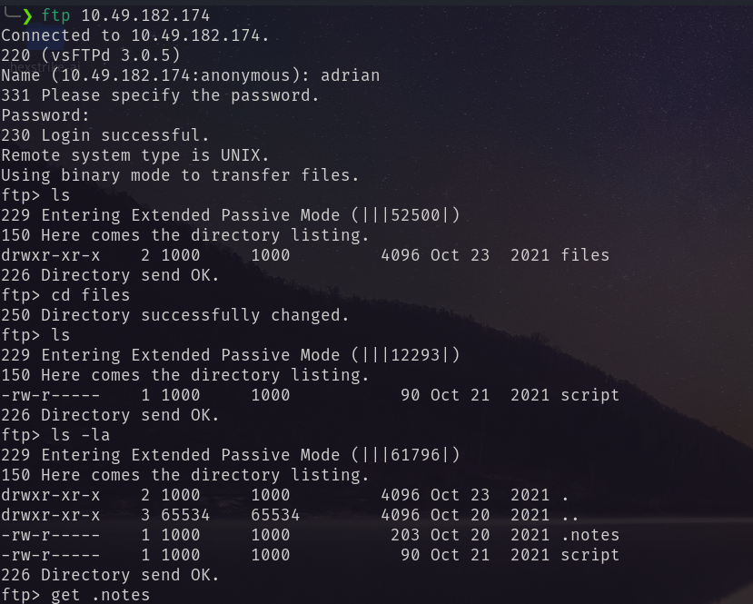
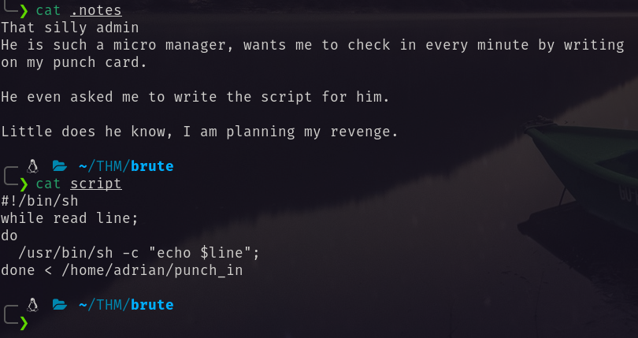
Frome the ftp files I found these things. As `www-data` I can't read from `punch_in` so I tried to login via ssh. And succeed.
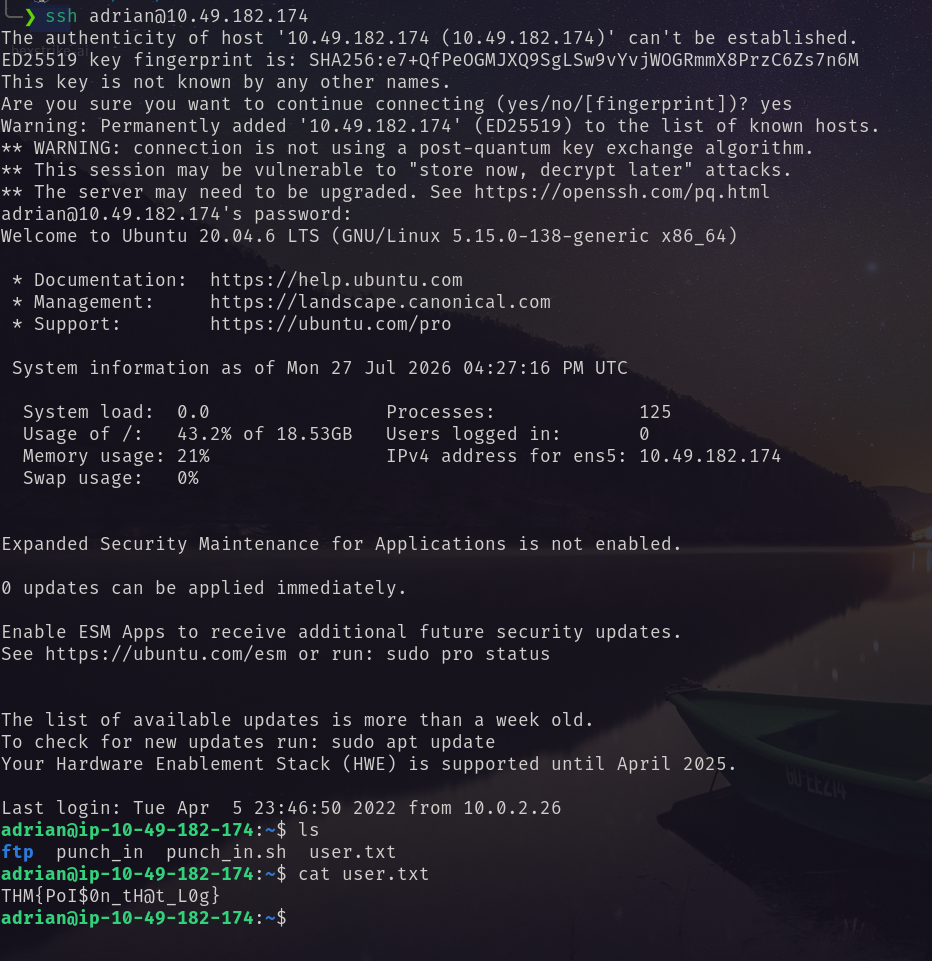
First I tried to get a shell reverse shell. But  it didn't work. So I added privilege to `/bin/bash`. And became root.
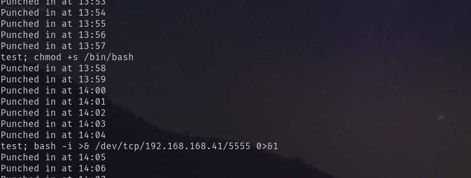
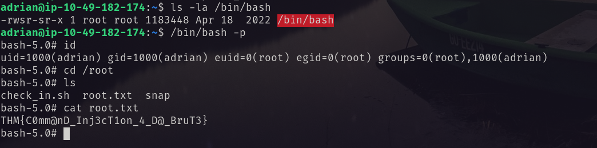
