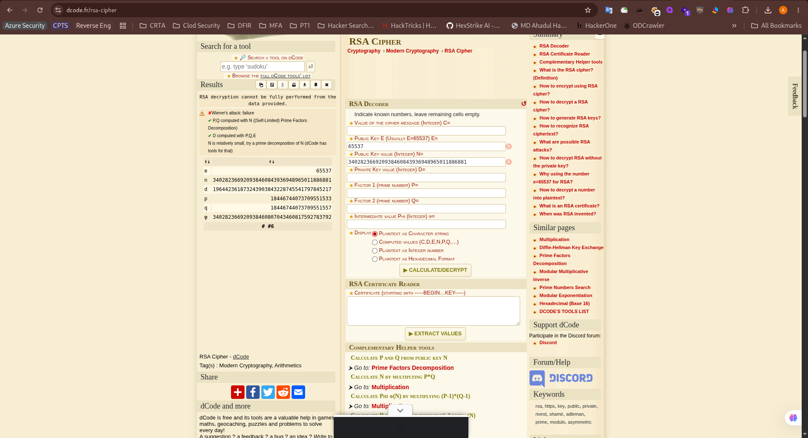
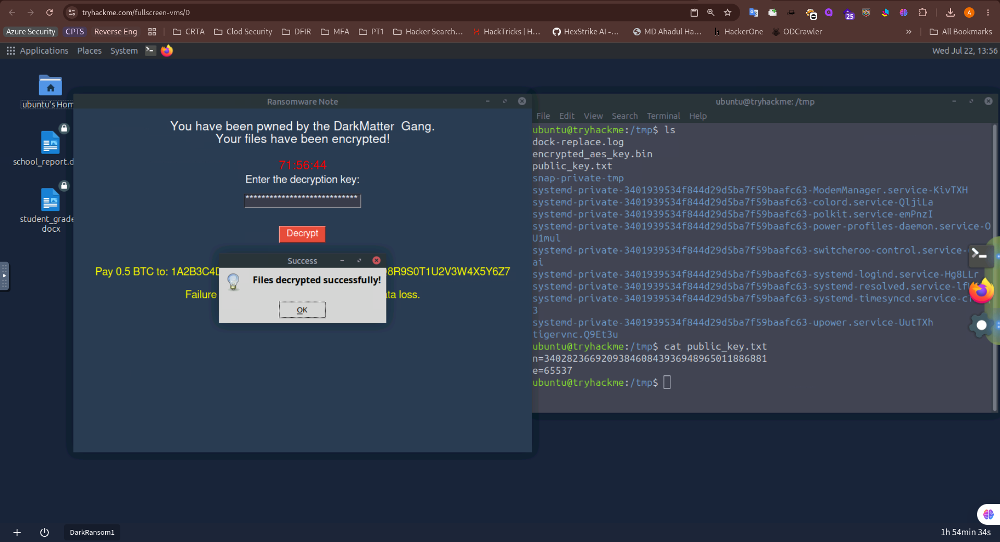
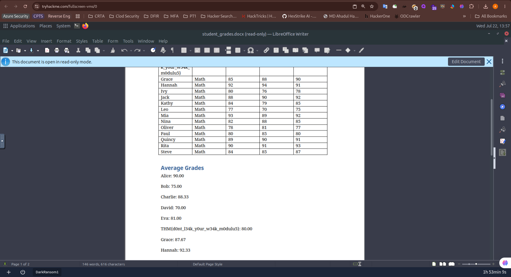

I the running machine I went to the `/tmp` directory and found a public key file.
```bash
ubuntu@tryhackme:/tmp$ cat public_key.txt 
n=340282366920938460843936948965011886881
e=65537
```
Then I visited the decode.fr RSA decryption page. and decode the values. <br/>
 <br/>
Using the value of `d`. I decrypt the file. <br/>
 <br/>
Then I opened the `student_grades.docx` and got the flag. <br/>
 <br/>