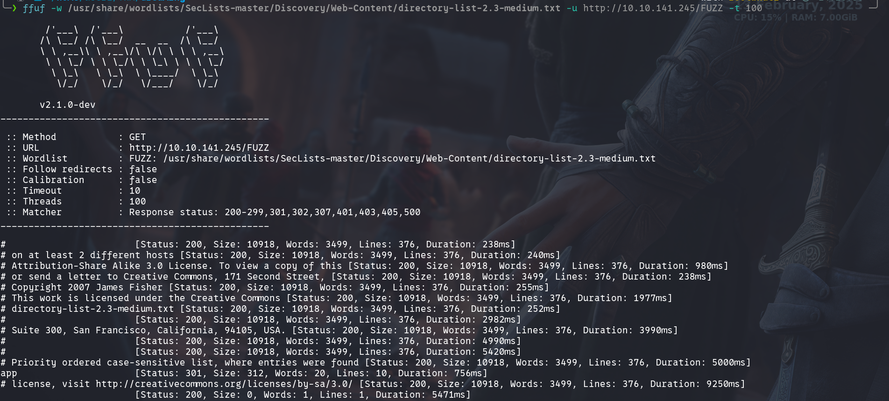
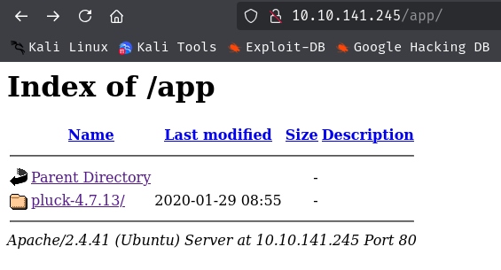
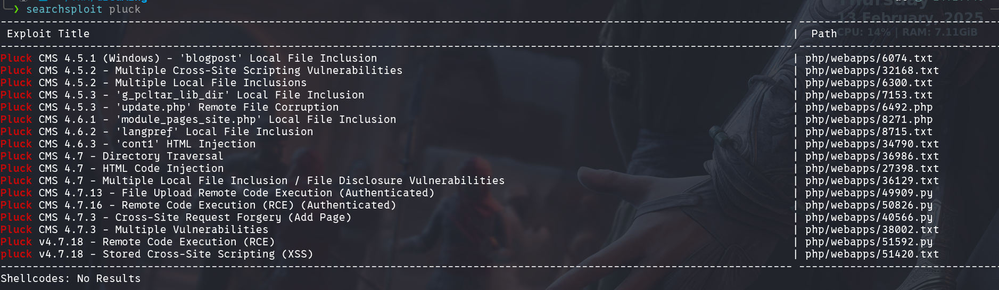
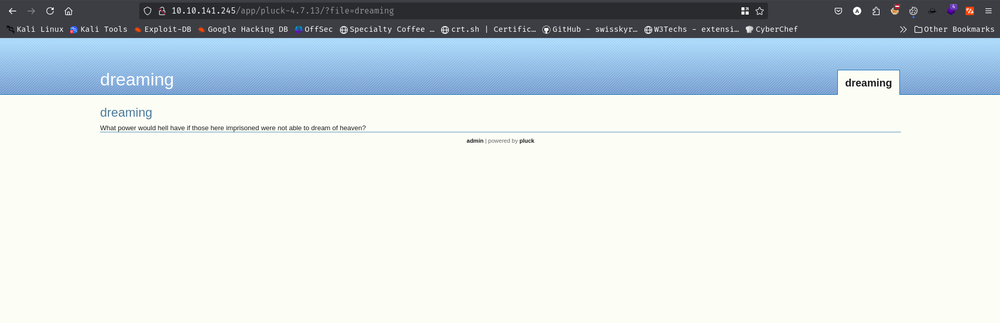
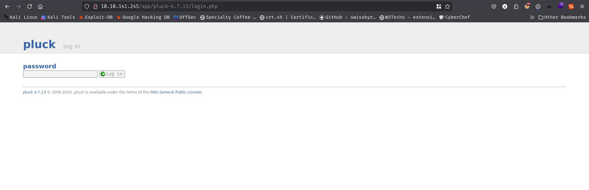
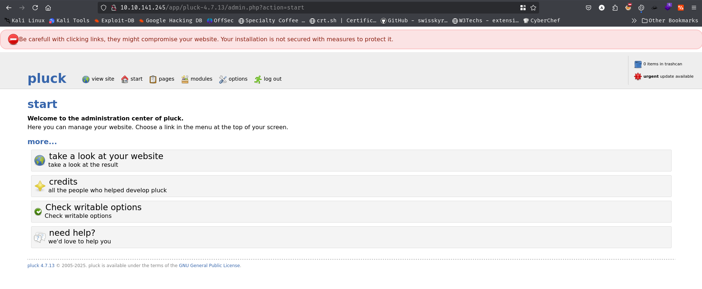
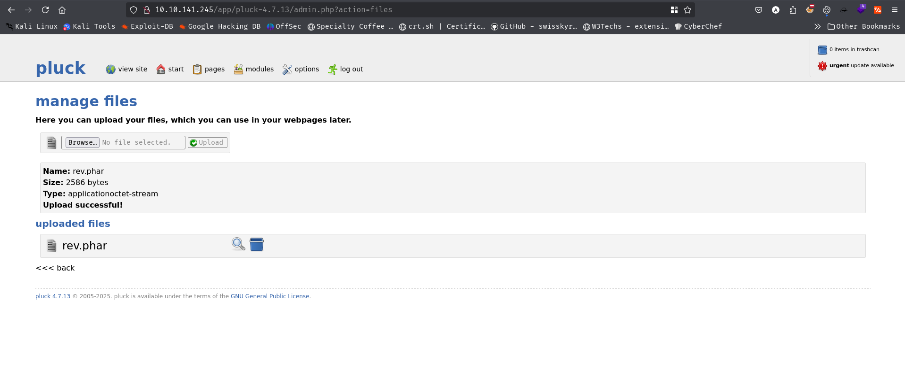
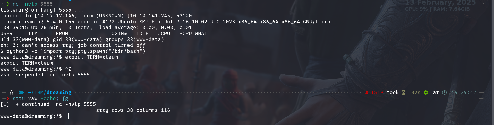

### Open Ports 
```bash
rustscan -a 10.10.141.245 -- -A

Open 10.10.141.245:22
Open 10.10.141.245:80

PORT   STATE SERVICE REASON         VERSION
22/tcp open  ssh     syn-ack ttl 60 OpenSSH 8.2p1 Ubuntu 4ubuntu0.8 (Ubuntu Linux; protocol 2.0)
| ssh-hostkey: 
|   3072 76:26:67:a6:b0:08:0e:ed:34:58:5b:4e:77:45:92:57 (RSA)
| ssh-rsa AAAAB3NzaC1yc2EAAAADAQABAAABgQDDwLHu8L86UCKGGVbbYL07uBhmOh9hWLPtBknNwMgULG3UGIqmCT3DywDvtEYZ/6D97nrt6PpsVAu0/gp73GYjUxvk4Gfog9YFShodiB/VJqK4RC23h0oNoAElSJajjEq6JcVaEyub6w8Io50fk4nNhf8dPx0YSaRjKANr9mET6s+4cUNBAF/DknsZw6iYtafzxIQTAtgSX6AtXTXRf5cpdF02wwYvUo1jVSYdXL+Oqx19UADVhQib4Pt5gLAiwuFkoJjnN1L6xwkTjd+sUPVlhQ/6yHfB826/Qk55DWoUrnABfe+3jngyPvjl1heYDuPx01rtDvlDDGAwvriwR7XmX+8X7MZ9E9QOx/m2gEHZ83kuJ9jNLB6WjlqCyA4Zes+oHWbM9Q/nJ/UVQGdfcDS65edQ5m/fw2khqUbCeSFcuD3AQvUJvvFrfg/eTNnhpee/WYJjyZO70tlzhaT/oJheodQ1hQyfgnjwToy/ISHn9Yp4jeqrshBUF87x9kUuLV0=
|   256 52:3a:ad:26:7f:6e:3f:23:f9:e4:ef:e8:5a:c8:42:5c (ECDSA)
| ecdsa-sha2-nistp256 AAAAE2VjZHNhLXNoYTItbmlzdHAyNTYAAAAIbmlzdHAyNTYAAABBBCmisKYJLewSTob1PZ06N0jUpWdArbsaHK65lE8Lwefkk3WFAwoTWvStQbzCJlo0MF+zztRtwcqmHc5V7qawS8E=
|   256 71:df:6e:81:f0:80:79:71:a8:da:2e:1e:56:c4:de:bb (ED25519)
|_ssh-ed25519 AAAAC3NzaC1lZDI1NTE5AAAAIK3j+g633Muvqft5oYrShkXdV0Rjn2S1GQpyXyxoPJy0
80/tcp open  http    syn-ack ttl 60 Apache httpd 2.4.41 ((Ubuntu))
|_http-title: Apache2 Ubuntu Default Page: It works
|_http-server-header: Apache/2.4.41 (Ubuntu)
| http-methods: 
|_  Supported Methods: POST OPTIONS HEAD GET
Warning: OSScan results may be unreliable because we could not find at least 1 open and 1 closed port
Device type: general purpose
Running: Linux 4.X
OS CPE: cpe:/o:linux:linux_kernel:4.15
OS details: Linux 4.15
```

Browsing the http port we get default apache page.<br/>
Then I start fuzzing<br/>
<br/>
I found `/app` directory.<br/>
<br/>
It has a CMS pluck version 4.7.13<br/>
Using searchsploit I have found a exploit for this version.<br/>
<br/>
File Upload RCE.<br/>
The home page<br/>
<br/>
By clicking the admin I found a login page requesting for password. <br/>
<br/>
Guessing default password as `password` I was able to log in to the pannel.<br/>
<br/>
I upload a php reverse shell with .phar extension.<br/>
<br/>
Then clicking the glass icon beside the file name I visited the upload file and obtained the reverse shell. And make it a stable shell with tty shell.<br/>
<br/>
In `/opt` directory I have found a python file with lucien password.<br/>
<br/>
Using the password `HeyLucien#@1999!` I logged in as lucien.<br/>
