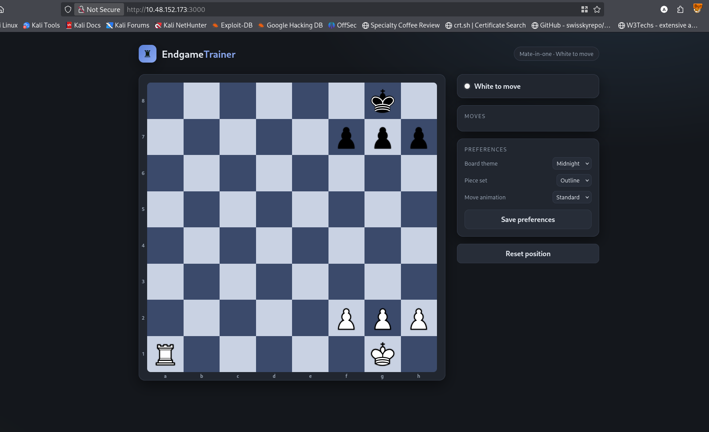
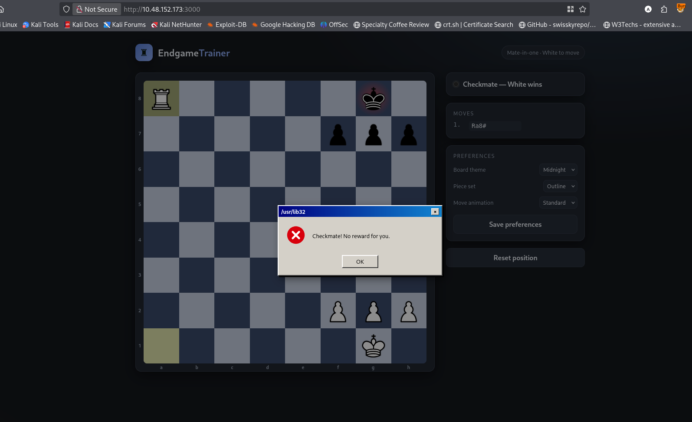
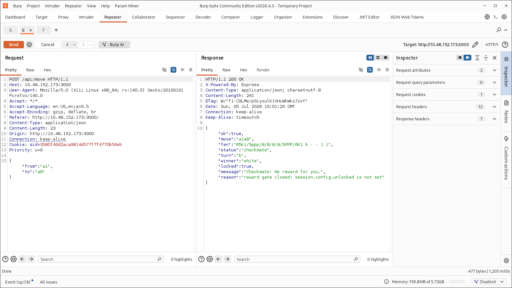
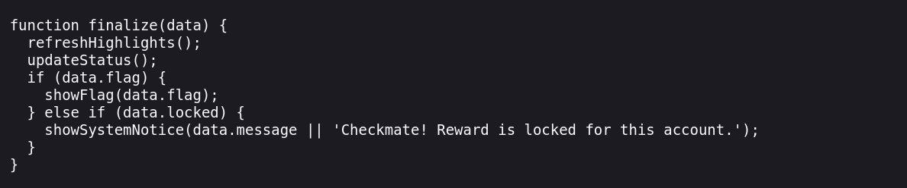
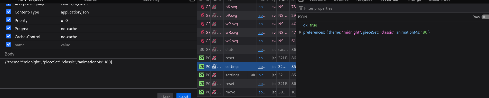
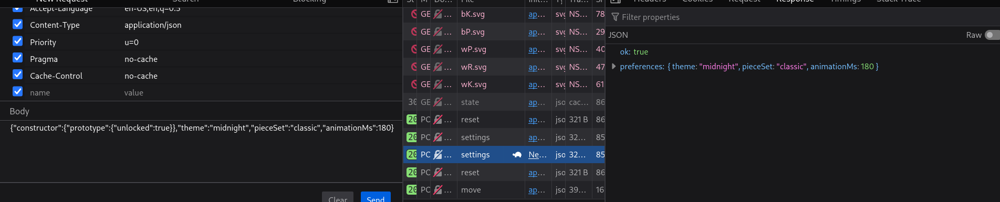
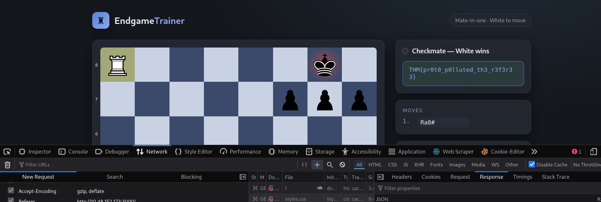

Visiting the site:<br/>
<br/>
Moving the rock for checkmate I got<br/>
<br/>
I observed the response in burpsuite. And noticed that the `reason` in the response giving me a hint. <br/>
<br/>
The function for displaying flag seems secured.<br/>
<br/>
After thinking a long time looking for here and there I discovered that there might be prototype-polution.
There is an extra option that is `save preferences` that sends request to `/api/settings`  <br/>
 <br/>
I modified the post data like the following
```
from
{"theme":"midnight","pieceSet":"classic","animationMs":180}

to
{"constructor":{"prototype":{"unlocked":true}},"theme":"midnight","pieceSet":"classic","animationMs":180}
```
For prototype pollution I added the constructor, prototype, unlocked and send the request to the same api. The api response was same. <br/>
 <br/>
Then I again click the reset button. And again move the rock for checkmate and got the flag.  <br/>
 <br/>
