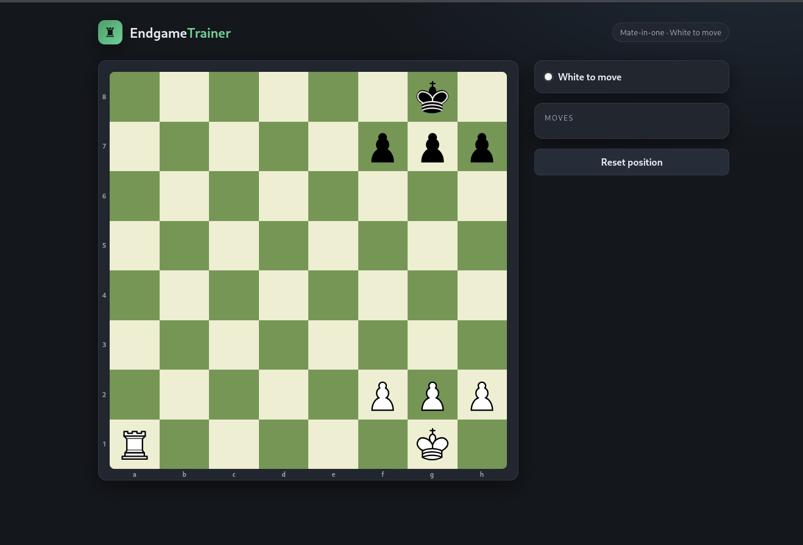
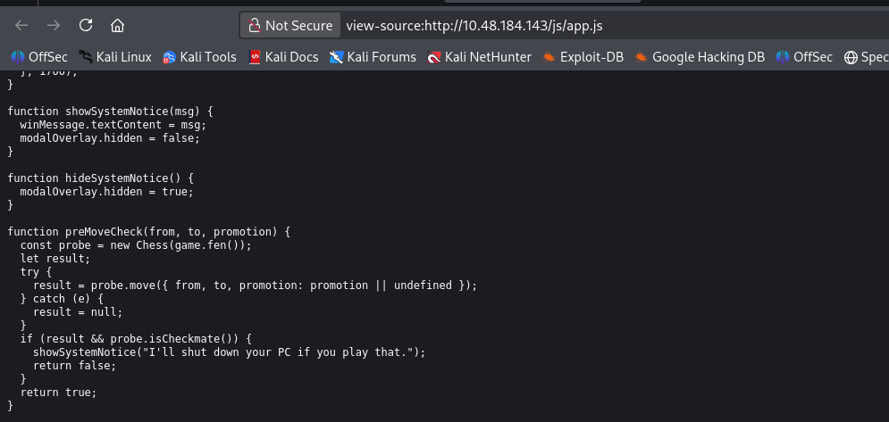
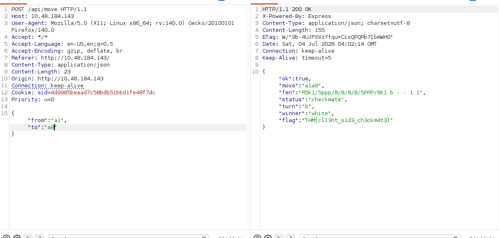

The site is 
 
Viewing the `app.js` file a function named `preMoveCheck()` that prevents checkmate in client side. 
 
So in just move any pieces except the rock. and intercept the request with burpsuite. The Change by this value `from:a1`,`to:a8`. and receive the flag.  
 