## Open ports 
```bash
rustscan -a 10.48.141.228 -- -A

Open 10.48.141.228:22
Open 10.48.141.228:21

PORT   STATE SERVICE REASON         VERSION
21/tcp open  ftp     syn-ack ttl 62 vsftpd 3.0.5
| ftp-syst: 
|   STAT: 
| FTP server status:
|      Connected to ::ffff:192.168.168.41
|      Logged in as ftp
|      TYPE: ASCII
|      No session bandwidth limit
|      Session timeout in seconds is 300
|      Control connection is plain text
|      Data connections will be plain text
|      At session startup, client count was 3
|      vsFTPd 3.0.5 - secure, fast, stable
|_End of status
| ftp-anon: Anonymous FTP login allowed (FTP code 230)
| drwxrwxrwx    2 115      123          4096 Apr 30 06:00 incoming [NSE: writeable]
|_drwxr-xr-x    4 115      123          4096 Jun 09 08:22 pub
22/tcp open  ssh     syn-ack ttl 62 OpenSSH 9.6p1 Ubuntu 3ubuntu13.16 (Ubuntu Linux; protocol 2.0)
| ssh-hostkey: 
|   256 43:80:05:ff:6c:12:87:02:e1:82:23:f6:b6:65:95:a7 (ECDSA)
| ecdsa-sha2-nistp256 AAAAE2VjZHNhLXNoYTItbmlzdHAyNTYAAAAIbmlzdHAyNTYAAABBBFyLZw+ZTGekNrNar8prf3gEbtx5RT2rjTZkddmbHwPhDHwb9St0bTOv2266eQEgydv2uQZZmzQJOECrlFPrlcM=
|   256 41:f7:76:00:97:3f:1d:f7:33:c0:7e:ab:24:db:14:b1 (ED25519)
|_ssh-ed25519 AAAAC3NzaC1lZDI1NTE5AAAAIAywfMvKSWzJ0aQdPJSJOMTHi00tvDE6tJ+OPIkRPT6I
Warning: OSScan results may be unreliable because we could not find at least 1 open and 1 closed port
Device type: general purpose|phone
Running (JUST GUESSING): Linux 5.X|6.X|4.X (96%), Google Android 10.X|11.X|12.X|9.X (93%)
OS CPE: cpe:/o:linux:linux_kernel:5 cpe:/o:linux:linux_kernel:6 cpe:/o:linux:linux_kernel:4 cpe:/o:google:android:10 cpe:/o:google:android:11 cpe:/o:google:android:12 cpe:/o:google:android:9
OS fingerprint not ideal because: Missing a closed TCP port so results incomplete
Aggressive OS guesses: Linux 5.14 - 6.8 (96%), Linux 4.15 - 5.19 (96%), Linux 4.15 (95%), Linux 5.4 - 5.15 (95%), Android 10 - 12 (Linux 4.14 - 4.19) (93%), Android 10 - 11 (Linux 4.9 - 4.14) (92%), Android 9 - 11 (Linux 4.9 - 4.14) (92%), Linux 2.6.32 (92%), Linux 3.1 - 3.2 (92%), Linux 3.11 (92%)
No exact OS matches for host (test conditions non-ideal).
```
Anonymous ftp login is allowed.<br/>
I found a `README.txt` in pub directory. That says<br/>
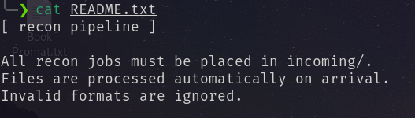<br/>
I uploaded a bash reverse shell named test.sh through ftp to incoming directory. and received the shell.<br/>
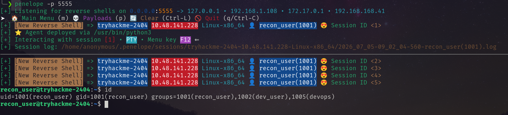<br/>
And in `recon_user` home directory I found the first flag.<br/>
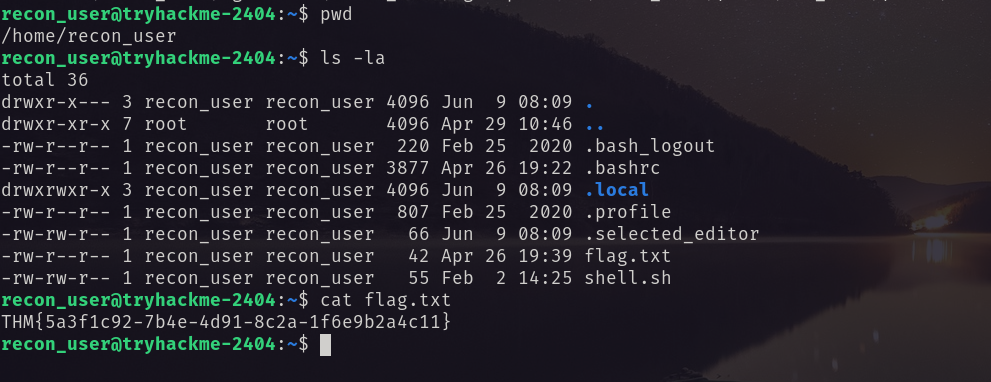<br/>
### recon_user
In `/opt/dev_user` I found `backup.sh` which is writable by recon_user. I write a reverse shell and received a shell as dev_user.<br/>
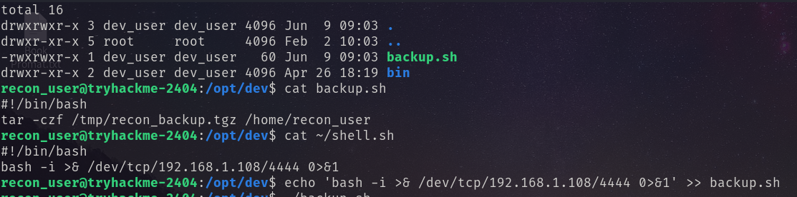<br/>
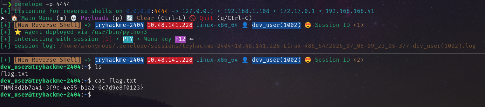<br/>
### dev_user
Running `pspy64` I found something interesting.<br/>
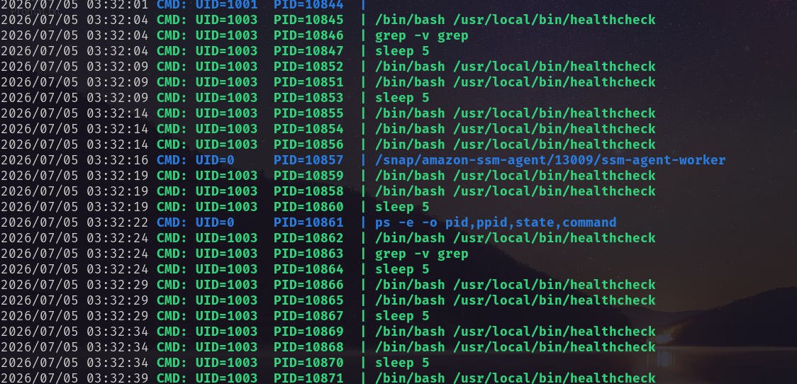<br/>
The file `/usr/local/bin/healthcheck` is owned by `monitor_user` and ran by `monitr_user`. Inside the file i found the following.<br/>
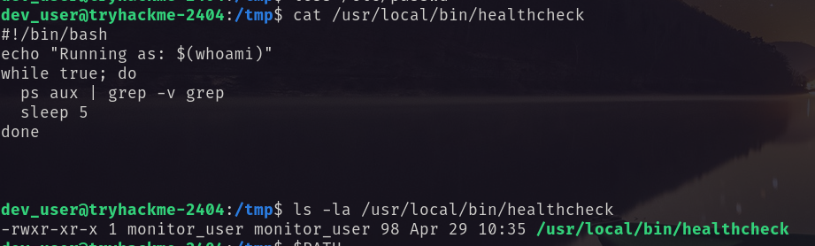<br/>
There is also a `ps` command in `/opt/dev/bin` folder. I rewrite the `ps` command with reverse shell and obtained the shell.<br/>
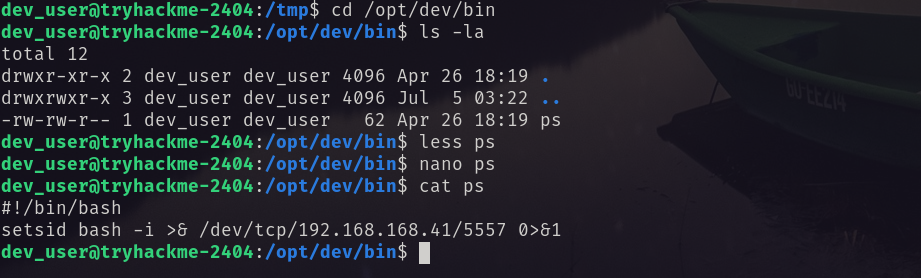<br/>
Give it execution permission.<br/>
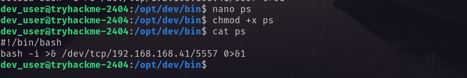<br/>
Here is the flag.<br/>
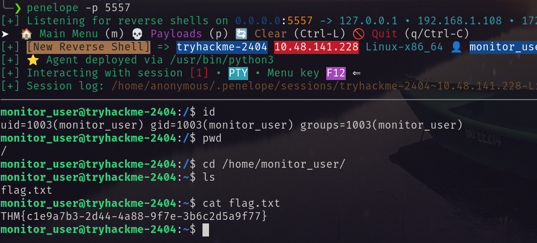<br/>
### monitor_user
Running `sudo -l` I found I can run `ops_user`'s file.<br/>
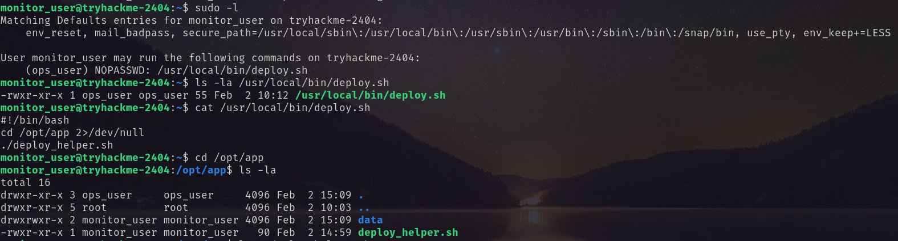<br/>
Reading this file I found `deploy_helper`. In which I have write permission.<br/>
I edited that file with reverse shell and obtained the shell as `ops_user`.<br/>
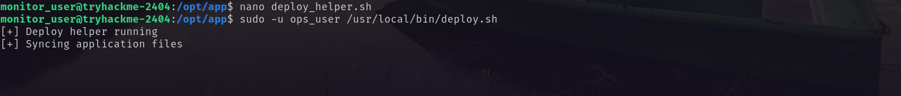<br/>
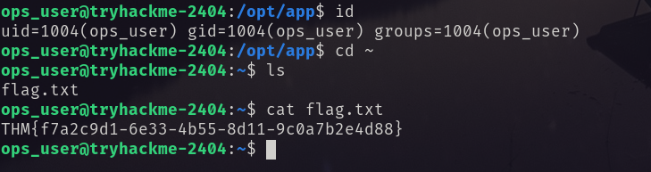<br/>
### ops_user 
Running `sudo -l` I found <br/>
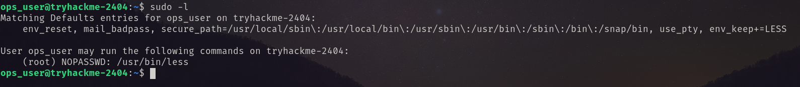<br/>
Using [gtfobins](https://gtfobins.org/gtfobins/less/#inherit) I executed the command and get shell as root.<br/>
`sudo less /etc/hosts` then type `!/bin/sh`  <br/>
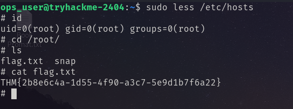 <br/>
