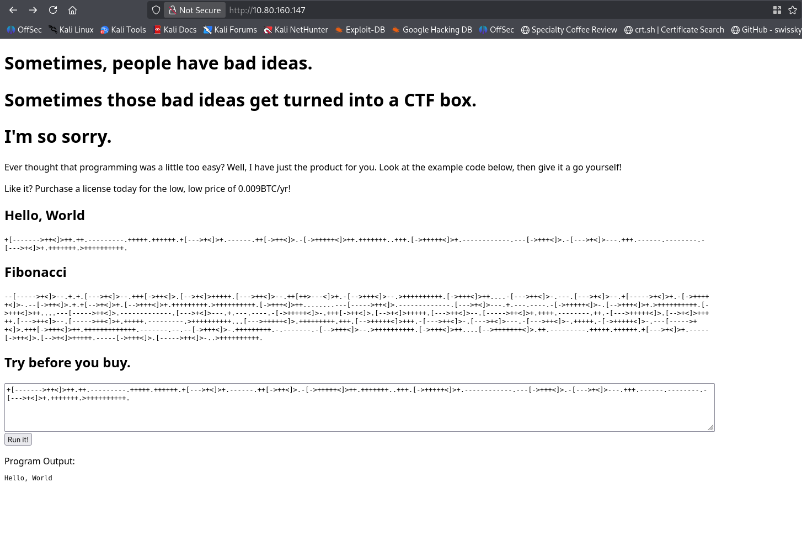
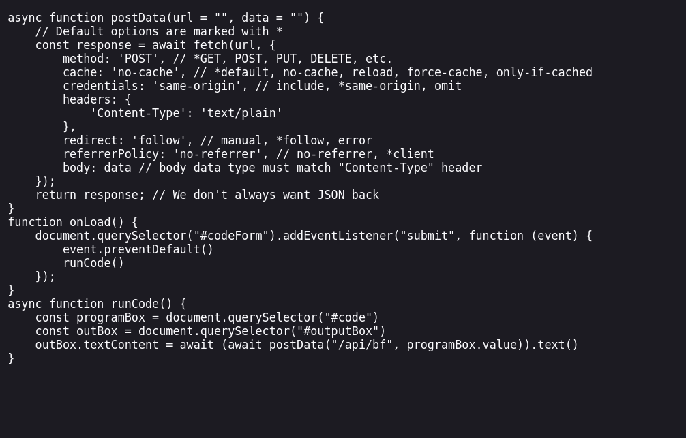
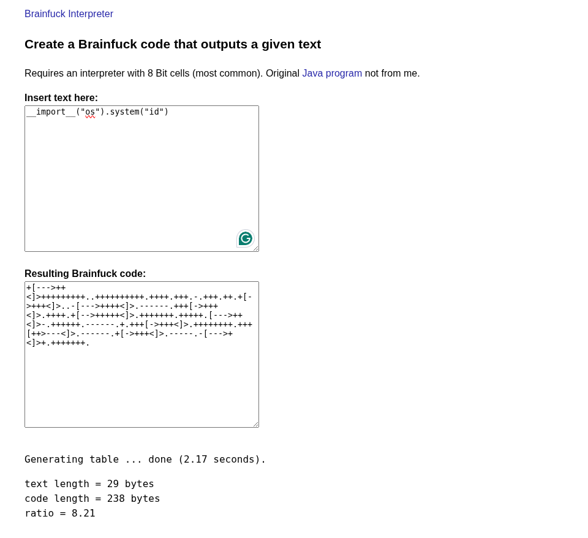
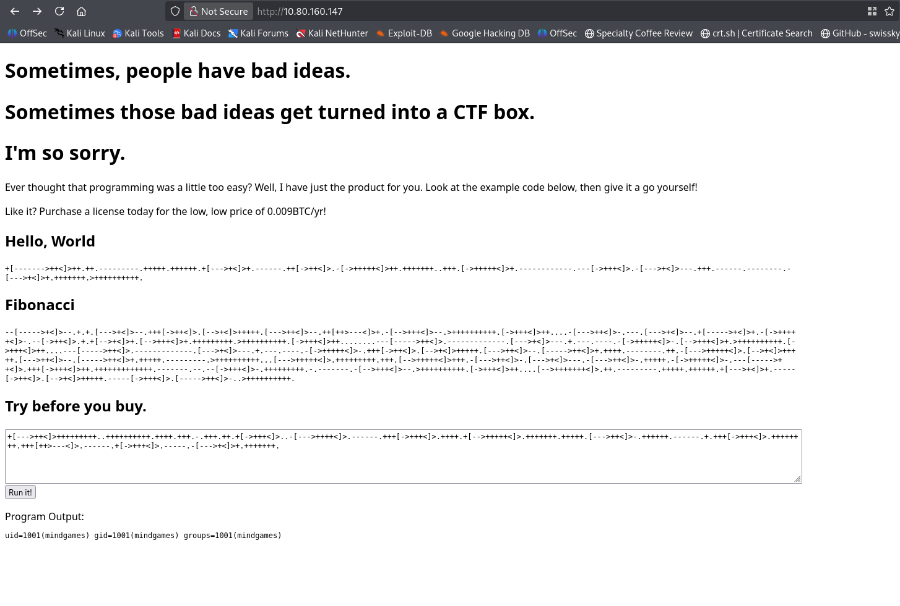
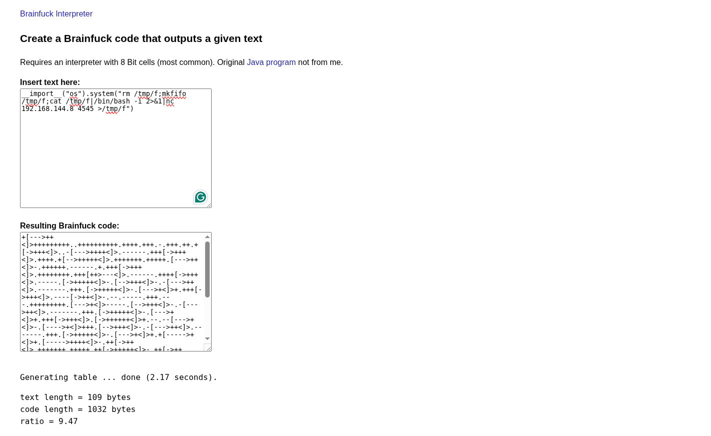
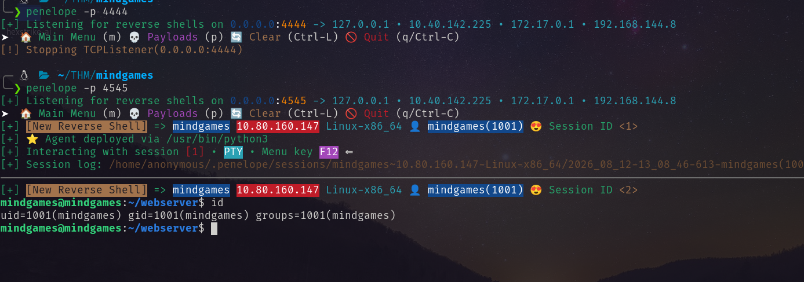
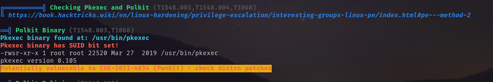
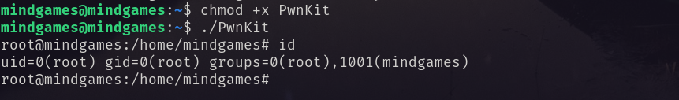

# Port Scanning
```bash
❯ rustscan -a 10.80.160.147 -- -A

Open 10.80.160.147:80

PORT   STATE SERVICE REASON         VERSION
80/tcp open  http    syn-ack ttl 62 Golang net/http server (Go-IPFS json-rpc or InfluxDB API)
|_http-title: Mindgames.
| http-methods: 
|_  Supported Methods: GET HEAD POST OPTIONS
Warning: OSScan results may be unreliable because we could not find at least 1 open and 1 closed port
Device type: general purpose|phone
Running (JUST GUESSING): Linux 4.X|5.X|6.X (96%), Google Android 10.X|11.X|12.X (93%)
OS CPE: cpe:/o:linux:linux_kernel:4 cpe:/o:linux:linux_kernel:5 cpe:/o:google:android:10 cpe:/o:google:android:11 cpe:/o:google:android:12 cpe:/o:linux:linux_kernel:6 cpe:/o:linux:linux_kernel:5.4
OS fingerprint not ideal because: Missing a closed TCP port so results incomplete
Aggressive OS guesses: Linux 4.15 - 5.19 (96%), Linux 4.15 (96%), Linux 5.4 - 5.15 (96%), Android 10 - 12 (Linux 4.14 - 4.19) (93%), Linux 5.14 - 6.8 (93%), Android 10 - 11 (Linux 4.9 - 4.14) (92%), Android 12 (Linux 5.4) (92%), Android 9 - 11 (Linux 4.9 - 4.14) (92%), Linux 2.6.32 (92%), Linux 2.6.39 - 3.2 (92%)
No exact OS matches for host (test conditions non-ideal).
```
So visiting the webpage I found it decodes BrainFuck scripts. <br/>
 <br/>
In `main.js` it discloses just the `/api/bf`. That takes the brainfuck code as input and returns the decoded output.<br/>
 <br/>
So I crafted a command injection payload in brainfuck. <br/>
 <br/>
Then put that payload in that page and run it. <br/>
 <br/>
It has command injection vulnerability. So I took reverse shell abusing this vulnerability. <br/>
  <br/>
 <br/>
And got the user flag. <br/>
# Privilege Escalation
I ran `linpeas.sh` and found that it has pkexec vulnerability.  <br/>
 <br/>
Abusing this I became ROOT. <br/>
 <br/>