### Open Ports 
```bash
rustscan -a 10.10.188.63 -- -A

Open 10.10.188.63:21
Open 10.10.188.63:80
Open 10.10.188.63:1337

PORT     STATE SERVICE REASON         VERSION
21/tcp   open  ftp     syn-ack ttl 60 vsftpd 3.0.3
80/tcp   open  http    syn-ack ttl 60 Apache httpd 2.4.29 ((Ubuntu))
|_http-server-header: Apache/2.4.29 (Ubuntu)
|_http-title: Site doesn't have a title (text/html).
| http-robots.txt: 1 disallowed entry 
|_/webmasters/*
| http-methods: 
|_  Supported Methods: OPTIONS HEAD GET POST
1337/tcp open  ssh     syn-ack ttl 60 OpenSSH 7.6p1 Ubuntu 4ubuntu0.3 (Ubuntu Linux; protocol 2.0)
| ssh-hostkey: 
|   2048 e0:42:c0:a5:7d:42:6f:00:22:f8:c7:54:aa:35:b9:dc (RSA)
| ssh-rsa AAAAB3NzaC1yc2EAAAADAQABAAABAQC+cUIYV9ABbcQFihgqbuJQcxu2FBvx0gwPk5Hn+Eu05zOEpZRYWLq2CRm3++53Ty0R7WgRwayrTTOVt6V7yEkCoElcAycgse/vY+U4bWr4xFX9HMNElYH1UztZnV12il/ep2wVd5nn//z4fOllUZJlGHm3m5zWF/k5yIh+8x7T7tfYNsoJdjUqQvB7IrcKidYxg/hPDWoZ/C+KMXij1n3YXVoDhQwwR66eUF1le90NybORg5ogCfBLSGJQhZhALBLLmxAVOSc4e+nhT/wkhTkHKGzUzW6PzA7fTN3Pgt81+m9vaxVm/j7bXG3RZSzmKlhrmdjEHFUkLmz6bjYu3201
|   256 23:eb:a9:9b:45:26:9c:a2:13:ab:c1:ce:07:2b:98:e0 (ECDSA)
| ecdsa-sha2-nistp256 AAAAE2VjZHNhLXNoYTItbmlzdHAyNTYAAAAIbmlzdHAyNTYAAABBBOJp4tEjJbtHZZtdwGUu6frTQk1CzigA1PII09LP2Edpj6DX8BpTwWQ0XLNSx5bPKr5sLO7Hn6fM6f7yOy8SNHU=
|   256 35:8f:cb:e2:0d:11:2c:0b:63:f2:bc:a0:34:f3:dc:49 (ED25519)
|_ssh-ed25519 AAAAC3NzaC1lZDI1NTE5AAAAIIiax5oqQ7hT7CgO0CC7FlvGf3By7QkUDcECjpc9oV9k
Warning: OSScan results may be unreliable because we could not find at least 1 open and 1 closed port
OS fingerprint not ideal because: Missing a closed TCP port so results incomplete
Aggressive OS guesses: Linux 3.1 (95%), Linux 3.2 (95%), AXIS 210A or 211 Network Camera (Linux 2.6.17) (95%), ASUS RT-N56U WAP (Linux 3.4) (93%), Linux 3.16 (93%), Adtran 424RG FTTH gateway (93%), Linux 2.6.32 (93%), Linux 2.6.39 - 3.2 (93%), Linux 3.1 - 3.2 (93%), Linux 3.11 (93%)
No exact OS matches for host (test conditions non-ideal).
```

Visiting http://10.10.188.63/robots.txt I found <br/>
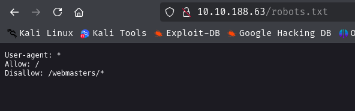<br/>
Fuzzing that url reveals some information <br/>
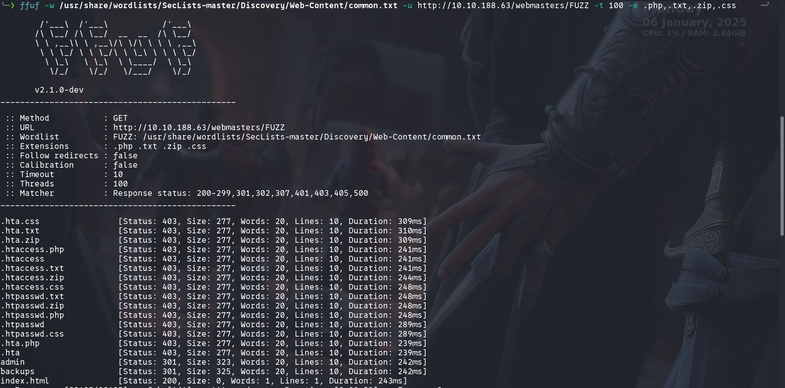 <br/>
Then fuzzing the backups directory <br/>
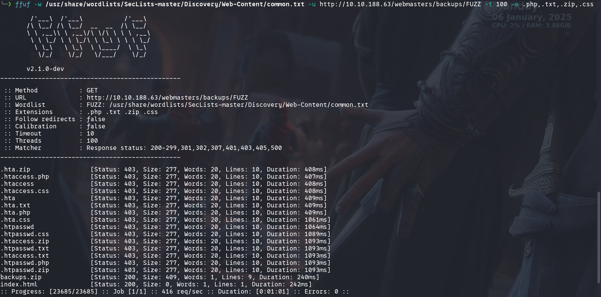 <br/>
I have downloaded the backups.zip file but <br/>
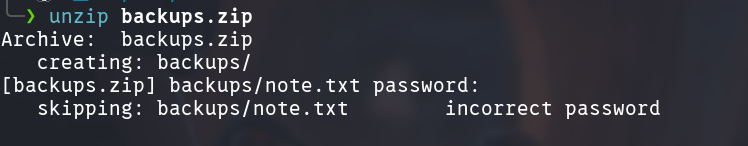 <br/>
Using John The Ripper I have cracked the password <br/>
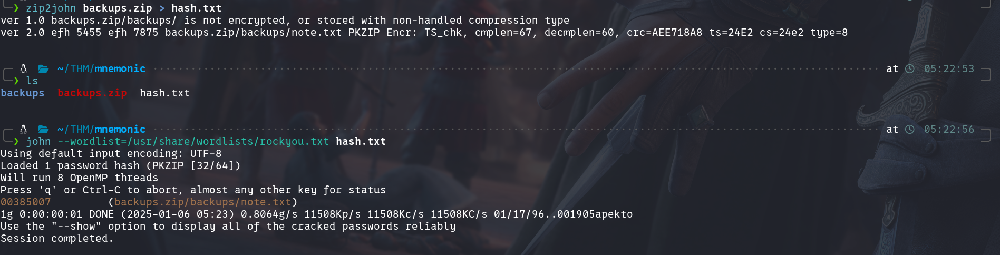 <br/>
Unzip password is: 00385007 <br/>
Uzipping that file i received note.txt  <br/>
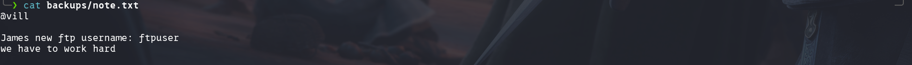 <br/>
So the ftp username is ftpuser. <br/>
Using hydra I got the password. <br/>
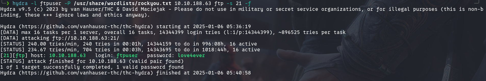 <br/>
ftp credentials `ftpuser:love4ever` <br/>
Using the credentials I loged in to the ftp server. And get <br/>
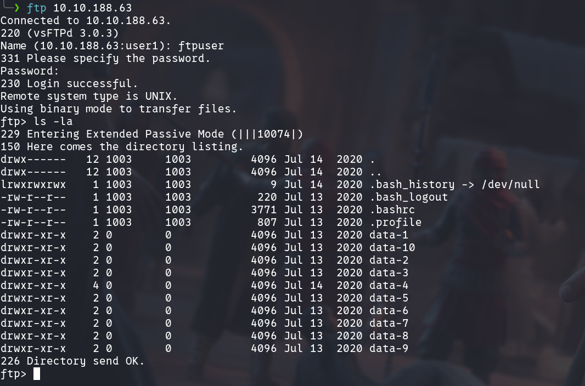 <br/>
I have searched all the directory for credentials. Then I got something from `data-4` <br/>
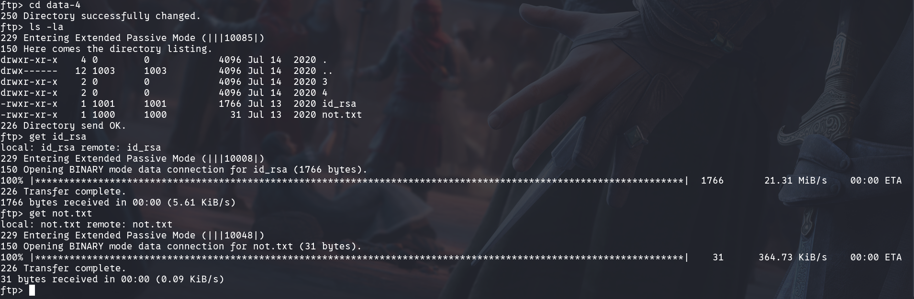 <br/>
From not.txt 
```bash
cat not.txt
james change ftp user password
```
So the username is john.
For ssh password I have used john.
```bash
ssh2john id_rsa > sshHash.txt

john --wordlist=/usr/share/wordlists/rockyou.txt sshHash.txt                                                                                           ─╯
Using default input encoding: UTF-8
Loaded 1 password hash (SSH, SSH private key [RSA/DSA/EC/OPENSSH 32/64])
Cost 1 (KDF/cipher [0=MD5/AES 1=MD5/3DES 2=Bcrypt/AES]) is 0 for all loaded hashes
Cost 2 (iteration count) is 1 for all loaded hashes
Will run 8 OpenMP threads
Press 'q' or Ctrl-C to abort, almost any other key for status
bluelove         (id_rsa)     
1g 0:00:00:00 DONE (2025-01-06 05:56) 33.33g/s 932266p/s 932266c/s 932266C/s chooch..ROSITA
Use the "--show" option to display all of the cracked passwords reliably
Session completed. 
```

Therefore, the ssh credentials `james:bluelove` <br/>
After login as james I got this  <br/>
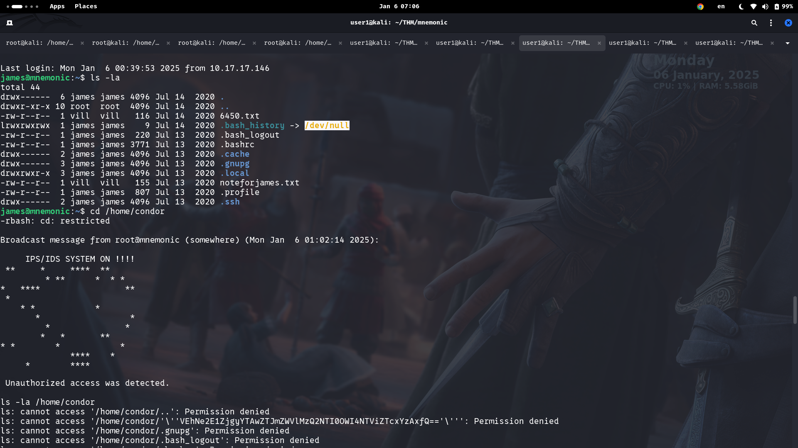 <br/>
IPS starts blocking so have to do quick. <br/>
 <br/>
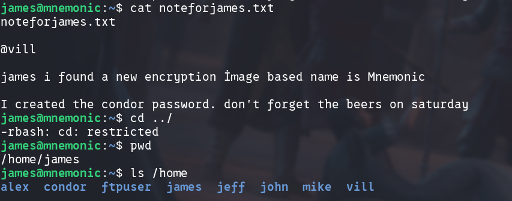 <br/>
From `/home/condor` I got <br/>
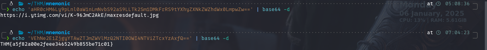 <br/>
Following that link <br/>
 <br/>

According to the information this is a image based mnemonic encryption and password file is 6450.txt <br/>
Using [this](https://github.com/MustafaTanguner/Mnemonic.git) tool I decrypted the message <br/>
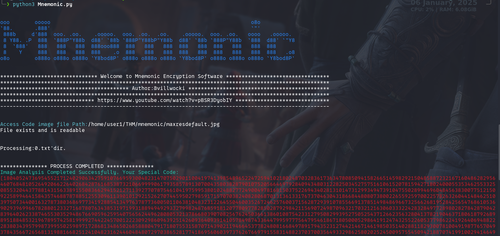 <br/>
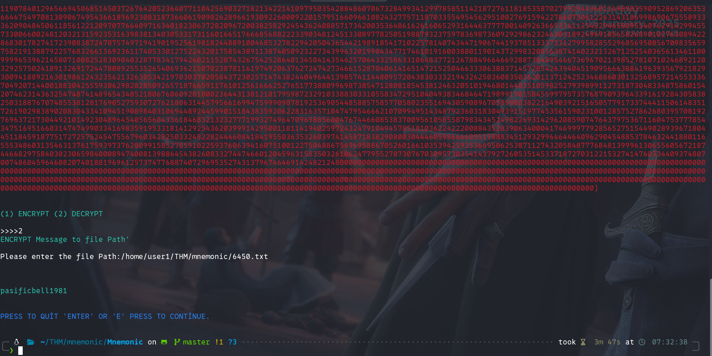 <br/>

So the condor credential is `condor:pasificbell1981` <br/>
After login as condor I use the following command and found SUID bit is set to `/usr/bin/pkexec`
```bash
find / -type f -perm -u=s 2>/dev/null
```

Then using this vulnerability I got the root shell. <br/>
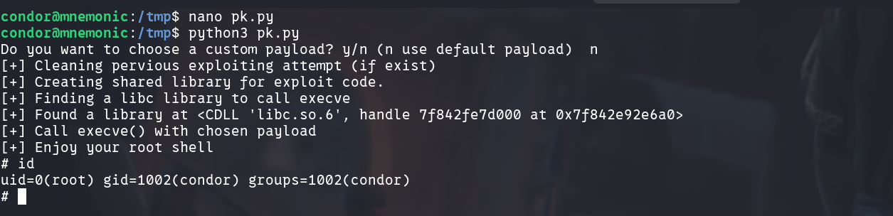 <br/>
