# Port Scanning
```bash
❯ rustscan -a 10.49.137.52 -- -A

Open 10.49.137.52:22
Open 10.49.137.52:80


PORT   STATE SERVICE REASON         VERSION
22/tcp open  ssh     syn-ack ttl 62 OpenSSH 8.9p1 Ubuntu 3ubuntu0.13 (Ubuntu Linux; protocol 2.0)
| ssh-hostkey: 
|   256 8f:40:db:e4:9d:66:77:97:7e:51:9a:c4:80:7f:31:9f (ECDSA)
| ecdsa-sha2-nistp256 AAAAE2VjZHNhLXNoYTItbmlzdHAyNTYAAAAIbmlzdHAyNTYAAABBBF/kUTCIw6HP42hBnA9jPkJPHWrq0q9RvBtbAkkXIpvLYjJ3hci6L44DqXnRK+sW7MG3mqkHbwnjSHWOwEFUcW8=
|   256 df:c5:ba:df:1a:0e:7a:d6:20:7b:d2:53:b8:a8:4a:ba (ED25519)
|_ssh-ed25519 AAAAC3NzaC1lZDI1NTE5AAAAIOCi8tHAhMJCHk9mijPqi0xKad4TXbEUR3AoLtgEEMTx
80/tcp open  http    syn-ack ttl 62 Apache httpd 2.4.52 ((Ubuntu))
| http-methods: 
|_  Supported Methods: GET HEAD POST OPTIONS
|_http-server-header: Apache/2.4.52 (Ubuntu)
|_http-title: Cherry on Top Ice Cream Shop
Warning: OSScan results may be unreliable because we could not find at least 1 open and 1 closed port
Device type: general purpose|phone
Running (JUST GUESSING): Linux 5.X|6.X|4.X (96%), Google Android 10.X|11.X|12.X (93%)
OS CPE: cpe:/o:linux:linux_kernel:5 cpe:/o:linux:linux_kernel:6 cpe:/o:linux:linux_kernel:4 cpe:/o:google:android:10 cpe:/o:google:android:11 cpe:/o:google:android:12 cpe:/o:linux:linux_kernel:5.4
OS fingerprint not ideal because: Missing a closed TCP port so results incomplete
Aggressive OS guesses: Linux 5.14 - 6.8 (96%), Linux 4.15 - 5.19 (96%), Linux 4.15 (96%), Linux 5.4 - 5.15 (96%), Android 10 - 12 (Linux 4.14 - 4.19) (93%), Android 10 - 11 (Linux 4.9 - 4.14) (92%), Android 12 (Linux 5.4) (92%), Android 9 - 11 (Linux 4.9 - 4.14) (92%), Linux 2.6.32 (92%), Linux 2.6.39 - 3.2 (92%)
```
## 3rd key
Given backdoor credentials 
```
Username: notsus
Password: dontbeascriptkiddie
```
Using the given credential I accessed to the user via ssh. After that I ran upload `linpeas.sh` and ran it. <br/>
Found interesting cron job. and /etc/hosts file writable. <br/>
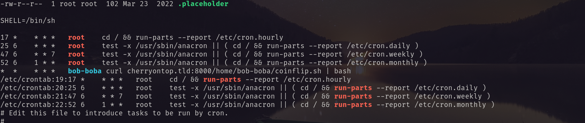 <br/>
!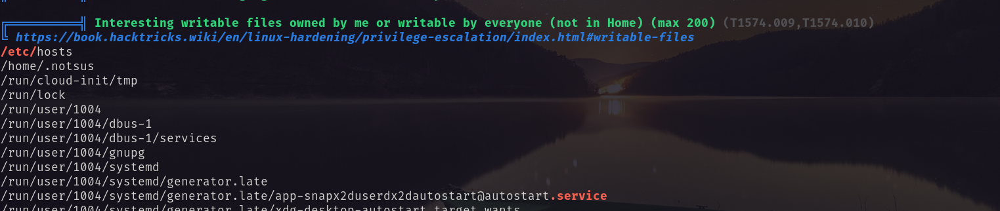 <br/>
Edited the hosts file with my attack box ip and then created a reverse shell according to the cron process. <br/>
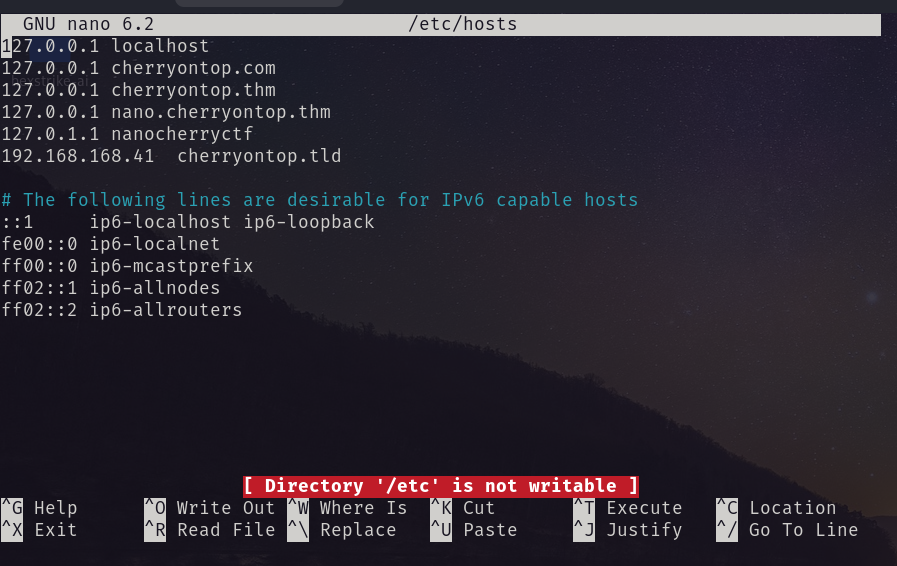 <br/>
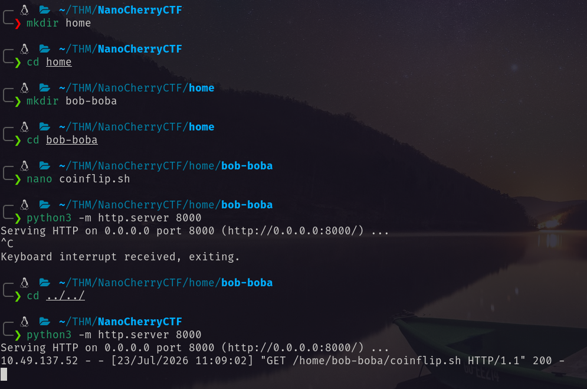 <br/>
When it executed the shell is executed I got the shell as bob-boa. <br/>
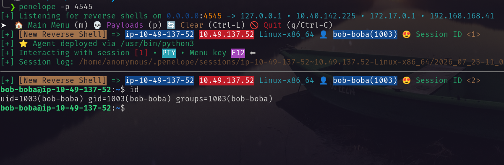 <br/>
I have found chads 3rd key. `7h3fu7ur3` <br/>
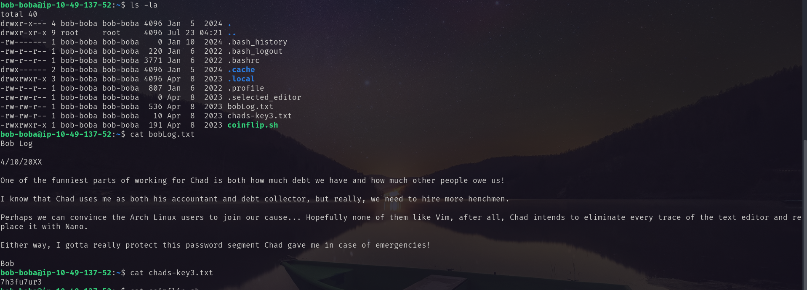 <br/>
## 1st key 
I brute force vhost and found `nano.cherryontop.thm`. <br/>
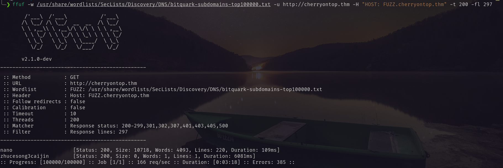 <br/>
After that I again bruteforce for file and directories on that vhost. And found something interesting. <br/>
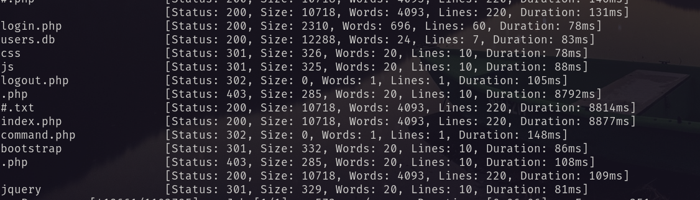 <br/>
Visiting the url `http://nano.cherryontop.thm/users.db/` I got a sqlite3 database. <br/>
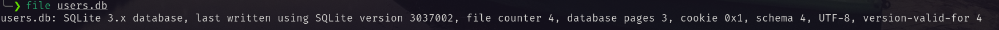 <br/>
From that database I got login credentials for `/login.php` page. <br/>
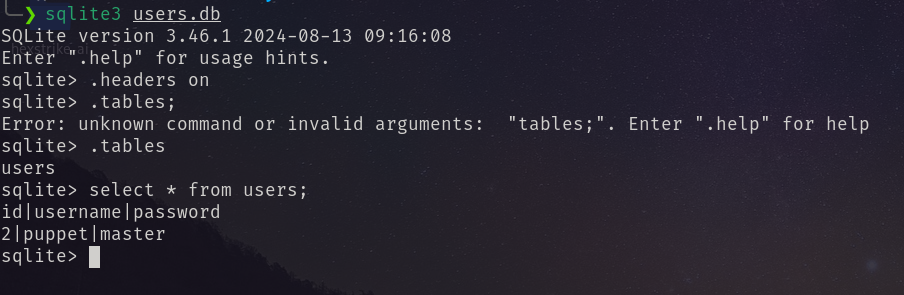 <br/>
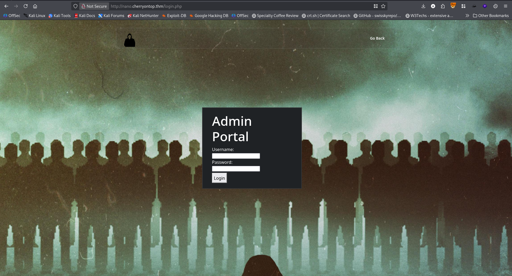 <br/>
Using the password I logged in and got the first flag. <br/>
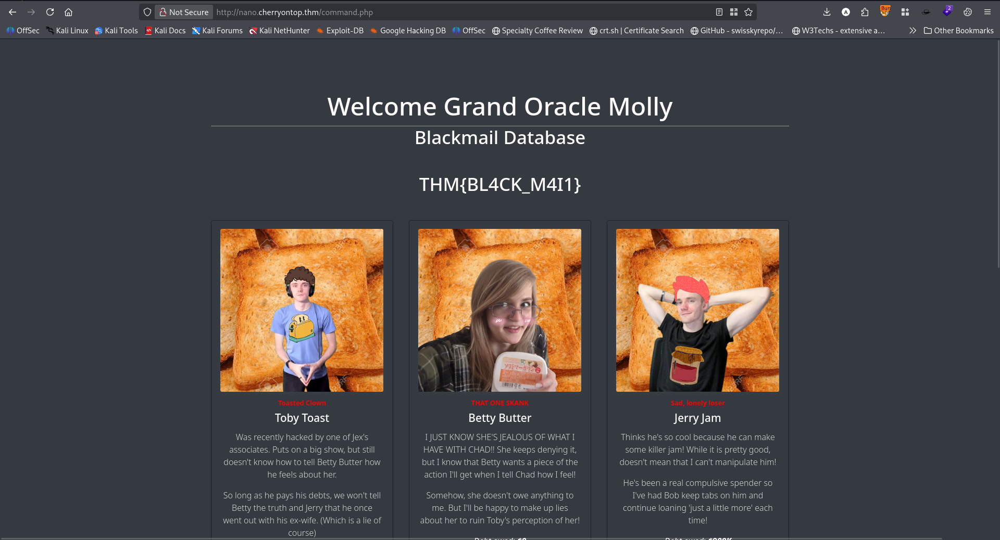 <br/>
In the same page I have found something interesting.  <br/>
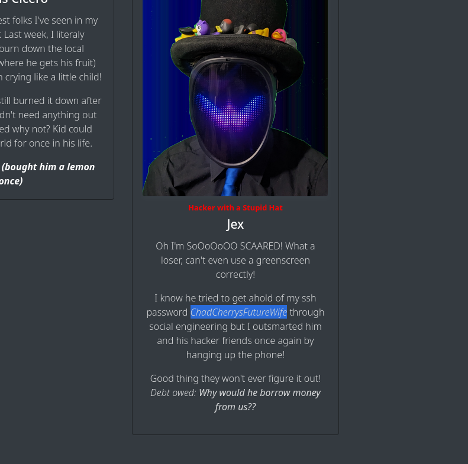 <br/>
After investigating I found the password is for `molly-milks`. <br/>
Via ssh I logged in as `molly-milks`. <br/>
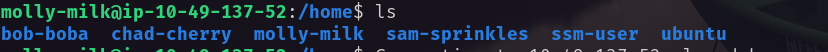 <br/>
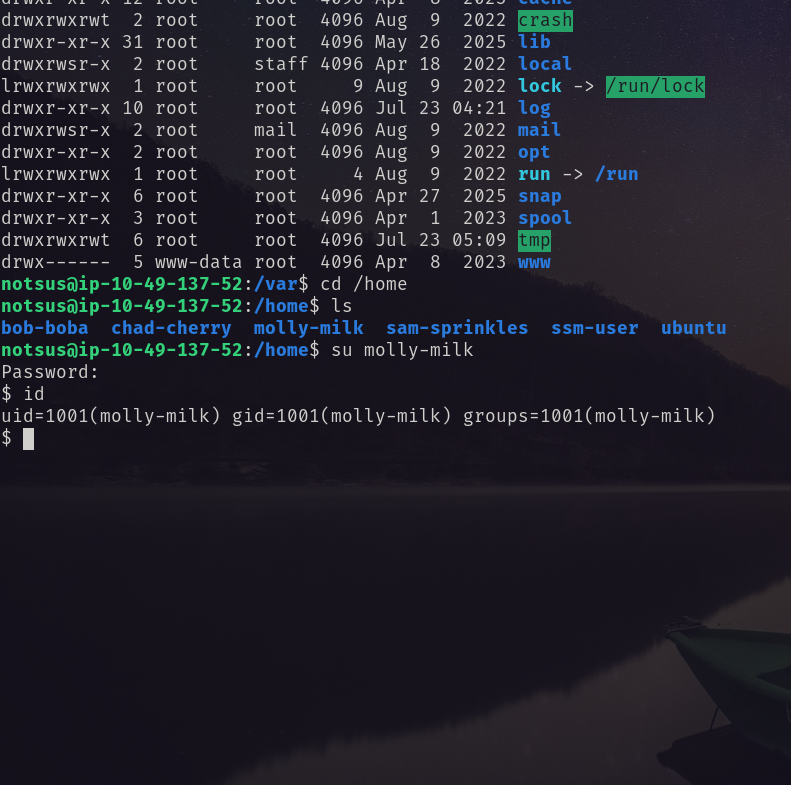 <br/>
Inside the home directory of molly-milks I have found the chad's 1st key: `n4n0ch3rry`. <br/>
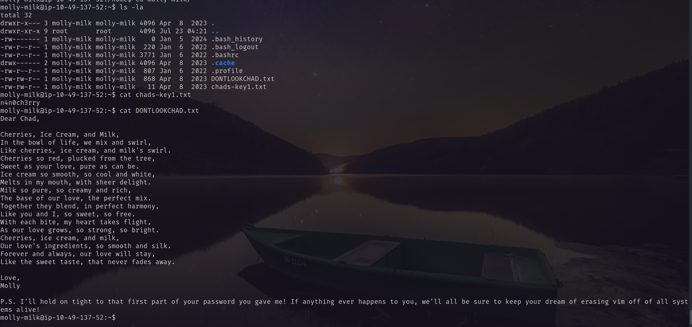  
## 2nd key 
In the page`http://cherryontop.thm/content.php`this url I made a request. <br/>
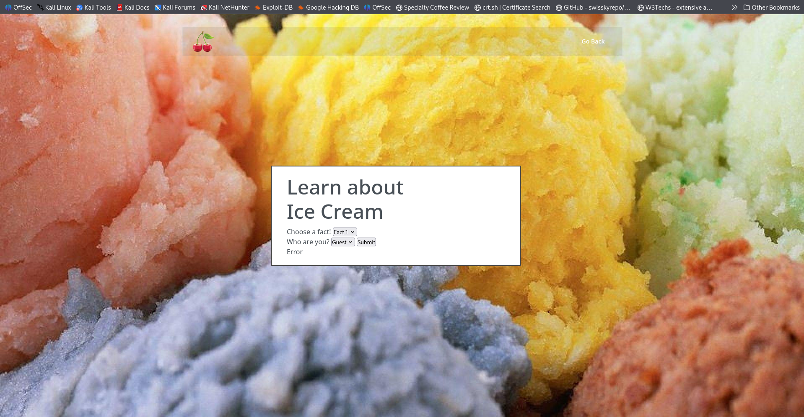 <br/>
The `user=` parameter sends base32 encoded string. <br/>
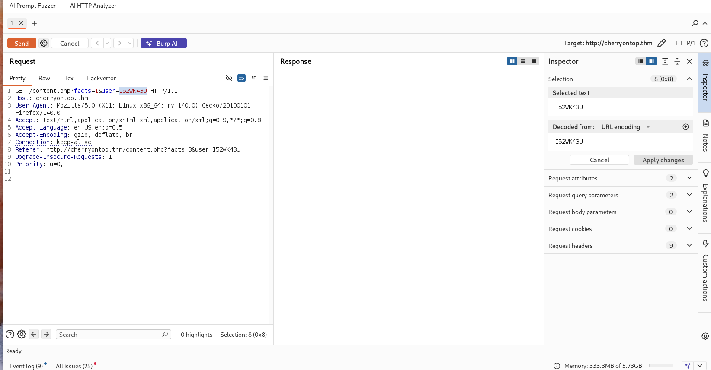 <br/>
I modified the request parameter to bas32 encoding of sam-sprinkles replacing the user parameter I bruteforce with burp intruder and found credentials for sam-sprinkles. <br/>
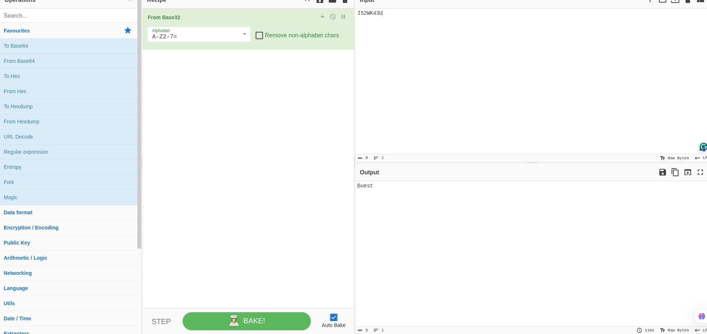 <br/>
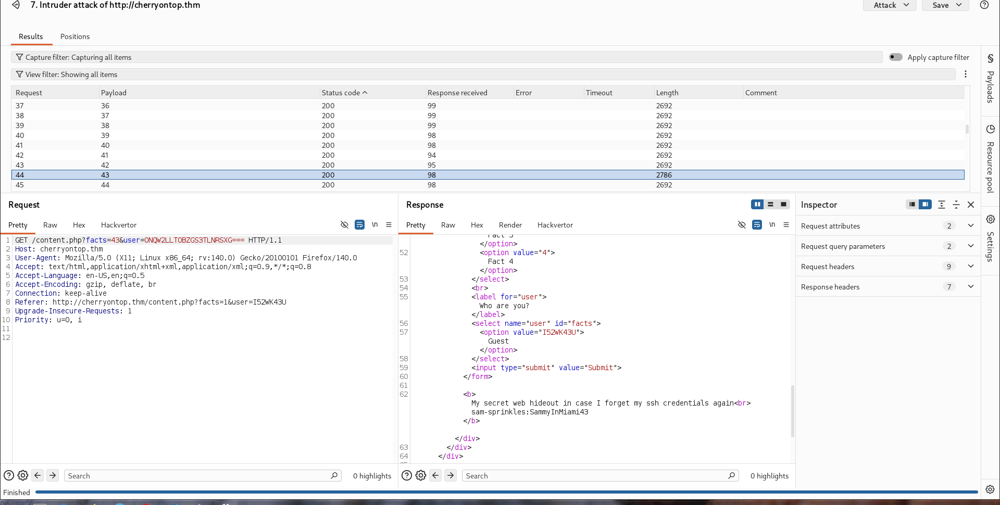 <br/>
Using the credential I logged in via ssh and retrieved chad-cherry 2nd key. <br/>
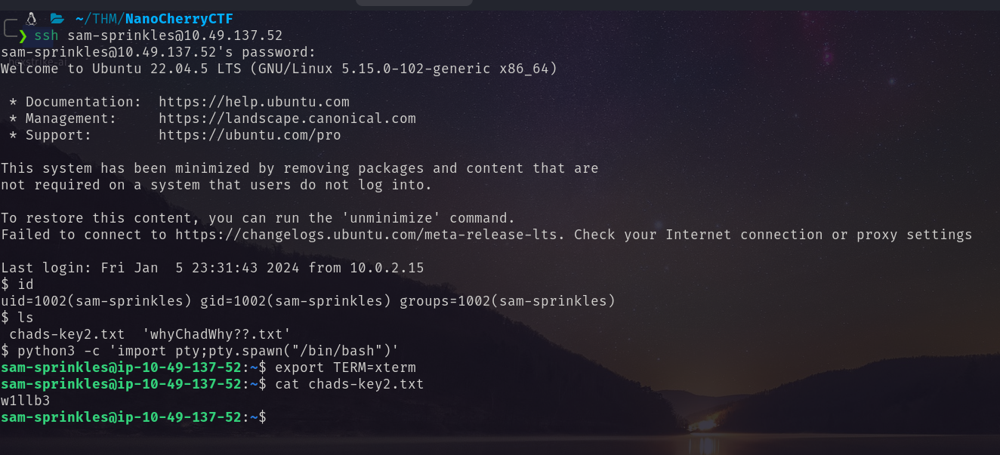 <br/>
So chad-cherry ssh password is: `n4n0ch3rryw1llb37h3fu7ur3` <br/>
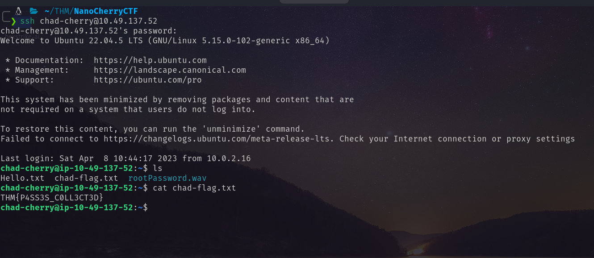 
## Root flag
After login as chad-cherry I have found a .wav file named rootPassword.wav. The Hello.txt also says that this .wav file has the password of root.  <br/>
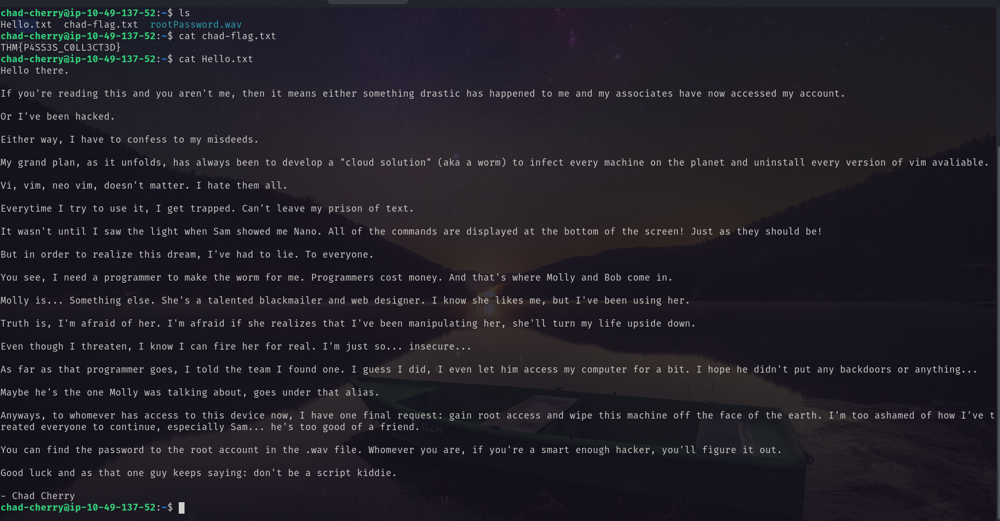 <br/>
After searching more about that audio file I have found that the audio is SSTV using this site: https://sstv-decoder.mathieurenaud.fr/ I decoded the file and got the root password that is: `NanoWillNeverBeOvertaken` <br/>
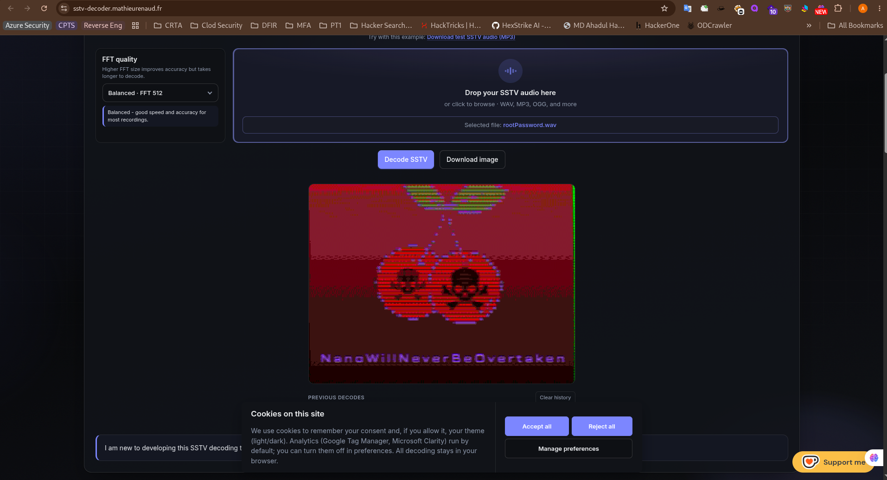 <br/>
Using the password I became ROOT! <br/>
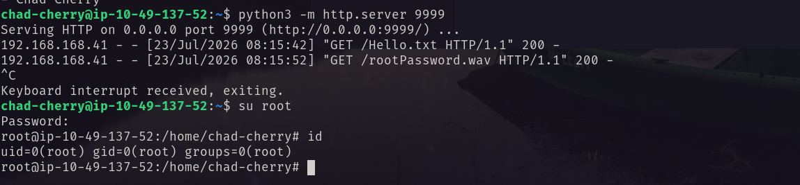 <br/>
