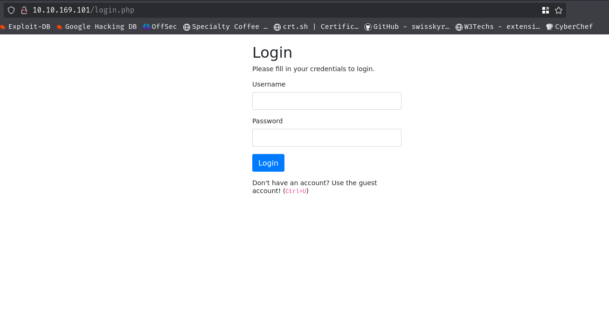
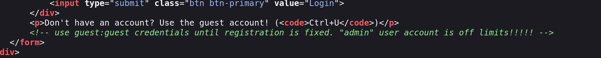
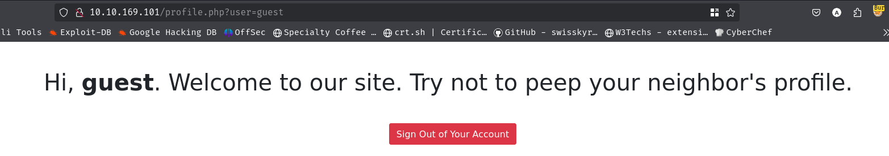
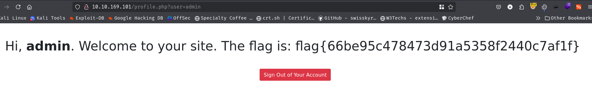

Open the URL with IP address  
 
Pressing `Ctrl+U`:  
 
Using the credentials `guest:guest` I logged in as guest. 
  
In the URL I replace the `user=guest` with `user=admin` and found the flag. 
  
