# Port Scanning
```bash
❯ rustscan -a 10.49.131.71 -- -A 

Open 10.49.131.71:22
Open 10.49.131.71:21
Open 10.49.131.71:139
Open 10.49.131.71:1337

PORT     STATE SERVICE     REASON         VERSION
21/tcp   open  ftp         syn-ack ttl 62 vsftpd 3.0.3
22/tcp   open  ssh         syn-ack ttl 62 OpenSSH 7.2p2 Ubuntu 4ubuntu2.10 (Ubuntu Linux; protocol 2.0)
| ssh-hostkey: 
|   2048 0c:84:1b:36:b2:a2:e1:11:dd:6a:ef:42:7b:0d:bb:43 (RSA)
| ssh-rsa AAAAB3NzaC1yc2EAAAADAQABAAABAQCYrqlEH/5dR4LGfKThK3BQuCVPxx91asS9FfOewAooNFJf4zsESd/VCHcfQCXEHucZo7+xdceZklC7PwhzmybjkN79iQcd040gw5kg0htMWuVzdzcVFowV0hC1o7Rbze7zLya1B1C105aEoRKVHVeTx0ishoJfJlkJBlx2nKrKWciDYbJQvG+1TxEJaEM4KkmkO31y0L7C3nsdaEd+Z/lNIo6JfbxwrOb6vBonPLS/lZDJdaY0vrdZJ81FRiMbSuUIj3lEtDAZNWBTwXx5kO3fwodw4KbS0ukW5srZX5TLmf/Q/T8ooCnJMLvaksIXKl0r8fjJIx0QucoCwhCTR2o1
|   256 e2:5d:9e:e7:28:ea:d3:dd:d4:cc:20:86:a3:df:23:b8 (ECDSA)
| ecdsa-sha2-nistp256 AAAAE2VjZHNhLXNoYTItbmlzdHAyNTYAAAAIbmlzdHAyNTYAAABBBNSB3jALoSxl/A6Jtpf21NoRfbr8ICR6FpH+bbprQ17LUFUm6pUrhDSx134JBYKLOfFljhNKR57LLS6LAK0bKB0=
|   256 ec:be:23:7b:a9:4c:21:85:bc:a8:db:0e:7c:39:de:49 (ED25519)
|_ssh-ed25519 AAAAC3NzaC1lZDI1NTE5AAAAII4VHJRelvecImJNkkZcKdI+vK0Hn1SjMT2r8SaiLiK3
139/tcp  open  netbios-ssn syn-ack ttl 62 Samba smbd 4.3.11-Ubuntu
1337/tcp open  http        syn-ack ttl 62 Apache httpd 2.4.18 ((Ubuntu))
|_http-title: Apache2 Ubuntu Default Page: It works
| http-methods: 
|_  Supported Methods: HEAD POST OPTIONS
Warning: OSScan results may be unreliable because we could not find at least 1 open and 1 closed port
Device type: general purpose|storage-misc|specialized|media device|phone
Running (JUST GUESSING): Linux 3.X|4.X|5.X|2.6.X (92%), Synology DiskStation Manager 5.X (92%), Crestron 2-Series (91%), QNAP QTS 4.X (91%), Amazon embedded (89%), Asus embedded (89%), Google Android 4.X (89%)
OS CPE: cpe:/o:linux:linux_kernel:3 cpe:/o:linux:linux_kernel:4.4 cpe:/o:linux:linux_kernel:5.4 cpe:/a:synology:diskstation_manager:5.2 cpe:/o:crestron:2_series cpe:/o:qnap:qts:4 cpe:/o:linux:linux_kernel:2.6 cpe:/o:google:android:4.4.2
OS fingerprint not ideal because: Missing a closed TCP port so results incomplete
Aggressive OS guesses: Linux 3.10 - 3.13 (92%), Linux 3.13 (92%), Linux 4.4 (92%), Linux 5.4 (92%), Linux 4.15 - 5.19 (92%), Synology DiskStation Manager 5.2-5644 (92%), Crestron XPanel control system (91%), Linux 4.15 (91%), Linux 3.8 (91%), QNAP QTS 4.0 - 4.2 (91%)

Host script results:
| smb2-time: 
|   date: 2026-09-01T06:12:01
|_  start_date: N/A
| smb2-security-mode: 
|   3.1.1: 
|_    Message signing enabled but not required
| smb-os-discovery: 
|   OS: Windows 6.1 (Samba 4.3.11-Ubuntu)
|   Computer name: nerdherd
|   NetBIOS computer name: NERDHERD\x00
|   Domain name: \x00
|   FQDN: nerdherd
|_  System time: 2026-09-01T09:12:02+03:00
|_clock-skew: mean: -59m59s, deviation: 1h43m52s, median: -2s
| p2p-conficker: 
|   Checking for Conficker.C or higher...
|   Check 1 (port 11840/tcp): CLEAN (Couldn't connect)
|   Check 2 (port 21308/tcp): CLEAN (Couldn't connect)
|   Check 3 (port 8134/udp): CLEAN (Failed to receive data)
|   Check 4 (port 46673/udp): CLEAN (Failed to receive data)
|_  0/4 checks are positive: Host is CLEAN or ports are blocked
| nbstat: NetBIOS name: NERDHERD, NetBIOS user: <unknown>, NetBIOS MAC: <unknown> (unknown)
| Names:
|   NERDHERD<00>         Flags: <unique><active>
|   NERDHERD<03>         Flags: <unique><active>
|   NERDHERD<20>         Flags: <unique><active>
|   \x01\x02__MSBROWSE__\x02<01>  Flags: <group><active>
|   WORKGROUP<00>        Flags: <group><active>
|   WORKGROUP<1d>        Flags: <unique><active>
|   WORKGROUP<1e>        Flags: <group><active>
| Statistics:
|   00 00 00 00 00 00 00 00 00 00 00 00 00 00 00 00 00
|   00 00 00 00 00 00 00 00 00 00 00 00 00 00 00 00 00
|_  00 00 00 00 00 00 00 00 00 00 00 00 00 00
| smb-security-mode: 
|   account_used: guest
|   authentication_level: user
|   challenge_response: supported
|_  message_signing: disabled (dangerous, but default)
```
First I check the FTP server and found an image and a text file. <br/>
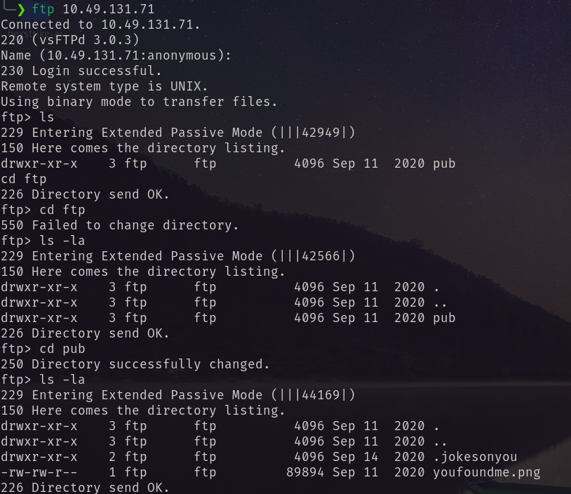<br/>
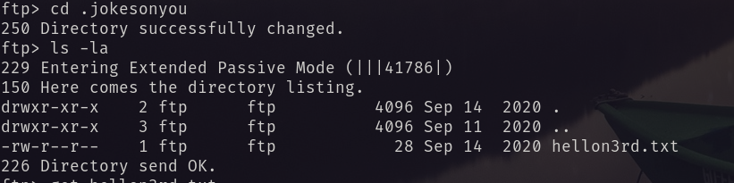<br/>
From the text file I found nothing suspicious. But in the image: <br/>
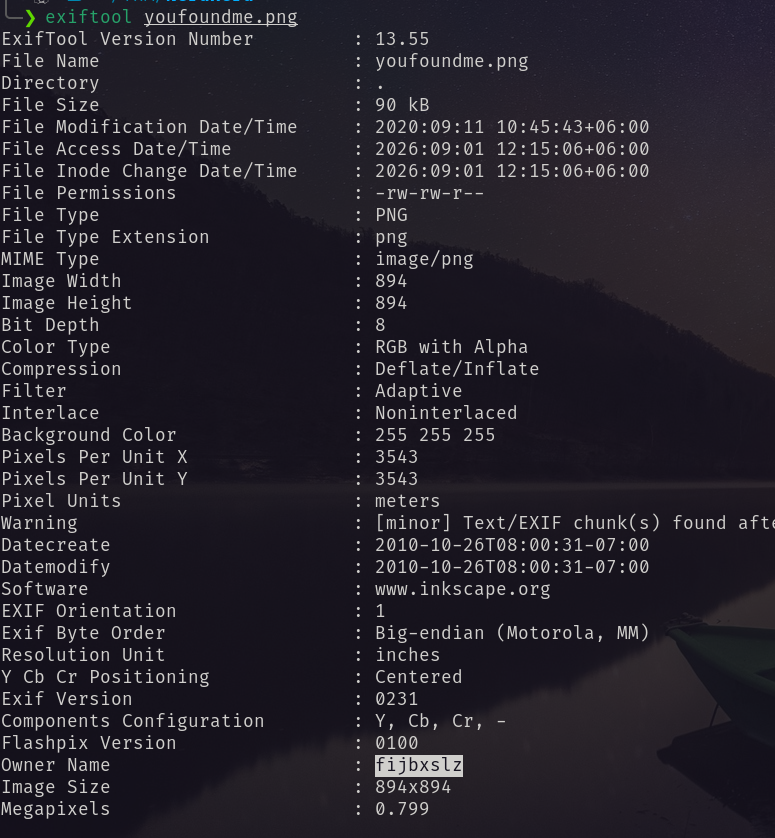 <br/>
Found the owner name encoded. <br/>
Then I visited the website. It give two popups, including hint. So I checked the source code. <br/>
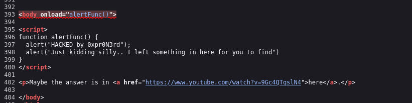 <br/>
Going to the youtube link <br/>
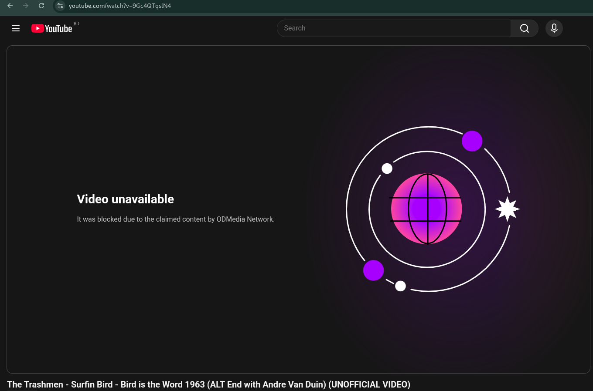 <br/>
`Bird is the Word` <br/>
So using cyberchef with vigenere cypher got a password. <br/>
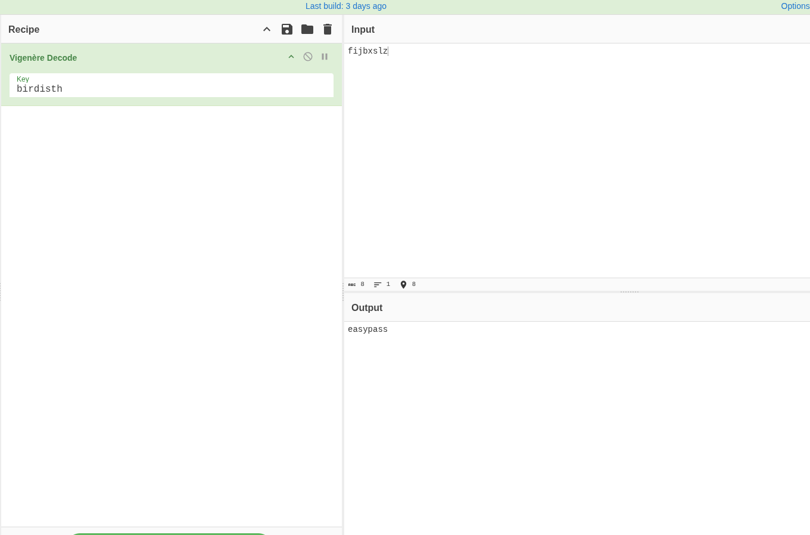 <br/>
After that I go for the SMB enumeration I found a share and a username. <br/>
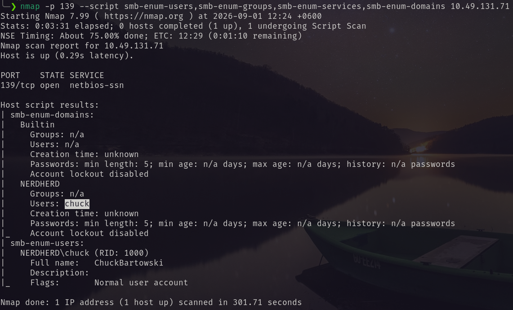 <br/>
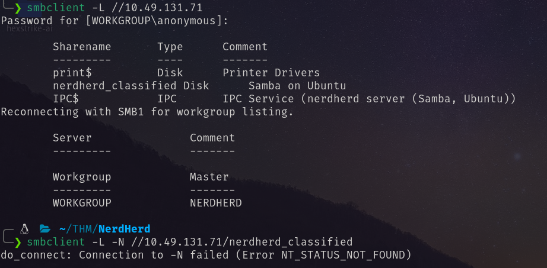 <br/>
Using the username `chuck` and password `easypass` I retrieved a file from the smb share. <br/>
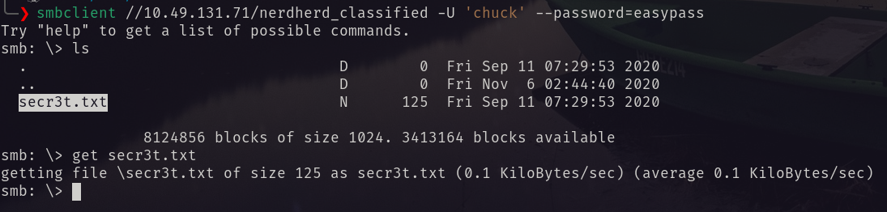 <br/>
Inside the file. <br/>
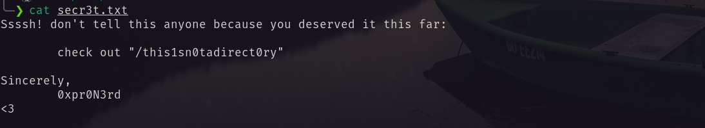 <br/>
Then I visited the directory and got the password for ssh login as chuck. <br/>
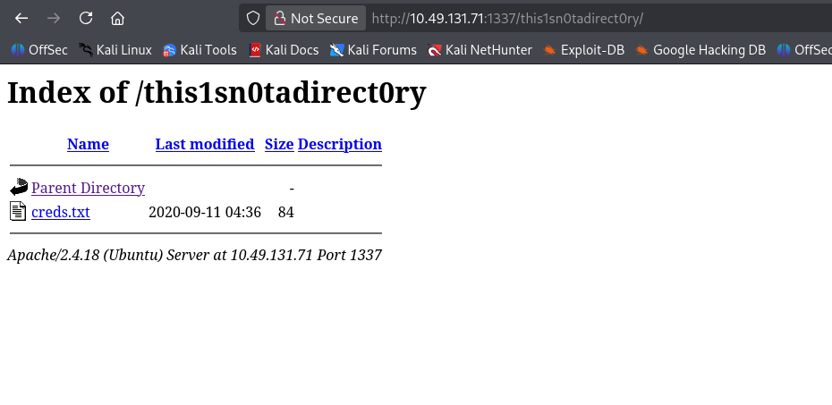 <br/>
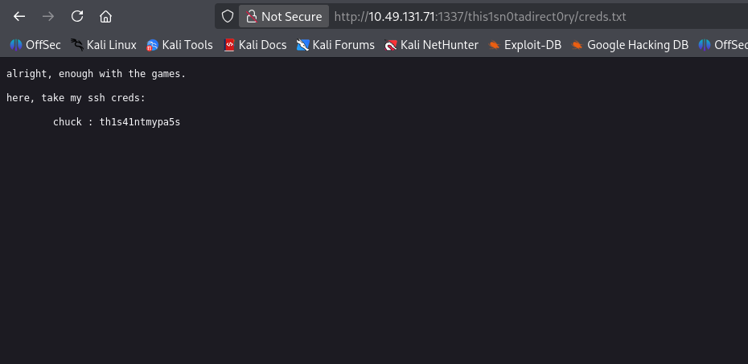 <br/>
Using the password I logged in to the machine and got the user flag. <br/>
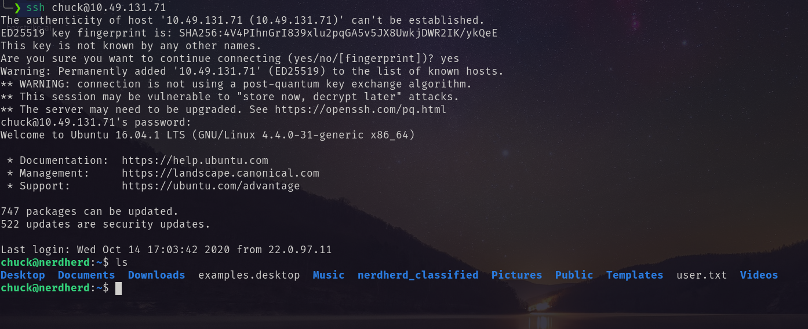 <br/>
# Privilege Escalation
Vulnerable kernel version is found. <br/>
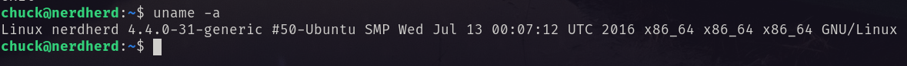 <br/>
In exploitdb I found the following exploit working well. <br/>
https://www.exploit-db.com/exploits/45010  <br/>
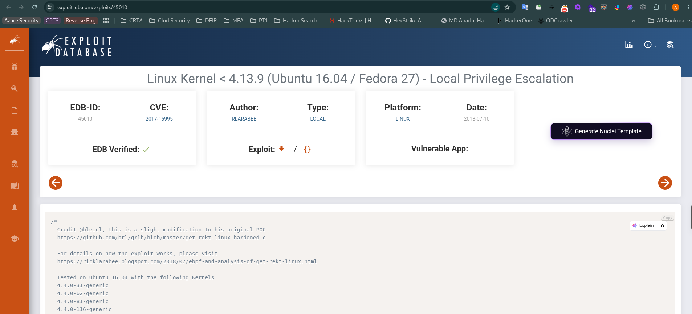 <br/>
Using this exploit I became ROOT. And the root flag. <br/>
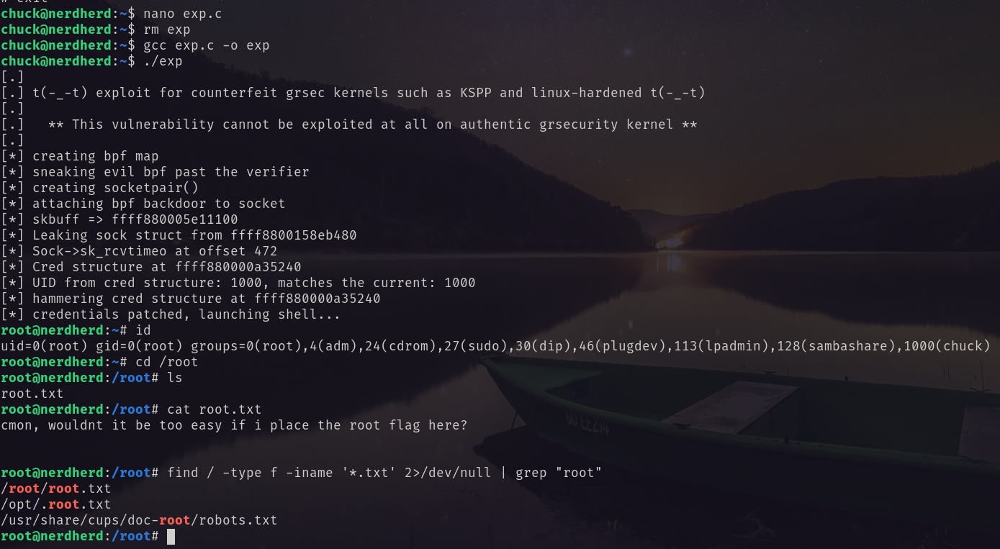 <br/>
The final flag was found in `/root/.bash_history`. <br/>
