# Port Scanning
```bash
❯ rustscan -a 10.49.182.238 -- -A

Open 10.49.182.238:22
Open 10.49.182.238:80
Open 10.49.182.238:1337

PORT     STATE SERVICE REASON         VERSION
22/tcp   open  ssh     syn-ack ttl 62 OpenSSH 8.2p1 Ubuntu 4ubuntu0.13 (Ubuntu Linux; protocol 2.0)
| ssh-hostkey: 
|   3072 db:ab:67:3f:d0:4f:b9:57:04:6d:29:99:5d:74:65:84 (RSA)
| ssh-rsa AAAAB3NzaC1yc2EAAAADAQABAAABgQCodhkdeZse14cJBZ+qWxERyLbUY9Z7i8H6HMlORO4GayK67dX3a8o/n/ffT1HOp58RHchumCVa2KTxXi62mA6XwV0wqyx/uEzqt8s1WBKm7xEAIVB1+zSWhDNcMUE6+HJ86HA+xB4Gsxkx8nDEChcld3eK2NG7p8gHOKIAh9nhtgUItCsSfQX3lAXRs07Xag0+Rxlfl1xpfob1jkvUYFG6l1lhPJzMSYWUowsLbeWL0Ku5vha8pz4YiqoXJSMIAf6/SuSJJ0S2JB6NzM86Ri17azOQVQIAnvNnSNHJcmV7yOzEzPiAZGiOaK/6AYkj/I/BKXjw/KLYUG68KY1h562MIqbb20Zt963Rz3mJ8c9krzi5IM1ve8CeMZ/w8vom0xoF8Lj2ECm6TL7oCqXzUf69FdT2PNdRLDfg/HuDPWVNHSLJDpsO2pOFQ/KXpri865EnXle8VzTXAHwH+5f6Q3tIGoBJM3GWSOeGTPJovSvZQp5aweYgzV+lCXlsCLd6tkE=
|   256 55:f0:4a:16:00:76:a9:eb:2e:df:64:ed:6c:c1:f5:e9 (ECDSA)
| ecdsa-sha2-nistp256 AAAAE2VjZHNhLXNoYTItbmlzdHAyNTYAAAAIbmlzdHAyNTYAAABBBIkiMGqEVUInr52uP0AUHaJter743mIjxAl1wyFZkyr0Mtv5EVXrvI4MUcAfs5x6Do8p27Kmt4yfqg/MuVUacF4=
|   256 7a:e1:2d:67:11:10:52:cd:59:75:b6:1d:66:bc:a7:b3 (ED25519)
|_ssh-ed25519 AAAAC3NzaC1lZDI1NTE5AAAAIKo1+AjEPFSk/GxSiUbXSE58O5IgdBVFEc56mJ+h4pyR
80/tcp   open  http    syn-ack ttl 62 Apache httpd 2.4.41 ((Ubuntu))
| http-title: Ollie :: login
|_Requested resource was http://10.49.182.238/index.php?page=login
| http-robots.txt: 2 disallowed entries 
|_/ /immaolllieeboyyy
| http-methods: 
|_  Supported Methods: GET HEAD POST OPTIONS
|_http-favicon: Unknown favicon MD5: 851615F43921F017A297184922B4FBFD
|_http-server-header: Apache/2.4.41 (Ubuntu)
1337/tcp open  waste?  syn-ack ttl 61
| fingerprint-strings: 
|   DNSStatusRequestTCP, GenericLines: 
|     Hey stranger, I'm Ollie, protector of panels, lover of deer antlers.
|     What is your name? What's up, 
|     It's been a while. What are you here for?
|   DNSVersionBindReqTCP: 
|     Hey stranger, I'm Ollie, protector of panels, lover of deer antlers.
|     What is your name? What's up, 
|     version
|     bind
|     It's been a while. What are you here for?
|   GetRequest: 
|     Hey stranger, I'm Ollie, protector of panels, lover of deer antlers.
|     What is your name? What's up, Get / http/1.0
|     It's been a while. What are you here for?
|   HTTPOptions: 
|     Hey stranger, I'm Ollie, protector of panels, lover of deer antlers.
|     What is your name? What's up, Options / http/1.0
|     It's been a while. What are you here for?
|   Help: 
|     Hey stranger, I'm Ollie, protector of panels, lover of deer antlers.
|     What is your name? What's up, Help
|     It's been a while. What are you here for?
|   NULL, RPCCheck: 
|     Hey stranger, I'm Ollie, protector of panels, lover of deer antlers.
|     What is your name?
|   RTSPRequest: 
|     Hey stranger, I'm Ollie, protector of panels, lover of deer antlers.
|     What is your name? What's up, Options / rtsp/1.0
|_    It's been a while. What are you here for?

Running (JUST GUESSING): Linux 5.X|6.X|4.X (96%), Google Android 10.X|11.X|12.X (93%), Adtran embedded (92%)
OS CPE: cpe:/o:linux:linux_kernel:5 cpe:/o:linux:linux_kernel:6 cpe:/o:linux:linux_kernel:4 cpe:/o:google:android:10 cpe:/o:google:android:11 cpe:/o:google:android:12 cpe:/h:adtran:424rg
OS fingerprint not ideal because: Missing a closed TCP port so results incomplete
Aggressive OS guesses: Linux 5.14 - 6.8 (96%), Linux 4.15 - 5.19 (96%), Linux 4.15 (96%), Linux 5.4 - 5.15 (96%), Android 10 - 12 (Linux 4.14 - 4.19) (93%), Adtran 424RG FTTH gateway (92%), Android 10 - 11 (Linux 4.9 - 4.14) (92%), Android 12 (Linux 5.4) (92%), Android 9 - 11 (Linux 4.9 - 4.14) (92%), Linux 2.6.32 (92%)
No exact OS matches for host (test conditions non-ideal).
```
First I visited the webpage. <br/>
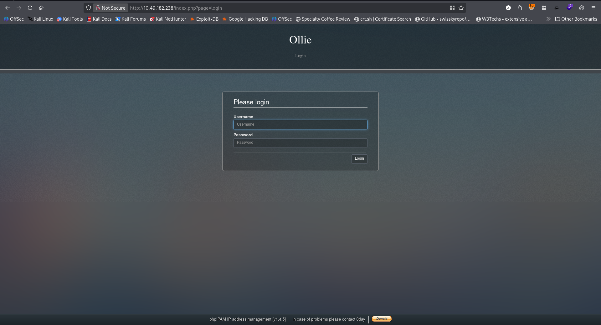 <br/>
It give me the CMS `phpIPAM` and it's version `1.4.5`. Googling about it I have found authenticated vulnerability exploit. <br/>
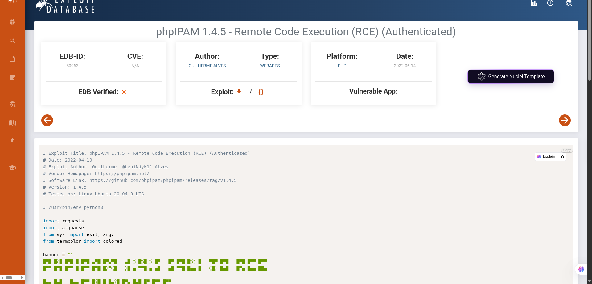<br/>
But I needed username and password for authentication. From the Port scanning I connected to the port 1337 via `nc`. And found the username and password.  <br/>
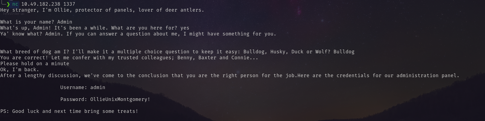 <br/>
Using this username and password I logged in as admin. <br/>
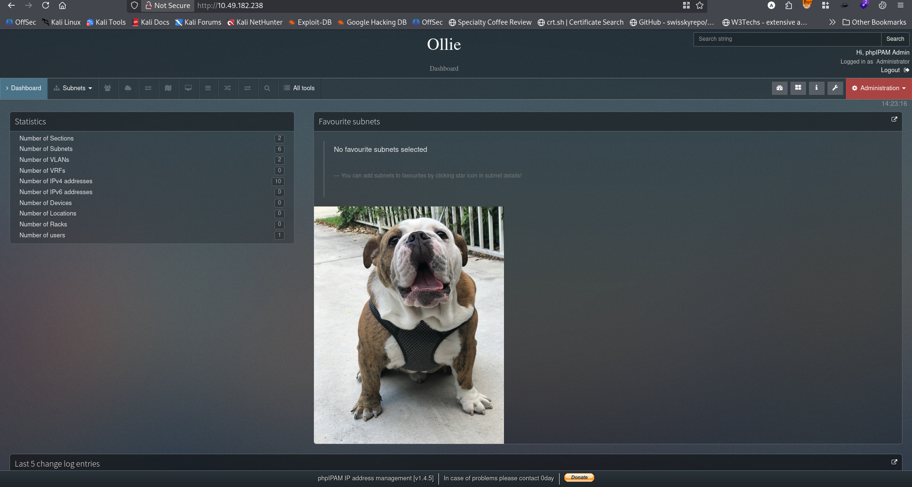 <br/>
After that I using the script I logged I got shell. <br/>
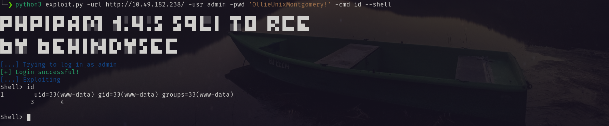 <br/>
Then I have found `evil.php` webshell. <br/>
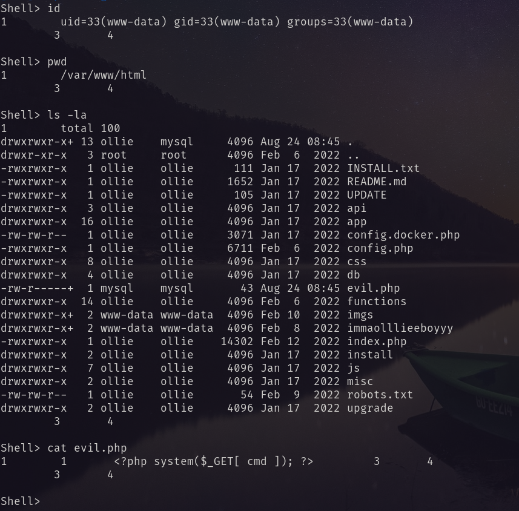 <br/>
Uploaded by the script. <br/>
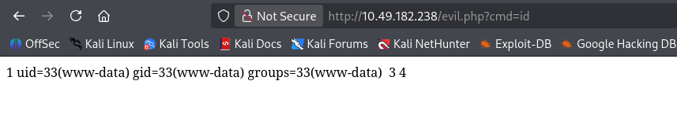 <br/>
Then using this I got the reverse shell. <br/>
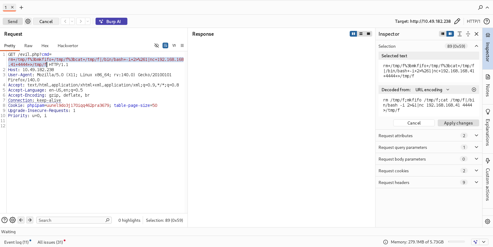 <br/>
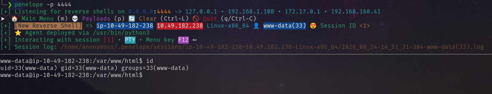 <br/>
Using the same password again I became `ollie`. <br/>
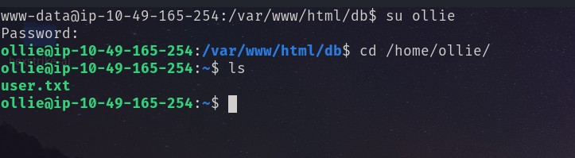 <br/>
# Privilege Escalation
While enumeration, using `pspy64` I have found and interesting process. <br/>
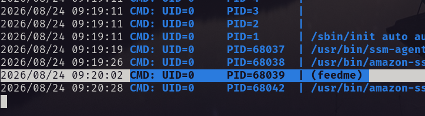 <br/>
After that I found the location of `feedme` <br/>
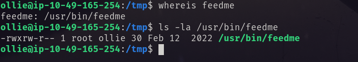 <br/>
I can write to the running binary. And it was executed by root every minute. So, <br/>
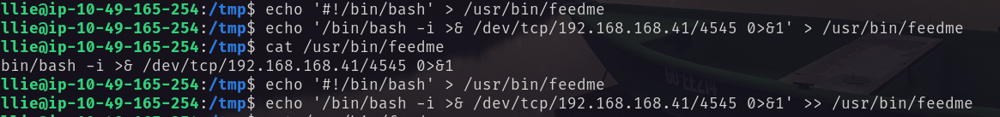 <br/>
And got the root shell. <br/>
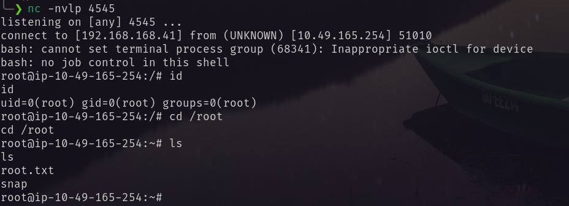<br/>
