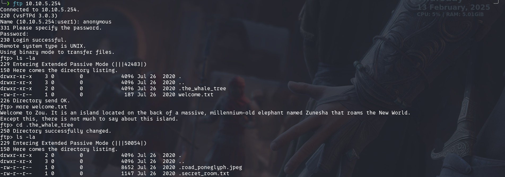

### Open Ports 
```bash
rustscan -a 10.10.5.254 -- -A

Open 10.10.5.254:21
Open 10.10.5.254:22
Open 10.10.5.254:80
Open 10.10.5.254:42483

PORT      STATE  SERVICE REASON         VERSION
21/tcp    open   ftp     syn-ack ttl 60 vsftpd 3.0.3
| ftp-syst: 
|   STAT: 
| FTP server status:
|      Connected to ::ffff:10.17.17.146
|      Logged in as ftp
|      TYPE: ASCII
|      No session bandwidth limit
|      Session timeout in seconds is 300
|      Control connection is plain text
|      Data connections will be plain text
|      At session startup, client count was 4
|      vsFTPd 3.0.3 - secure, fast, stable
|_End of status
| ftp-anon: Anonymous FTP login allowed (FTP code 230)
|_-rw-r--r--    1 0        0             187 Jul 26  2020 welcome.txt
22/tcp    open   ssh     syn-ack ttl 60 OpenSSH 7.6p1 Ubuntu 4ubuntu0.3 (Ubuntu Linux; protocol 2.0)
| ssh-hostkey: 
|   2048 01:18:18:f9:b7:8a:c3:6c:7f:92:2d:93:90:55:a1:29 (RSA)
| ssh-rsa AAAAB3NzaC1yc2EAAAADAQABAAABAQC45MSZ6fV/xyKjd0Vlj750dJSO5TPl1lrNfd+t+qc4LIKnaMoUsyIuxlnTOSQ0yHhGCxRYaDheybyGr1JqQrFazro9bL5cr3o0LQYLgTWbTcVAgkByqDvblrqUj1c6O4R0Z3BoppqzBgXIsUJFw96HAiYzVJCh9RN2rGnAHmqy8lIS/Z56pFlmiEOc3/W1ccnA/ABAIWkX25Kpxz+QE1eMEWEswLG57qmG8nt0qkOT6hQ9sskVW/ADnUmY3rO/dsP7TXh/IvI1slb6HALUlQXXfGUp/2CwOS7SfIthom8HJ3s7STVVOiAQM6xw6USA9QFLObcUSV0qHpXzJnyQtqtl
|   256 cc:02:18:a9:b5:2b:49:e4:5b:77:f9:6e:c2:db:c9:0d (ECDSA)
| ecdsa-sha2-nistp256 AAAAE2VjZHNhLXNoYTItbmlzdHAyNTYAAAAIbmlzdHAyNTYAAABBBLQ8y5fOAYcijtTXLprC5JojtRJvMIvbUGGFTMN5eYol3XZucpVKnt/fyLV/5x1jWXsnQixuE2QMCJ6hNRGwHgw=
|   256 b8:52:72:e6:2a:d5:7e:56:3d:16:7b:bc:51:8c:7b:2a (ED25519)
|_ssh-ed25519 AAAAC3NzaC1lZDI1NTE5AAAAIIWb4BgTYBRRA6bswNkUVwbviPydKMyyWsLyspHwzc/B
80/tcp    open   http    syn-ack ttl 60 Apache httpd 2.4.29 ((Ubuntu))
|_http-server-header: Apache/2.4.29 (Ubuntu)
| http-methods: 
|_  Supported Methods: OPTIONS HEAD GET POST
|_http-title: New World
|_http-favicon: Unknown favicon MD5: C31581B251EA41386CB903FC27B37692
42483/tcp closed unknown reset ttl 60
No exact OS matches for host (If you know what OS is running on it, see https://nmap.org/submit/ ).
```
The ftp allows anonymous login. <br/>
 <br/>
Found the tree name: `the whale` <br/>
