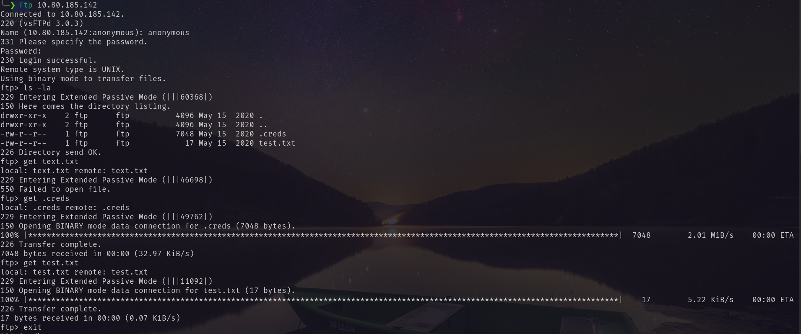
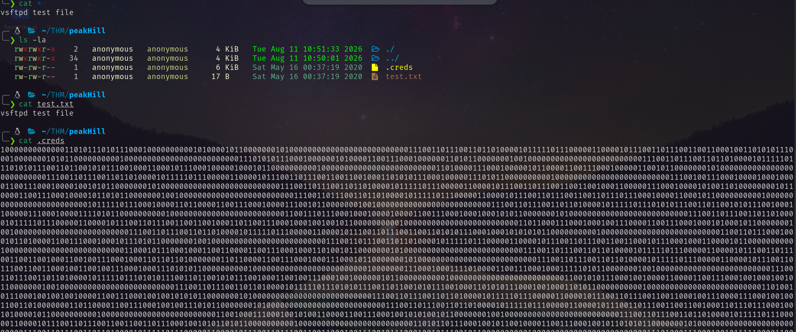
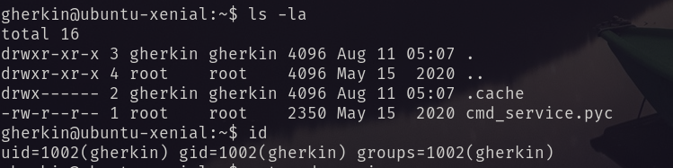
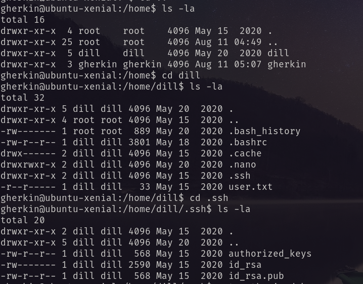
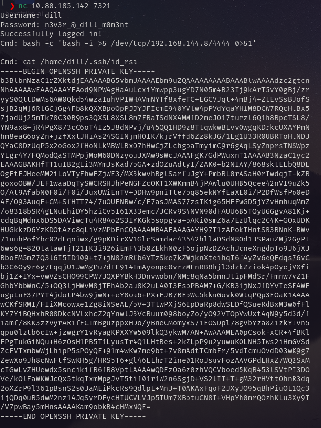
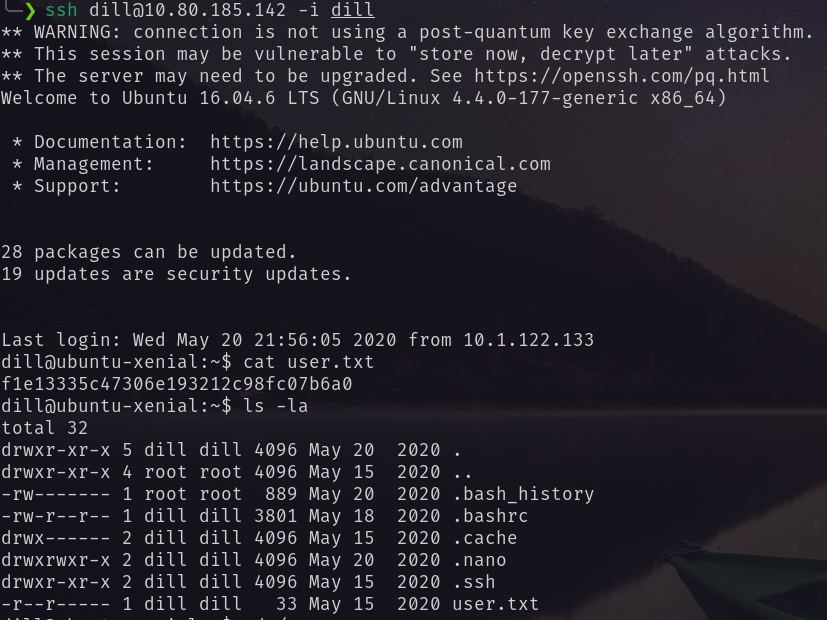
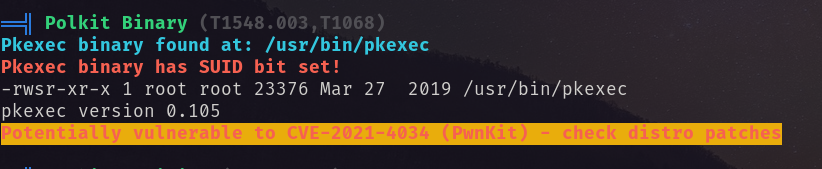
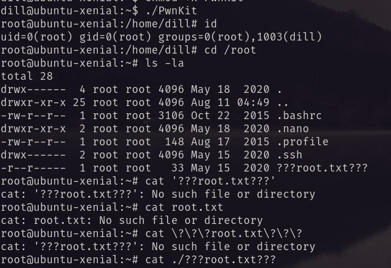

# Port Scanning
```bash
❯ rustscan -a 10.80.185.142 -- -A

Open 10.80.185.142:22
Open 10.80.185.142:21
Open 10.80.185.142:7321

PORT     STATE SERVICE REASON         VERSION
21/tcp   open  ftp     syn-ack ttl 62 vsftpd 3.0.3
| ftp-anon: Anonymous FTP login allowed (FTP code 230)
|_-rw-r--r--    1 ftp      ftp            17 May 15  2020 test.txt
| ftp-syst: 
|   STAT: 
| FTP server status:
|      Connected to ::ffff:192.168.144.8
|      Logged in as ftp
|      TYPE: ASCII
|      No session bandwidth limit
|      Session timeout in seconds is 300
|      Control connection is plain text
|      Data connections will be plain text
|      At session startup, client count was 2
|      vsFTPd 3.0.3 - secure, fast, stable
|_End of status
22/tcp   open  ssh     syn-ack ttl 62 OpenSSH 7.2p2 Ubuntu 4ubuntu2.8 (Ubuntu Linux; protocol 2.0)
| ssh-hostkey: 
|   2048 04:d5:75:9d:c1:40:51:37:73:4c:42:30:38:b8:d6:df (RSA)
| ssh-rsa AAAAB3NzaC1yc2EAAAADAQABAAABAQDeP0io1wWrWYeCtLqYTCxkE3UILotD77FRSxrUy0IZbmUBpYNt+B2NWt1kXPLXldnAGcjyEKIN36lcHXbxPxfPXrGQGfzdKUxE9kRVrLSrkd702cr2AoRp7sjiaJ/bsIKEHwWlNgJJedYdzutT73SUJTnVUS5HsJ9pKERRjI3jdAwJFjslniRIF/xA55myN/0zleZAmQ3PPs7UMqFoU8wxBGj2gLDrkOEszpbsRZu2qhZtGMCpRlxIs5ZKl+JPrF6laG3Em1oh7tPi6Qibf9p6P92iVy7bLa0s0kFdEn/lvp75vUJxUaeoAtKhV482jU6R/Bn1VSSccafgq3wu5QHV
|   256 7f:95:1a:d7:59:2f:19:06:ea:c1:55:ec:58:35:0c:05 (ECDSA)
| ecdsa-sha2-nistp256 AAAAE2VjZHNhLXNoYTItbmlzdHAyNTYAAAAIbmlzdHAyNTYAAABBBGXY1pEPDvAMnRbMdsY2+G5K3fMuTAAMXK+ekVlE/cbfv8GOnvTOJmECPgjXOxbknHltv2OCZi7L2NPxUNaTkGQ=
|   256 a5:15:36:92:1c:aa:59:9b:8a:d8:ea:13:c9:c0:ff:b6 (ED25519)
|_ssh-ed25519 AAAAC3NzaC1lZDI1NTE5AAAAINsblxrCR5cC4mDOS8S/+KyqlCwu+cGETl6ujJWgevhN
7321/tcp open  swx?    syn-ack ttl 62
| fingerprint-strings: 
|   DNSStatusRequestTCP, DNSVersionBindReqTCP, FourOhFourRequest, GenericLines, GetRequest, HTTPOptions, Help, JavaRMI, Kerberos, LANDesk-RC, LDAPBindReq, LDAPSearchReq, LPDString, NCP, NotesRPC, RPCCheck, RTSPRequest, SIPOptions, SMBProgNeg, SSLSessionReq, TLSSessionReq, TerminalServer, TerminalServerCookie, WMSRequest, X11Probe, afp, giop, ms-sql-s, oracle-tns: 
|     Username: Password:
|   NULL: 
|_    Username:
OS fingerprint not ideal because: Missing a closed TCP port so results incomplete
Aggressive OS guesses: Linux 3.8 - 3.16 (91%), Linux 3.13 (90%), Linux 4.4 (90%), Linux 3.10 - 3.13 (88%), Linux 5.4 (88%), Crestron XPanel control system (86%), Linux 4.15 - 5.19 (86%), Linux 5.14 - 6.8 (86%), Android 10 - 12 (Linux 4.14 - 4.19) (85%), HP P2000 G3 NAS device (85%)
```
In ftp anonymous login is allowed so I logged in retrieved some files. <br/>
 <br/>
Viewing the files: <br/>
 <br/>
Using the following script i decrypted the binary.
```bash
import pickle

filename = "creds"

# Read the binary-string file
with open(filename, "r") as f:
    binary_data = f.read().strip()

# Convert every 8 binary digits into one byte
decoded_bytes = bytes(
    int(binary_data[i:i+8], 2)
    for i in range(0, len(binary_data), 8)
)

# Decode the pickle object
data = pickle.loads(decoded_bytes)

# Separate username and password fragments
username_parts = {}
password_parts = {}

for key, value in data:
    if key.startswith("ssh_user"):
        index = int(key.replace("ssh_user", ""))
        username_parts[index] = value

    elif key.startswith("ssh_pass"):
        index = int(key.replace("ssh_pass", ""))
        password_parts[index] = value

# Reconstruct strings in numerical order
username = "".join(username_parts[i] for i in sorted(username_parts))
password = "".join(password_parts[i] for i in sorted(password_parts))

print(f"Username: {username}")
print(f"Password: {password}")
```
Output:
```bash
python3 decoder.py
Username: gherkin
Password: p1ckl3s_@11_@r0und_th3_w0rld
```
I logged in via ssh. And found the user dill and a `.pyc` file. <br/>
 <br/>
 <br/>
User dill has `id_rsa`. <br/>
`.pyc` is a python complied binary. Decrypting that binary I found login credentials for user dill.
```txt
Username: dill
Password: n3v3r_@_d1ll_m0m3nt
```
Using this I logged in to port 7321. I tried reverse shell but it so not allowed. So I retrieved the ssh private key form id_rsa of user dill. <br/>
 <br/>
Using this key I logged in via ssh as user dill. <br/>
 <br/>
For privilege escalation I ran `linpeas`. And found it is vulnerable to Pwnkit. <br/>
 <br/>
Then using pwnkit I became root. <br/>
 <br/>
