Form the attached file I found a jpg file. Using stegcrack I cracked the password. <br/>
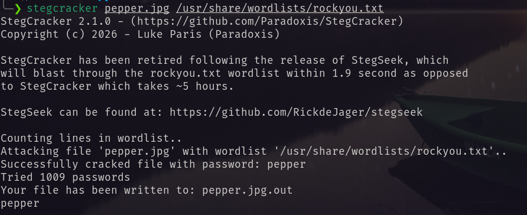  <br/>
Found the following.  <br/>
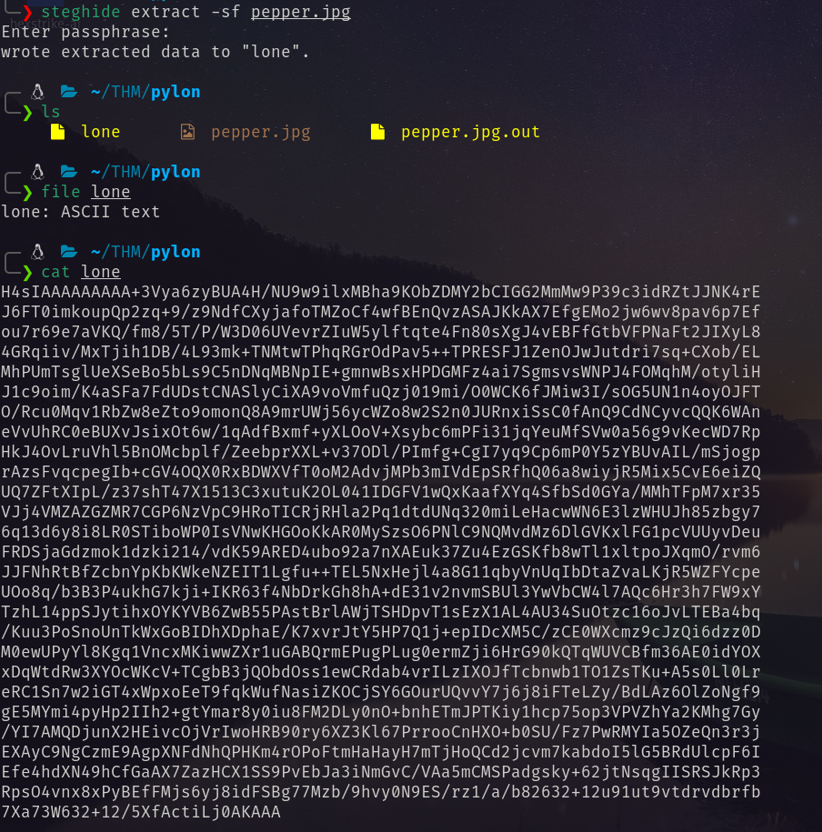  <br/>
**The header `H4sIAAAAAAAAA+...`** starts with `H4sI`, which is the Base64 encoding for the Gzip magic bytes (`1F 8B 08`)  <br/>
So I deocded the Base64 content and decompressed it  
```bash
base64 -d lone | gunzip > extracted_content
```
Then from `extracted_content` I derived the private hash.  <br/>
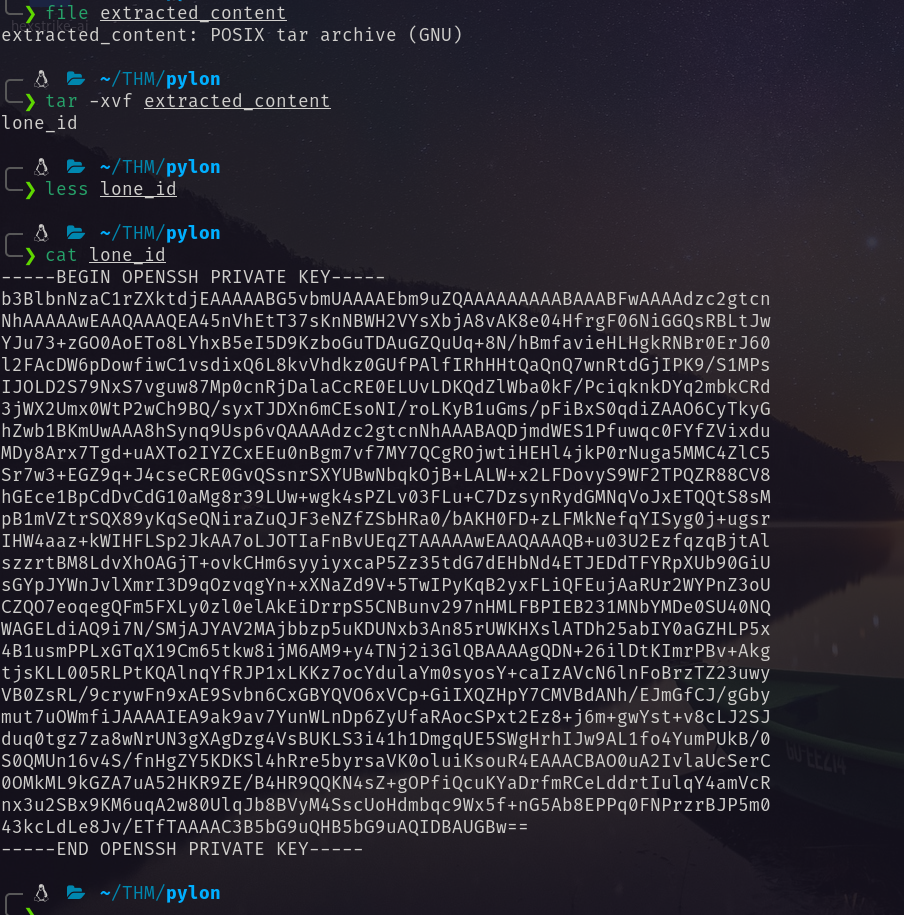  <br/>
Thorugh port scanning I found Two open ports.  
```bash
❯ rustscan -a 10.49.176.255 -- -A

Open 10.49.176.255:22
Open 10.49.176.255:222

PORT    STATE SERVICE REASON         VERSION
22/tcp  open  ssh     syn-ack ttl 62 OpenSSH 7.6p1 Ubuntu 4ubuntu0.3 (Ubuntu Linux; protocol 2.0)
| ssh-hostkey: 
|   2048 12:9f:ae:2d:f8:af:04:bc:8d:6e:2d:55:66:a8:b7:55 (RSA)
| ssh-rsa AAAAB3NzaC1yc2EAAAADAQABAAABAQC48TQ2bNsfSzCnjiLLFrhPxsQFtcf4tlGCuD9FFnqSRngeiwGx5OYXmVpTmZ3oQBlg09xQZHhOx0HG1w9wQTeGNfrJ3HbI7Ne4gzCXeNacwNrPwa9kQ4Jhe90rXUGbsnjwrSTXSe/j2vEIDOPo+nlP7HJZBMvzPR8YohRxpn/zmA+1/yldVDueib64A3bwaKZ/bjFs8PvY4kRCwaFF3j0vhHT5bteQWqllpJXOYMe/kXiHa8pZoSamp+fNQm7lxIpXZhcw13cXWauVftAMloIfuOJQnOxmexbCbC0D0LTj/W1KdYIXcw9+4HdNn+R0wFFgOWfL49ImnGeZvIz+/KV7
|   256 ce:65:eb:ce:9f:3f:57:16:6a:79:45:9d:d3:d2:eb:f2 (ECDSA)
| ecdsa-sha2-nistp256 AAAAE2VjZHNhLXNoYTItbmlzdHAyNTYAAAAIbmlzdHAyNTYAAABBBAngdr5IauC530BNjl20lrHWKkcbrDv4sx0cCN3LDhz01JHzSrlxO4+4JizUGzK/nY/RUY1w5iyv9w9cp4cayVc=
|   256 6c:3b:a7:02:3f:a9:cd:83:f2:b9:46:6c:d0:d6:e6:ec (ED25519)
|_ssh-ed25519 AAAAC3NzaC1lZDI1NTE5AAAAIIxQ6Fpj73z02s4gj/3thP3O1xXMmVp60yt1Ff7wObmh
222/tcp open  ssh     syn-ack ttl 61 OpenSSH 8.4 (protocol 2.0)
| ssh-hostkey: 
|   3072 39:e1:e4:0e:b5:40:8a:b9:e0:de:d0:6e:78:82:e8:28 (RSA)
| ssh-rsa AAAAB3NzaC1yc2EAAAADAQABAAABgQCWmYY++QRFaOM4hlW77VN6PvZcLVj1gqoBUnqRt3WbbrYUzwe9nBU4YdM6LN1d57KrNuzZyrvjS2+9V9Wz7AtsiBGz+7rOMejT4A3hz6GdMUZwAZ7jhDEqqYV/BDP+xcadiLuHWnYFyeSy1xLhVRtZsnU8bXCg9+meHv6PBMq6+TFK5zkmYXBshEyj8LpH9MRGXlwHREkbAcllAr0gNRTrJpwI4/r/O//V6TIA1wyLoDZtYQABVsVoGd9R0vu++HLrNI9+NBi7BVyUvOSkQmsoFNAkMslZv9S7TOG/VQQOrJMjRY/EGPu6JwLHmpd+Kf3q6cOrCjfQOXRo+UaD/E0cfNClCXlJPAa3t8SzqYBK7ebkCwF7fifuOH7vIGgioN9jJNYzcB1hlLcfuBhv69qpe99DL7C4Qqk0ftv9TQgx945JhQiq2LH90eYDUGXmVu0wKLu4mfMfLSUYYgXEZGNkqIW/IM13wagN1FHZBNMsyR1/f/O9igD/qEt0KT70Zfs=
|   256 c6:f6:48:21:fd:07:66:77:fc:ca:3d:83:f5:ca:1b:a3 (ECDSA)
| ecdsa-sha2-nistp256 AAAAE2VjZHNhLXNoYTItbmlzdHAyNTYAAAAIbmlzdHAyNTYAAABBBC9mDTxaeB3QKOzrGC5WK4WId+ZzFhUAgFK5ONKQ7I2Ya+FmBk/R4Uqjq3Epc0Xv31gi6r3k8ytRBYFMmq3L66g=
|   256 17:a2:5b:ae:4e:44:20:fb:28:58:6b:56:34:3a:14:b3 (ED25519)
|_ssh-ed25519 AAAAC3NzaC1lZDI1NTE5AAAAICwLlQimfX4lrWWdFenHEWZgUWVWRQj1Mt0L4IBeeTnJ
Warning: OSScan results may be unreliable because we could not find at least 1 open and 1 closed port
Device type: general purpose|phone
Running (JUST GUESSING): Linux 4.X|5.X|6.X (96%), Google Android 10.X|11.X|12.X (93%)
OS CPE: cpe:/o:linux:linux_kernel:4 cpe:/o:linux:linux_kernel:5 cpe:/o:google:android:10 cpe:/o:google:android:11 cpe:/o:google:android:12 cpe:/o:linux:linux_kernel:6 cpe:/o:linux:linux_kernel:5.4
OS fingerprint not ideal because: Missing a closed TCP port so results incomplete
Aggressive OS guesses: Linux 4.15 - 5.19 (96%), Linux 4.15 (96%), Linux 5.4 - 5.15 (96%), Android 10 - 12 (Linux 4.14 - 4.19) (93%), Linux 5.14 - 6.8 (93%), Android 10 - 11 (Linux 4.9 - 4.14) (92%), Android 12 (Linux 5.4) (92%), Android 9 - 11 (Linux 4.9 - 4.14) (92%), Linux 2.6.32 (92%), Linux 2.6.39 - 3.2 (92%)
No exact OS matches for host (test conditions non-ideal).
```
I used the key with username `lone` on port 22. But failed. So again i tried on port 222. And found the following.  <br/>
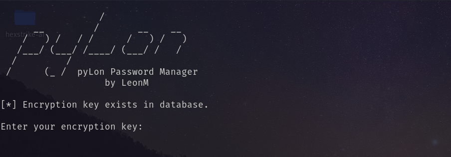  <br/>
I needed the encryption key. I found a link on metadata of the image.  <br/>
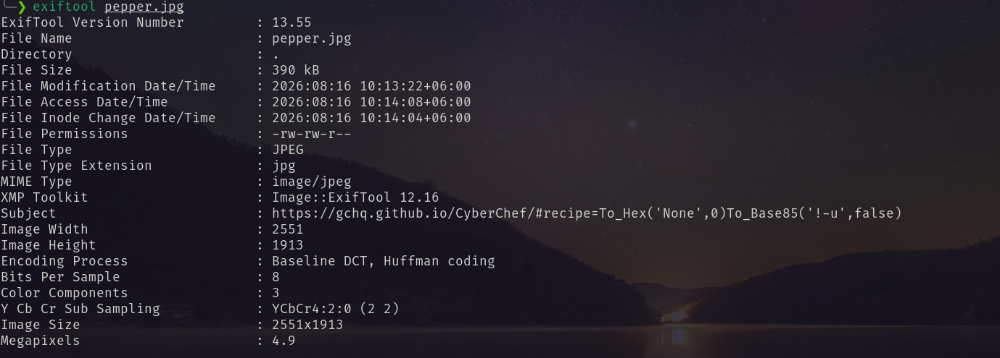  <br/>
Using that link I encoded the word `pepper`  <br/>
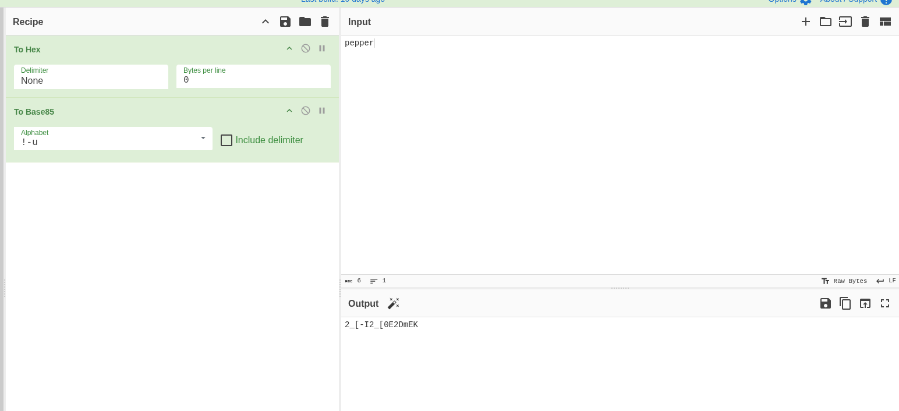  <br/>
Using this output I got access.  <br/>
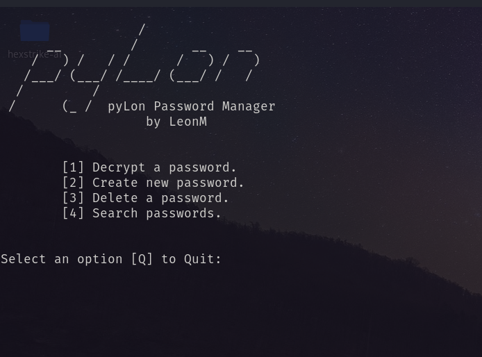  <br/>
Press 1 hit enter  <br/>
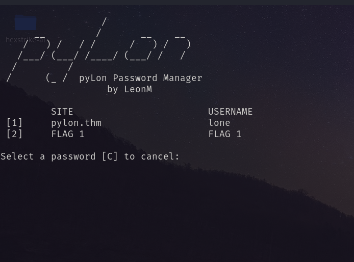  <br/>
1 for flag and 2 for lone ssh password.  <br/>
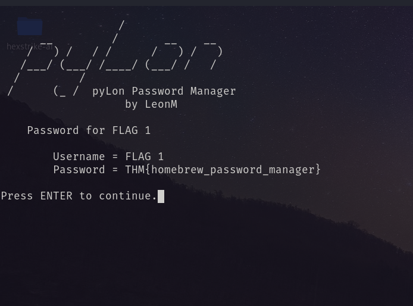  <br/>
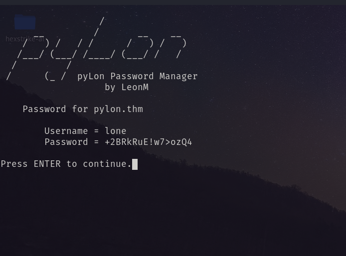  <br/>
Using this password I logged in via ssh as lone  <br/>
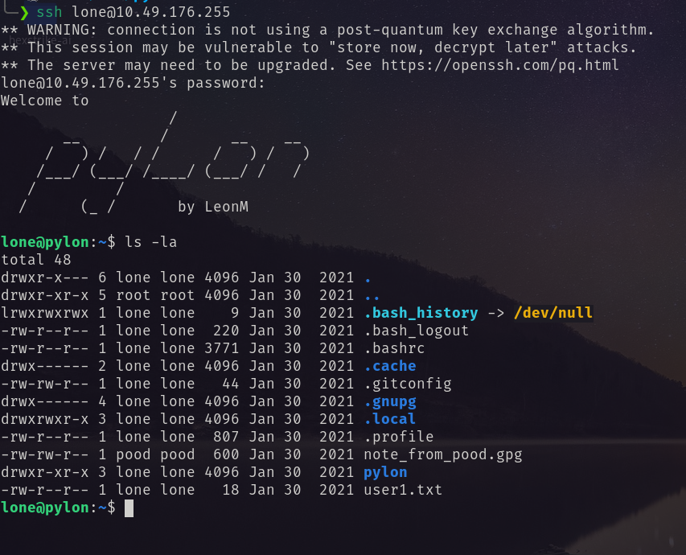  <br/>
There were two interesting thing. `note_from_pood.gpg` a file I need the gpg key to decrypt it. I used all the retrieved keys. But no luck!. Another is `pylon` directory.  <br/>
Inside the pylon directory I found .git so I check for the log. Then I checkout to the first log.  <br/>
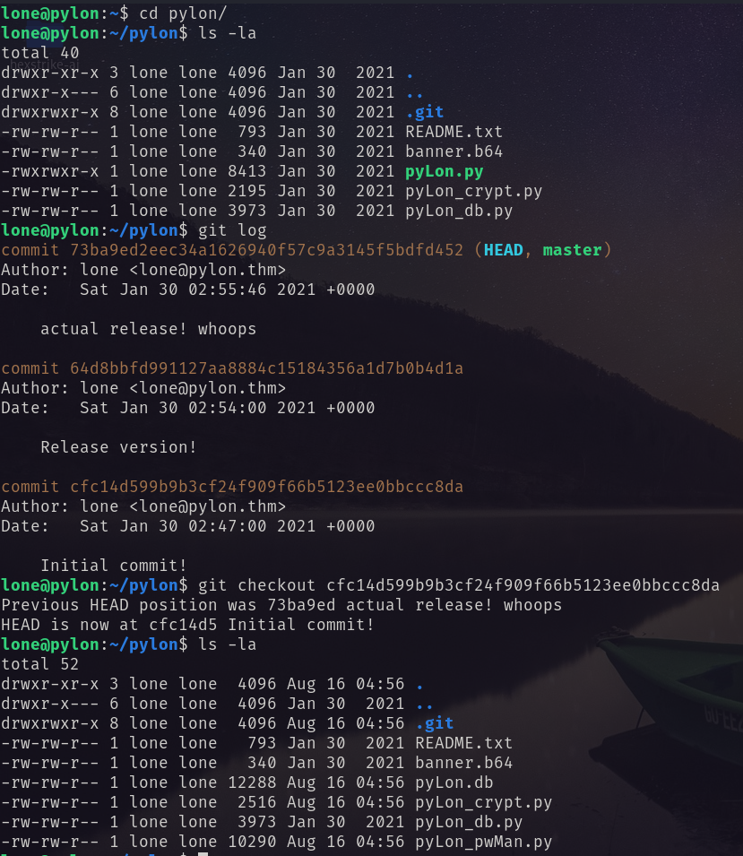  <br/>
There are more files. I download the pylon.db file in my machine and checked it.  <br/>
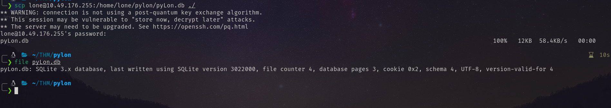  <br/>
Inside the db I found two hashes.  <br/>
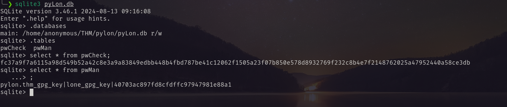  <br/>
Tried to decrypt them via hashcat and john. But no luck. Then I ran the `pyLon_pwMan.py`   <br/>
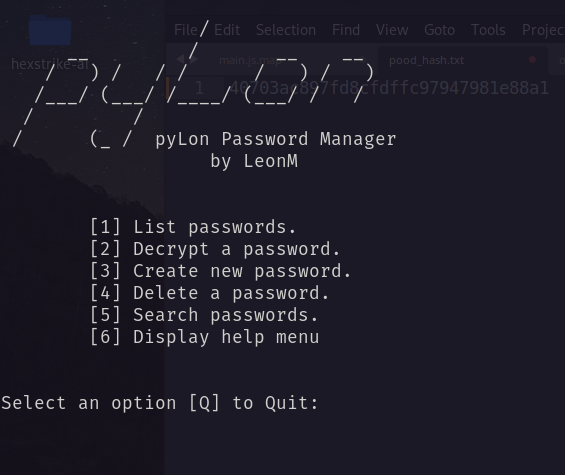  <br/>
It give me more options than the running one.  <br/>
Pressed 2 then 1  <br/>
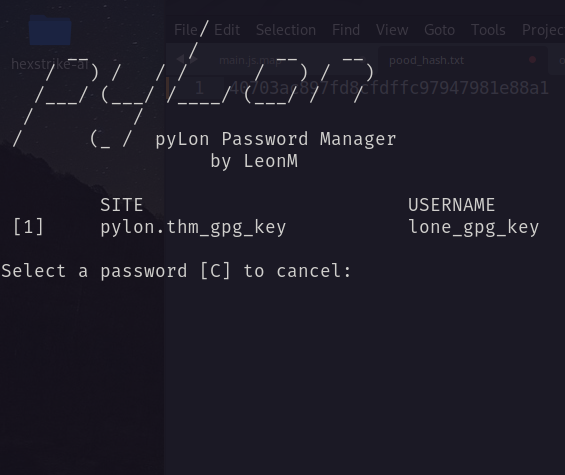  <br/>
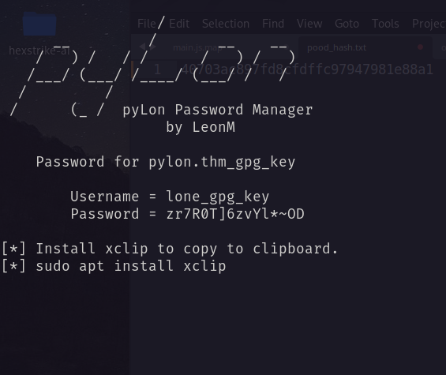  <br/>
Using this key I decrypted the note.  <br/>
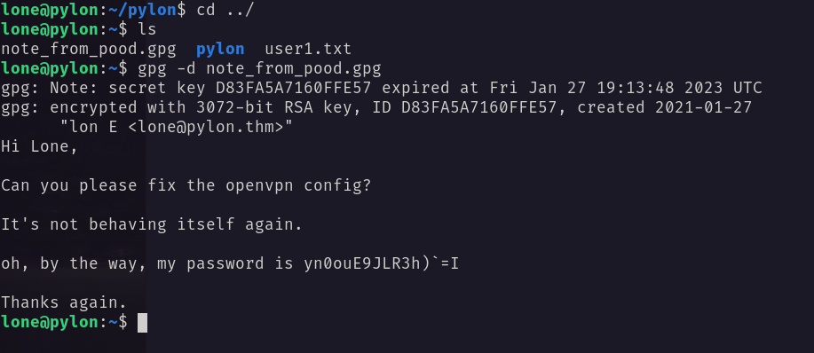  <br/>
And got the password for pood.   <br/>
Using the password I logged in as pood.   <br/>
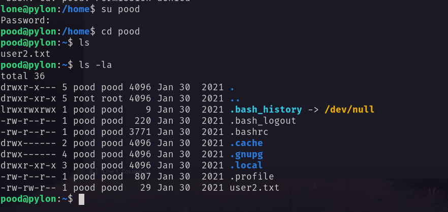  <br/>
# Privilege Escalation
I ran `linpeas.sh` and found that it has pkexec vulnerability.   <br/>
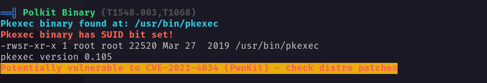  <br/>
Abusing this I got root shell.  <br/>
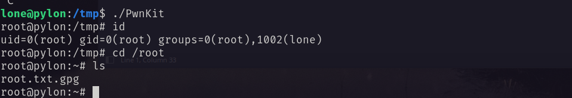  <br/>
Run the following for flag  <br/>
```bash
gpg -d root.txt.gpg
```
