# Port Scan 
```bash
rustscan -a 10.48.165.32 -- -A
Open 10.48.165.32:53
Open 10.48.165.32:22
Open 10.48.165.32:80

PORT   STATE SERVICE REASON         VERSION
22/tcp open  ssh     syn-ack ttl 62 OpenSSH 8.2p1 Ubuntu 4ubuntu0.7 (Ubuntu Linux; protocol 2.0)
| ssh-hostkey: 
|   3072 81:cc:00:bf:52:69:b4:67:ce:67:9c:18:0c:85:cd:08 (RSA)
| ssh-rsa AAAAB3NzaC1yc2EAAAADAQABAAABgQDBTSlqpNuoRCMIckTpGXN54YWMXj0OKYPaA1B1PwO6G0ylQoaHanSLudn17Yk+SUxuIbxpnffZe4DoeIAoLtVPycf5nyOq8qAsCrg1s22qSLGi3nNUJtACwqcS9MTI0r3UZ3mb+OWfTDP7x4ZCicPmNVvidp9iE4hmffZlvSU6dWk1DTat/S7whSjGbSj560yY3Tt1IlueCG+w5Pfz7AAw7hiTEPZQBQAWAbrCACoPZOoWYb9ULLk7QfF0UDEoG9+6VbP1ELjwWPsPhE+997KHNwRp54Y4k/hR+lbx3NQiR6FpKN3DvDDL9CkbOjl1w7jILVK9HZAXCQ2HRhrtm5r4ifB1qLT9QIwPPjs+SNjNXpNTZpmsSAjZpvzAZ0EY6qfIcBeV/0/9//I39wXlaRS7Q4zCxZ5KD8xIP0nJD06xFB1ypsgcmDnyK6JOljjMNjlspxF3ob1GzCsFuPQATXpHHR9fJMTW5qKZjeD4bXFaS01kXf95cZOmbQSy8wEgsTE=
|   256 f5:be:58:97:99:8a:52:6d:b9:0c:ff:4b:bf:e8:f1:b9 (ECDSA)
| ecdsa-sha2-nistp256 AAAAE2VjZHNhLXNoYTItbmlzdHAyNTYAAAAIbmlzdHAyNTYAAABBBEqZ51ac7hY4HtYxbB75qtC9+o3mdhNZNmYBKA8lRaJ5KpVbbgQ+yAT9xtC7J1k40tdQGc0P8WJ8un+fWhWFrpQ=
|   256 01:87:3a:68:d1:ae:49:a5:bb:67:fb:56:c4:ef:8e:09 (ED25519)
|_ssh-ed25519 AAAAC3NzaC1lZDI1NTE5AAAAIL+aCwSz8RwdFjWF0NFiEzZtlPYVubv19z1ZlqsZA62A
53/tcp open  domain  syn-ack ttl 62 ISC BIND 9.16.1 (Ubuntu Linux)
| dns-nsid: 
|_  bind.version: 9.16.1-Ubuntu
80/tcp open  http    syn-ack ttl 62 Apache httpd 2.4.41 ((Ubuntu))
| http-methods: 
|_  Supported Methods: GET HEAD POST OPTIONS
|_http-server-header: Apache/2.4.41 (Ubuntu)
| http-cookie-flags: 
|   /: 
|     PHPSESSID: 
|_      httponly flag not set
|_http-title: Recruit
Warning: OSScan results may be unreliable because we could not find at least 1 open and 1 closed port
Device type: general purpose|phone
Running (JUST GUESSING): Linux 5.X|6.X|4.X (96%), Google Android 10.X|11.X|12.X (93%)
OS CPE: cpe:/o:linux:linux_kernel:5 cpe:/o:linux:linux_kernel:6 cpe:/o:linux:linux_kernel:4 cpe:/o:google:android:10 cpe:/o:google:android:11 cpe:/o:google:android:12 cpe:/o:linux:linux_kernel:5.4
```
Now using ffuf I perform directory fuzzing.
```bash
ffuf -u http://10.48.165.32:80/FUZZ -w /usr/share/wordlists/SecLists/Discovery/Web-Content/DirBuster-2007_directory-list-2.3-medium.txt -t 100

mail                    [Status: 301, Size: 311, Words: 20, Lines: 10, Duration: 102ms]
assets                  [Status: 301, Size: 313, Words: 20, Lines: 10, Duration: 102ms]
javascript              [Status: 301, Size: 317, Words: 20, Lines: 10, Duration: 105ms]
phpmyadmin              [Status: 301, Size: 317, Words: 20, Lines: 10, Duration: 104ms]
server-status           [Status: 403, Size: 277, Words: 20, Lines: 10, Duration: 104ms]
```
Going to the *mail* directory I have found *mail.log*. And inside mail.log <br/>
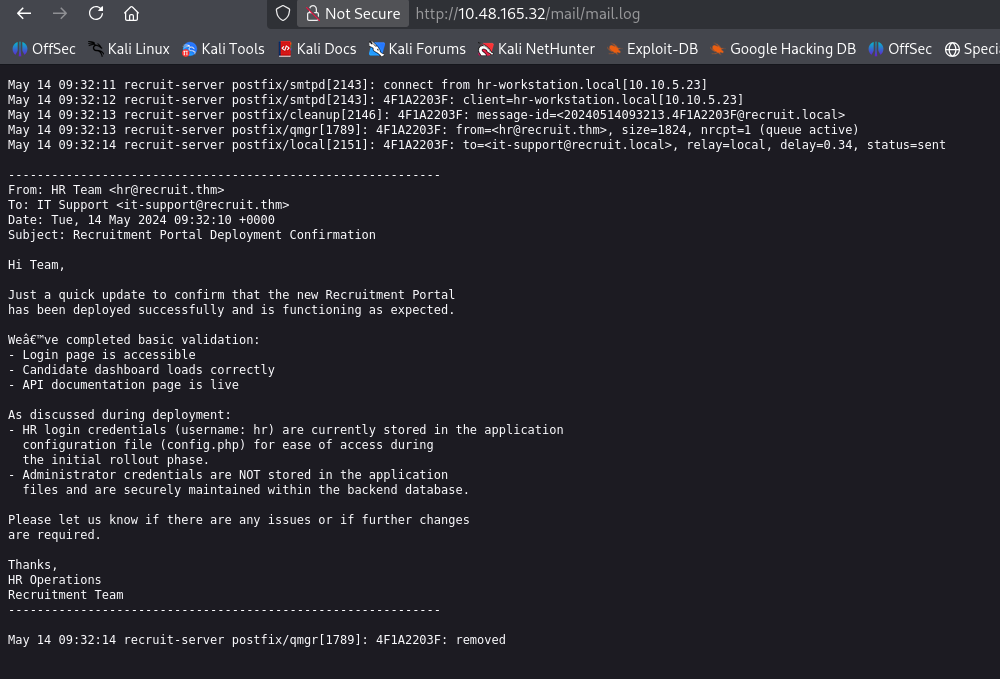<br/>
Visiting the main page.<br/>
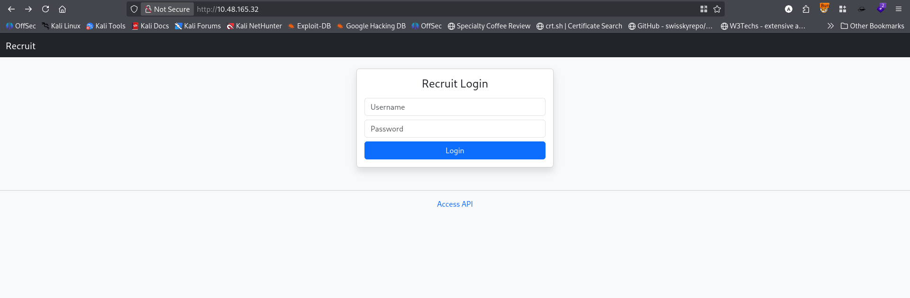<br/>
Going to `Access API`.<br/>
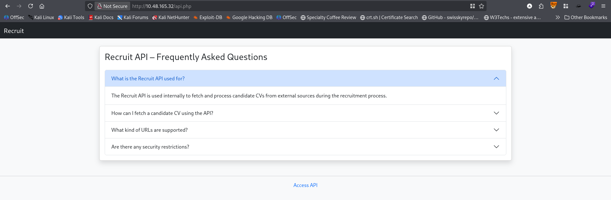<br/>
Nothing interesting found. But in BurpSuite I found an interesting url `/file.php?cv=<URL>`
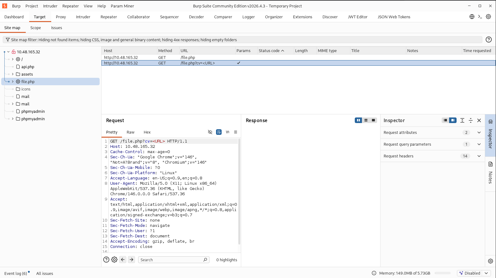<br/>
Visiting that url.<br/>
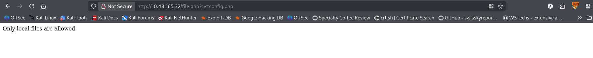<br/>
So I changed the parameter value to *localhost/config.php*, *../config.php*, etc. But the reply is the same. At last `file://config.php` revealed the data.<br/>
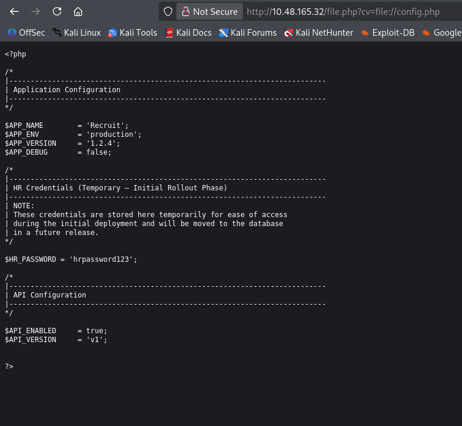<br/>
Using the following credential I logged in. And found the first flag.
```
Username: hr
Password: hrpassword123
```
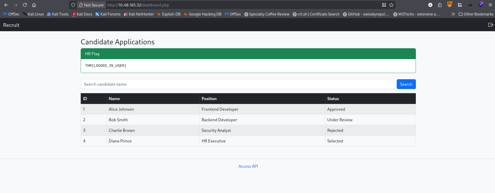<br/>
There I found a searching option with search parameter. <br/>
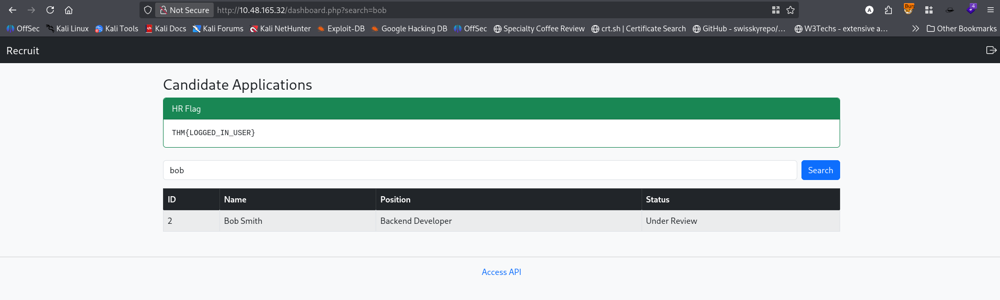<br/>
Putting `'` to test for SQL injection I found this.<br/>
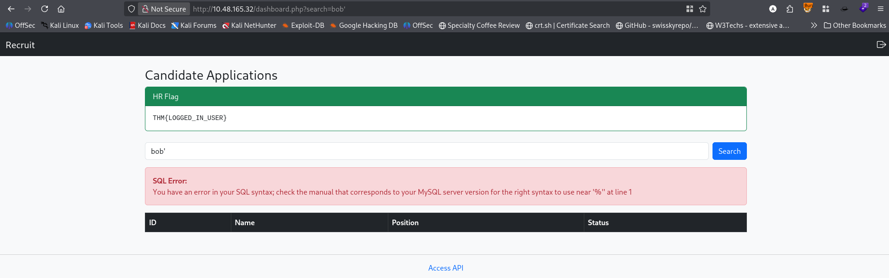<br/>
As it is vulnerable to SQL injection I use `sqlmap` for database dumping.<br/>
```bash
sqlmap -r search.txt --level=5 --risk=3 --dbs --users --threads=10
```
Retrieved the databases and users.<br/>
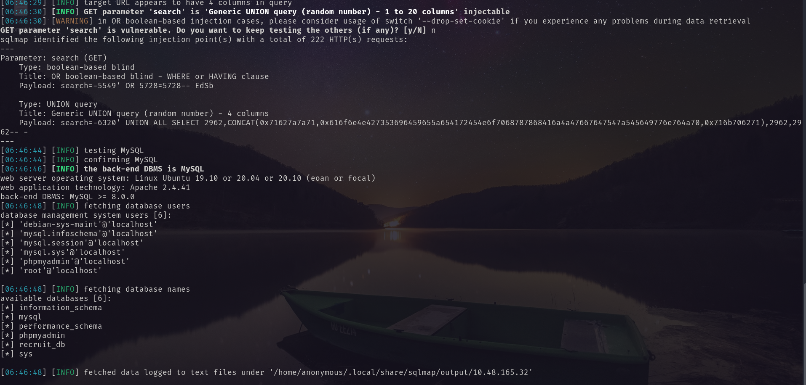<br/>
Then I retrieved tables of `recruit_db`.<br/>
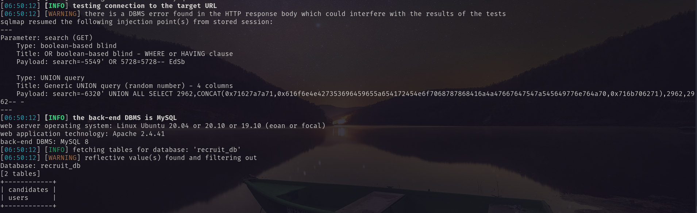<br/>
Then I dump the tables data.<br/>
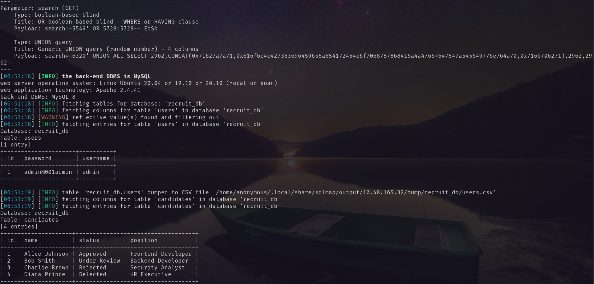<br/>
Which reveals admin's credentials.
```
username: admin
password: admin@001admin
```
Using these credentials I logged in as admin.<br/>
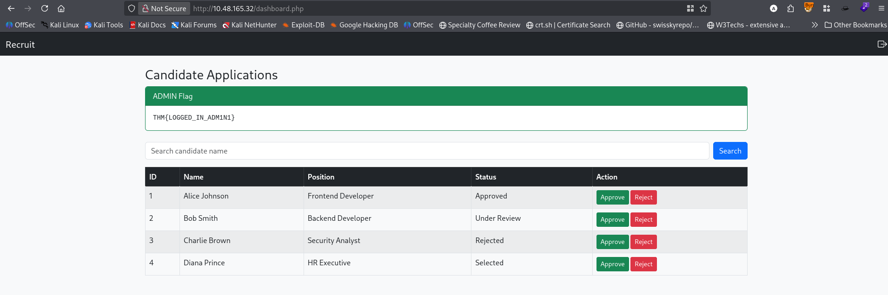
A found the admin flag.<br/>