# Port Scanning
```bash
❯ rustscan -a 10.82.143.154 -- -A

Open 10.82.143.154:22
Open 10.82.143.154:80

PORT   STATE SERVICE REASON         VERSION
22/tcp open  ssh     syn-ack ttl 62 OpenSSH 8.2p1 Ubuntu 4ubuntu0.13 (Ubuntu Linux; protocol 2.0)
| ssh-hostkey: 
|   3072 5b:e6:71:fd:54:0e:b3:a5:09:96:f1:4d:ca:a5:03:a6 (RSA)
| ssh-rsa AAAAB3NzaC1yc2EAAAADAQABAAABgQDDTz5oxE2nPd0oLgTLzSCCYvWfBVDgk5fOUA4xO9xF1HyKoXzHfm6KdiP1LhQMDDrXe2Pk6+D5JTZflCJaTJmZ42PzI5lko2iFX7DIaeLQxaNGrUgQEuGR8X/3bWnHhsKiTOVir8DAdxaIN/w6L+SP9eYg9uG4X69b62d9oTZtjwvUahe1OSC0NeFB3lMjJ7rI9oR1CZHj3cBdnw0FlWelek8Ye7jyYCDX55gvDi+nFI0xUQrsYe0A6yP8Ciaqy7TQ1jiBUtjly1LaykVjIfCoib7KziyJzOJxPB5Fy6XS2X+v5pGAqdXkrw5w12a3yYbeE/zL0pI4ZgxNyrjmQlOn3m6vIyb3+vyC065aNRkBR2ENkMJ3e5iXrb/a17B3iU5DRHYR7NzVnRkpk+P3/ZUsHt73iBGKGuW8iXfsnjIgyvkC2OVyWDYGyr6PDj3ksNUiaEyfzheIRtJ8MEuKVwi1mpSnnEYlF4jX6aixm4MbVhkYGg993He+oMPOtegGXbc=
|   256 70:da:82:0d:70:c0:e5:39:97:ba:02:d4:76:8e:32:fe (ECDSA)
| ecdsa-sha2-nistp256 AAAAE2VjZHNhLXNoYTItbmlzdHAyNTYAAAAIbmlzdHAyNTYAAABBBNTyNi8vuQ9DuAbiaCf9m7+6Nlt8FDrO8SjY56fVUGh0ynujg1XwU2VT75bFJ3vwseYwhA/EvQ82F386DlXbO0M=
|   256 8c:9c:6b:5c:0f:90:c6:75:75:02:f3:c3:05:02:df:79 (ED25519)
|_ssh-ed25519 AAAAC3NzaC1lZDI1NTE5AAAAIN4LHlF0mX3AUjZXDI7hkjR0yqzuXqG590uMfpij96N+
80/tcp open  http    syn-ack ttl 62 Apache httpd 2.4.41 ((Ubuntu))
|_http-title: Sky Couriers
| http-methods: 
|_  Supported Methods: GET POST OPTIONS HEAD
|_http-favicon: Unknown favicon MD5: FB0AA7D49532DA9D0006BA5595806138
|_http-server-header: Apache/2.4.41 (Ubuntu)
Warning: OSScan results may be unreliable because we could not find at least 1 open and 1 closed port
Device type: general purpose|phone
Running (JUST GUESSING): Linux 5.X|6.X|4.X (96%), Google Android 10.X|11.X|12.X|9.X (93%)
OS CPE: cpe:/o:linux:linux_kernel:5 cpe:/o:linux:linux_kernel:6 cpe:/o:linux:linux_kernel:4 cpe:/o:google:android:10 cpe:/o:google:android:11 cpe:/o:google:android:12 cpe:/o:google:android:9
OS fingerprint not ideal because: Missing a closed TCP port so results incomplete
Aggressive OS guesses: Linux 5.14 - 6.8 (96%), Linux 4.15 - 5.19 (96%), Linux 4.15 (95%), Linux 5.4 - 5.15 (95%), Android 10 - 12 (Linux 4.14 - 4.19) (93%), Android 10 - 11 (Linux 4.9 - 4.14) (92%), Android 9 - 11 (Linux 4.9 - 4.14) (92%), Linux 2.6.32 (92%), Linux 3.1 - 3.2 (92%), Linux 3.11 (92%)
```
First I visited the website. <br/>
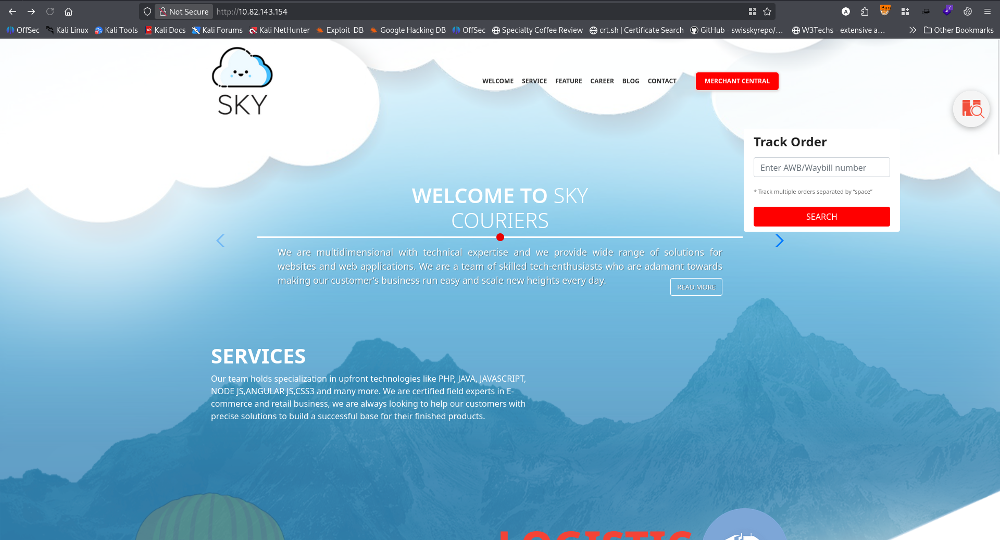 <br/>
Clicking the merchant central I found a login page. <br/>
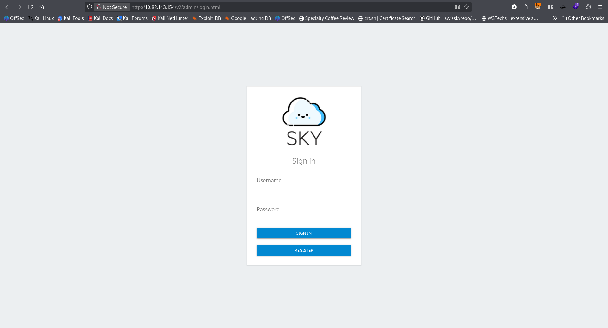 <br/>
Also a registration page. <br/>
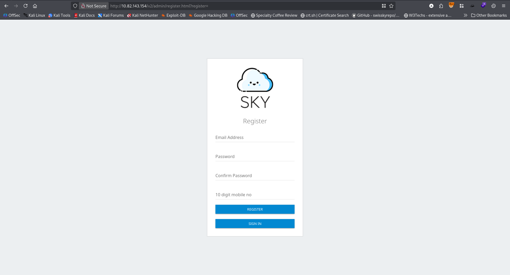 <br/>
I created a test account and login to that account. <br/>
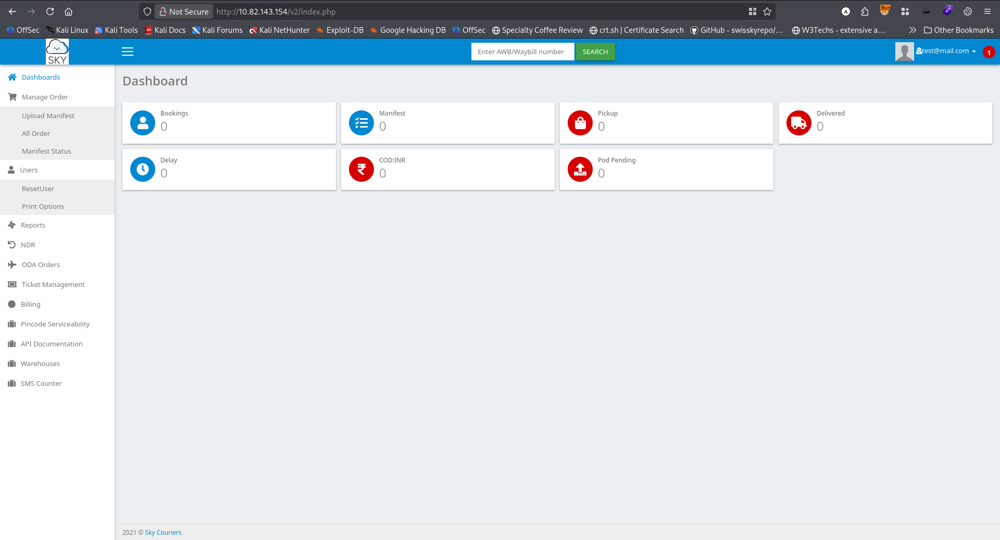 <br/>
While looking at different pages, I found the profile page and profile picture upload functionality. <br/>
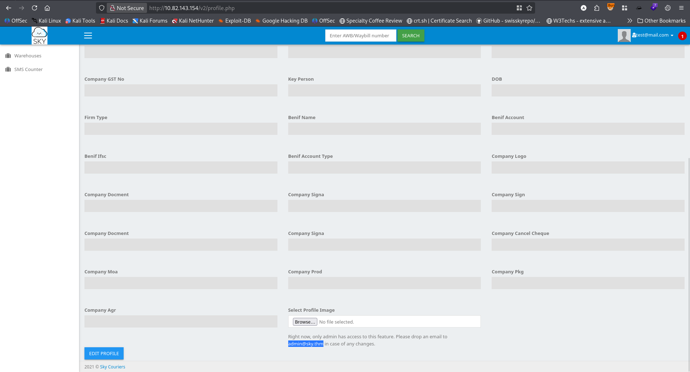 <br/>
But it was only for admin. And it leaked admin password. <br/>
I also found a password reset functionality. <br/>
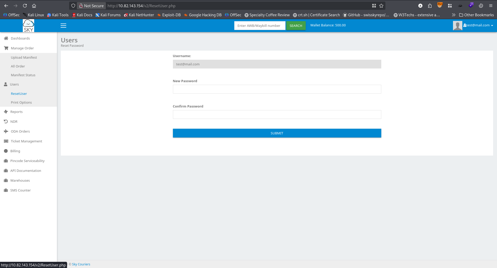 <br/>
In the front end I found the username is not changeable. But intercepting the request with burpsuite I changed the username with the admin's one. And it replied `200 OK` <br/>
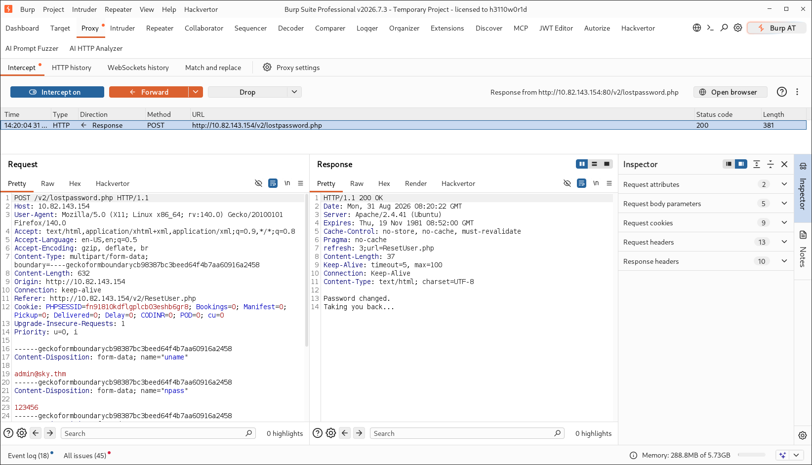 <br/>
Now changing the password of the admin, I logged in as admin. <br/>
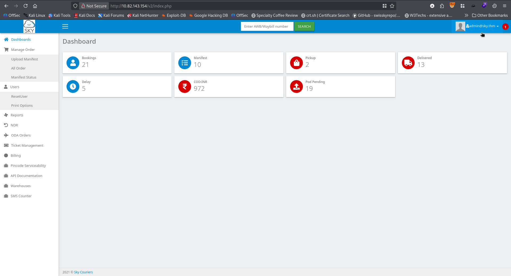 <br/>
In the profile page I could upload the image. <br/>
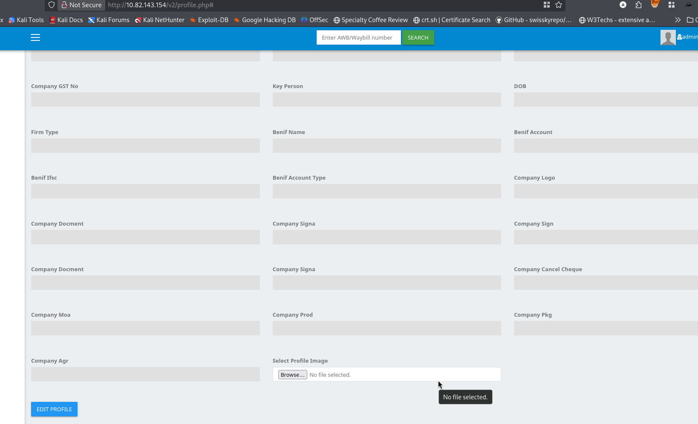 <br/>
I tried to upload a php reverse shell script. And succeed. But I didn't know the location of the image on the server. In the burpsuite sitemap I found the location. <br/>
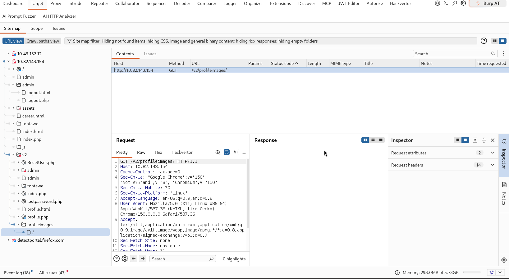 <br/>
I added the uploaded filename and sent the request and received the reverse shell. <br/>
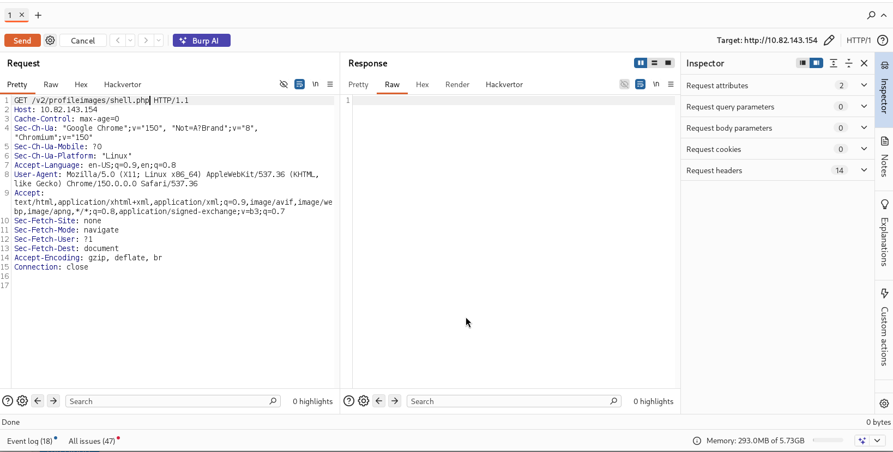 <br/>
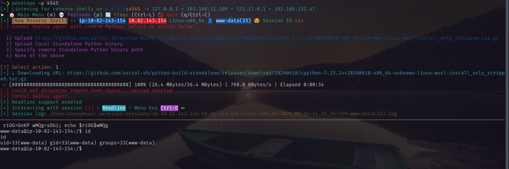 <br/>
I ran leanpeas.sh I enumerate the system as `www-data`. Found an open port. <br/>
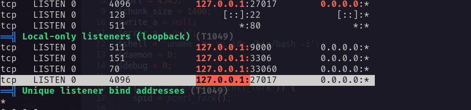 <br/>
mongodb default port. <br/>
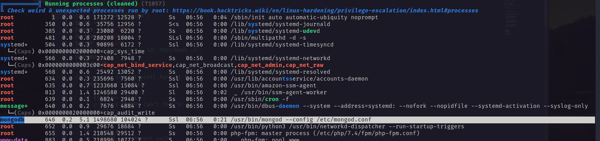 <br/>
I enumerate the database and found password for user `webdeveloper`. <br/>
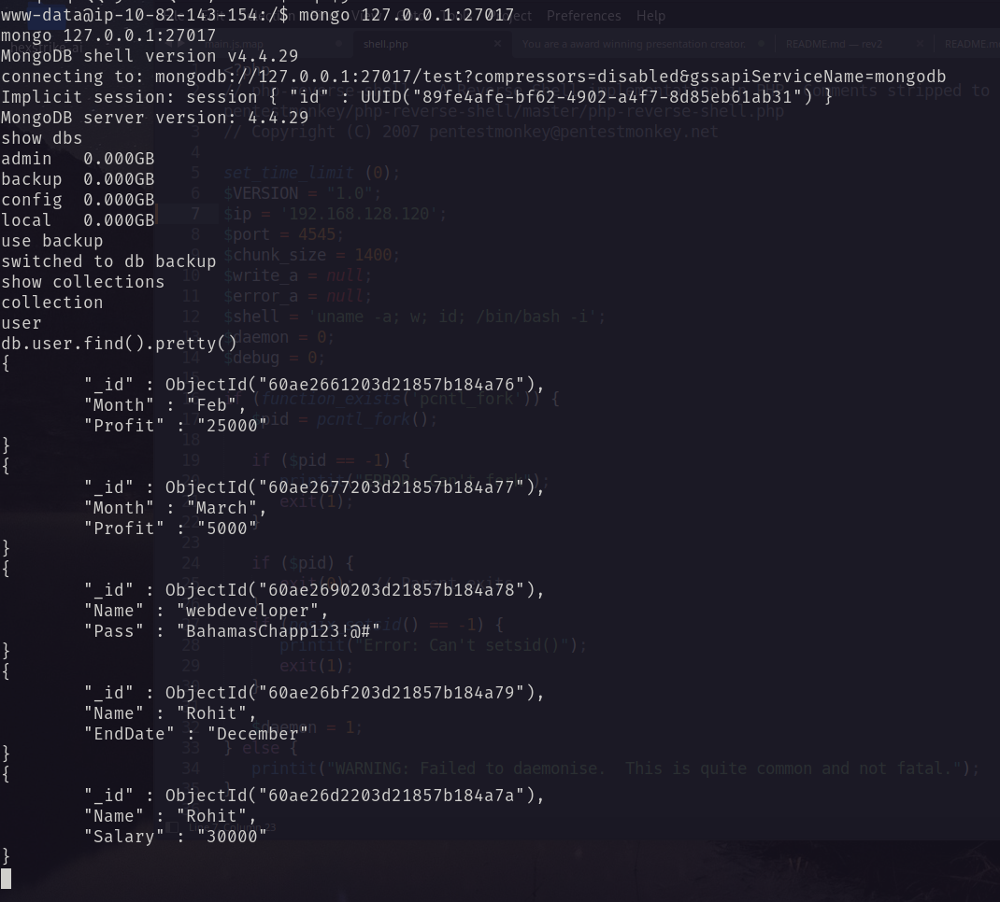 <br/>
Using the password I logged in as webdeveloper. <br/>
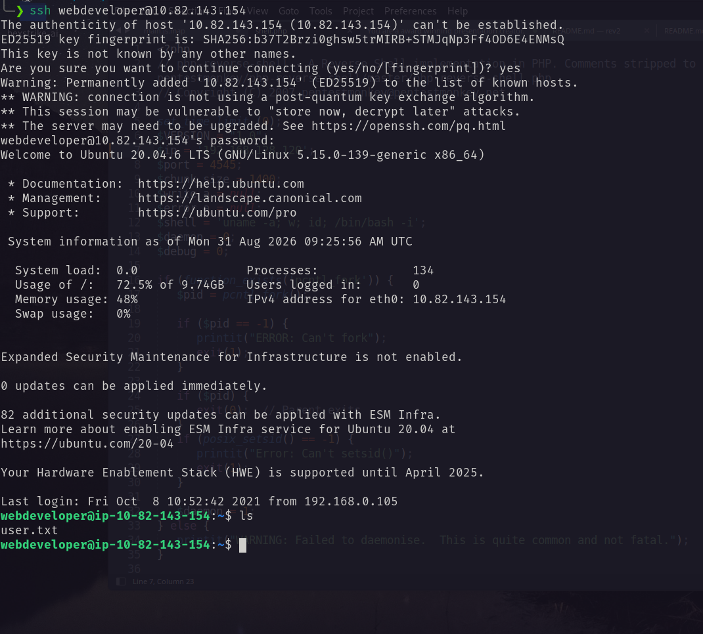 <br/>
# Privilege Escalation
I ran `sudo -l` <br/>
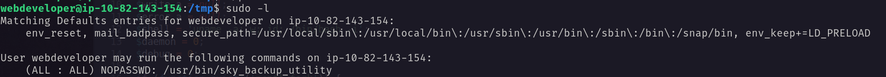 <br/>
Found LD_PRELOAD vulnerability. Exploiting it I became ROOT. <br/>
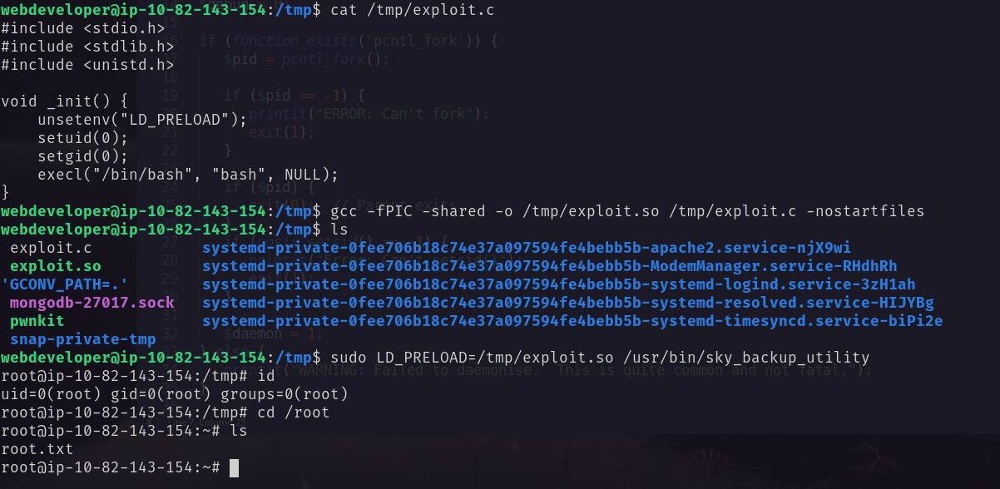 <br/>