# Port Scanning
```bash
rustscan -a 10.48.156.151 -- -A 

Open 10.48.156.151:22
Open 10.48.156.151:5050

PORT     STATE SERVICE REASON         VERSION
22/tcp   open  ssh     syn-ack ttl 62 OpenSSH 8.9p1 Ubuntu 3ubuntu0.15 (Ubuntu Linux; protocol 2.0)
| ssh-hostkey: 
|   256 96:3a:37:52:c5:a7:f8:04:3a:11:b3:8a:a4:30:95:b4 (ECDSA)
| ecdsa-sha2-nistp256 AAAAE2VjZHNhLXNoYTItbmlzdHAyNTYAAAAIbmlzdHAyNTYAAABBBB3ZzhOZRIHWLoEADDfzEpFZRGJL6G/OnmpfFijVOjMyaaBZXKKNn2Tsc+so1ErOpE7m6mUJf3qAq1M/xJ+tuEU=
|   256 a2:4c:d8:d7:bd:4c:40:ca:e5:73:a4:41:04:ee:e1:de (ED25519)
|_ssh-ed25519 AAAAC3NzaC1lZDI1NTE5AAAAIPMOh5hPhrb6BRn1TopmPZjS9YJZ1Bzs7GnSRqmcWQP2
5050/tcp open  http    syn-ack ttl 62 Werkzeug httpd 2.0.2 (Python 3.10.12)
|_http-title: CorpNet \xE2\x80\x94 Network Operations Centre
| http-methods: 
|_  Supported Methods: HEAD OPTIONS GET
|_http-server-header: Werkzeug/2.0.2 Python/3.10.12
Warning: OSScan results may be unreliable because we could not find at least 1 open and 1 closed port
Device type: general purpose|phone|specialized
Running (JUST GUESSING): Linux 4.X|5.X|6.X (96%), Google Android 10.X|11.X|12.X (93%), Adtran embedded (92%)
OS CPE: cpe:/o:linux:linux_kernel:4 cpe:/o:linux:linux_kernel:5 cpe:/o:google:android:10 cpe:/o:google:android:11 cpe:/o:google:android:12 cpe:/o:linux:linux_kernel:6 cpe:/h:adtran:424rg
OS fingerprint not ideal because: Missing a closed TCP port so results incomplete
Aggressive OS guesses: Linux 4.15 - 5.19 (96%), Linux 4.15 (96%), Linux 5.4 - 5.15 (96%), Android 10 - 12 (Linux 4.14 - 4.19) (93%), Linux 5.14 - 6.8 (93%), Adtran 424RG FTTH gateway (92%), Android 10 - 11 (Linux 4.9 - 4.14) (92%), Android 12 (Linux 5.4) (92%), Android 9 - 11 (Linux 4.9 - 4.14) (92%), Linux 2.6.32 (92%)
```
Visited the website on `5050`. <br/>
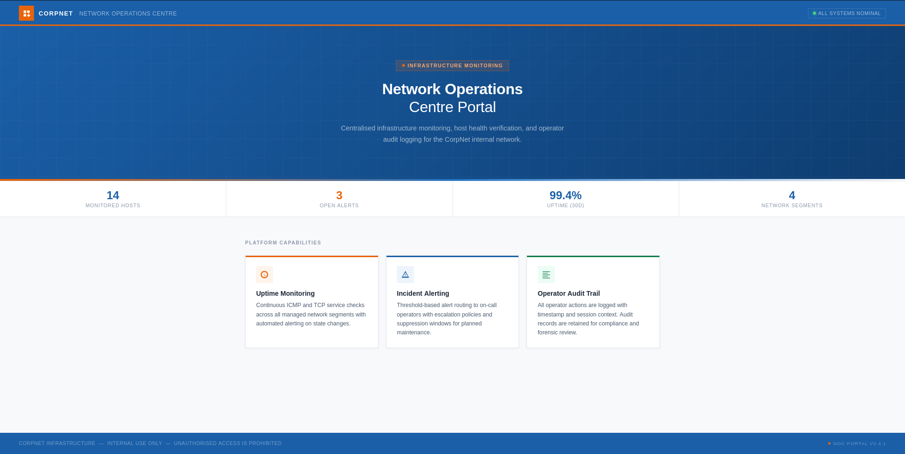 <br/>
Then fuzzing the site found `/internal` presenting a login page. <br/>
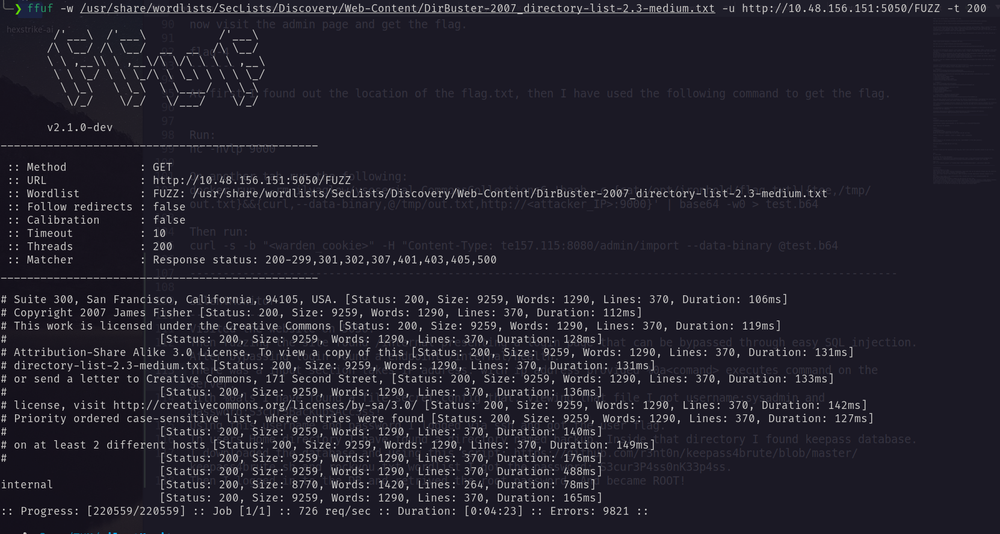 <br/>
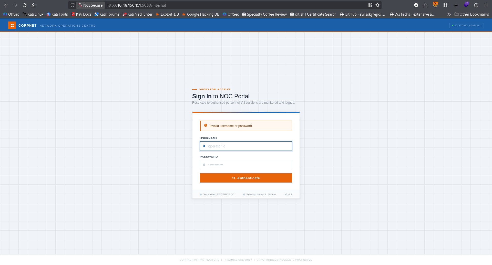 <br/>
That can be bypassed through easy SQL injection. <br/>
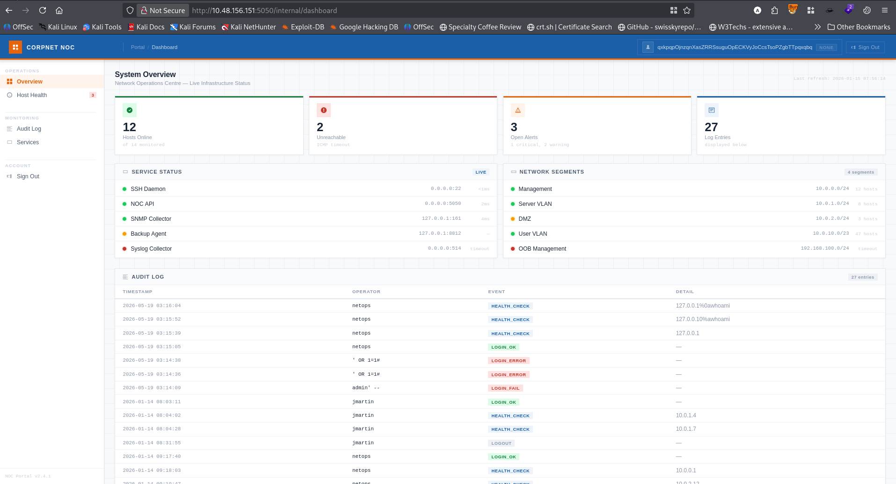 <br/>
After bypassing login found a endpoint `/internal/health`. There was a input section takes IP address. <br/>
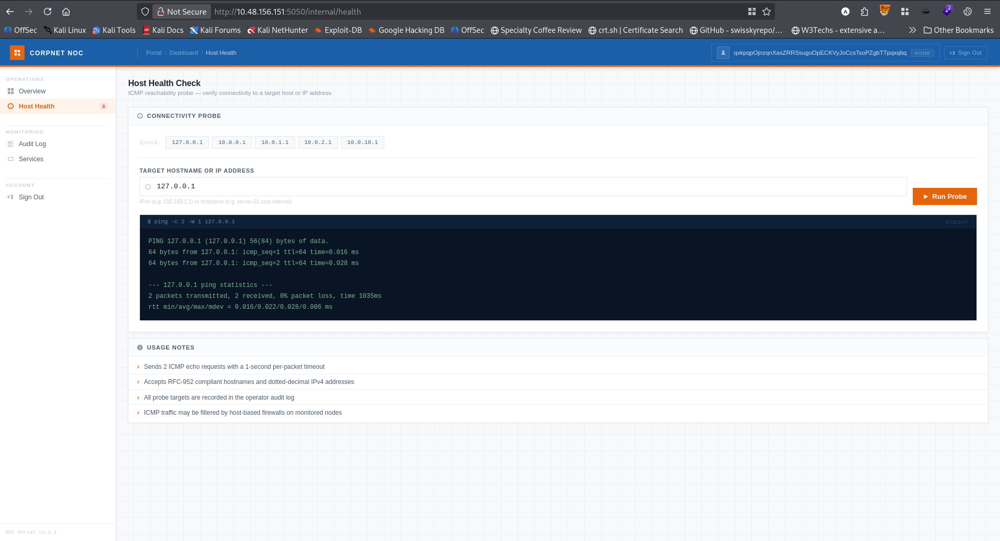 <br/>
With ip address provided `%0a<comand>` executes command on the server. <br/>
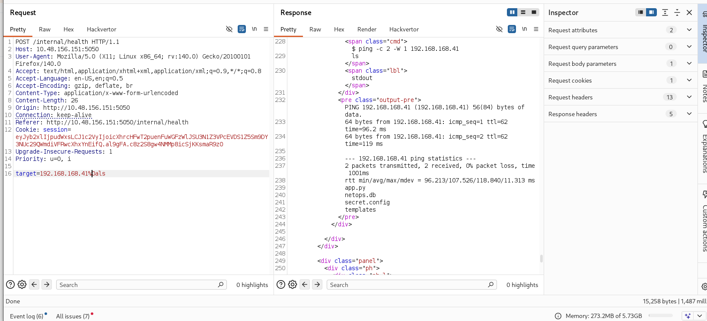 <br/>
With %0als I have found a file secret.config that. Viewing that file I got `username: sysadmin` and `password: S3cur3Backup$Acc3ss!` <br/>
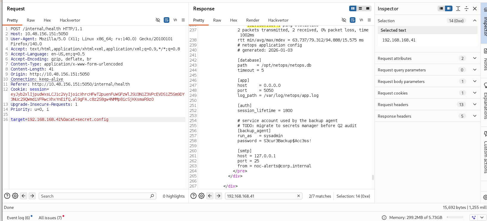 <br/>
Using this username and password I logged via ssh and got the user flag. <br/>
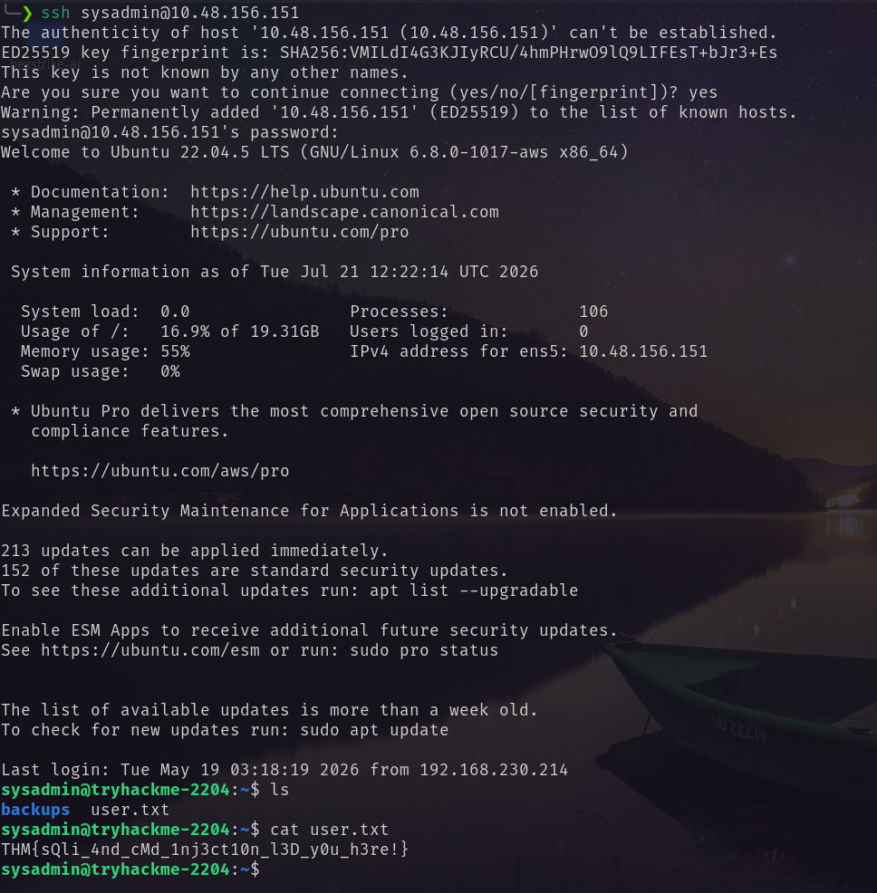 <br/>
In users Home directory I have found a directory named backup. Inside that directory I found keepass database. <br/>
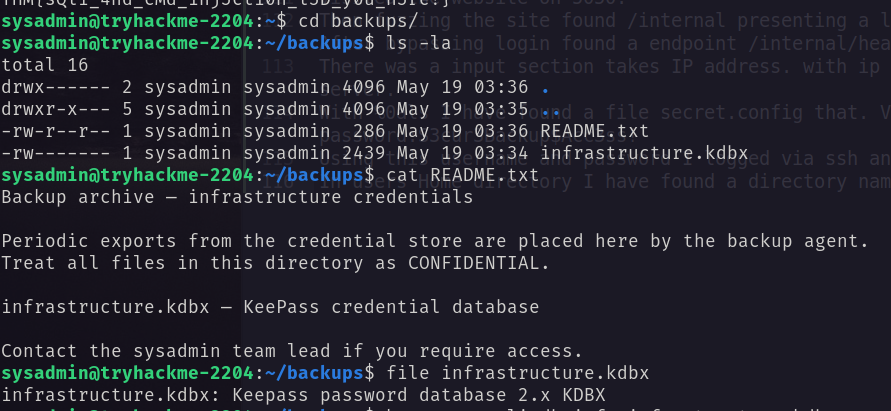 <br/>
I downloaded the database and using this [script](https://github.com/r3nt0n/keepass4brute/blob/master/keepass4brute.sh) and rockyou.txt wordlist I got the password: `spring` to access the keepass database. <br/>
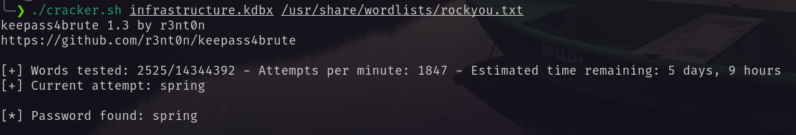 <br/>
I logged in with the password. <br/>
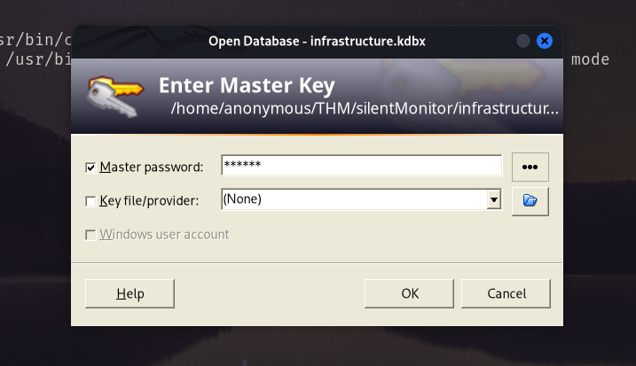 <br/>
And got the root password. <br/>
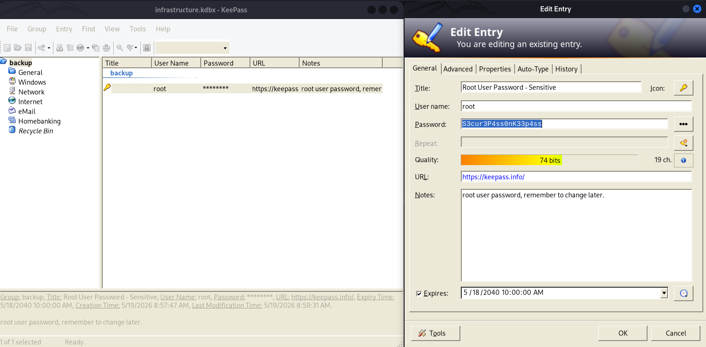 <br/>

`root:S3cur3P4ss0nK33p4ss`. <br/>
Using this I logged in as ROOT. <br/>
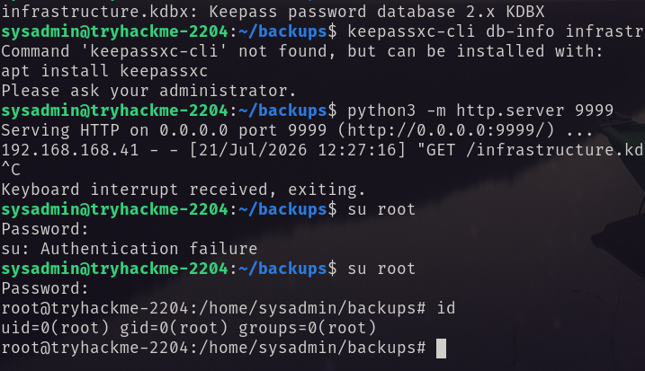 <br/>
