# Port Scan
```bash
rustscan -a 10.48.190.12 -- -A

Open 10.48.190.12:22
Open 10.48.190.12:80

PORT   STATE SERVICE REASON         VERSION
22/tcp open  ssh     syn-ack ttl 62 OpenSSH 9.6p1 Ubuntu 3ubuntu13.11 (Ubuntu Linux; protocol 2.0)
| ssh-hostkey: 
|   256 aa:94:fd:e5:4c:94:8b:a8:50:57:4b:d9:79:a9:5e:a2 (ECDSA)
| ecdsa-sha2-nistp256 AAAAE2VjZHNhLXNoYTItbmlzdHAyNTYAAAAIbmlzdHAyNTYAAABBBGEMotYNespTEby4UeXldJPS3WvsTH67cI4cSVP6lWA30gt2ufCq3kn62r60lxUi3FydxPrPhCfwoPPHMyOzdJo=
|   256 05:f5:4f:72:d7:40:72:2c:e7:a7:55:8c:ba:a1:a2:b6 (ED25519)
|_ssh-ed25519 AAAAC3NzaC1lZDI1NTE5AAAAIPYfKtDZVBE38A4/pSQUk0Q/Igy+9RtsXgSHYkn8IBSI
80/tcp open  http    syn-ack ttl 62 Apache httpd 2.4.58 ((Ubuntu))
| http-cookie-flags: 
|   /: 
|     PHPSESSID: 
|_      httponly flag not set
|_http-title: Support Operations Panel
|_http-server-header: Apache/2.4.58 (Ubuntu)
| http-methods: 
|_  Supported Methods: GET HEAD POST OPTIONS
Warning: OSScan results may be unreliable because we could not find at least 1 open and 1 closed port
Device type: general purpose|phone
Running (JUST GUESSING): Linux 5.X|6.X|4.X (96%), Google Android 10.X|11.X|12.X (93%)
OS CPE: cpe:/o:linux:linux_kernel:5 cpe:/o:linux:linux_kernel:6 cpe:/o:linux:linux_kernel:4 cpe:/o:google:android:10 cpe:/o:google:android:11 cpe:/o:google:android:12 cpe:/o:linux:linux_kernel:5.4
OS fingerprint not ideal because: Missing a closed TCP port so results incomplete
Aggressive OS guesses: Linux 5.14 - 6.8 (96%), Linux 4.15 - 5.19 (96%), Linux 4.15 (96%), Linux 5.4 - 5.15 (96%), Android 10 - 12 (Linux 4.14 - 4.19) (93%), Android 10 - 11 (Linux 4.9 - 4.14) (92%), Android 12 (Linux 5.4) (92%), Android 9 - 11 (Linux 4.9 - 4.14) (92%), Linux 2.6.32 (92%), Linux 2.6.39 - 3.2 (92%)
No exact OS matches for host (test conditions non-ideal).
```
Using dirsearch I found this.<br/>
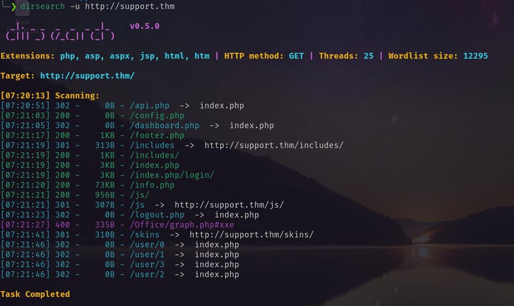<br/>
Visiting the website.<br/>
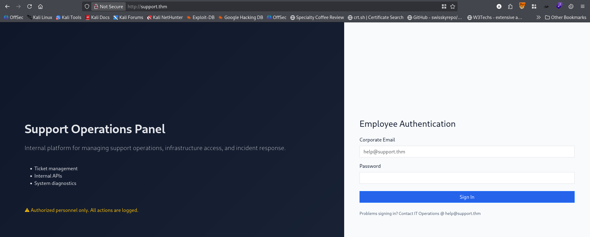<br/>
I bruteforced the password for email `help@support.thm` <br/>
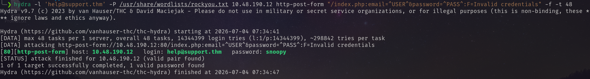<br/>
Using the credential I logged in.
```
email: help@suppoet.thm
password: snoopy
```
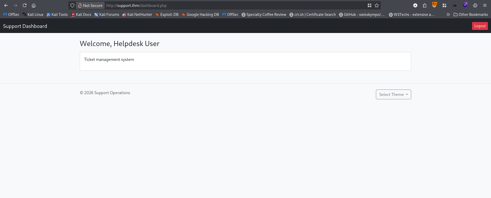<br/>
In cookie editor I found<br/>
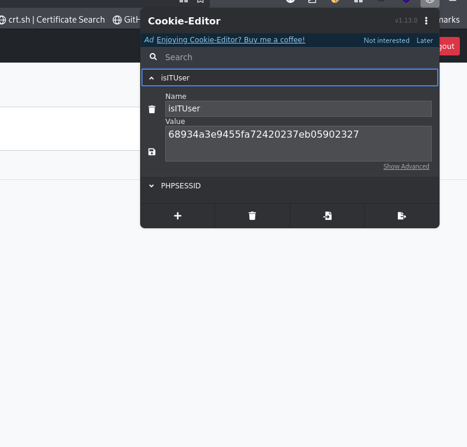<br/>
I decrypt the value.<br/>
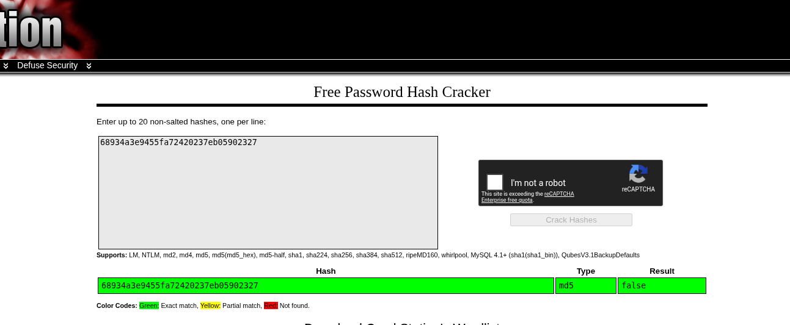<br/>
Then I create a MD5 hash for `true` value, that is `b326b5062b2f0e69046810717534cb09`. Set for cookie editor and again send the request.<br/>
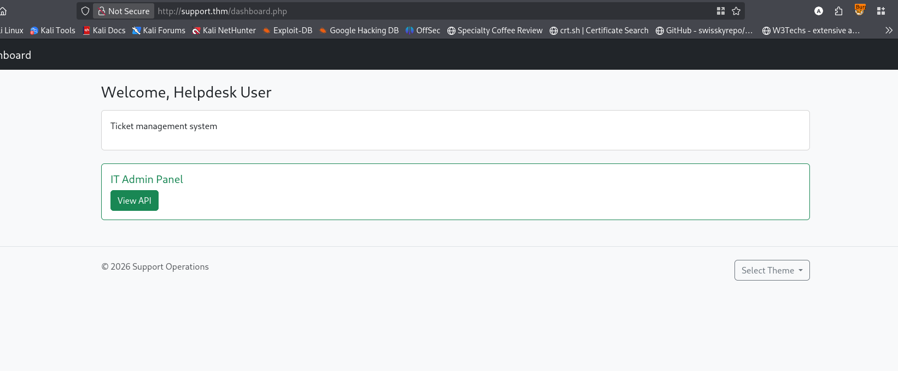<br/>
Clicking View API.<br/>
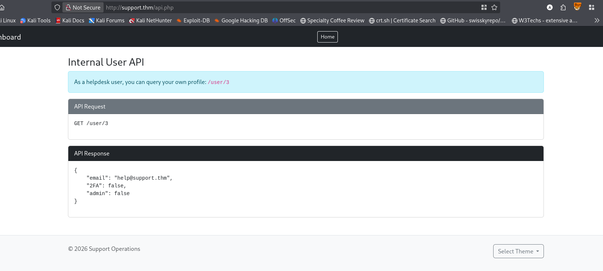<br/>
For `/user/1` I found special admin with admin information.<br/>
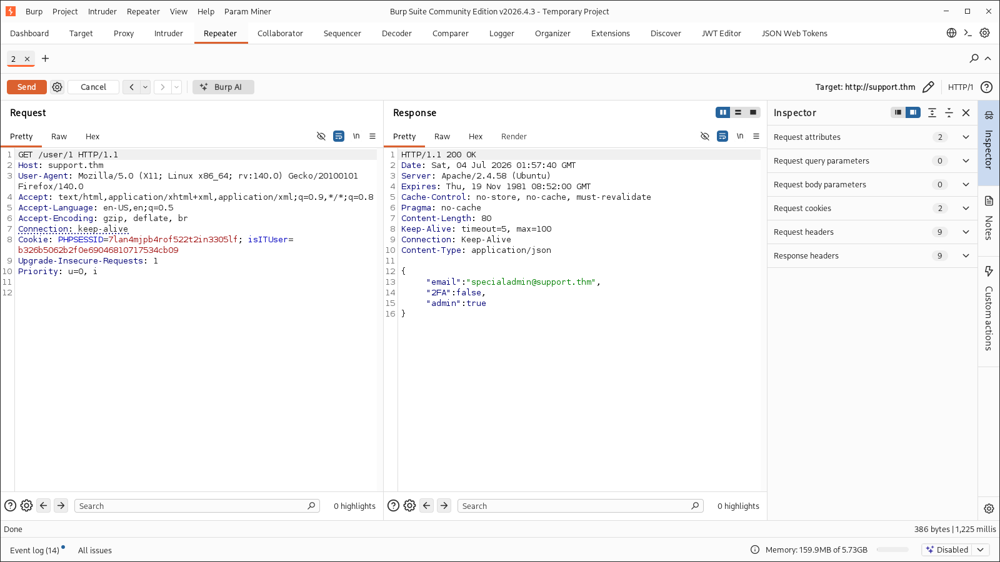<br/>
After trying many things atlast I found something suspecious.<br/>
![]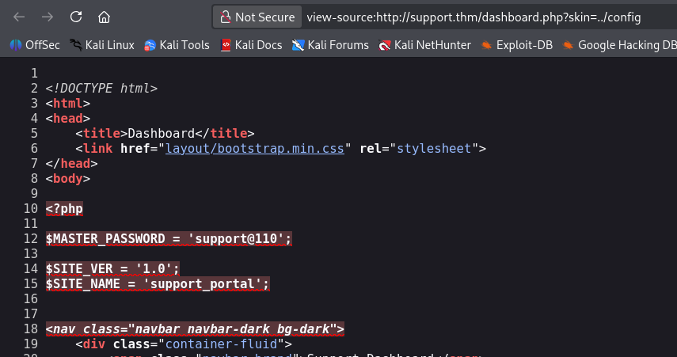<br/>
But the given password was not accurate. Removing the @ I could login as admin.
```
email: specialadmin@support.thm
password: support110
```
And found the admin flag.<br/>
![]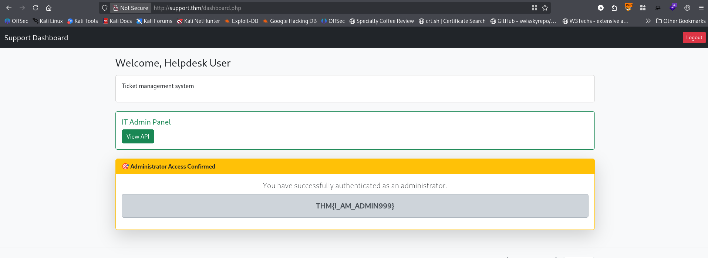<br/>
In this page I found a option to check date and time.<br/>
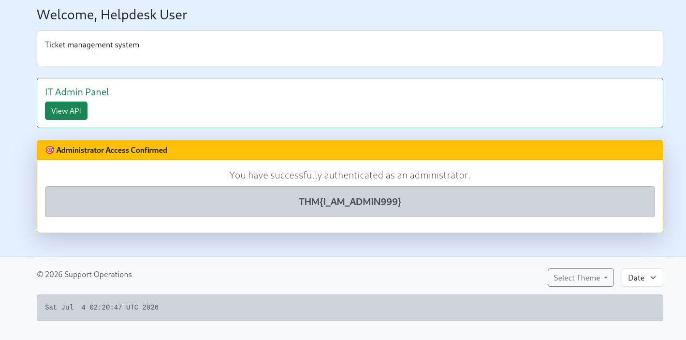<br/>
In burpsuite <br/>
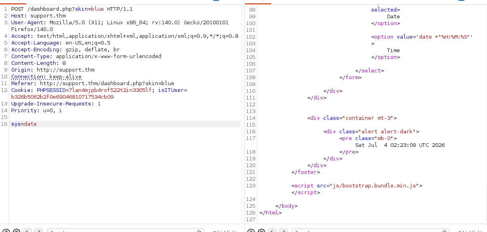<br/>
I changed the `sys` value to `id`. But it says<br/>
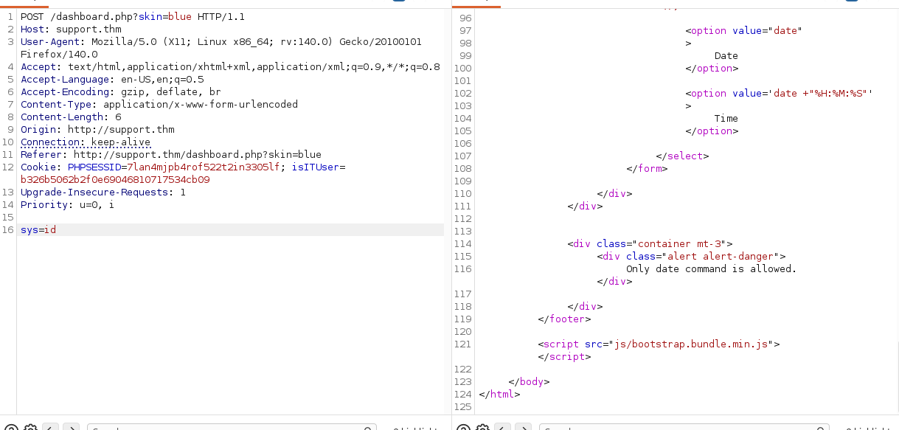<br/>
So I changed it to `date;id`. And Boom!<br/>
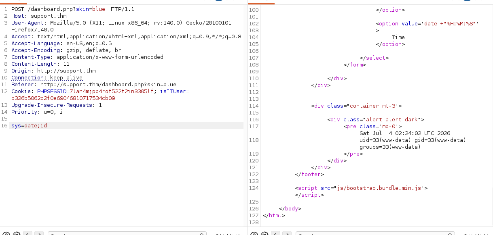<br/>
Then I changed the value to `date;cat /home/ubuntu/user.txt` and got the flag.<br/>
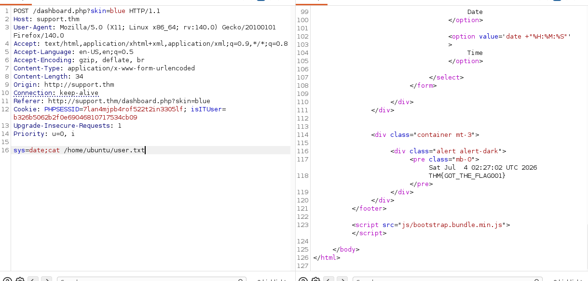<br/>
