# Port Scanning
```bash
❯ rustscan -a 10.82.132.254 -- -A 

Open 10.82.132.254:22
Open 10.82.132.254:80

PORT   STATE SERVICE REASON         VERSION
22/tcp open  ssh     syn-ack ttl 62 OpenSSH 6.6.1p1 Ubuntu 2ubuntu2.13 (Ubuntu Linux; protocol 2.0)
| ssh-hostkey: 
|   1024 e7:28:a6:33:66:4e:99:9e:8e:ad:2f:1b:49:ec:3e:e8 (DSA)
| ssh-dss AAAAB3NzaC1kc3MAAACBALXivx0EdFUjWn8Hg9zVrEE0+FIVsz0Dgt27TYzwHsc2NBir/vuOaG2wuM28Yu1yY5yX8QyIT7QvvtGwpZMS9wGy0x+mjSzMVgkkUpMDp2Yholkm9NH/CDhaA8zg3HxGd8/EdnHMLWszgF58xPCjUAtL3tZK09B4w/pdM0FFAF5BAAAAFQDzhIOaKK76v9eKeZNe0ZgkHVdyWQAAAIEAirSNjm02GVhgTbV6I60sZmY9nWORouyVp+Y+K0MQF+Jvxr0QQEWFeIVNbYNW0eg06VJ0JLexGNttrT/N6LPU4KBR7zIGOshLhXV847rwkUjODCt0ZeLjUv0X8o6T4ExZi92VLBylxQmk2OMgUIyeVPVbAsDAK2N0LFWHfpLTbl0AAACARqXryFKMWJQTJ1Ta5dX4bCZ20ulsATRbFuMLH1OZoA7gM2A2rijxPvK6Vp/VJt7701LhgI0dUZClMLC8q0OXaTEO3Ao6zdJb8W5snDue2TrPm12UnELgUD/NwWVqyjgYq1UgZ+71l+3fy6Q8opDILH+RYmAypIXb29dXvICjC5U=
|   2048 86:fc:ed:ce:46:63:4d:fd:ca:74:b6:50:46:ac:33:0f (RSA)
| ssh-rsa AAAAB3NzaC1yc2EAAAADAQABAAABAQDgOLGhQs3olTn9V7fF/VB8GkElTVbM33EOlppILeLZmIdeg0NkxZdScAjalP4AB/yiU/01Whysy6NhOeuyVfwRhCkvpoWkN1X20YI6fPdTE5TLOeR+m78IXXZlyBSj2GOqvM7tPr0BqvfpsoxkS4zXVYG4OhxZDR4/rmXA9GaSOTzGEOWj839sbW6cdos5nanQSdEhDM441+GeUfXfPh+nqasy422AEhDqFh6cDRcQw5MXR2pt+VicabIfcVjRNRCmNgpx3nbJ/u1TeNC8C40krEiH735AbPd/Bu/Hbg2hY0AR7I/2dwsZMMcQ6weRLY0bOdW8wWPTIgdWN65DVAlf
|   256 e0:cc:05:0a:1b:8f:5e:a8:83:7d:c3:d2:b3:cf:91:ca (ECDSA)
| ecdsa-sha2-nistp256 AAAAE2VjZHNhLXNoYTItbmlzdHAyNTYAAAAIbmlzdHAyNTYAAABBBOdOqWQM/+hxmRNa9Np94ZyfIfPGqNPOMKRMQkwCUXxrEfrC6RxnuNQolldjaSZtTx4nd/qWQqcNvrFbifP942o=
|   256 80:e3:45:b2:55:e2:11:31:ef:b1:fe:39:a8:90:65:c5 (ED25519)
|_ssh-ed25519 AAAAC3NzaC1lZDI1NTE5AAAAIJCjSR4Gytw2HNoqL4fDTKnxm0d8U/16kopRnicLqWMM
80/tcp open  http    syn-ack ttl 62 Apache httpd 2.4.7 ((Ubuntu))
|_http-title: Apache2 Ubuntu Default Page: It works
| http-methods: 
|_  Supported Methods: POST OPTIONS GET HEAD
|_http-server-header: Apache/2.4.7 (Ubuntu)
Warning: OSScan results may be unreliable because we could not find at least 1 open and 1 closed port
OS fingerprint not ideal because: Missing a closed TCP port so results incomplete
```
So first I visited the website and found nothing. But in source code I have found the following. <br/>
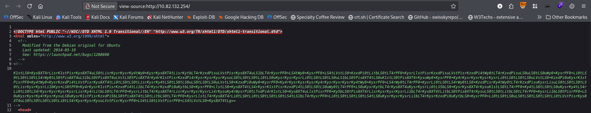 <br/>
base64 encoded string.  <br/>
At the bottom of the page I have found:  <br/>
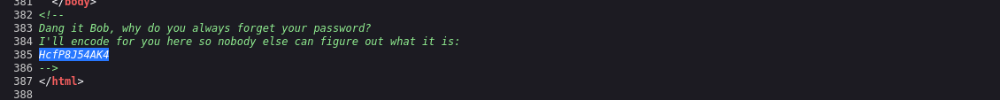 <br/>
Using cyberchef I decoed the password: <br/>
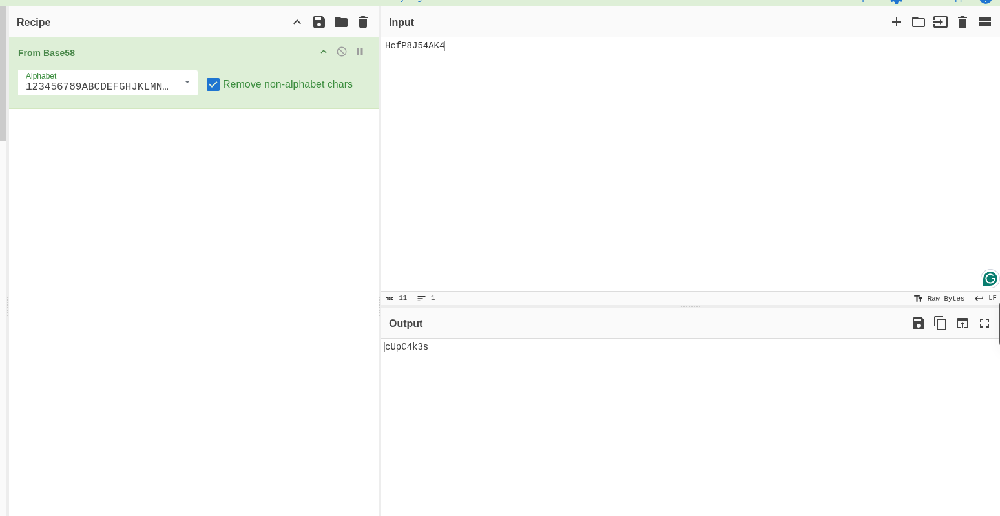 <br/>
Using cyberchef I decoded the long base64 string and found the following: <br/>
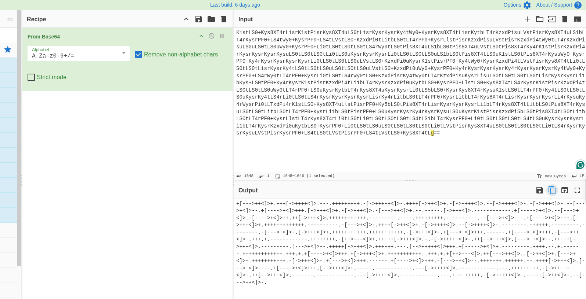 <br/>
It is a brainfuck encoded text. Uisng brain fuck decoder I decoed it. <br/>
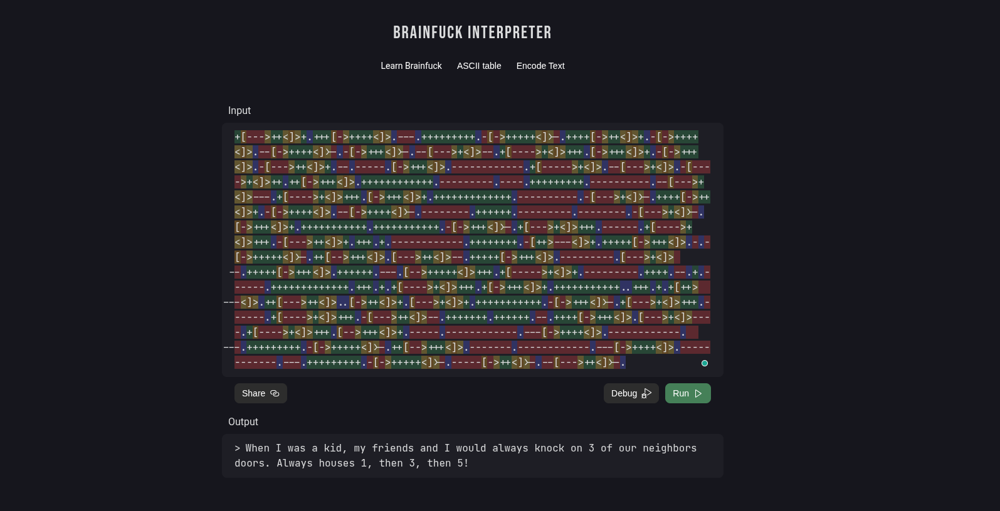 <br/>
So it is a clue for port knocking. So I performed port knocking with scanning.
```bash
❯ knock 10.82.132.254 1 3 5 && rustscan -a 10.82.132.254 -- -A

Open 10.82.132.254:21
Open 10.82.132.254:22
Open 10.82.132.254:80
Open 10.82.132.254:445
Open 10.82.132.254:8080

PORT     STATE SERVICE REASON         VERSION
21/tcp   open  ftp     syn-ack ttl 62 vsftpd 3.0.2
22/tcp   open  ssh     syn-ack ttl 62 OpenSSH 6.6.1p1 Ubuntu 2ubuntu2.13 (Ubuntu Linux; protocol 2.0)
| ssh-hostkey: 
|   1024 e7:28:a6:33:66:4e:99:9e:8e:ad:2f:1b:49:ec:3e:e8 (DSA)
| ssh-dss AAAAB3NzaC1kc3MAAACBALXivx0EdFUjWn8Hg9zVrEE0+FIVsz0Dgt27TYzwHsc2NBir/vuOaG2wuM28Yu1yY5yX8QyIT7QvvtGwpZMS9wGy0x+mjSzMVgkkUpMDp2Yholkm9NH/CDhaA8zg3HxGd8/EdnHMLWszgF58xPCjUAtL3tZK09B4w/pdM0FFAF5BAAAAFQDzhIOaKK76v9eKeZNe0ZgkHVdyWQAAAIEAirSNjm02GVhgTbV6I60sZmY9nWORouyVp+Y+K0MQF+Jvxr0QQEWFeIVNbYNW0eg06VJ0JLexGNttrT/N6LPU4KBR7zIGOshLhXV847rwkUjODCt0ZeLjUv0X8o6T4ExZi92VLBylxQmk2OMgUIyeVPVbAsDAK2N0LFWHfpLTbl0AAACARqXryFKMWJQTJ1Ta5dX4bCZ20ulsATRbFuMLH1OZoA7gM2A2rijxPvK6Vp/VJt7701LhgI0dUZClMLC8q0OXaTEO3Ao6zdJb8W5snDue2TrPm12UnELgUD/NwWVqyjgYq1UgZ+71l+3fy6Q8opDILH+RYmAypIXb29dXvICjC5U=
|   2048 86:fc:ed:ce:46:63:4d:fd:ca:74:b6:50:46:ac:33:0f (RSA)
| ssh-rsa AAAAB3NzaC1yc2EAAAADAQABAAABAQDgOLGhQs3olTn9V7fF/VB8GkElTVbM33EOlppILeLZmIdeg0NkxZdScAjalP4AB/yiU/01Whysy6NhOeuyVfwRhCkvpoWkN1X20YI6fPdTE5TLOeR+m78IXXZlyBSj2GOqvM7tPr0BqvfpsoxkS4zXVYG4OhxZDR4/rmXA9GaSOTzGEOWj839sbW6cdos5nanQSdEhDM441+GeUfXfPh+nqasy422AEhDqFh6cDRcQw5MXR2pt+VicabIfcVjRNRCmNgpx3nbJ/u1TeNC8C40krEiH735AbPd/Bu/Hbg2hY0AR7I/2dwsZMMcQ6weRLY0bOdW8wWPTIgdWN65DVAlf
|   256 e0:cc:05:0a:1b:8f:5e:a8:83:7d:c3:d2:b3:cf:91:ca (ECDSA)
| ecdsa-sha2-nistp256 AAAAE2VjZHNhLXNoYTItbmlzdHAyNTYAAAAIbmlzdHAyNTYAAABBBOdOqWQM/+hxmRNa9Np94ZyfIfPGqNPOMKRMQkwCUXxrEfrC6RxnuNQolldjaSZtTx4nd/qWQqcNvrFbifP942o=
|   256 80:e3:45:b2:55:e2:11:31:ef:b1:fe:39:a8:90:65:c5 (ED25519)
|_ssh-ed25519 AAAAC3NzaC1lZDI1NTE5AAAAIJCjSR4Gytw2HNoqL4fDTKnxm0d8U/16kopRnicLqWMM
80/tcp   open  http    syn-ack ttl 62 Apache httpd 2.4.7 ((Ubuntu))
|_http-server-header: Apache/2.4.7 (Ubuntu)
| http-methods: 
|_  Supported Methods: POST OPTIONS GET HEAD
|_http-title: Apache2 Ubuntu Default Page: It works
445/tcp  open  http    syn-ack ttl 62 Apache httpd 2.4.7 ((Ubuntu))
| http-methods: 
|_  Supported Methods: POST OPTIONS GET HEAD
|_http-title: Apache2 Ubuntu Default Page: It works
|_http-server-header: Apache/2.4.7 (Ubuntu)
8080/tcp open  http    syn-ack ttl 62 Werkzeug httpd 1.0.1 (Python 3.5.3)
|_http-server-header: Werkzeug/1.0.1 Python/3.5.3
| http-methods: 
|_  Supported Methods: GET OPTIONS HEAD
|_http-title: Apache2 Ubuntu Default Page: It works
Warning: OSScan results may be unreliable because we could not find at least 1 open and 1 closed port
Device type: specialized|general purpose
Running (JUST GUESSING): Crestron 2-Series (87%), Linux 3.X|4.X|5.X (86%)
OS CPE: cpe:/o:crestron:2_series cpe:/o:linux:linux_kernel:3.13 cpe:/o:linux:linux_kernel:4.4 cpe:/o:linux:linux_kernel:5
OS fingerprint not ideal because: Missing a closed TCP port so results incomplete
Aggressive OS guesses: Crestron XPanel control system (87%), Linux 3.13 (86%), Linux 4.4 (86%), Linux 4.10 (86%), Linux 4.15 - 5.19 (85%), Linux 3.10 - 3.13 (85%), Linux 5.4 (85%)
No exact OS matches for host (test conditions non-ideal).
```
So, new discovery <br/>
- `21` --> ftp
- `445` --> http 
- `8080` --> http 
Using the password found above I logged in via ftp as user bob. After enumerating I found an image. <br/>
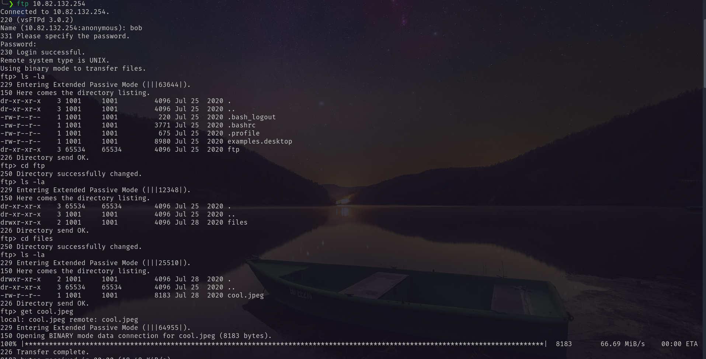 <br/>
On port `445` I found a password. <br/>
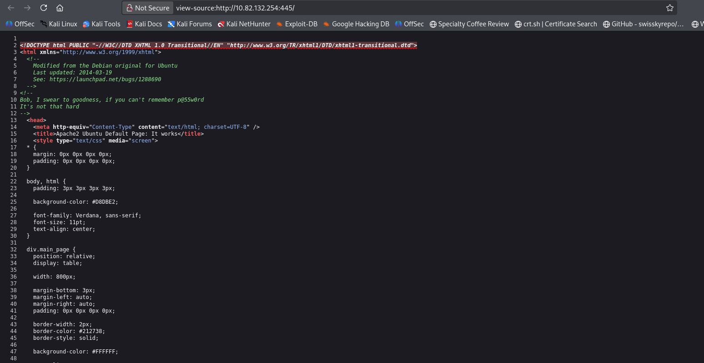 <br/>
Using this password and `steghide` I figure out a directory and again encrypted username and password. <br/>
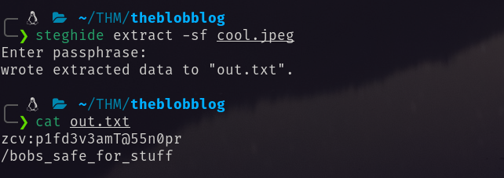 <br/>
Visiting that directory I found. `youmayenter` looked like a key. <br/>
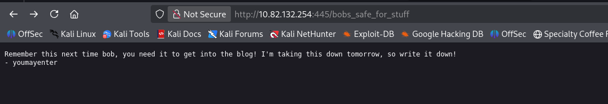 <br/>
Using this key I decoded the encoded username and password from vigenere cipher. <br/>
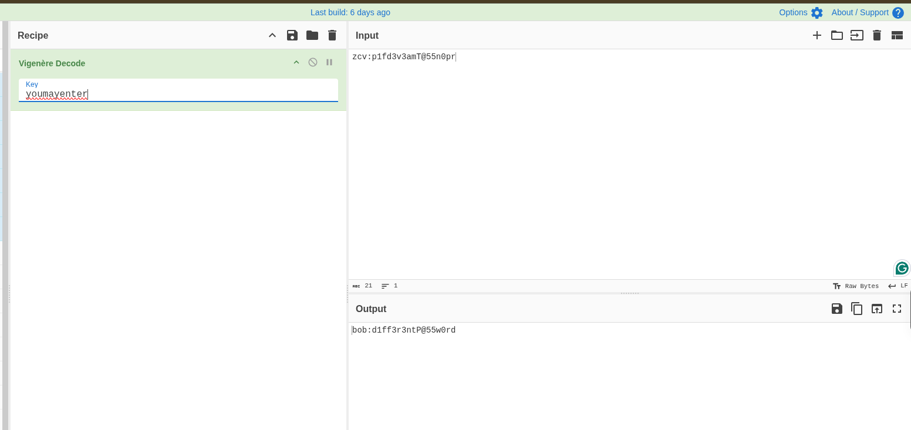 <br/>
The bruteforcing port 8080 found the follwoing pages. <br/>
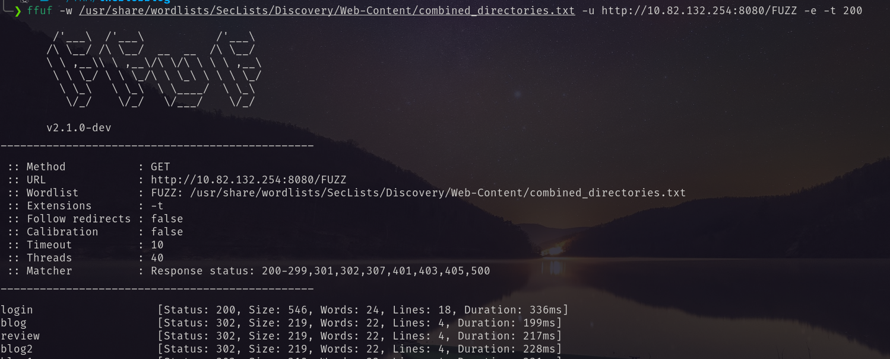 <br/>
In login I logged in with the username and password. <br/>
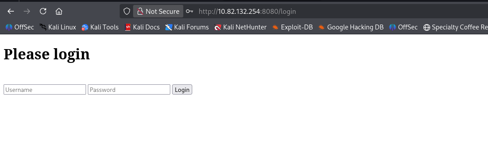 <br/>
After login I found a review submission page. <br/>
 <br/>
After submitting the review it can be found by clicking `here` button. <br/>
So for trying command injection I submitted `id` command  <br/>
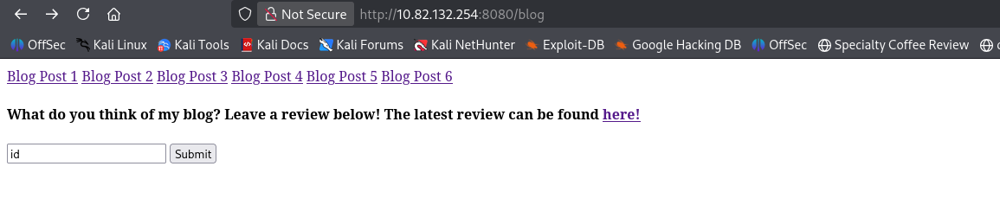 <br/>
And it replied  <br/>
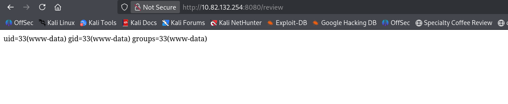 <br/>
So it is vulnerable to command injection. Using this vulnerability I got the reverse shell. <br/>
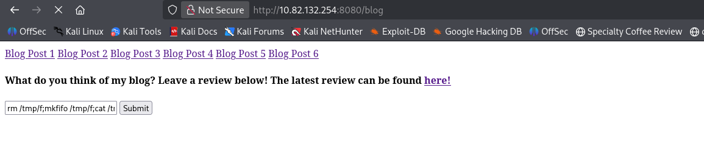 <br/>
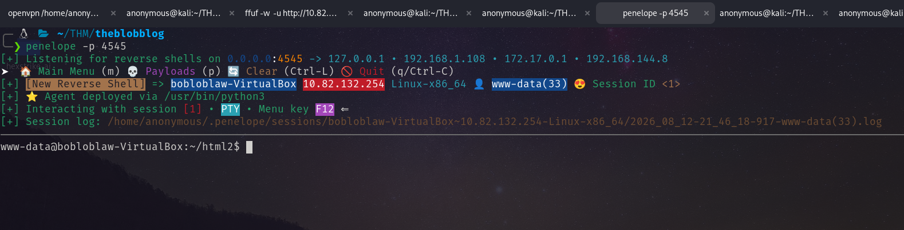 <br/>
I ran `linpeas.sh` and found that it has pkexec vulnerability.  <br/>
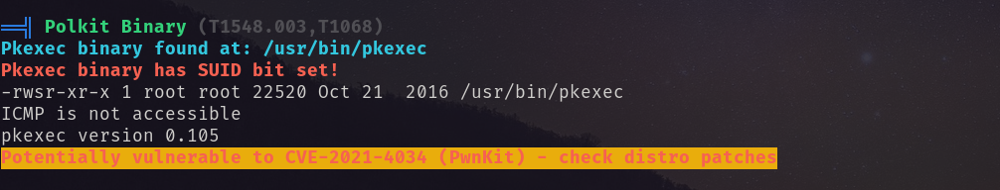 <br/>
Abusing this I got root shell. <br/>
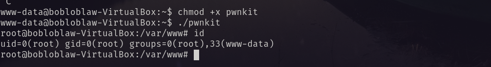 <br/>