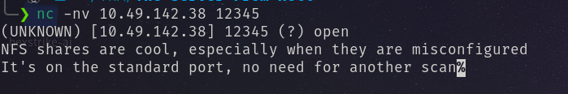
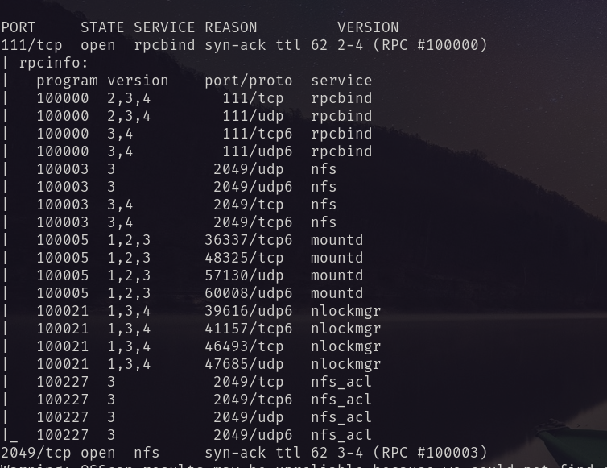
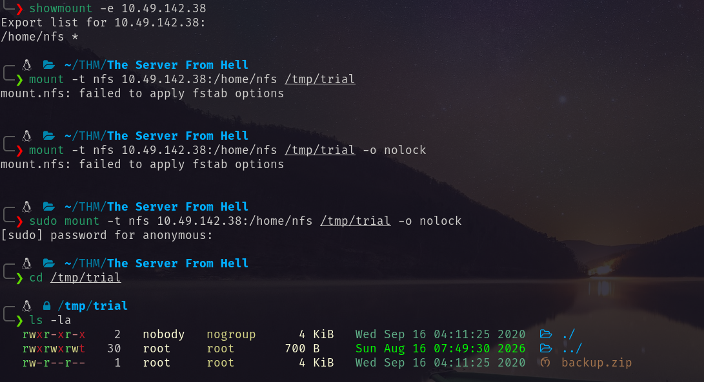
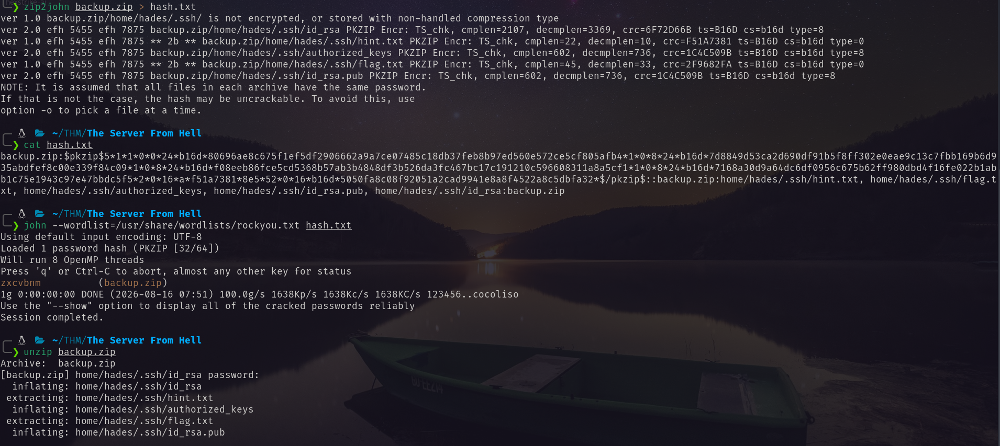
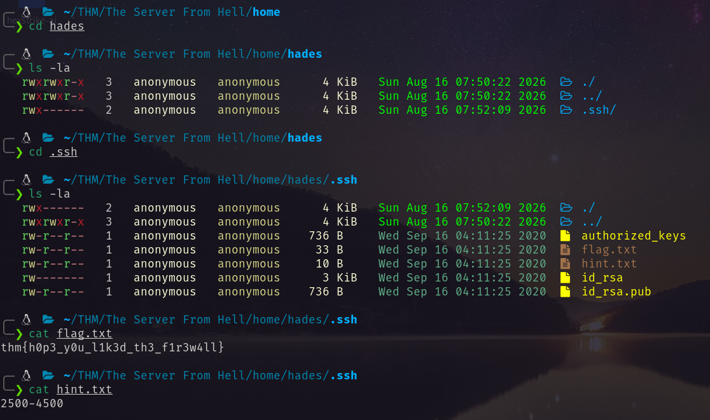
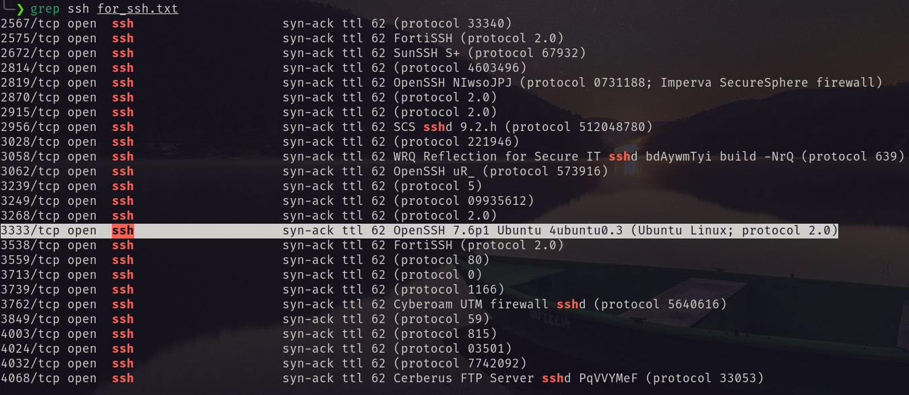
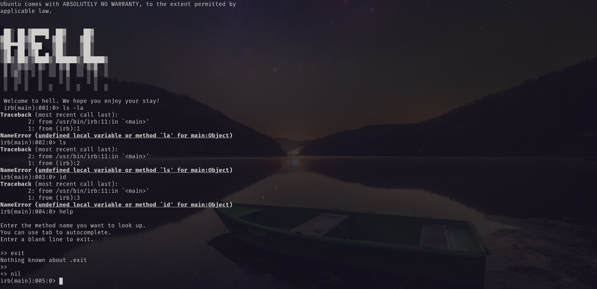
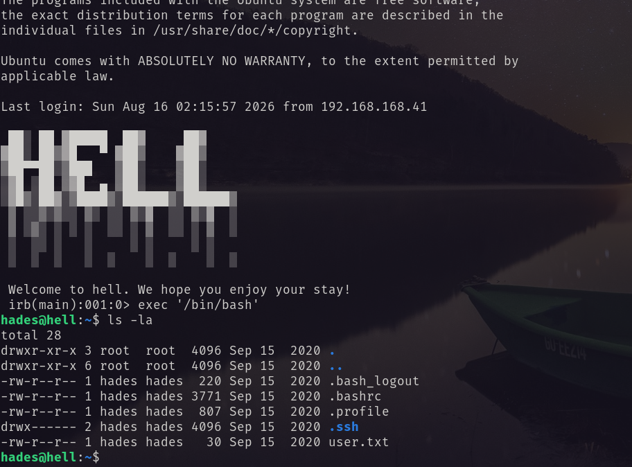
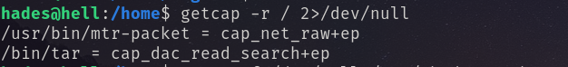
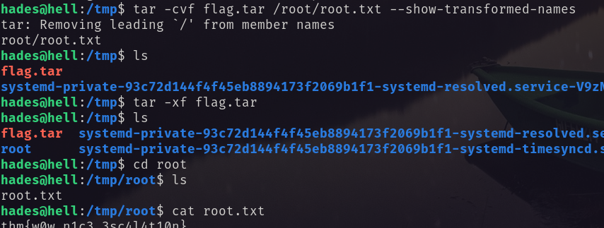

Through rustscan I have found a huge amount of ports are open. So I break them in a little set of ports and perform scanning. Then I have found something interesting on port 12345. <br/>
 <br/>
NFS share. So I go for scanning NFS share default port 111, 2049. And discovered the following. <br/>
! <br/>
I enumerate the share and mount it. And found backup.zip file which is locked through a password. <br/>
 <br/>
Using john I cracked the password.  <br/>
 <br/>
It is the home directory of user hades with the first flag and id_rsa and hint. <br/>
 <br/>
Following the hint I again make a scan for the given port for ssh service. Found a few ports but one of them look legitimate.  <br/>
 <br/>
Using the id_rsa file I logged in via ssh.
```bash
ssh hades@10.49.142.38 -i id_rsa
```
 <br/>
But it give me a ruby shell. So I ran the following command found in gtfobins and got the bash shell. <br/>
```bash
exec '/bin/bash'
```
 <br/>
Got the user flag. <br/>
## Privilege to ROOT <br/>
While enumerating found some interesting capabilities <br/>
 <br/>
`cap_dac_read_search` allows tar to read **any file** on the system, regardless of permissions. So using this I got the root flag. <br/>
 <br/>